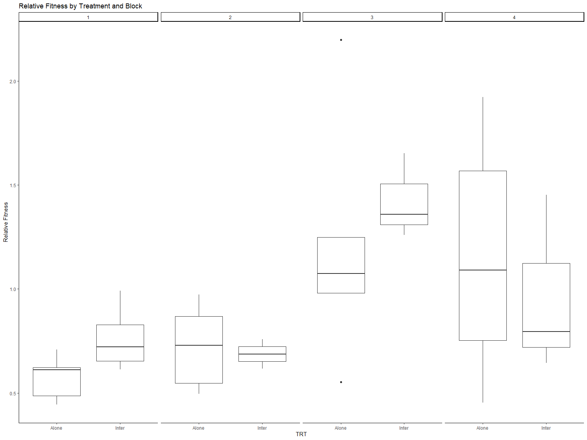
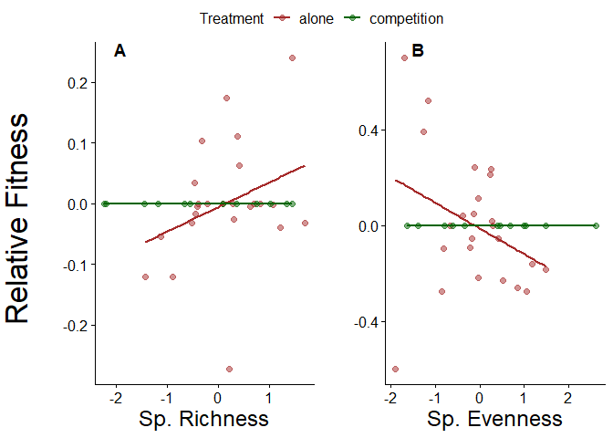

RhizMicrobiome_GenusLevel
================
Sara Colom
2/8/2020

-   [Sample sizes](#sample-sizes)
    -   [Table sample number by species and
        treatment](#table-sample-number-by-species-and-treatment)
    -   [Table number of maternal line per
        species](#table-number-of-maternal-line-per-species)
-   [Load Libraries](#load-libraries)
-   [Read in Data](#read-in-data)
    -   [Test for differences](#test-for-differences)
-   [Linear mixed models](#linear-mixed-models)
-   [ANOVA Test for treatment within I. purpurea
    (Table 1)](#anova-test-for-treatment-within-i-purpurea-table-1)
-   [Community Composition](#community-composition)
    -   [Beta Diversity](#beta-diversity)
-   [PERMANOVA (Table 2)](#permanova-table-2)
-   [Correlations with root traits](#correlations-with-root-traits)
    -   [Prep root data](#prep-root-data)
    -   [Table 3. Within species (root traits and
        alphadiv)](#table-3-within-species-root-traits-and-alphadiv)
-   [ANCOVA](#ancova)
-   [Figure 3](#figure-3)
-   [MANTEL (Table 4)](#mantel-table-4)
-   [Export ANCOVA tables](#export-ancova-tables)

## Sample sizes

### Table sample number by species and treatment

| Species      | Treatment   | N   |
|--------------|-------------|-----|
| I. purpurea  | Alone       | 27  |
| I. purpurea  | Competition | 73  |
| I. hederacea | Competition | 73  |

### Table number of maternal line per species

| Species      | Number of ML |
|--------------|--------------|
| I. purpurea  | 10           |
| I. hederacea | 5            |

# Load Libraries

``` r
library(phyloseq)
library(ggplot2)
library(ape)
library(caret)
library(vegan)
library(plyr)
library(dplyr)
library(scales)
library(grid)
library(reshape2)
library(pegas)
library(pgirmess)
library(multcomp)
library(multcompView)
library(ggpubr)
library(ggcorrplot)
library(RColorBrewer)
library(broom)
library(ggthemes)
library(corrplot)
library(Hmisc)
library(emmeans)
library(lmerTest)
library(interactions)
library(jtools)
library(MASS)
library(stringr)

source("../MainAnalysis/miSeq.R")
source("../MainAnalysis/functions.R")

# Aesthetics
Tx<-theme(axis.text.y = element_text(size = 12),
          axis.title.y = element_text(size = 20)) +
          theme(axis.text.x = element_text(vjust = 1, hjust=1, angle=0, size = 20),
          axis.title.x = element_text(angle=0, size = 12),
          plot.title=element_text(size = 25,hjust=0))

# Aesthetics
Tx2<-theme(axis.text.y = element_text(size = 12),
          axis.title.y = element_text(size = 12)) +
          theme(axis.text.x = element_text(vjust = 1, hjust=1, size = 25),
          axis.title.x = element_text(size = 25),
          plot.title=element_text(size = 25,hjust=0))

GoldGrey <- c("#F1CE63", "#79706E")
GreenBlue <- c("#59A14F", "#4E79A7")
```

# Read in Data

``` r
physeq1 <- readRDS("../DataSets/physeq_clean")
physeq.scale <- readRDS("../DataSets/physeq_scaled")
alpha <- readRDS("../DataSets/alpha")

RootData <- read.csv("../DataSets/RootTraits_PCs.csv")
LeafData <- read.csv("../DataSets/SizeFitData.csv")
Fitness = read.csv("../DataSets/FitPA4.csv")

# Random subset of 30 samples from competition treatments
set.seed(3456)

alone_samp <- alpha %>% 
  filter(TRT == "Alone") 

comp_samp <- alpha %>% 
  filter(TRT != "Alone") %>% 
  sample_n(size = 30, replace = F)

alpha <- alone_samp %>% 
  bind_rows(comp_samp) # overwrite alpha df with subsets

rm(alone_samp, comp_samp)
```

## Test for differences

# Linear mixed models

``` r
# Test for treatment within I. purpurea


RichLmm <- lmer(rich ~ TRT + Block + (1|Block:ML), alpha %>% filter(Species == "Ip"))
```

    ## boundary (singular) fit: see help('isSingular')

``` r
InvLmm <- lmer(InvSimp ~ TRT + Block + (1|Block:ML), alpha %>% filter(Species == "Ip"))

SimLmm <- lmer(sim ~ TRT + Block + (1|Block:ML), alpha %>% filter(Species == "Ip"))

EvenLmm <- lmer(even ~ TRT + Block + (1|Block:ML), alpha %>% filter(Species == "Ip"))
```

    ## boundary (singular) fit: see help('isSingular')

``` r
anova(RichLmm)
```

    ## Type III Analysis of Variance Table with Satterthwaite's method
    ##        Sum Sq Mean Sq NumDF DenDF F value  Pr(>F)  
    ## TRT    2110.8  2110.8     1    34  1.6895 0.20241  
    ## Block 14461.6  4820.5     3    34  3.8585 0.01771 *
    ## ---
    ## Signif. codes:  0 '***' 0.001 '**' 0.01 '*' 0.05 '.' 0.1 ' ' 1

``` r
ranova(RichLmm)
```

    ## ANOVA-like table for random-effects: Single term deletions
    ## 
    ## Model:
    ## rich ~ TRT + Block + (1 | Block:ML)
    ##                npar  logLik   AIC         LRT Df Pr(>Chisq)
    ## <none>            7 -175.05 364.1                          
    ## (1 | Block:ML)    6 -175.05 362.1 -1.1369e-13  1          1

``` r
anova(InvLmm)
```

    ## Type III Analysis of Variance Table with Satterthwaite's method
    ##       Sum Sq Mean Sq NumDF  DenDF F value Pr(>F)
    ## TRT    10.11  10.111     1 22.854  0.1368 0.7149
    ## Block 428.48 142.828     3 20.244  1.9319 0.1566

``` r
ranova(InvLmm)
```

    ## ANOVA-like table for random-effects: Single term deletions
    ## 
    ## Model:
    ## InvSimp ~ TRT + Block + (1 | Block:ML)
    ##                npar  logLik    AIC     LRT Df Pr(>Chisq)
    ## <none>            7 -132.16 278.33                      
    ## (1 | Block:ML)    6 -132.57 277.14 0.81777  1     0.3658

``` r
anova(SimLmm)
```

    ## Type III Analysis of Variance Table with Satterthwaite's method
    ##           Sum Sq    Mean Sq NumDF  DenDF F value  Pr(>F)  
    ## TRT   0.00023469 0.00023469     1 25.759  2.9946 0.09551 .
    ## Block 0.00037132 0.00012377     3 17.810  1.5793 0.22949  
    ## ---
    ## Signif. codes:  0 '***' 0.001 '**' 0.01 '*' 0.05 '.' 0.1 ' ' 1

``` r
ranova(SimLmm)
```

    ## ANOVA-like table for random-effects: Single term deletions
    ## 
    ## Model:
    ## sim ~ TRT + Block + (1 | Block:ML)
    ##                npar logLik     AIC      LRT Df Pr(>Chisq)
    ## <none>            7 105.19 -196.38                       
    ## (1 | Block:ML)    6 105.15 -198.29 0.083186  1      0.773

``` r
anova(EvenLmm)
```

    ## Type III Analysis of Variance Table with Satterthwaite's method
    ##           Sum Sq    Mean Sq NumDF DenDF F value  Pr(>F)  
    ## TRT   2.0925e-07 2.0925e-07     1    34  0.9114 0.34648  
    ## Block 2.6212e-06 8.7373e-07     3    34  3.8055 0.01871 *
    ## ---
    ## Signif. codes:  0 '***' 0.001 '**' 0.01 '*' 0.05 '.' 0.1 ' ' 1

``` r
ranova(EvenLmm)
```

    ## ANOVA-like table for random-effects: Single term deletions
    ## 
    ## Model:
    ## even ~ TRT + Block + (1 | Block:ML)
    ##                npar logLik     AIC LRT Df Pr(>Chisq)
    ## <none>            7 206.04 -398.09                  
    ## (1 | Block:ML)    6 206.04 -400.09   0  1          1

# ANOVA Test for treatment within I. purpurea (Table 1)

``` r
alpha.purp <- alpha %>% filter(Species == "Ip")

aov.Richness <- lm(rich ~ TRT + Block, alpha.purp)
aov.simpsonInv <- lm(InvSimp ~ TRT + Block, alpha.purp)
aov.simpson <- lm(sim ~ TRT + Block, alpha.purp)
aov.evenness <- lm(even ~ TRT + Block, alpha.purp)
aov.shannon <- lm(shan ~ TRT + Block, alpha.purp)


#Call for the summary of that ANOVA, which will include P-values
anova(aov.Richness)
```

    FALSE Analysis of Variance Table
    FALSE 
    FALSE Response: rich
    FALSE           Df Sum Sq Mean Sq F value  Pr(>F)  
    FALSE TRT        1   1620  1619.7  1.2965 0.26282  
    FALSE Block      3  14462  4820.5  3.8585 0.01771 *
    FALSE Residuals 34  42477  1249.3                  
    FALSE ---
    FALSE Signif. codes:  0 '***' 0.001 '**' 0.01 '*' 0.05 '.' 0.1 ' ' 1

``` r
anova(aov.simpsonInv)
```

    FALSE Analysis of Variance Table
    FALSE 
    FALSE Response: InvSimp
    FALSE           Df Sum Sq Mean Sq F value  Pr(>F)  
    FALSE TRT        1    7.6   7.604  0.0741 0.78717  
    FALSE Block      3  794.5 264.846  2.5793 0.06967 .
    FALSE Residuals 34 3491.2 102.683                  
    FALSE ---
    FALSE Signif. codes:  0 '***' 0.001 '**' 0.01 '*' 0.05 '.' 0.1 ' ' 1

``` r
anova(aov.simpson)
```

    FALSE Analysis of Variance Table
    FALSE 
    FALSE Response: sim
    FALSE           Df     Sum Sq    Mean Sq F value Pr(>F)
    FALSE TRT        1 0.00022955 2.2955e-04  2.6442 0.1132
    FALSE Block      3 0.00046052 1.5351e-04  1.7682 0.1718
    FALSE Residuals 34 0.00295165 8.6813e-05

``` r
anova(aov.evenness)
```

    FALSE Analysis of Variance Table
    FALSE 
    FALSE Response: even
    FALSE           Df     Sum Sq    Mean Sq F value  Pr(>F)  
    FALSE TRT        1 1.5730e-07 1.5729e-07  0.6851 0.41361  
    FALSE Block      3 2.6212e-06 8.7373e-07  3.8055 0.01871 *
    FALSE Residuals 34 7.8063e-06 2.2960e-07                  
    FALSE ---
    FALSE Signif. codes:  0 '***' 0.001 '**' 0.01 '*' 0.05 '.' 0.1 ' ' 1

``` r
# No significant differences
```

# Community Composition

## Beta Diversity

``` r
physeq.bray <- phyloseq::distance(physeq = physeq.scale, method = "bray")

# # # # # # # # # # # # # # # # # # # # # 
# Subsample for within I. purpurea only
# # # # # # # # # # # # # # # # # # # # # 

physeq.Purp <- subset_samples(physeq.scale, Species == "Ip")
sampledf.Purp<- data.frame(sample_data(physeq.Purp))

# Calculate bray curtis for I.purpurea samples only
physeq.Purp.bray <- phyloseq::distance(physeq = physeq.Purp, method = "bray")
```

``` r
# Beta diversity pcoa Bray-Curtis DNA only 
physeq.pcoa <-
  ordinate(
    physeq = physeq.scale,
    method = "PCoA",
    distance = "bray"
  )

physeq.pcoa.vectors <- data.frame(physeq.pcoa$vectors[, 1:4])

physeq.pcoa.vectors$Duplicates <- row.names(physeq.pcoa.vectors)

SampData <- data.frame(sample_data(physeq1))

colnames(SampData)[1] <- "Duplicates"

SampData <- subset(SampData, SampData$TRT == "Inter"|SampData$TRT == "Alone")

physeq.pcoa.df <- droplevels(merge(physeq.pcoa.vectors, SampData,by="Duplicates"))
```

# PERMANOVA (Table 2)

``` r
## All experiment, add variable treatment, then species
sampledf <- data.frame(sample_data(physeq.scale))

physeq.purp = subset_samples(physeq.scale, Species == "Ip")

treatment <- sampledf %>% 
  filter(Species == "Ip") %>% 
  pull(TRT)

block <- sampledf %>% 
  filter(Species == "Ip") %>% 
  pull(Block)

output <- adonis(otu_table(physeq.purp) %>% t ~ treatment + block, method = "bray")
```

# Correlations with root traits

## Prep root data

``` r
RootAlphaObs <- merge(alpha, RootData[c("Sample_ID", "PC1", "PC2", "PC3", "PC4")])
```

## Table 3. Within species (root traits and alphadiv)

``` r
#summary(glht(SimpInvPC1, mcp(rank="Tukey")))

#################################################################
##################### SUBSET for I.purpurea #####################
#################################################################


RootAlphaPurp <- droplevels(RootAlphaObs %>% filter(Species == "Ip"))
RootAlphaPurp$Comp <- sub(".*\\-", "", RootAlphaPurp$Combos)

### Linear regressions

SimpPC1 <- lm(sim ~ PC1 + Block + TRT, RootAlphaPurp) 
summary(SimpPC1)
```

    ## 
    ## Call:
    ## lm(formula = sim ~ PC1 + Block + TRT, data = RootAlphaPurp)
    ## 
    ## Residuals:
    ##       Min        1Q    Median        3Q       Max 
    ## -0.018513 -0.002339  0.001197  0.005510  0.012496 
    ## 
    ## Coefficients:
    ##              Estimate Std. Error t value Pr(>|t|)    
    ## (Intercept)  0.982361   0.005581 176.010   <2e-16 ***
    ## PC1          0.002155   0.001771   1.217   0.2387    
    ## Block3      -0.018330   0.015825  -1.158   0.2611    
    ## Block4      -0.007058   0.003809  -1.853   0.0795 .  
    ## TRTInter    -0.009203   0.003817  -2.411   0.0262 *  
    ## ---
    ## Signif. codes:  0 '***' 0.001 '**' 0.01 '*' 0.05 '.' 0.1 ' ' 1
    ## 
    ## Residual standard error: 0.008465 on 19 degrees of freedom
    ## Multiple R-squared:  0.3554, Adjusted R-squared:  0.2197 
    ## F-statistic: 2.619 on 4 and 19 DF,  p-value: 0.0675

``` r
SimpInvPC1 <- lm(InvSimp ~ PC1 + Comp + TRT + Block, RootAlphaPurp) 
summary(SimpInvPC1)
```

    ## 
    ## Call:
    ## lm(formula = InvSimp ~ PC1 + Comp + TRT + Block, data = RootAlphaPurp)
    ## 
    ## Residuals:
    ##     Min      1Q  Median      3Q     Max 
    ## -10.965  -5.597   0.000   2.720  15.229 
    ## 
    ## Coefficients: (1 not defined because of singularities)
    ##                  Estimate Std. Error t value Pr(>|t|)    
    ## (Intercept)       41.8207     6.0990   6.857 3.86e-06 ***
    ## PC1               -0.1629     1.9342  -0.084   0.9339    
    ## CompPA 4.12 Ihed  -6.1521     9.1424  -0.673   0.5106    
    ## CompPA 4.15 Ihed  -4.9426     6.8117  -0.726   0.4786    
    ## CompPA 4.2 Ihed  -11.9075     5.5733  -2.137   0.0484 *  
    ## CompPA 4.3 Ihed    3.4399     9.6176   0.358   0.7253    
    ## TRTInter               NA         NA      NA       NA    
    ## Block3             0.1860    17.1953   0.011   0.9915    
    ## Block4            -6.1324     4.2136  -1.455   0.1649    
    ## ---
    ## Signif. codes:  0 '***' 0.001 '**' 0.01 '*' 0.05 '.' 0.1 ' ' 1
    ## 
    ## Residual standard error: 8.618 on 16 degrees of freedom
    ## Multiple R-squared:  0.3543, Adjusted R-squared:  0.07174 
    ## F-statistic: 1.254 on 7 and 16 DF,  p-value: 0.332

``` r
RichPC1 <- lm(rich ~ PC1 + Block + TRT, RootAlphaPurp) 
summary(RichPC1)
```

    ## 
    ## Call:
    ## lm(formula = rich ~ PC1 + Block + TRT, data = RootAlphaPurp)
    ## 
    ## Residuals:
    ##     Min      1Q  Median      3Q     Max 
    ## -62.763 -17.758   5.686  26.801  46.109 
    ## 
    ## Coefficients:
    ##             Estimate Std. Error t value Pr(>|t|)    
    ## (Intercept)  462.956     22.813  20.294 2.44e-14 ***
    ## PC1            2.857      7.240   0.395    0.698    
    ## Block3        14.830     64.684   0.229    0.821    
    ## Block4       -10.077     15.568  -0.647    0.525    
    ## TRTInter     -15.748     15.602  -1.009    0.325    
    ## ---
    ## Signif. codes:  0 '***' 0.001 '**' 0.01 '*' 0.05 '.' 0.1 ' ' 1
    ## 
    ## Residual standard error: 34.6 on 19 degrees of freedom
    ## Multiple R-squared:  0.2692, Adjusted R-squared:  0.1154 
    ## F-statistic:  1.75 on 4 and 19 DF,  p-value: 0.1807

``` r
EvenPC1 <- lm(even ~ PC1 + Block + TRT , RootAlphaPurp) 
summary(EvenPC1)
```

    ## 
    ## Call:
    ## lm(formula = even ~ PC1 + Block + TRT, data = RootAlphaPurp)
    ## 
    ## Residuals:
    ##        Min         1Q     Median         3Q        Max 
    ## -8.605e-04 -3.645e-04  1.574e-05  2.811e-04  8.107e-04 
    ## 
    ## Coefficients:
    ##               Estimate Std. Error t value Pr(>|t|)    
    ## (Intercept)  1.043e-02  3.171e-04  32.884   <2e-16 ***
    ## PC1          1.917e-05  1.006e-04   0.190    0.851    
    ## Block3      -8.673e-04  8.992e-04  -0.965    0.347    
    ## Block4      -1.109e-04  2.164e-04  -0.512    0.614    
    ## TRTInter    -1.797e-05  2.169e-04  -0.083    0.935    
    ## ---
    ## Signif. codes:  0 '***' 0.001 '**' 0.01 '*' 0.05 '.' 0.1 ' ' 1
    ## 
    ## Residual standard error: 0.000481 on 19 degrees of freedom
    ## Multiple R-squared:  0.2517, Adjusted R-squared:  0.09417 
    ## F-statistic: 1.598 on 4 and 19 DF,  p-value: 0.2158

``` r
SimpPC2 <- lm(sim ~ PC2 + Block + TRT, RootAlphaPurp) 
summary(SimpPC2)
```

    ## 
    ## Call:
    ## lm(formula = sim ~ PC2 + Block + TRT, data = RootAlphaPurp)
    ## 
    ## Residuals:
    ##        Min         1Q     Median         3Q        Max 
    ## -0.0202305 -0.0026986  0.0002443  0.0065392  0.0106959 
    ## 
    ## Coefficients:
    ##              Estimate Std. Error t value Pr(>|t|)    
    ## (Intercept)  0.973778   0.003940 247.151   <2e-16 ***
    ## PC2         -0.001144   0.001078  -1.061   0.3019    
    ## Block3       0.001296   0.005216   0.248   0.8064    
    ## Block4      -0.003252   0.004922  -0.661   0.5167    
    ## TRTInter    -0.007263   0.004112  -1.766   0.0934 .  
    ## ---
    ## Signif. codes:  0 '***' 0.001 '**' 0.01 '*' 0.05 '.' 0.1 ' ' 1
    ## 
    ## Residual standard error: 0.008539 on 19 degrees of freedom
    ## Multiple R-squared:  0.3441, Adjusted R-squared:  0.206 
    ## F-statistic: 2.492 on 4 and 19 DF,  p-value: 0.0777

``` r
SimpInvPC2 <- lm(InvSimp ~ PC2 + Comp + TRT + Block, RootAlphaPurp) 
summary(SimpInvPC2)
```

    ## 
    ## Call:
    ## lm(formula = InvSimp ~ PC2 + Comp + TRT + Block, data = RootAlphaPurp)
    ## 
    ## Residuals:
    ##      Min       1Q   Median       3Q      Max 
    ## -11.4408  -5.9621   0.2635   1.7632  14.6828 
    ## 
    ## Coefficients: (1 not defined because of singularities)
    ##                  Estimate Std. Error t value Pr(>|t|)    
    ## (Intercept)       41.1152     4.1234   9.971 2.86e-08 ***
    ## PC2               -0.4621     1.0922  -0.423   0.6779    
    ## CompPA 4.12 Ihed  -5.1841     9.3615  -0.554   0.5874    
    ## CompPA 4.15 Ihed  -4.6435     6.7667  -0.686   0.5024    
    ## CompPA 4.2 Ihed  -11.2063     5.6941  -1.968   0.0666 .  
    ## CompPA 4.3 Ihed    4.0223     9.3257   0.431   0.6720    
    ## TRTInter               NA         NA      NA       NA    
    ## Block3            -0.5504     5.7322  -0.096   0.9247    
    ## Block4            -4.8381     5.2262  -0.926   0.3683    
    ## ---
    ## Signif. codes:  0 '***' 0.001 '**' 0.01 '*' 0.05 '.' 0.1 ' ' 1
    ## 
    ## Residual standard error: 8.573 on 16 degrees of freedom
    ## Multiple R-squared:  0.3611, Adjusted R-squared:  0.0816 
    ## F-statistic: 1.292 on 7 and 16 DF,  p-value: 0.3152

``` r
RichPC2 <- lm(rich ~ PC2 + Block + TRT, RootAlphaPurp) 
summary(RichPC2)
```

    ## 
    ## Call:
    ## lm(formula = rich ~ PC2 + Block + TRT, data = RootAlphaPurp)
    ## 
    ## Residuals:
    ##     Min      1Q  Median      3Q     Max 
    ## -54.433 -20.779   1.569  19.393  48.435 
    ## 
    ## Coefficients:
    ##             Estimate Std. Error t value Pr(>|t|)    
    ## (Intercept)  432.315     13.949  30.992   <2e-16 ***
    ## PC2           -9.419      3.817  -2.468   0.0233 *  
    ## Block3        50.268     18.468   2.722   0.0135 *  
    ## Block4        17.734     17.427   1.018   0.3216    
    ## TRTInter      -2.357     14.558  -0.162   0.8731    
    ## ---
    ## Signif. codes:  0 '***' 0.001 '**' 0.01 '*' 0.05 '.' 0.1 ' ' 1
    ## 
    ## Residual standard error: 30.23 on 19 degrees of freedom
    ## Multiple R-squared:  0.4421, Adjusted R-squared:  0.3246 
    ## F-statistic: 3.764 on 4 and 19 DF,  p-value: 0.02034

``` r
car::Anova(mod = lm(rich ~ PC2 + Block + TRT*PC2, RootAlphaPurp), type = "III")
```

    ## Anova Table (Type III tests)
    ## 
    ## Response: rich
    ##             Sum Sq Df  F value  Pr(>F)    
    ## (Intercept) 872621  1 925.5828 < 2e-16 ***
    ## PC2           2874  1   3.0489 0.09783 .  
    ## Block         7059  2   3.7437 0.04370 *  
    ## TRT             41  1   0.0433 0.83755    
    ## PC2:TRT        396  1   0.4196 0.52533    
    ## Residuals    16970 18                     
    ## ---
    ## Signif. codes:  0 '***' 0.001 '**' 0.01 '*' 0.05 '.' 0.1 ' ' 1

``` r
EvenPC2 <- lm(even ~ PC2 + Block + TRT , RootAlphaPurp) 
summary(EvenPC2) 
```

    ## 
    ## Call:
    ## lm(formula = even ~ PC2 + Block + TRT, data = RootAlphaPurp)
    ## 
    ## Residuals:
    ##        Min         1Q     Median         3Q        Max 
    ## -8.730e-04 -2.926e-04  9.114e-05  2.445e-04  6.819e-04 
    ## 
    ## Coefficients:
    ##               Estimate Std. Error t value Pr(>|t|)    
    ## (Intercept)  1.071e-02  1.895e-04  56.535  < 2e-16 ***
    ## PC2          1.382e-04  5.185e-05   2.666  0.01527 *  
    ## Block3      -8.697e-04  2.509e-04  -3.466  0.00259 ** 
    ## Block4      -5.046e-04  2.367e-04  -2.131  0.04635 *  
    ## TRTInter    -2.039e-04  1.978e-04  -1.031  0.31555    
    ## ---
    ## Signif. codes:  0 '***' 0.001 '**' 0.01 '*' 0.05 '.' 0.1 ' ' 1
    ## 
    ## Residual standard error: 0.0004107 on 19 degrees of freedom
    ## Multiple R-squared:  0.4544, Adjusted R-squared:  0.3395 
    ## F-statistic: 3.955 on 4 and 19 DF,  p-value: 0.01684

``` r
SimpPC3 <- lm(sim ~ PC3 + Block + TRT, RootAlphaPurp) 
summary(SimpPC3)
```

    ## 
    ## Call:
    ## lm(formula = sim ~ PC3 + Block + TRT, data = RootAlphaPurp)
    ## 
    ## Residuals:
    ##        Min         1Q     Median         3Q        Max 
    ## -0.0138101 -0.0047791  0.0000073  0.0057689  0.0108392 
    ## 
    ## Coefficients:
    ##              Estimate Std. Error t value Pr(>|t|)    
    ## (Intercept)  0.974551   0.002728 357.266   <2e-16 ***
    ## PC3          0.002631   0.001035   2.542   0.0199 *  
    ## Block3       0.002688   0.004624   0.581   0.5679    
    ## Block4      -0.008088   0.003449  -2.345   0.0300 *  
    ## TRTInter    -0.007847   0.003434  -2.285   0.0340 *  
    ## ---
    ## Signif. codes:  0 '***' 0.001 '**' 0.01 '*' 0.05 '.' 0.1 ' ' 1
    ## 
    ## Residual standard error: 0.007592 on 19 degrees of freedom
    ## Multiple R-squared:  0.4815, Adjusted R-squared:  0.3723 
    ## F-statistic: 4.411 on 4 and 19 DF,  p-value: 0.01088

``` r
SimpInvPC3 <- lm(InvSimp ~ PC3 + Comp + TRT + Block, RootAlphaPurp) 
summary(SimpInvPC3)
```

    ## 
    ## Call:
    ## lm(formula = InvSimp ~ PC3 + Comp + TRT + Block, data = RootAlphaPurp)
    ## 
    ## Residuals:
    ##     Min      1Q  Median      3Q     Max 
    ## -11.348  -5.677   0.188   2.564  13.543 
    ## 
    ## Coefficients: (1 not defined because of singularities)
    ##                  Estimate Std. Error t value Pr(>|t|)    
    ## (Intercept)      41.54967    3.28965  12.630 9.76e-10 ***
    ## PC3               1.11911    1.78632   0.626    0.540    
    ## CompPA 4.12 Ihed -4.01025    9.64426  -0.416    0.683    
    ## CompPA 4.15 Ihed -5.59617    6.72509  -0.832    0.418    
    ## CompPA 4.2 Ihed  -9.62800    6.50133  -1.481    0.158    
    ## CompPA 4.3 Ihed  -1.43257   11.68827  -0.123    0.904    
    ## TRTInter               NA         NA      NA       NA    
    ## Block3            0.09015    5.86115   0.015    0.988    
    ## Block4           -7.23441    4.44972  -1.626    0.124    
    ## ---
    ## Signif. codes:  0 '***' 0.001 '**' 0.01 '*' 0.05 '.' 0.1 ' ' 1
    ## 
    ## Residual standard error: 8.517 on 16 degrees of freedom
    ## Multiple R-squared:  0.3694, Adjusted R-squared:  0.09356 
    ## F-statistic: 1.339 on 7 and 16 DF,  p-value: 0.2954

``` r
RichPC3 <- lm(rich ~ PC3 + Block + TRT, RootAlphaPurp) 
summary(RichPC3)
```

    ## 
    ## Call:
    ## lm(formula = rich ~ PC3 + Block + TRT, data = RootAlphaPurp)
    ## 
    ## Residuals:
    ##     Min      1Q  Median      3Q     Max 
    ## -59.458 -18.027  -0.551  25.048  46.101 
    ## 
    ## Coefficients:
    ##             Estimate Std. Error t value Pr(>|t|)    
    ## (Intercept)  449.329     11.566  38.848   <2e-16 ***
    ## PC3            7.762      4.389   1.769   0.0930 .  
    ## Block3        47.169     19.605   2.406   0.0265 *  
    ## Block4       -13.945     14.624  -0.954   0.3523    
    ## TRTInter     -12.355     14.562  -0.848   0.4067    
    ## ---
    ## Signif. codes:  0 '***' 0.001 '**' 0.01 '*' 0.05 '.' 0.1 ' ' 1
    ## 
    ## Residual standard error: 32.19 on 19 degrees of freedom
    ## Multiple R-squared:  0.3674, Adjusted R-squared:  0.2342 
    ## F-statistic: 2.759 on 4 and 19 DF,  p-value: 0.05794

``` r
EvenPC3 <- lm(even ~ PC3 + Block + TRT , RootAlphaPurp) 
summary(EvenPC3)
```

    ## 
    ## Call:
    ## lm(formula = even ~ PC3 + Block + TRT, data = RootAlphaPurp)
    ## 
    ## Residuals:
    ##        Min         1Q     Median         3Q        Max 
    ## -0.0008460 -0.0003951  0.0000550  0.0003073  0.0007529 
    ## 
    ## Coefficients:
    ##               Estimate Std. Error t value Pr(>|t|)    
    ## (Intercept)  1.042e-02  1.693e-04  61.561   <2e-16 ***
    ## PC3         -5.871e-05  6.423e-05  -0.914   0.3721    
    ## Block3      -7.664e-04  2.870e-04  -2.671   0.0151 *  
    ## Block4      -7.199e-05  2.140e-04  -0.336   0.7403    
    ## TRTInter    -3.656e-05  2.131e-04  -0.172   0.8656    
    ## ---
    ## Signif. codes:  0 '***' 0.001 '**' 0.01 '*' 0.05 '.' 0.1 ' ' 1
    ## 
    ## Residual standard error: 0.0004712 on 19 degrees of freedom
    ## Multiple R-squared:  0.2819, Adjusted R-squared:  0.1307 
    ## F-statistic: 1.864 on 4 and 19 DF,  p-value: 0.1583

``` r
SimpPC4 <- lm(sim ~ PC4 + Block + TRT, RootAlphaPurp) 
summary(SimpPC4)
```

    ## 
    ## Call:
    ## lm(formula = sim ~ PC4 + Block + TRT, data = RootAlphaPurp)
    ## 
    ## Residuals:
    ##        Min         1Q     Median         3Q        Max 
    ## -0.0149194 -0.0027082  0.0006253  0.0052960  0.0122580 
    ## 
    ## Coefficients:
    ##              Estimate Std. Error t value Pr(>|t|)    
    ## (Intercept)  0.978054   0.002900 337.200   <2e-16 ***
    ## PC4          0.002737   0.001492   1.834   0.0824 .  
    ## Block3      -0.000517   0.004802  -0.108   0.9154    
    ## Block4      -0.008000   0.003708  -2.157   0.0440 *  
    ## TRTInter    -0.005620   0.004040  -1.391   0.1803    
    ## ---
    ## Signif. codes:  0 '***' 0.001 '**' 0.01 '*' 0.05 '.' 0.1 ' ' 1
    ## 
    ## Residual standard error: 0.008101 on 19 degrees of freedom
    ## Multiple R-squared:  0.4097, Adjusted R-squared:  0.2854 
    ## F-statistic: 3.296 on 4 and 19 DF,  p-value: 0.03272

``` r
car::Anova(mod = lm(sim ~ PC4 + Block + TRT*PC4, RootAlphaPurp), type = "III")
```

    ## Anova Table (Type III tests)
    ## 
    ## Response: sim
    ##             Sum Sq Df    F value Pr(>F)    
    ## (Intercept) 6.4535  1 96163.1494 <2e-16 ***
    ## PC4         0.0000  1     0.4055 0.5323    
    ## Block       0.0002  2     1.3959 0.2732    
    ## TRT         0.0000  1     0.4758 0.4991    
    ## PC4:TRT     0.0000  1     0.5790 0.4565    
    ## Residuals   0.0012 18                      
    ## ---
    ## Signif. codes:  0 '***' 0.001 '**' 0.01 '*' 0.05 '.' 0.1 ' ' 1

``` r
# Repeat & remove outlier
SimpPC4_out <- lm(sim ~ PC4 + Block + TRT, RootAlphaPurp %>% filter(sim > 0.94)) 
summary(SimpPC4_out)
```

    ## 
    ## Call:
    ## lm(formula = sim ~ PC4 + Block + TRT, data = RootAlphaPurp %>% 
    ##     filter(sim > 0.94))
    ## 
    ## Residuals:
    ##        Min         1Q     Median         3Q        Max 
    ## -0.0124651 -0.0026416  0.0009235  0.0038850  0.0076488 
    ## 
    ## Coefficients:
    ##               Estimate Std. Error t value Pr(>|t|)    
    ## (Intercept)  0.9747068  0.0025164 387.342   <2e-16 ***
    ## PC4         -0.0008488  0.0015874  -0.535    0.599    
    ## Block3       0.0003044  0.0038467   0.079    0.938    
    ## Block4      -0.0028006  0.0033309  -0.841    0.411    
    ## TRTInter    -0.0051625  0.0032325  -1.597    0.128    
    ## ---
    ## Signif. codes:  0 '***' 0.001 '**' 0.01 '*' 0.05 '.' 0.1 ' ' 1
    ## 
    ## Residual standard error: 0.006476 on 18 degrees of freedom
    ## Multiple R-squared:  0.1825, Adjusted R-squared:  0.000787 
    ## F-statistic: 1.004 on 4 and 18 DF,  p-value: 0.4311

``` r
SimpInvPC4 <- lm(InvSimp ~ PC4 + Comp + TRT + Block, RootAlphaPurp) 
summary(SimpInvPC4)
```

    ## 
    ## Call:
    ## lm(formula = InvSimp ~ PC4 + Comp + TRT + Block, data = RootAlphaPurp)
    ## 
    ## Residuals:
    ##      Min       1Q   Median       3Q      Max 
    ## -12.6045  -3.4184   0.0285   4.0936  13.5816 
    ## 
    ## Coefficients: (1 not defined because of singularities)
    ##                  Estimate Std. Error t value Pr(>|t|)    
    ## (Intercept)       42.9715     3.0540  14.071 1.99e-10 ***
    ## PC4                1.9444     1.6360   1.189    0.252    
    ## CompPA 4.12 Ihed  -3.1266     9.1195  -0.343    0.736    
    ## CompPA 4.15 Ihed  -5.1805     6.4660  -0.801    0.435    
    ## CompPA 4.2 Ihed   -8.7096     5.9136  -1.473    0.160    
    ## CompPA 4.3 Ihed    7.2392     9.4250   0.768    0.454    
    ## TRTInter               NA         NA      NA       NA    
    ## Block3            -0.5475     5.3600  -0.102    0.920    
    ## Block4            -6.7819     4.0302  -1.683    0.112    
    ## ---
    ## Signif. codes:  0 '***' 0.001 '**' 0.01 '*' 0.05 '.' 0.1 ' ' 1
    ## 
    ## Residual standard error: 8.263 on 16 degrees of freedom
    ## Multiple R-squared:  0.4064, Adjusted R-squared:  0.1467 
    ## F-statistic: 1.565 on 7 and 16 DF,  p-value: 0.2163

``` r
RichPC4 <- lm(rich ~ PC4 + Block + TRT, RootAlphaPurp) 
summary(RichPC4)
```

    ## 
    ## Call:
    ## lm(formula = rich ~ PC4 + Block + TRT, data = RootAlphaPurp)
    ## 
    ## Residuals:
    ##    Min     1Q Median     3Q    Max 
    ## -61.65 -18.70   5.97  25.05  46.53 
    ## 
    ## Coefficients:
    ##             Estimate Std. Error t value Pr(>|t|)    
    ## (Intercept)  456.628     12.389  36.856   <2e-16 ***
    ## PC4            2.490      6.375   0.391   0.7005    
    ## Block3        38.629     20.512   1.883   0.0751 .  
    ## Block4       -10.721     15.840  -0.677   0.5067    
    ## TRTInter     -12.333     17.256  -0.715   0.4835    
    ## ---
    ## Signif. codes:  0 '***' 0.001 '**' 0.01 '*' 0.05 '.' 0.1 ' ' 1
    ## 
    ## Residual standard error: 34.6 on 19 degrees of freedom
    ## Multiple R-squared:  0.2691, Adjusted R-squared:  0.1153 
    ## F-statistic: 1.749 on 4 and 19 DF,  p-value: 0.1809

``` r
EvenPC4 <- lm(even ~ PC4 + Block + TRT , RootAlphaPurp) 
summary(EvenPC4)
```

    ## 
    ## Call:
    ## lm(formula = even ~ PC4 + Block + TRT, data = RootAlphaPurp)
    ## 
    ## Residuals:
    ##        Min         1Q     Median         3Q        Max 
    ## -8.620e-04 -3.618e-04  2.835e-05  2.532e-04  7.354e-04 
    ## 
    ## Coefficients:
    ##               Estimate Std. Error t value Pr(>|t|)    
    ## (Intercept)  1.040e-02  1.717e-04  60.546   <2e-16 ***
    ## PC4          3.440e-05  8.834e-05   0.389   0.7013    
    ## Block3      -7.105e-04  2.843e-04  -2.499   0.0218 *  
    ## Block4      -1.246e-04  2.195e-04  -0.568   0.5769    
    ## TRTInter     2.570e-05  2.391e-04   0.107   0.9156    
    ## ---
    ## Signif. codes:  0 '***' 0.001 '**' 0.01 '*' 0.05 '.' 0.1 ' ' 1
    ## 
    ## Residual standard error: 0.0004795 on 19 degrees of freedom
    ## Multiple R-squared:  0.2562, Adjusted R-squared:  0.09962 
    ## F-statistic: 1.636 on 4 and 19 DF,  p-value: 0.2063

``` r
LeafData$Sample_ID <- paste(LeafData$Position, ifelse(grepl("Ihed", LeafData$ML), "H", "P"), sep="")
```

``` r
# Calculate relative fitness
# First calculate mean seed number by species and treatment---note* we only have seed output of I. purpurea

MeanSeedNumber <- aggregate(SeedNumber ~ Trt + Species, Fitness, mean)

colnames(MeanSeedNumber) <- c("Trt", "Species", "MeanSeedNumber")

Ipurp.Fit <- Fitness %>%
  filter(Species == "Ip")

Ipurp.Alpha <- alpha %>%
  filter(Species == "Ip")

FitnessPurp <- merge(Ipurp.Fit, MeanSeedNumber, by=c("Trt", "Species"))
FitnessPurp$RelativeFit <- FitnessPurp$SeedNumber/FitnessPurp$MeanSeedNumber
FitnessPurp$Block <- as.factor(FitnessPurp$Block)

FitnessPurp2 <- merge(FitnessPurp, LeafData)
str(FitnessPurp2)
```

    ## 'data.frame':    385 obs. of  24 variables:
    ##  $ Trt            : chr  "Alone" "Alone" "Alone" "Alone" ...
    ##  $ Species        : chr  "Ip" "Ip" "Ip" "Ip" ...
    ##  $ Position       : chr  "102" "114" "136" "138" ...
    ##  $ Block          : Factor w/ 4 levels "1","2","3","4": 1 1 1 1 1 1 1 1 1 1 ...
    ##  $ Order          : int  102 114 136 138 151 153 172 203 204 213 ...
    ##  $ ML             : chr  "PA4.2Ip" "PA4.15Ip" "PA4.2Ip" "PA4.11Ip" ...
    ##  $ UniqId         : chr  "102Ip" "114Ip" "136Ip" "138Ip" ...
    ##  $ GerminationDate: chr  "43258" "43258" "43258" "43258" ...
    ##  $ Comment1       : chr  NA NA NA NA ...
    ##  $ Dead_plant     : chr  NA NA NA NA ...
    ##  $ DeathCause     : logi  NA NA NA NA NA NA ...
    ##  $ RootsHarvested : chr  "N" "N" "N" "N" ...
    ##  $ SeedsCounted   : chr  "Y" "Y" "Y" "Y" ...
    ##  $ Comp           : chr  NA NA NA NA ...
    ##  $ Combos         : chr  NA NA NA NA ...
    ##  $ Population     : chr  "PA4" "PA4" "PA4" "PA4" ...
    ##  $ SeedNumber     : int  96 75 93 56 383 321 256 202 79 172 ...
    ##  $ MeanSeedNumber : num  224 224 224 224 224 ...
    ##  $ RelativeFit    : num  0.428 0.334 0.415 0.25 1.708 ...
    ##  $ Block.1        : int  1 1 1 1 1 1 1 1 1 1 ...
    ##  $ Leaf.Number    : int  6 5 6 7 9 10 11 7 7 8 ...
    ##  $ Comment        : logi  NA NA NA NA NA NA ...
    ##  $ X              : int  1 7 21 23 31 32 39 53 54 57 ...
    ##  $ Sample_ID      : chr  "102P" "114P" "136P" "138P" ...

``` r
FitnessPurp2$Leaf.Number <- as.numeric(as.character(FitnessPurp2$Leaf.Number))

SN1 <- lmer(SeedNumber~Trt + Block + Leaf.Number + Block:Trt + (1|ML), FitnessPurp2)
anova(SN1) # Treatment is significant effect on plant seed number; Significant Treatment by Block effect
```

    ## Type III Analysis of Variance Table with Satterthwaite's method
    ##              Sum Sq Mean Sq NumDF  DenDF  F value  Pr(>F)    
    ## Trt           83491   83491     1 370.05   3.9783 0.04682 *  
    ## Block        128423   42808     3 371.69   2.0398 0.10790    
    ## Leaf.Number 2425524 2425524     1 374.69 115.5752 < 2e-16 ***
    ## Trt:Block    164743   54914     3 371.54   2.6166 0.05082 .  
    ## ---
    ## Signif. codes:  0 '***' 0.001 '**' 0.01 '*' 0.05 '.' 0.1 ' ' 1

``` r
ggplot(FitnessPurp, aes(Trt, RelativeFit, fill=Block)) +
  geom_boxplot() +
  scale_fill_brewer("Paired") +
  theme_classic() +
  ylab("Relative Fitness") +
  ggtitle("Relative Fitness by Treatment and Block")
```

<!-- -->

``` r
# Remove size effects from fitness
StdFitness <- FitnessPurp2[c("Trt", "Species", "Block", "ML", "RelativeFit", "Leaf.Number")] # Subset fitness data for variables of interest

# Run one-way ANOVA to remove size effect--i.e., keep residuals
StdFitness$RelativeFitness <- residuals(lm(RelativeFit ~ Leaf.Number, FitnessPurp2)) 

# Compare residuals and non-standard values of fitness
plot(StdFitness$RelativeFit, StdFitness$RelativeFitness)
```

<!-- -->

``` r
# Average fitness by block, maternal line and treatment--we use NON standardized fitness (ie size effects not removed)
FitAveraged = aggregate(RelativeFit ~ Block + Trt + ML, FitnessPurp, mean)
colnames(FitAveraged) <- c("Block", "Trt", "ML", "RelativeFitness")
FitAveraged$TRT <- FitAveraged$Trt
dim(FitAveraged)
```

    ## [1] 76  5

``` r
head(FitAveraged)
```

    ##   Block   Trt       ML RelativeFitness   TRT
    ## 1     1 Alone PA4.11Ip       0.4437172 Alone
    ## 2     2 Alone PA4.11Ip       1.0435158 Alone
    ## 3     3 Alone PA4.11Ip       1.0747321 Alone
    ## 4     4 Alone PA4.11Ip       1.4627059 Alone
    ## 5     1 Inter PA4.11Ip       0.6619616 Inter
    ## 6     2 Inter PA4.11Ip       0.6103389 Inter

``` r
# Average size
SizeAveraged <- aggregate(Leaf.Number ~ Block + Trt + ML + Species, LeafData,mean)
colnames(SizeAveraged) <- c("Block", "Trt", "ML", "Species", "Size")

SizeAveraged$TRT <- SizeAveraged$Trt
dim(SizeAveraged)
```

    ## [1] 76  6

``` r
head(SizeAveraged)
```

    ##   Block   Trt       ML Species      Size   TRT
    ## 1     1 Alone PA4.11Ip      Ip  9.000000 Alone
    ## 2     2 Alone PA4.11Ip      Ip 11.000000 Alone
    ## 3     3 Alone PA4.11Ip      Ip  8.000000 Alone
    ## 4     4 Alone PA4.11Ip      Ip  5.000000 Alone
    ## 5     1 Inter PA4.11Ip      Ip  7.545455 Inter
    ## 6     2 Inter PA4.11Ip      Ip  7.500000 Inter

``` r
SizePurp <- SizeAveraged %>% filter(Species == "Ip")
```

``` r
####  ####  ####  ####  ####  ####   ####
#  Examine selection on microbiome first
####  ####  ####  ####  ####  ####   ####
FitnessPurp$TRT <- FitnessPurp$Trt
FitnessPurp$Combos <- as.character(FitnessPurp$Combos)
FitnessPurp[which(FitnessPurp$TRT == "Alone"),]$Combos <- "none"
FitnessPurp$Combos <- as.factor(FitnessPurp$Combos)

BrayFit <- merge(physeq.pcoa.df,FitAveraged)

FitAlpha <- merge(FitAveraged, alpha)
dim(FitAlpha)
```

    ## [1] 36 13

``` r
ggplot(FitAlpha, aes(TRT, RelativeFitness)) +
  geom_boxplot() +
  scale_fill_brewer("Paired") +
  theme_classic() +
  ylab("Relative Fitness") +
  ggtitle("Relative Fitness by Treatment and Block") +
  facet_grid(~Block)
```

<!-- -->

``` r
# Combine with root data

RootAveraged <- aggregate(list(RootData[c("PC1", "PC2", "PC3", "PC4")]),by=list(RootData$Trt, RootData$ML), FUN = mean) 

colnames(RootAveraged) <- c("Trt", "ML", "PC1", "PC2", "PC3", "PC4")
head(RootAveraged)
```

    ##     Trt         ML         PC1        PC2        PC3         PC4
    ## 1 Alone   PA4.11Ip -0.69794646 -1.3274069  0.7756816 -0.75520608
    ## 2 Inter   PA4.11Ip  0.43519578  0.6954043 -0.1859846  0.10761866
    ## 3 Inter PA4.12Ihed  0.07075942 -0.9146971 -0.2814713 -0.01631047
    ## 4 Alone   PA4.13Ip -2.28254650  1.4831488  0.9299528 -0.64140759
    ## 5 Inter   PA4.13Ip  0.11317327 -0.1860671  0.1006711  0.43992946
    ## 6 Alone   PA4.14Ip  0.70071833 -0.4492977  0.9728631 -0.41237743

``` r
RootFitAlpha <- merge(FitAlpha, RootAveraged)
head(RootFitAlpha)
```

    ##         ML   Trt Block   TRT RelativeFitness Sample_ID Species
    ## 1 PA4.11Ip Alone     1 Alone       0.4437172       84P      Ip
    ## 2 PA4.11Ip Alone     1 Alone       0.4437172      158P      Ip
    ## 3 PA4.11Ip Alone     3 Alone       1.0747321      674P      Ip
    ## 4 PA4.11Ip Alone     4 Alone       1.4627059      814P      Ip
    ## 5 PA4.11Ip Inter     3 Inter       1.2596261     754BP      Ip
    ## 6 PA4.13Ip Alone     1 Alone       0.7090556      115P      Ip
    ##                    Combos rich  InvSimp       sim     shan        even
    ## 1                    none  478 41.08728 0.9756616 4.753743 0.009945068
    ## 2                    none  434 31.43535 0.9681887 4.534697 0.010448610
    ## 3                    none  437 30.30030 0.9669970 4.491512 0.010278060
    ## 4                    none  466 48.22287 0.9792630 4.791226 0.010281601
    ## 5 PA 4.11 Ip-PA 4.15 Ihed  508 41.31982 0.9757985 4.797553 0.009444003
    ## 6                    none  453 41.80628 0.9760801 4.718727 0.010416615
    ##          PC1        PC2        PC3        PC4
    ## 1 -0.6979465 -1.3274069  0.7756816 -0.7552061
    ## 2 -0.6979465 -1.3274069  0.7756816 -0.7552061
    ## 3 -0.6979465 -1.3274069  0.7756816 -0.7552061
    ## 4 -0.6979465 -1.3274069  0.7756816 -0.7552061
    ## 5  0.4351958  0.6954043 -0.1859846  0.1076187
    ## 6 -2.2825465  1.4831488  0.9299528 -0.6414076

``` r
# CombinE root,fitness/bray estimates
RootFitBray <- merge(BrayFit, RootAveraged)


# Plot boxplots of averaged root traits
PC2_Box <- ggplot(RootAveraged, aes(x = "", y = PC2)) +
  geom_boxplot() +
  #geom_jitter() +
  xlab("Root Architecture") +
  theme_classic() +
  Tx+ 
  coord_flip()

# Plot boxplots of averaged root traits
PC1_Box=ggplot(RootAveraged, aes(x = "", y = PC1)) +
  geom_boxplot() +
  #geom_jitter() +
  xlab("Root Topology") +
  theme_classic() +
  Tx+ 
  coord_flip()

# Plot boxplots of averaged root traits
PC4_Box=ggplot(RootAveraged, aes(x = "", y = PC4)) +
  geom_boxplot() +
  #geom_jitter() +
  xlab("Root Morphology") +
  theme_classic() +
  Tx+ 
  coord_flip()
```

``` r
# Remove block effects from fitness
RootFitAlpha$FitResidBlk <- resid(lm(RelativeFitness ~ Block, RootFitAlpha))

RootFitAlpha$Comp <- sub(".*\\-", "", RootFitAlpha$Combos)
```

# ANCOVA

Evaluate selection on microbiome community structure variables
separately. Use MASS for selection of best model.

``` r
# Scale the microbial variables
RootFitAlpha$richScaled<-scale(RootFitAlpha$rich)
RootFitAlpha$SimScaled<-scale(RootFitAlpha$sim)
RootFitAlpha$InvSimScaled<-scale(RootFitAlpha$InvSimp)
RootFitAlpha$EvenScaled<-scale(RootFitAlpha$even)


# ANCOVA MUltivariate Linear Regressions

# Inverse Simpson diversity

ANCOVA_sim <-(lm(RelativeFitness ~ TRT + Block + TRT:Block + PC1*TRT + PC2*TRT + PC3*TRT + PC4*TRT + InvSimScaled*TRT + PC1*Block + PC2*Block + PC3*Block + PC4*Block + InvSimScaled*Block, RootFitAlpha)) # Full model reported


step <- stepAIC(ANCOVA_sim, direction = "backward", trace = FALSE)

step$anova
```

    ## Stepwise Model Path 
    ## Analysis of Deviance Table
    ## 
    ## Initial Model:
    ## RelativeFitness ~ TRT + Block + TRT:Block + PC1 * TRT + PC2 * 
    ##     TRT + PC3 * TRT + PC4 * TRT + InvSimScaled * TRT + PC1 * 
    ##     Block + PC2 * Block + PC3 * Block + PC4 * Block + InvSimScaled * 
    ##     Block
    ## 
    ## Final Model:
    ## RelativeFitness ~ TRT + Block + PC1 + PC2 + PC3 + PC4 + InvSimScaled + 
    ##     TRT:Block + TRT:PC1 + TRT:PC2 + TRT:PC4 + TRT:InvSimScaled + 
    ##     Block:PC1 + Block:PC2 + Block:PC3 + Block:PC4 + Block:InvSimScaled
    ## 
    ## 
    ##        Step Df     Deviance Resid. Df Resid. Dev       AIC
    ## 1                                   3 0.05079284 -170.2867
    ## 2 - TRT:PC3  1 0.0003988162         4 0.05119166 -172.0051

``` r
model_sim <-lm(RelativeFitness ~ TRT + Block + PC1 + PC2 + PC3 + PC4 + InvSimScaled + 
    TRT:Block + TRT:PC3 + TRT:InvSimScaled + Block:PC1 + Block:PC3 + 
    Block:PC4, RootFitAlpha
)


# anova(model) # Type I sum of sqaures--sequence order matters, interactions not accounted
ancova_res_sim <- car::Anova(model_sim, type="III") %>% 
  tidy() %>%   # Report the type three sums of squares
  tidy_more() %>% 
  mutate(Term = str_replace(Term, "InvSimScaled", "Inverse Simpson")) %>% 
  mutate(Term = str_replace(Term, "PC1", "Root topology")) %>% 
  mutate(Term = str_replace(Term, "PC2", "Root architecture")) %>% 
  mutate(Term = str_replace(Term, "PC3", "Root size")) %>% 
  mutate(Term = str_replace(Term, "PC4", "Root morphology")) %>% 
  mutate(Term = str_replace(Term, "TRT", "Treatment")) 
  

ancova_res_sim
```

    ## # A tibble: 15 x 6
    ##    Term                         SS    DF `F-value` p.value P     
    ##    <chr>                     <dbl> <dbl>     <dbl>   <dbl> <chr> 
    ##  1 (Intercept)               0.158     1     1.65    0.224 0.224 
    ##  2 Treatment                 0.017     1     0.172   0.686 0.686 
    ##  3 Block                     0.735     3     2.55    0.105 0.105 
    ##  4 Root topology             0.024     1     0.254   0.623 0.623 
    ##  5 Root architecture         0.004     1     0.042   0.841 0.841 
    ##  6 Root size                 0.021     1     0.218   0.649 0.649 
    ##  7 Root morphology           0.006     1     0.059   0.811 0.811 
    ##  8 Inverse Simpson           0.036     1     0.372   0.553 0.553 
    ##  9 Treatment:Block           0.306     3     1.06    0.402 0.402 
    ## 10 Treatment:Root size       0.005     1     0.057   0.816 0.816 
    ## 11 Treatment:Inverse Simpson 0.018     1     0.187   0.673 0.673 
    ## 12 Block:Root topology       1.38      3     4.80    0.02  0.02* 
    ## 13 Block:Root size           1.24      3     4.31    0.028 0.028*
    ## 14 Block:Root morphology     0.442     3     1.53    0.257 0.257 
    ## 15 Residuals                 1.16     12    NA      NA     <NA>

Evaluate species richness on fitness

``` r
ANCOVA_rich <-(lm(RelativeFitness ~ TRT + Block + TRT:Block + PC1*TRT + PC2*TRT + PC3*TRT + PC4*TRT + richScaled*TRT + PC1*Block + PC2*Block + PC3*Block + PC4*Block + richScaled*Block, RootFitAlpha)) # Full model reported


step <- stepAIC(ANCOVA_rich, direction = "backward", trace = FALSE)

step$anova
```

    ## Stepwise Model Path 
    ## Analysis of Deviance Table
    ## 
    ## Initial Model:
    ## RelativeFitness ~ TRT + Block + TRT:Block + PC1 * TRT + PC2 * 
    ##     TRT + PC3 * TRT + PC4 * TRT + richScaled * TRT + PC1 * Block + 
    ##     PC2 * Block + PC3 * Block + PC4 * Block + richScaled * Block
    ## 
    ## Final Model:
    ## RelativeFitness ~ TRT + Block + PC1 + PC2 + PC3 + PC4 + richScaled + 
    ##     TRT:Block + TRT:PC1 + TRT:PC2 + TRT:PC3 + TRT:PC4 + Block:PC1 + 
    ##     Block:PC2 + Block:PC3 + Block:PC4 + Block:richScaled
    ## 
    ## 
    ##               Step Df    Deviance Resid. Df Resid. Dev       AIC
    ## 1                                         3 0.05934903 -164.6822
    ## 2 - TRT:richScaled  1 0.001639061         4 0.06098809 -165.7014

``` r
model_rich <-lm(RelativeFitness ~ TRT + Block + PC1 + PC2 + PC3 + PC4 + richScaled + 
    TRT:Block + TRT:richScaled + Block:PC1 + Block:PC3 + Block:PC4, RootFitAlpha
)


# anova(model) # Type I sum of sqaures--sequence order matters, interactions not accounted
ancova_res_rich <- car::Anova(model_rich, type="III") %>% 
  tidy() %>%   # Report the type three sums of squares
  tidy_more() %>% 
  mutate(Term = str_replace(Term, "richScaled", "Species richness")) %>% 
  mutate(Term = str_replace(Term, "PC1", "Root topology")) %>% 
  mutate(Term = str_replace(Term, "PC2", "Root architecture")) %>% 
  mutate(Term = str_replace(Term, "PC3", "Root size")) %>% 
  mutate(Term = str_replace(Term, "PC4", "Root morphology")) %>% 
  mutate(Term = str_replace(Term, "TRT", "Treatment")) 
  

ancova_res_rich
```

    ## # A tibble: 14 x 6
    ##    Term                          SS    DF `F-value` p.value P     
    ##    <chr>                      <dbl> <dbl>     <dbl>   <dbl> <chr> 
    ##  1 (Intercept)                0.112     1     1.28    0.279 0.279 
    ##  2 Treatment                  0.034     1     0.389   0.543 0.543 
    ##  3 Block                      0.558     3     2.11    0.148 0.148 
    ##  4 Root topology              0.036     1     0.407   0.535 0.535 
    ##  5 Root architecture          0.004     1     0.046   0.834 0.834 
    ##  6 Root size                  0.02      1     0.231   0.639 0.639 
    ##  7 Root morphology            0.002     1     0.023   0.881 0.881 
    ##  8 Species richness           0.039     1     0.44    0.519 0.519 
    ##  9 Treatment:Block            0.325     3     1.23    0.338 0.338 
    ## 10 Treatment:Species richness 0.003     1     0.032   0.861 0.861 
    ## 11 Block:Root topology        1.29      3     4.88    0.017 0.017*
    ## 12 Block:Root size            1.03      3     3.92    0.034 0.034*
    ## 13 Block:Root morphology      0.487     3     1.85    0.189 0.189 
    ## 14 Residuals                  1.14     13    NA      NA     <NA>

Evaluate species evenness on fitness

``` r
ANCOVA_even <-(lm(RelativeFitness ~ TRT + Block + TRT:Block + PC1*TRT + PC2*TRT + PC3*TRT + PC4*TRT + EvenScaled*TRT + PC1*Block + PC2*Block + PC3*Block + PC4*Block + EvenScaled*Block, RootFitAlpha)) # Full model reported


step <- stepAIC(ANCOVA_even, direction = "backward", trace = FALSE)

step$anova
```

    ## Stepwise Model Path 
    ## Analysis of Deviance Table
    ## 
    ## Initial Model:
    ## RelativeFitness ~ TRT + Block + TRT:Block + PC1 * TRT + PC2 * 
    ##     TRT + PC3 * TRT + PC4 * TRT + EvenScaled * TRT + PC1 * Block + 
    ##     PC2 * Block + PC3 * Block + PC4 * Block + EvenScaled * Block
    ## 
    ## Final Model:
    ## RelativeFitness ~ TRT + Block + PC1 + PC2 + PC3 + PC4 + EvenScaled + 
    ##     TRT:Block + TRT:PC1 + TRT:PC2 + TRT:PC3 + TRT:PC4 + Block:PC1 + 
    ##     Block:PC2 + Block:PC3 + Block:PC4 + Block:EvenScaled
    ## 
    ## 
    ##               Step Df    Deviance Resid. Df Resid. Dev       AIC
    ## 1                                         3 0.09527869 -147.6409
    ## 2 - TRT:EvenScaled  1 0.001929938         4 0.09720862 -148.9189

``` r
model_even <-lm(RelativeFitness ~ TRT + Block + PC1 + PC2 + PC3 + PC4 + EvenScaled + 
    TRT:EvenScaled + Block:PC1 + Block:PC4, RootFitAlpha
)


# anova(model) # Type I sum of sqaures--sequence order matters, interactions not accounted
ancova_res_even <- car::Anova(model_even, type="III") %>% 
  tidy() %>%   # Report the type three sums of squares
  tidy_more() %>% 
  mutate(Term = str_replace(Term, "EvenScaled", "Species evenness")) %>%
  mutate(Term = str_replace(Term, "PC1", "Root topology")) %>% 
  mutate(Term = str_replace(Term, "PC2", "Root architecture")) %>% 
  mutate(Term = str_replace(Term, "PC3", "Root size")) %>% 
  mutate(Term = str_replace(Term, "PC4", "Root morphology")) %>% 
  mutate(Term = str_replace(Term, "TRT", "Treatment")) 
  

ancova_res_even
```

    ## # A tibble: 12 x 6
    ##    Term                          SS    DF `F-value` p.value P      
    ##    <chr>                      <dbl> <dbl>     <dbl>   <dbl> <chr>  
    ##  1 (Intercept)                1.38      1    11.6     0.003 0.003**
    ##  2 Treatment                  0.065     1     0.543   0.47  0.47   
    ##  3 Block                      1.06      3     2.96    0.058 0.058  
    ##  4 Root topology              0.004     1     0.035   0.854 0.854  
    ##  5 Root architecture          0.073     1     0.612   0.444 0.444  
    ##  6 Root size                  0.069     1     0.578   0.456 0.456  
    ##  7 Root morphology            0.171     1     1.43    0.246 0.246  
    ##  8 Species evenness           0.374     1     3.14    0.093 0.093  
    ##  9 Treatment:Species evenness 0.461     1     3.88    0.064 0.064  
    ## 10 Block:Root topology        1.14      3     3.19    0.047 0.047* 
    ## 11 Block:Root morphology      0.355     3     0.995   0.416 0.416  
    ## 12 Residuals                  2.26     19    NA      NA     <NA>

Within treatment linear regression, regress sp. richness onto relative
fitness

``` r
# Richness scaled and covariates

lr_scaled_rich <- summary(lm(RelativeFitness ~ Block + PC1 + PC2 + PC3 + PC4 + richScaled 
    + Block:PC1 + Block:PC3 + Block:PC4, RootFitAlpha %>% filter(TRT == "Alone"))) %>%  # Alone
    tidy() %>% 
    tidy_more2()


lr_scaled_rich2 <- summary(lm(RelativeFitness ~ Block + PC1 + PC2 + PC3 + PC4 + richScaled + 
    Block:PC1 + Block:PC3 + Block:PC4, RootFitAlpha %>% filter(TRT != "Alone"))) %>%  # Competition
    tidy() %>% 
    tidy_more2()


lr_scaled_rich
```

    ## # A tibble: 18 x 6
    ##    Term        estimate    SE `F-value` p.value P       
    ##    <chr>          <dbl> <dbl>     <dbl>   <dbl> <chr>   
    ##  1 (Intercept)   -4.41  3.33     -1.32    0.234 0.234   
    ##  2 Block2         5.23  3.30      1.59    0.164 0.164   
    ##  3 Block3         5.56  3.28      1.70    0.141 0.141   
    ##  4 Block4         5.80  3.28      1.77    0.127 0.127   
    ##  5 PC1           -0.598 0.359    -1.67    0.147 0.147   
    ##  6 PC2           -0.053 0.048    -1.11    0.309 0.309   
    ##  7 PC3            0.494 0.392     1.26    0.255 0.255   
    ##  8 PC4           -5.24  3.62     -1.45    0.198 0.198   
    ##  9 richScaled     0.171 0.077     2.20    0.07  0.07    
    ## 10 Block2:PC1     0.537 0.336     1.60    0.161 0.161   
    ## 11 Block3:PC1     1.12  0.355     3.15    0.02  0.02 *  
    ## 12 Block4:PC1     0.169 0.365     0.464   0.659 0.659   
    ## 13 Block2:PC3    -0.666 0.447    -1.49    0.187 0.187   
    ## 14 Block3:PC3     0.175 0.419     0.418   0.691 0.691   
    ## 15 Block4:PC3    -1.41  0.374    -3.77    0.009 0.009 **
    ## 16 Block2:PC4     5.47  3.65      1.50    0.184 0.184   
    ## 17 Block3:PC4     5.65  3.61      1.57    0.168 0.168   
    ## 18 Block4:PC4     4.73  3.67      1.29    0.245 0.245

``` r
lr_scaled_rich2
```

    ## # A tibble: 12 x 6
    ##    Term        estimate    SE `F-value` p.value P    
    ##    <chr>          <dbl> <dbl>     <dbl>   <dbl> <chr>
    ##  1 (Intercept)    0.403   NaN       NaN     NaN NaN  
    ##  2 Block2         0.957   NaN       NaN     NaN NaN  
    ##  3 Block3         0.238   NaN       NaN     NaN NaN  
    ##  4 Block4         0.099   NaN       NaN     NaN NaN  
    ##  5 PC1            7.20    NaN       NaN     NaN NaN  
    ##  6 PC2           -0.332   NaN       NaN     NaN NaN  
    ##  7 PC3            0.826   NaN       NaN     NaN NaN  
    ##  8 PC4           -2.68    NaN       NaN     NaN NaN  
    ##  9 richScaled     0.64    NaN       NaN     NaN NaN  
    ## 10 Block2:PC1    -0.193   NaN       NaN     NaN NaN  
    ## 11 Block3:PC1    -6.36    NaN       NaN     NaN NaN  
    ## 12 Block4:PC1    -7.09    NaN       NaN     NaN NaN

Raw value of richness simple LR

``` r
summary(lm(RelativeFitness ~ rich, RootFitAlpha %>% filter(TRT == "Alone"))) # Alone
```

    ## 
    ## Call:
    ## lm(formula = RelativeFitness ~ rich, data = RootFitAlpha %>% 
    ##     filter(TRT == "Alone"))
    ## 
    ## Residuals:
    ##     Min      1Q  Median      3Q     Max 
    ## -0.5824 -0.3509 -0.1523  0.2511  1.0696 
    ## 
    ## Coefficients:
    ##              Estimate Std. Error t value Pr(>|t|)
    ## (Intercept) -1.313978   1.400070  -0.939    0.358
    ## rich         0.004895   0.003069   1.595    0.125
    ## 
    ## Residual standard error: 0.4722 on 22 degrees of freedom
    ## Multiple R-squared:  0.1037, Adjusted R-squared:  0.06291 
    ## F-statistic: 2.544 on 1 and 22 DF,  p-value: 0.125

``` r
summary(lm(RelativeFitness ~ rich, RootFitAlpha %>% filter(TRT != "Alone"))) # Alone
```

    ## 
    ## Call:
    ## lm(formula = RelativeFitness ~ rich, data = RootFitAlpha %>% 
    ##     filter(TRT != "Alone"))
    ## 
    ## Residuals:
    ##      Min       1Q   Median       3Q      Max 
    ## -0.43180 -0.24514  0.06673  0.16428  0.53719 
    ## 
    ## Coefficients:
    ##              Estimate Std. Error t value Pr(>|t|)
    ## (Intercept) -0.458930   0.865468  -0.530    0.607
    ## rich         0.003246   0.001960   1.656    0.129
    ## 
    ## Residual standard error: 0.3428 on 10 degrees of freedom
    ## Multiple R-squared:  0.2153, Adjusted R-squared:  0.1368 
    ## F-statistic: 2.743 on 1 and 10 DF,  p-value: 0.1287

Within treatment linear regression, regress sp. evenness onto relative
fitness

``` r
# Run full model
lr_scaled_even <- summary(lm(RelativeFitness ~ Block + PC1 + PC2 + PC3 + PC4 + EvenScaled + 
  Block:PC1 + Block:PC4, RootFitAlpha %>% filter(TRT == "Alone"))) %>%  # Alone
  tidy() %>% 
  tidy_more2()

lr_scaled_even2 <- summary(lm(RelativeFitness ~ Block + PC1 + PC2 + PC3 + PC4 + EvenScaled + 
    Block:PC1 + Block:PC4, RootFitAlpha %>% filter(TRT != "Alone"))) %>%  # Competition
    tidy() %>% 
    tidy_more2()

lr_scaled_even
```

    ## # A tibble: 15 x 6
    ##    Term        estimate    SE `F-value` p.value P    
    ##    <chr>          <dbl> <dbl>     <dbl>   <dbl> <chr>
    ##  1 (Intercept)   -0.296 3.51     -0.085   0.935 0.935
    ##  2 Block2         1.19  3.52      0.337   0.744 0.744
    ##  3 Block3         1.59  3.42      0.467   0.652 0.652
    ##  4 Block4         1.11  3.42      0.324   0.754 0.754
    ##  5 PC1           -0.215 0.47     -0.458   0.658 0.658
    ##  6 PC2           -0.059 0.088    -0.668   0.521 0.521
    ##  7 PC3           -0.072 0.236    -0.304   0.768 0.768
    ##  8 PC4           -0.682 3.88     -0.175   0.865 0.865
    ##  9 EvenScaled    -0.284 0.15     -1.88    0.092 0.092
    ## 10 Block2:PC1     0.179 0.517     0.347   0.737 0.737
    ## 11 Block3:PC1     0.456 0.528     0.864   0.41  0.41 
    ## 12 Block4:PC1    -0.187 0.511    -0.367   0.722 0.722
    ## 13 Block2:PC4     0.997 3.96      0.252   0.807 0.807
    ## 14 Block3:PC4     0.516 3.97      0.13    0.9   0.9  
    ## 15 Block4:PC4     0.24  3.97      0.06    0.953 0.953

``` r
lr_scaled_even2
```

    ## # A tibble: 12 x 6
    ##    Term        estimate    SE `F-value` p.value P    
    ##    <chr>          <dbl> <dbl>     <dbl>   <dbl> <chr>
    ##  1 (Intercept)    0.468   NaN       NaN     NaN NaN  
    ##  2 Block2        -0.45    NaN       NaN     NaN NaN  
    ##  3 Block3         1.00    NaN       NaN     NaN NaN  
    ##  4 Block4         0.547   NaN       NaN     NaN NaN  
    ##  5 PC1            1.96    NaN       NaN     NaN NaN  
    ##  6 PC2            0.381   NaN       NaN     NaN NaN  
    ##  7 PC3            0.84    NaN       NaN     NaN NaN  
    ##  8 PC4            0.296   NaN       NaN     NaN NaN  
    ##  9 EvenScaled     0.276   NaN       NaN     NaN NaN  
    ## 10 Block2:PC1     0.907   NaN       NaN     NaN NaN  
    ## 11 Block3:PC1    -1.72    NaN       NaN     NaN NaN  
    ## 12 Block4:PC1    -1.60    NaN       NaN     NaN NaN

Simple LR and raw value of evenness

``` r
summary(lm(RelativeFitness ~ even, RootFitAlpha %>% filter(TRT == "Alone"))) # Alone
```

    ## 
    ## Call:
    ## lm(formula = RelativeFitness ~ even, data = RootFitAlpha %>% 
    ##     filter(TRT == "Alone"))
    ## 
    ## Residuals:
    ##     Min      1Q  Median      3Q     Max 
    ## -0.6257 -0.3240 -0.1184  0.2570  1.0273 
    ## 
    ## Coefficients:
    ##             Estimate Std. Error t value Pr(>|t|)  
    ## (Intercept)    5.359      2.170    2.47   0.0218 *
    ## even        -434.397    211.854   -2.05   0.0524 .
    ## ---
    ## Signif. codes:  0 '***' 0.001 '**' 0.01 '*' 0.05 '.' 0.1 ' ' 1
    ## 
    ## Residual standard error: 0.457 on 22 degrees of freedom
    ## Multiple R-squared:  0.1604, Adjusted R-squared:  0.1223 
    ## F-statistic: 4.204 on 1 and 22 DF,  p-value: 0.05242

``` r
summary(lm(RelativeFitness ~ even, RootFitAlpha %>% filter(TRT != "Alone"))) # Alone
```

    ## 
    ## Call:
    ## lm(formula = RelativeFitness ~ even, data = RootFitAlpha %>% 
    ##     filter(TRT != "Alone"))
    ## 
    ## Residuals:
    ##      Min       1Q   Median       3Q      Max 
    ## -0.51524 -0.17116 -0.05454  0.13949  0.56467 
    ## 
    ## Coefficients:
    ##             Estimate Std. Error t value Pr(>|t|)  
    ## (Intercept)    3.358      1.732   1.939   0.0813 .
    ## even        -229.631    165.931  -1.384   0.1965  
    ## ---
    ## Signif. codes:  0 '***' 0.001 '**' 0.01 '*' 0.05 '.' 0.1 ' ' 1
    ## 
    ## Residual standard error: 0.3545 on 10 degrees of freedom
    ## Multiple R-squared:  0.1607, Adjusted R-squared:  0.07681 
    ## F-statistic: 1.915 on 1 and 10 DF,  p-value: 0.1965

# Figure 3

Plot results

First create data frames of regression residuals after controlling for
all other predictors in the model.

``` r
alone_res_fit <- resid(lm(RelativeFitness ~ Block + PC1 + PC2 + PC3 + PC4 + 
  Block:PC1 + Block:PC4, RootFitAlpha %>% filter(TRT == "Alone"))) # Collect residuals excluding evenness

comp_res_fit <- resid(lm(RelativeFitness ~ Block + PC1 + PC2 + PC3 + PC4 + 
  Block:PC1 + Block:PC4, RootFitAlpha %>% filter(TRT != "Alone"))) # Collect residuals excluding evenness


EvenScaled_alone <- RootFitAlpha %>%  filter(TRT == "Alone") %>% pull(EvenScaled) 
EvenScaled_comp <- RootFitAlpha %>%  filter(TRT != "Alone") %>% pull(EvenScaled)

even_df_resid <- data.frame(fitness = c(alone_res_fit, comp_res_fit), 
                            EvenScaled = c(EvenScaled_alone,
                                           EvenScaled_comp),
                            TRT = c(rep("alone", length(alone_res_fit)), rep("competition", length(comp_res_fit))))
```

``` r
alone_res_fit <- resid(lm(RelativeFitness ~ Block + PC1 + PC2 + PC3 + PC4 
    + Block:PC1 + Block:PC3 + Block:PC4, RootFitAlpha %>% filter(TRT == "Alone"))) # Collect residuals excluding richness

comp_res_fit <- resid(lm(RelativeFitness ~ Block + PC1 + PC2 + PC3 + PC4 
    + Block:PC1 + Block:PC3 + Block:PC4, RootFitAlpha %>% filter(TRT != "Alone"))) # Collect residuals excluding richness

richScaled_alone <- RootFitAlpha %>%  filter(TRT == "Alone") %>% pull(richScaled) 
richScaled_comp <- RootFitAlpha %>%  filter(TRT != "Alone") %>% pull(richScaled)

rich_df_resid <- data.frame(fitness = c(alone_res_fit, comp_res_fit), 
                            richScaled = c(richScaled_alone,
                                           richScaled_comp),
                            TRT = c(rep("alone", length(alone_res_fit)), rep("competition", length(comp_res_fit))))
```

``` r
rich_p <- ggscatter(
  rich_df_resid, x = "richScaled", y = "fitness",
  color = "TRT", add = "reg.line", size = 2, alpha = 0.5
  ) +
  scale_color_manual("Treatment", values = c("brown", "darkgreen")) +
  xlab("Sp. Richness") +
  ylab("") +
  theme(axis.text = element_text(color = "black", size = 12)) +
  theme(axis.title = element_text(color = "black", size = 18)) +
  theme(legend.text = element_text(size = 12)) 
```

``` r
even_p <- ggscatter(
  even_df_resid, x = "EvenScaled", y = "fitness",
  color = "TRT", add = "reg.line", size = 2, alpha = 0.5
  ) +
  scale_color_manual("Treatment", values = c("brown", "darkgreen")) +
  xlab("Sp. Evenness") +
  ylab("") +
  theme(axis.text = element_text(color = "black", size = 12)) +
  theme(axis.title = element_text(color = "black", size = 18)) +
  theme(legend.text = element_text(size = 12)) 
```

``` r
#ggarrange(P2.rich,P2.even,P4.Sim,P4.simIn,nrow=2,ncol=2)
AB <- ggarrange(rich_p, even_p, labels = "AUTO", hjust = -7, vjust = 1.5,font.label = list(size = 14),
                common.legend = T)
```

    ## `geom_smooth()` using formula 'y ~ x'
    ## `geom_smooth()` using formula 'y ~ x'
    ## `geom_smooth()` using formula 'y ~ x'

``` r
# Common x title
y.grob1 <- textGrob("Relative Fitness", 
                   gp = gpar(col="black", fontsize = 25), rot = 90)

gridExtra::grid.arrange(gridExtra::arrangeGrob(AB, left = y.grob1), nrow=1)
```

<!-- -->

# MANTEL (Table 4)

``` r
#  Here we use the Family mean values of root traits---this would indicate evidence for 'phenotypic selection' 

  # Load matrix Bray distances of OTU abundance
  OTU_table = t(otu_table(physeq1)) # Write out OTU table
  

  # Pull out Root traits of interest and save these to the Sampled data frame
  SampledFit = merge(FitAveraged, sampledf, by = c("TRT", "ML", "Block"))


# Pull out Root traits of interest and save these to the Sampled data frame
SampledRoots = merge(RootAlphaObs, sampledf)
SampledRootsIp = subset(SampledRoots, Species == "Ip")

OTU_table = OTU_table[row.names(OTU_table) %in% SampledRootsIp$Sample_ID,]

    OTU = OTU_table
    Roots = SampledRootsIp

  # Calculate root architecture distances with euclidean distance 

    PC2 = SampledRootsIp$PC2 # isolate PC2, i.e. root architecture
    PC2.dist = dist(PC2)

  # Calculate Bray distance matrix for OTU table

    Bray = vegdist(OTU, method = "bray")

    
# OTU Bray vs Root architecture

    OTU_pc2 = mantel(Bray, PC2.dist, method = "spearman", permutations = 9999, na.rm = TRUE)

    # Marginally significant--very low r value
    # Mantel statistic r: 0.06836  
    # Significance: 0.07
    
# Repeat for root topology, size and morphology

  PC1 = SampledRootsIp$PC1 # isolate 
  PC1.dist = dist(PC1)
  PC3 = SampledRootsIp$PC3 # isolate 
  PC3.dist=dist(PC3)
  PC4 = SampledRootsIp$PC1 # isolate 
  PC4.dist = dist(PC4)

# Examine overall distances in root system; i.e. use all PCs in distance calculation

    PCall = SampledRootsIp[grep("PC",names(SampledRootsIp))]
    PC.dist = dist(PCall)

    OTU_pc = mantel(Bray, PC.dist, method = "spearman", permutations = 9999, na.rm = TRUE)

###             examine mantel test using observed values of roots ###

OTU_pc1 = mantel(Bray, PC1.dist, method = "spearman", permutations = 9999, na.rm = TRUE)
# OTU_pc2 = mantel(Bray,PC2.dist, method = "spearman", permutations = 9999, na.rm = TRUE)
OTU_pc3 = mantel(Bray, PC3.dist, method = "spearman", permutations = 9999, na.rm = TRUE)
OTU_pc4 = mantel(Bray, PC4.dist, method = "spearman", permutations = 9999, na.rm = TRUE)
```

PC1 Mantel

``` r
OTU_pc1
```

    ## 
    ## Mantel statistic based on Spearman's rank correlation rho 
    ## 
    ## Call:
    ## mantel(xdis = Bray, ydis = PC1.dist, method = "spearman", permutations = 9999,      na.rm = TRUE) 
    ## 
    ## Mantel statistic r: -0.0285 
    ##       Significance: 0.5534 
    ## 
    ## Upper quantiles of permutations (null model):
    ##   90%   95% 97.5%   99% 
    ## 0.163 0.213 0.258 0.316 
    ## Permutation: free
    ## Number of permutations: 9999

PC2 Mantel

``` r
OTU_pc2
```

    ## 
    ## Mantel statistic based on Spearman's rank correlation rho 
    ## 
    ## Call:
    ## mantel(xdis = Bray, ydis = PC2.dist, method = "spearman", permutations = 9999,      na.rm = TRUE) 
    ## 
    ## Mantel statistic r: 0.1053 
    ##       Significance: 0.1303 
    ## 
    ## Upper quantiles of permutations (null model):
    ##   90%   95% 97.5%   99% 
    ## 0.121 0.161 0.193 0.230 
    ## Permutation: free
    ## Number of permutations: 9999

PC3 Mantel

``` r
OTU_pc3
```

    ## 
    ## Mantel statistic based on Spearman's rank correlation rho 
    ## 
    ## Call:
    ## mantel(xdis = Bray, ydis = PC3.dist, method = "spearman", permutations = 9999,      na.rm = TRUE) 
    ## 
    ## Mantel statistic r: 0.207 
    ##       Significance: 0.048 
    ## 
    ## Upper quantiles of permutations (null model):
    ##   90%   95% 97.5%   99% 
    ## 0.151 0.205 0.251 0.294 
    ## Permutation: free
    ## Number of permutations: 9999

PC4 Mantel

``` r
OTU_pc4
```

    ## 
    ## Mantel statistic based on Spearman's rank correlation rho 
    ## 
    ## Call:
    ## mantel(xdis = Bray, ydis = PC4.dist, method = "spearman", permutations = 9999,      na.rm = TRUE) 
    ## 
    ## Mantel statistic r: -0.0285 
    ##       Significance: 0.5584 
    ## 
    ## Upper quantiles of permutations (null model):
    ##   90%   95% 97.5%   99% 
    ## 0.164 0.221 0.267 0.319 
    ## Permutation: free
    ## Number of permutations: 9999

# Export ANCOVA tables

``` r
tables <- list("rich" = ancova_res_rich, "even" = ancova_res_even, "invSim" = ancova_res_sim)

writexl::write_xlsx(tables, "ancova_tables_sub.xlsx")
```
