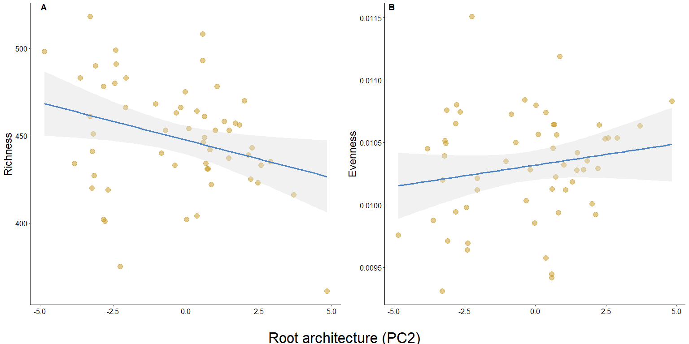
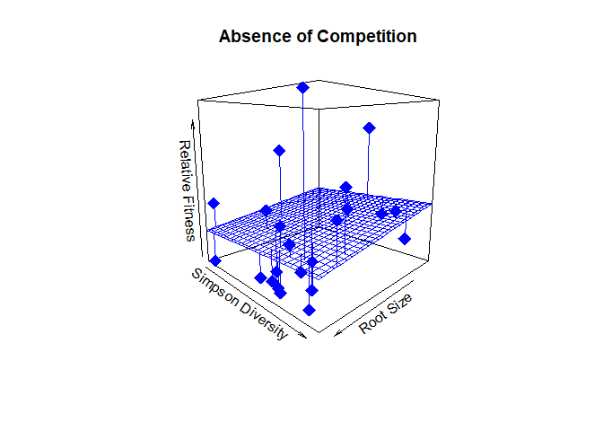

Simplified Analysis
================
Sara Colom
2/8/2020

# Objectives

Evaluate microbial community diversity at the Genus level and its
relationship with plant root architecture and plant fitness across and
between stressful enviornments.

We address the following specific research aims:

-   **Aim 1:** Do measures of microbial communities vary with root
    phenotypes? (e.g., root architecture, morphology, and size)
-   **Aim 2:** Within a non stressful environment or control treatment
    (i.e., no competition), does plant fitness vary by measures of
    microbial community after adjusting for root architecture? Is there
    evidence that plant fitness varies according to microbial community
    by root architecture interaction?
-   **Aim 3:** Question 2 extended–do these relationships change in
    stressful environment? In other words, does belowground plant-plant
    competition alter relationships with plant fitness and microbial
    communities?

## Sample sizes

### Table sample number by species and treatment

| Species      | Treatment   | N   |
|--------------|-------------|-----|
| I. purpurea  | Alone       | 27  |
| I. purpurea  | Competition | 73  |
| I. hederacea | Competition | 73  |

### Table number of maternal line per species

| Species      | Number of ML |
|--------------|--------------|
| I. purpurea  | 10           |
| I. hederacea | 5            |

# Load Libraries

``` r
library(tidyverse)
library(phyloseq)
library(vegan)
library(broom)
library(MASS)
library(ggpubr)
library(grid)
library(stringr)
library(broom)
library(car)

source("miSeq.R")
source("functions.R")
```

# Read in Data

``` r
physeq1 <- readRDS("../DataSets/physeq_clean")
physeq.scale <- readRDS("../DataSets/physeq_scaled")
alpha <- readRDS("../DataSets/alpha")

RootData <- read.csv("../DataSets/RootTraits_PCs.csv")
LeafData <- read.csv("../DataSets/SizeFitData.csv")
Fitness = read.csv("../DataSets/FitPA4.csv")
```

# Sample sizes

#### Samples by block within IP

``` r
alpha %>% 
  filter(Species == "Ip") %>% 
  count(Block)
```

| Block |   n |
|:------|----:|
| 1     |  24 |
| 2     |  25 |
| 3     |  26 |
| 4     |  25 |

#### Samples of treatment within IP

``` r
alpha %>% 
  filter(Species == "Ip") %>% 
  count(TRT)
```

| TRT   |   n |
|:------|----:|
| Alone |  27 |
| Inter |  73 |

## Alpha Diversity

``` r
# Visualize data distribution w Violin plots within I.purpurea

p <- ggplot(alpha %>% filter(Species == "Ip"), aes(x = TRT, y = rich)) +
  geom_violin(trim = FALSE, aes(fill = TRT), alpha = 0.3) + 
  geom_dotplot(binaxis = 'y', stackdir = 'center', dotsize = 1, aes(color = TRT, fill = TRT)) +
  theme_classic() +
  scale_color_brewer(palette = "Paired") +
  scale_fill_brewer(palette = "Paired") +
  ggtitle("Species Richness")


q <- ggplot(alpha %>% filter(Species == "Ip"), aes(x = TRT, y = InvSimp)) +
  geom_violin(trim = FALSE, aes(fill = TRT), alpha = 0.3) + 
  geom_dotplot(binaxis = 'y', stackdir = 'center', dotsize = 1, aes(color = TRT, fill = TRT)) +
  theme_classic() +
  scale_color_brewer(palette = "Paired") +
  scale_fill_brewer(palette = "Paired") +
  ggtitle("Species Inverse Simpson") +
  ylab("")


t <- ggplot(alpha %>% filter(Species == "Ip"), aes(x = TRT, y = sim)) +
  geom_violin(trim = FALSE, aes(fill= TRT), alpha = 0.3) + 
  geom_dotplot(binaxis = 'y', stackdir = 'center', dotsize = 1, aes(color = TRT, fill = TRT)) +
  theme_classic() +
  scale_color_brewer(palette = "Paired") +
  scale_fill_brewer(palette = "Paired") +
  ggtitle("Simpson") +
  ylab("")

v <- ggplot(alpha %>% filter(Species == "Ip"), aes(x = TRT, y = even)) +
  geom_violin(trim = FALSE, aes(fill = TRT), alpha = 0.3) + 
  geom_dotplot(binaxis = 'y', stackdir = 'center', dotsize = 1, aes(color = TRT, fill = TRT)) +
  theme_classic() +
  scale_color_brewer(palette = "Paired") +
  scale_fill_brewer(palette = "Paired") +
  ggtitle("Evenness") +
  ylab("")

ggarrange(p, q, t, v, common.legend = T, ncol = 2, nrow = 2)
```

<!-- -->

# Community Composition

## Beta Diversity

``` r
physeq.bray <- phyloseq::distance(physeq = physeq.scale, method = "bray")

# # # # # # # # # # # # # # # # # # # # # 
# Subsample for within I. purpurea only
# # # # # # # # # # # # # # # # # # # # # 

physeq.Purp <- subset_samples(physeq.scale, Species == "Ip")
sampledf.Purp<- data.frame(sample_data(physeq.Purp))

# Calculate bray curtis for I.purpurea samples only
physeq.Purp.bray <- phyloseq::distance(physeq = physeq.Purp, method = "bray")
```

``` r
# Beta diversity pcoa Bray-Curtis DNA only 
physeq.pcoa <-
  ordinate(
    physeq = physeq.scale,
    method = "PCoA",
    distance = "bray"
  )

physeq.pcoa.vectors <- data.frame(physeq.pcoa$vectors[, 1:4])

physeq.pcoa.vectors$Duplicates <- row.names(physeq.pcoa.vectors)

SampData <- data.frame(sample_data(physeq1))

colnames(SampData)[1] <- "Duplicates"

SampData <- subset(SampData, SampData$TRT == "Inter"|SampData$TRT == "Alone")

physeq.pcoa.df <- droplevels(merge(physeq.pcoa.vectors, SampData, by="Duplicates"))
```

# Testing linear relationships between root architecture & microbial diversity

## Prep root data

``` r
RootAlphaObs <- merge(alpha, RootData[c("Sample_ID", "PC1", "PC2", "PC3", "PC4")])
```

### Evaluate relationship between alpha diversity and root traits

``` r
#summary(glht(SimpInvPC1, mcp(rank="Tukey")))

#################################################################
##################### SUBSET for I.purpurea #####################
#################################################################

RootAlphaPurp <- droplevels(RootAlphaObs %>% filter(Species == "Ip"))
RootAlphaPurp$Comp <- sub(".*\\-", "", RootAlphaPurp$Combos)


### Linear regressions

SimpPC1 <- lm(sim ~ PC1 + Block + TRT, RootAlphaPurp) 
summary(SimpPC1)
```

    ## 
    ## Call:
    ## lm(formula = sim ~ PC1 + Block + TRT, data = RootAlphaPurp)
    ## 
    ## Residuals:
    ##       Min        1Q    Median        3Q       Max 
    ## -0.027453 -0.003862  0.001500  0.005865  0.011300 
    ## 
    ## Coefficients:
    ##              Estimate Std. Error t value Pr(>|t|)    
    ## (Intercept)  0.977989   0.003869 252.755   <2e-16 ***
    ## PC1          0.001447   0.001258   1.150   0.2554    
    ## Block2      -0.005401   0.010369  -0.521   0.6047    
    ## Block3      -0.009643   0.010882  -0.886   0.3797    
    ## Block4      -0.002049   0.002635  -0.777   0.4405    
    ## TRTInter    -0.004216   0.002470  -1.707   0.0939 .  
    ## ---
    ## Signif. codes:  0 '***' 0.001 '**' 0.01 '*' 0.05 '.' 0.1 ' ' 1
    ## 
    ## Residual standard error: 0.008187 on 51 degrees of freedom
    ## Multiple R-squared:  0.1337, Adjusted R-squared:  0.04877 
    ## F-statistic: 1.574 on 5 and 51 DF,  p-value: 0.1841

``` r
SimpInvPC1 <- lm(InvSimp ~ PC1  + TRT + Block, RootAlphaPurp) 
summary(SimpInvPC1)
```

    ## 
    ## Call:
    ## lm(formula = InvSimp ~ PC1 + TRT + Block, data = RootAlphaPurp)
    ## 
    ## Residuals:
    ##      Min       1Q   Median       3Q      Max 
    ## -17.7242  -6.0203   0.0454   5.7859  21.1897 
    ## 
    ## Coefficients:
    ##             Estimate Std. Error t value Pr(>|t|)    
    ## (Intercept)   43.458      4.429   9.811 2.46e-13 ***
    ## PC1            1.396      1.440   0.970    0.337    
    ## TRTInter      -3.528      2.828  -1.248    0.218    
    ## Block2        -3.544     11.870  -0.299    0.766    
    ## Block3        -7.712     12.457  -0.619    0.539    
    ## Block4        -2.575      3.017  -0.854    0.397    
    ## ---
    ## Signif. codes:  0 '***' 0.001 '**' 0.01 '*' 0.05 '.' 0.1 ' ' 1
    ## 
    ## Residual standard error: 9.372 on 51 degrees of freedom
    ## Multiple R-squared:  0.1379, Adjusted R-squared:  0.05334 
    ## F-statistic: 1.631 on 5 and 51 DF,  p-value: 0.1686

``` r
RichPC1 <- lm(rich ~ PC1 + Block + TRT, RootAlphaPurp) 
summary(RichPC1)
```

    ## 
    ## Call:
    ## lm(formula = rich ~ PC1 + Block + TRT, data = RootAlphaPurp)
    ## 
    ## Residuals:
    ##     Min      1Q  Median      3Q     Max 
    ## -68.694 -17.875   1.742  20.104  51.312 
    ## 
    ## Coefficients:
    ##             Estimate Std. Error t value Pr(>|t|)    
    ## (Intercept)  461.869     14.307  32.283   <2e-16 ***
    ## PC1            3.379      4.650   0.727   0.4707    
    ## Block2        -7.192     38.340  -0.188   0.8519    
    ## Block3        -2.043     40.236  -0.051   0.9597    
    ## Block4         1.186      9.744   0.122   0.9036    
    ## TRTInter     -17.545      9.133  -1.921   0.0603 .  
    ## ---
    ## Signif. codes:  0 '***' 0.001 '**' 0.01 '*' 0.05 '.' 0.1 ' ' 1
    ## 
    ## Residual standard error: 30.27 on 51 degrees of freedom
    ## Multiple R-squared:  0.1664, Adjusted R-squared:  0.08472 
    ## F-statistic: 2.037 on 5 and 51 DF,  p-value: 0.08903

``` r
EvenPC1 <- lm(even ~ PC1 + Block + TRT , RootAlphaPurp) 
summary(EvenPC1)
```

    ## 
    ## Call:
    ## lm(formula = even ~ PC1 + Block + TRT, data = RootAlphaPurp)
    ## 
    ## Residuals:
    ##        Min         1Q     Median         3Q        Max 
    ## -8.015e-04 -3.058e-04  1.160e-06  2.792e-04  9.880e-04 
    ## 
    ## Coefficients:
    ##               Estimate Std. Error t value Pr(>|t|)    
    ## (Intercept)  1.033e-02  2.037e-04  50.696   <2e-16 ***
    ## PC1         -6.197e-06  6.620e-05  -0.094    0.926    
    ## Block2      -1.131e-04  5.458e-04  -0.207    0.837    
    ## Block3      -3.416e-04  5.728e-04  -0.596    0.554    
    ## Block4      -1.537e-04  1.387e-04  -1.108    0.273    
    ## TRTInter     1.765e-04  1.300e-04   1.358    0.180    
    ## ---
    ## Signif. codes:  0 '***' 0.001 '**' 0.01 '*' 0.05 '.' 0.1 ' ' 1
    ## 
    ## Residual standard error: 0.0004309 on 51 degrees of freedom
    ## Multiple R-squared:  0.1239, Adjusted R-squared:  0.03796 
    ## F-statistic: 1.442 on 5 and 51 DF,  p-value: 0.2253

``` r
SimpPC2 <- lm(sim ~ PC2 + Block + TRT, RootAlphaPurp) 
summary(SimpPC2)
```

    ## 
    ## Call:
    ## lm(formula = sim ~ PC2 + Block + TRT, data = RootAlphaPurp)
    ## 
    ## Residuals:
    ##       Min        1Q    Median        3Q       Max 
    ## -0.027561 -0.003682  0.001345  0.005432  0.011845 
    ## 
    ## Coefficients:
    ##               Estimate Std. Error t value Pr(>|t|)    
    ## (Intercept)  0.9721778  0.0029179 333.173   <2e-16 ***
    ## PC2         -0.0009071  0.0006315  -1.436    0.157    
    ## Block2       0.0059736  0.0046160   1.294    0.201    
    ## Block3       0.0038107  0.0032096   1.187    0.241    
    ## Block4       0.0001549  0.0032208   0.048    0.962    
    ## TRTInter    -0.0028856  0.0024702  -1.168    0.248    
    ## ---
    ## Signif. codes:  0 '***' 0.001 '**' 0.01 '*' 0.05 '.' 0.1 ' ' 1
    ## 
    ## Residual standard error: 0.00813 on 51 degrees of freedom
    ## Multiple R-squared:  0.1458, Adjusted R-squared:  0.06203 
    ## F-statistic: 1.741 on 5 and 51 DF,  p-value: 0.1421

``` r
SimpInvPC2 <- lm(InvSimp ~ PC2  + TRT + Block, RootAlphaPurp) 
summary(SimpInvPC2)
```

    ## 
    ## Call:
    ## lm(formula = InvSimp ~ PC2 + TRT + Block, data = RootAlphaPurp)
    ## 
    ## Residuals:
    ##      Min       1Q   Median       3Q      Max 
    ## -16.9556  -5.8042   0.3685   5.7251  23.5566 
    ## 
    ## Coefficients:
    ##             Estimate Std. Error t value Pr(>|t|)    
    ## (Intercept)  38.1076     3.3574  11.350 1.44e-15 ***
    ## PC2          -0.7761     0.7266  -1.068    0.290    
    ## TRTInter     -2.3302     2.8422  -0.820    0.416    
    ## Block2        7.3541     5.3112   1.385    0.172    
    ## Block3        5.1111     3.6930   1.384    0.172    
    ## Block4       -0.7544     3.7059  -0.204    0.839    
    ## ---
    ## Signif. codes:  0 '***' 0.001 '**' 0.01 '*' 0.05 '.' 0.1 ' ' 1
    ## 
    ## Residual standard error: 9.354 on 51 degrees of freedom
    ## Multiple R-squared:  0.1412, Adjusted R-squared:  0.05699 
    ## F-statistic: 1.677 on 5 and 51 DF,  p-value: 0.1571

``` r
RichPC2 <- lm(rich ~ PC2 + Block + TRT, RootAlphaPurp) 
summary(RichPC2)
```

    ## 
    ## Call:
    ## lm(formula = rich ~ PC2 + Block + TRT, data = RootAlphaPurp)
    ## 
    ## Residuals:
    ##     Min      1Q  Median      3Q     Max 
    ## -65.527 -11.917   3.751  21.397  48.599 
    ## 
    ## Coefficients:
    ##             Estimate Std. Error t value Pr(>|t|)    
    ## (Intercept)  438.929     10.272  42.732  < 2e-16 ***
    ## PC2           -5.734      2.223  -2.579  0.01282 *  
    ## Block2        22.156     16.249   1.363  0.17872    
    ## Block3        35.137     11.298   3.110  0.00306 ** 
    ## Block4        17.473     11.338   1.541  0.12946    
    ## TRTInter     -11.287      8.696  -1.298  0.20012    
    ## ---
    ## Signif. codes:  0 '***' 0.001 '**' 0.01 '*' 0.05 '.' 0.1 ' ' 1
    ## 
    ## Residual standard error: 28.62 on 51 degrees of freedom
    ## Multiple R-squared:  0.255,  Adjusted R-squared:  0.182 
    ## F-statistic: 3.491 on 5 and 51 DF,  p-value: 0.008644

``` r
EvenPC2 <- lm(even ~ PC2 + Block + TRT , RootAlphaPurp) 
summary(EvenPC2) 
```

    ## 
    ## Call:
    ## lm(formula = even ~ PC2 + Block + TRT, data = RootAlphaPurp)
    ## 
    ## Residuals:
    ##        Min         1Q     Median         3Q        Max 
    ## -7.790e-04 -2.985e-04 -1.367e-05  2.307e-04  1.030e-03 
    ## 
    ## Coefficients:
    ##               Estimate Std. Error t value Pr(>|t|)    
    ## (Intercept)  1.053e-02  1.474e-04  71.425  < 2e-16 ***
    ## PC2          7.252e-05  3.190e-05   2.273  0.02725 *  
    ## Block2      -2.146e-04  2.332e-04  -0.920  0.36176    
    ## Block3      -5.085e-04  1.621e-04  -3.136  0.00284 ** 
    ## Block4      -3.746e-04  1.627e-04  -2.303  0.02541 *  
    ## TRTInter     1.110e-04  1.248e-04   0.890  0.37769    
    ## ---
    ## Signif. codes:  0 '***' 0.001 '**' 0.01 '*' 0.05 '.' 0.1 ' ' 1
    ## 
    ## Residual standard error: 0.0004107 on 51 degrees of freedom
    ## Multiple R-squared:  0.2043, Adjusted R-squared:  0.1263 
    ## F-statistic: 2.619 on 5 and 51 DF,  p-value: 0.03493

``` r
SimpPC3 <- lm(sim ~ PC3 + Block + TRT, RootAlphaPurp) 
summary(SimpPC3)
```

    ## 
    ## Call:
    ## lm(formula = sim ~ PC3 + Block + TRT, data = RootAlphaPurp)
    ## 
    ## Residuals:
    ##       Min        1Q    Median        3Q       Max 
    ## -0.027765 -0.002862  0.001317  0.006049  0.012040 
    ## 
    ## Coefficients:
    ##               Estimate Std. Error t value Pr(>|t|)    
    ## (Intercept)  0.9737709  0.0024996 389.573   <2e-16 ***
    ## PC3          0.0009578  0.0007577   1.264    0.212    
    ## Block2       0.0062684  0.0046770   1.340    0.186    
    ## Block3       0.0027008  0.0030730   0.879    0.384    
    ## Block4      -0.0028575  0.0025835  -1.106    0.274    
    ## TRTInter    -0.0029872  0.0024794  -1.205    0.234    
    ## ---
    ## Signif. codes:  0 '***' 0.001 '**' 0.01 '*' 0.05 '.' 0.1 ' ' 1
    ## 
    ## Residual standard error: 0.008166 on 51 degrees of freedom
    ## Multiple R-squared:  0.1382, Adjusted R-squared:  0.05373 
    ## F-statistic: 1.636 on 5 and 51 DF,  p-value: 0.1673

``` r
SimpInvPC3 <- lm(InvSimp ~ PC3  + TRT + Block, RootAlphaPurp) 
summary(SimpInvPC3)
```

    ## 
    ## Call:
    ## lm(formula = InvSimp ~ PC3 + TRT + Block, data = RootAlphaPurp)
    ## 
    ## Residuals:
    ##     Min      1Q  Median      3Q     Max 
    ## -18.376  -5.062   0.571   5.679  21.215 
    ## 
    ## Coefficients:
    ##             Estimate Std. Error t value Pr(>|t|)    
    ## (Intercept)  39.5095     2.8733  13.751   <2e-16 ***
    ## PC3           0.7704     0.8710   0.885    0.381    
    ## TRTInter     -2.4525     2.8500  -0.861    0.394    
    ## Block2        7.5555     5.3762   1.405    0.166    
    ## Block3        4.1443     3.5324   1.173    0.246    
    ## Block4       -3.3207     2.9698  -1.118    0.269    
    ## ---
    ## Signif. codes:  0 '***' 0.001 '**' 0.01 '*' 0.05 '.' 0.1 ' ' 1
    ## 
    ## Residual standard error: 9.386 on 51 degrees of freedom
    ## Multiple R-squared:  0.1352, Adjusted R-squared:  0.05046 
    ## F-statistic: 1.595 on 5 and 51 DF,  p-value: 0.1783

``` r
RichPC3 <- lm(rich ~ PC3 + Block + TRT, RootAlphaPurp) 
summary(RichPC3)
```

    ## 
    ## Call:
    ## lm(formula = rich ~ PC3 + Block + TRT, data = RootAlphaPurp)
    ## 
    ## Residuals:
    ##     Min      1Q  Median      3Q     Max 
    ## -70.160 -16.679   2.978  20.134  52.500 
    ## 
    ## Coefficients:
    ##             Estimate Std. Error t value Pr(>|t|)    
    ## (Intercept) 452.2049     9.2684  48.790   <2e-16 ***
    ## PC3           1.9983     2.8096   0.711    0.480    
    ## Block2       19.8187    17.3422   1.143    0.258    
    ## Block3       26.7079    11.3946   2.344    0.023 *  
    ## Block4       -0.6489     9.5797  -0.068    0.946    
    ## TRTInter    -14.8465     9.1935  -1.615    0.113    
    ## ---
    ## Signif. codes:  0 '***' 0.001 '**' 0.01 '*' 0.05 '.' 0.1 ' ' 1
    ## 
    ## Residual standard error: 30.28 on 51 degrees of freedom
    ## Multiple R-squared:  0.1661, Adjusted R-squared:  0.08432 
    ## F-statistic: 2.031 on 5 and 51 DF,  p-value: 0.08978

``` r
EvenPC3 <- lm(even ~ PC3 + Block + TRT , RootAlphaPurp) 
summary(EvenPC3)
```

    ## 
    ## Call:
    ## lm(formula = even ~ PC3 + Block + TRT, data = RootAlphaPurp)
    ## 
    ## Residuals:
    ##        Min         1Q     Median         3Q        Max 
    ## -8.037e-04 -3.090e-04 -1.690e-06  2.763e-04  9.947e-04 
    ## 
    ## Coefficients:
    ##               Estimate Std. Error t value Pr(>|t|)    
    ## (Intercept)  1.034e-02  1.319e-04  78.365   <2e-16 ***
    ## PC3          2.841e-06  3.999e-05   0.071   0.9436    
    ## Block2      -1.559e-04  2.468e-04  -0.632   0.5304    
    ## Block3      -3.921e-04  1.622e-04  -2.418   0.0192 *  
    ## Block4      -1.518e-04  1.364e-04  -1.113   0.2708    
    ## TRTInter     1.763e-04  1.309e-04   1.347   0.1839    
    ## ---
    ## Signif. codes:  0 '***' 0.001 '**' 0.01 '*' 0.05 '.' 0.1 ' ' 1
    ## 
    ## Residual standard error: 0.000431 on 51 degrees of freedom
    ## Multiple R-squared:  0.1238, Adjusted R-squared:  0.03789 
    ## F-statistic: 1.441 on 5 and 51 DF,  p-value: 0.2256

``` r
SimpPC4 <- lm(sim ~ PC4 + Block + TRT, RootAlphaPurp %>% filter(PC4 > -2.5)) 
summary(SimpPC4)
```

    ## 
    ## Call:
    ## lm(formula = sim ~ PC4 + Block + TRT, data = RootAlphaPurp %>% 
    ##     filter(PC4 > -2.5))
    ## 
    ## Residuals:
    ##       Min        1Q    Median        3Q       Max 
    ## -0.017808 -0.004329  0.001752  0.004489  0.011494 
    ## 
    ## Coefficients:
    ##               Estimate Std. Error t value Pr(>|t|)    
    ## (Intercept)  0.9747183  0.0022599 431.301   <2e-16 ***
    ## PC4          0.0008700  0.0009766   0.891    0.377    
    ## Block2       0.0035872  0.0042850   0.837    0.407    
    ## Block3       0.0016687  0.0027578   0.605    0.548    
    ## Block4      -0.0021782  0.0024706  -0.882    0.382    
    ## TRTInter    -0.0026443  0.0021322  -1.240    0.221    
    ## ---
    ## Signif. codes:  0 '***' 0.001 '**' 0.01 '*' 0.05 '.' 0.1 ' ' 1
    ## 
    ## Residual standard error: 0.007102 on 49 degrees of freedom
    ## Multiple R-squared:  0.1002, Adjusted R-squared:  0.008383 
    ## F-statistic: 1.091 on 5 and 49 DF,  p-value: 0.3771

``` r
# Repeat & remove outlier
SimpPC4_out <- lm(sim ~ PC4 + Block + TRT, RootAlphaPurp %>% filter(sim > 0.94)) 
summary(SimpPC4_out)
```

    ## 
    ## Call:
    ## lm(formula = sim ~ PC4 + Block + TRT, data = RootAlphaPurp %>% 
    ##     filter(sim > 0.94))
    ## 
    ## Residuals:
    ##       Min        1Q    Median        3Q       Max 
    ## -0.017811 -0.003811  0.001589  0.004450  0.011490 
    ## 
    ## Coefficients:
    ##               Estimate Std. Error t value Pr(>|t|)    
    ## (Intercept)  0.9747198  0.0022354 436.044   <2e-16 ***
    ## PC4          0.0008668  0.0009460   0.916    0.364    
    ## Block2       0.0035840  0.0042372   0.846    0.402    
    ## Block3       0.0016636  0.0027118   0.613    0.542    
    ## Block4      -0.0021819  0.0024349  -0.896    0.374    
    ## TRTInter    -0.0026408  0.0020996  -1.258    0.214    
    ## ---
    ## Signif. codes:  0 '***' 0.001 '**' 0.01 '*' 0.05 '.' 0.1 ' ' 1
    ## 
    ## Residual standard error: 0.00703 on 50 degrees of freedom
    ## Multiple R-squared:  0.102,  Adjusted R-squared:  0.01223 
    ## F-statistic: 1.136 on 5 and 50 DF,  p-value: 0.3537

``` r
SimpInvPC4 <- lm(InvSimp ~ PC4  + TRT + Block, RootAlphaPurp) 
summary(SimpInvPC4)
```

    ## 
    ## Call:
    ## lm(formula = InvSimp ~ PC4 + TRT + Block, data = RootAlphaPurp)
    ## 
    ## Residuals:
    ##     Min      1Q  Median      3Q     Max 
    ## -17.400  -7.413   1.142   5.415  24.360 
    ## 
    ## Coefficients:
    ##             Estimate Std. Error t value Pr(>|t|)    
    ## (Intercept)   41.834      2.810  14.886   <2e-16 ***
    ## PC4            2.259      1.058   2.135   0.0376 *  
    ## TRTInter      -2.298      2.705  -0.850   0.3995    
    ## Block2         3.120      5.393   0.579   0.5654    
    ## Block3         2.319      3.475   0.667   0.5076    
    ## Block4        -5.023      2.993  -1.678   0.0994 .  
    ## ---
    ## Signif. codes:  0 '***' 0.001 '**' 0.01 '*' 0.05 '.' 0.1 ' ' 1
    ## 
    ## Residual standard error: 9.062 on 51 degrees of freedom
    ## Multiple R-squared:  0.194,  Adjusted R-squared:  0.115 
    ## F-statistic: 2.456 on 5 and 51 DF,  p-value: 0.04547

``` r
RichPC4 <- lm(rich ~ PC4 + Block + TRT, RootAlphaPurp) 
summary(RichPC4)
```

    ## 
    ## Call:
    ## lm(formula = rich ~ PC4 + Block + TRT, data = RootAlphaPurp)
    ## 
    ## Residuals:
    ##    Min     1Q Median     3Q    Max 
    ## -65.92 -15.72   0.98  20.30  53.09 
    ## 
    ## Coefficients:
    ##             Estimate Std. Error t value Pr(>|t|)    
    ## (Intercept)  456.445      9.346  48.836   <2e-16 ***
    ## PC4            3.503      3.518   0.996   0.3241    
    ## Block2        12.109     17.934   0.675   0.5026    
    ## Block3        23.597     11.557   2.042   0.0464 *  
    ## Block4        -3.106      9.953  -0.312   0.7563    
    ## TRTInter     -15.185      8.995  -1.688   0.0975 .  
    ## ---
    ## Signif. codes:  0 '***' 0.001 '**' 0.01 '*' 0.05 '.' 0.1 ' ' 1
    ## 
    ## Residual standard error: 30.14 on 51 degrees of freedom
    ## Multiple R-squared:  0.1739, Adjusted R-squared:  0.09287 
    ## F-statistic: 2.147 on 5 and 51 DF,  p-value: 0.07469

``` r
EvenPC4 <- lm(even ~ PC4 + Block + TRT , RootAlphaPurp) 
summary(EvenPC4)
```

    ## 
    ## Call:
    ## lm(formula = even ~ PC4 + Block + TRT, data = RootAlphaPurp)
    ## 
    ## Residuals:
    ##        Min         1Q     Median         3Q        Max 
    ## -7.993e-04 -2.799e-04  2.209e-05  2.921e-04  9.660e-04 
    ## 
    ## Coefficients:
    ##               Estimate Std. Error t value Pr(>|t|)    
    ## (Intercept)  1.036e-02  1.333e-04  77.714   <2e-16 ***
    ## PC4          2.615e-05  5.018e-05   0.521   0.6045    
    ## Block2      -2.010e-04  2.558e-04  -0.786   0.4357    
    ## Block3      -4.111e-04  1.648e-04  -2.494   0.0159 *  
    ## Block4      -1.729e-04  1.420e-04  -1.218   0.2288    
    ## TRTInter     1.824e-04  1.283e-04   1.422   0.1611    
    ## ---
    ## Signif. codes:  0 '***' 0.001 '**' 0.01 '*' 0.05 '.' 0.1 ' ' 1
    ## 
    ## Residual standard error: 0.0004298 on 51 degrees of freedom
    ## Multiple R-squared:  0.1283, Adjusted R-squared:  0.04289 
    ## F-statistic: 1.502 on 5 and 51 DF,  p-value: 0.2057

## Make tables of results ABOVE with only root term in model and combine

PC1

``` r
SimpInvPC1_res <- SimpInvPC1 %>% 
  tidy() %>% 
  filter(term == "PC1") %>% 
  mutate(`Microbial community metric` = "Inverse Simpson Diversity") %>% 
  rename(b = estimate, SE = `std.error`, `t-statistic` = statistic, `p_value` = `p.value`) %>% 
  relocate(`Microbial community metric`) %>% 
  mutate(across(where(is.numeric), function(x) round(x, 3))) %>% 
  mutate("Root topology" = paste(b, "+/-", SE, sep = " ")) %>% 
  dplyr::select(`Microbial community metric`, `Root topology`)


SimpPC1_res <- SimpPC1 %>% 
  tidy() %>% 
  filter(term == "PC1") %>% 
  mutate(`Microbial community metric` = "Simpson Diversity") %>% 
  rename(b = estimate, SE = `std.error`, `t-statistic` = statistic, `p_value` = `p.value`) %>% 
  relocate(`Microbial community metric`)  %>% 
  mutate(b = b*1000,
         SE = SE*1000) %>% 
  mutate(across(where(is.numeric), function(x) round(x, 3))) %>% 
  mutate("Root topology" = paste(b, "e^3", " +/- ", SE, "e^3", sep = "")) %>% 
  dplyr::select(`Microbial community metric`, `Root topology`)

RichPC1_res <- RichPC1 %>% 
  tidy() %>% 
  filter(term == "PC1") %>% 
  mutate(`Microbial community metric` = "Sp. richness") %>% 
  rename(b = estimate, SE = `std.error`, `t-statistic` = statistic, `p_value` = `p.value`) %>% 
  relocate(`Microbial community metric`) %>% 
  mutate(across(where(is.numeric), function(x) round(x, 3))) %>% 
  mutate("Root topology" = paste(b, "+/-", SE, sep = " ")) %>% 
  dplyr::select(`Microbial community metric`, `Root topology`)  

EvenPC1_res <- EvenPC1 %>% 
  tidy() %>% 
  filter(term == "PC1") %>% 
  mutate(`Microbial community metric` = "Sp. evenness") %>% 
  rename(b = estimate, SE = `std.error`, `t-statistic` = statistic, `p_value` = `p.value`) %>% 
  relocate(`Microbial community metric`)  %>% 
  mutate(b = b*1000000,
         SE = SE*1000000) %>% 
  mutate(across(where(is.numeric), function(x) round(x, 3))) %>% 
  mutate("Root topology" = paste(b, "e^6", " +/- ", SE, "e^6", sep = "")) %>% 
  dplyr::select(`Microbial community metric`, `Root topology`) 

microbe_root_lm_res_pc1 <- SimpInvPC1_res %>% 
  bind_rows(
  RichPC1_res
  ) %>% 
  bind_rows(
    EvenPC1_res
  ) %>% 
  bind_rows(SimpPC1_res) 
```

PC2

``` r
SimpInvPC2_res <- SimpInvPC2 %>% 
  tidy() %>% 
  filter(term == "PC2") %>% 
  mutate(`Microbial community metric` = "Inverse Simpson Diversity") %>% 
  rename(b = estimate, SE = `std.error`, `t-statistic` = statistic, `p_value` = `p.value`) %>% 
  relocate(`Microbial community metric`) %>% 
  mutate(across(where(is.numeric), function(x) round(x, 3))) %>% 
  mutate("Root architecture" = paste(b, "+/-", SE, sep = " ")) %>% 
  dplyr::select(`Microbial community metric`, `Root architecture`)

SimpPC2_res <- SimpPC2 %>% 
  tidy() %>% 
  filter(term == "PC2") %>% 
  mutate(`Microbial community metric` = "Simpson Diversity") %>% 
  rename(b = estimate, SE = `std.error`, `t-statistic` = statistic, `p_value` = `p.value`) %>% 
  relocate(`Microbial community metric`) %>% 
    mutate(b = b*10000,
           SE = SE*10000) %>% 
    mutate(across(where(is.numeric), function(x) round(x, 3))) %>% 
    mutate("Root architecture" = paste(b, "e^4", " +/- ", SE, "e^4", sep = "")) %>% 
  dplyr::select(`Microbial community metric`, `Root architecture`)  

RichPC2_res <- RichPC2 %>% 
  tidy() %>% 
  filter(term == "PC2") %>% 
  mutate(`Microbial community metric` = "Sp. richness") %>% 
  rename(b = estimate, SE = `std.error`, `t-statistic` = statistic, `p_value` = `p.value`) %>% 
  relocate(`Microbial community metric`) %>%
  mutate(across(where(is.numeric), function(x) round(x, 3))) %>% 
  mutate("Root architecture" = paste(b, "+/-", SE, sep = " ")) %>% 
  dplyr::select(`Microbial community metric`, `Root architecture`)  

EvenPC2_res <- EvenPC2 %>% 
  tidy() %>% 
  filter(term == "PC2") %>% 
  mutate(`Microbial community metric` = "Sp. evenness") %>% 
  rename(b = estimate, SE = `std.error`, `t-statistic` = statistic, `p_value` = `p.value`) %>% 
  relocate(`Microbial community metric`) %>% 
    mutate(b = b*100000,
           SE = SE*100000) %>% 
    mutate(across(where(is.numeric), function(x) round(x, 3))) %>% 
    mutate("Root architecture" = paste(b, "e^5", " +/- ", SE, "e^5", sep = "")) %>% 
  dplyr::select(`Microbial community metric`, `Root architecture`)  

microbe_root_lm_res_pc2 <- SimpInvPC2_res %>% 
  bind_rows(
  RichPC2_res
  ) %>% 
  bind_rows(
    EvenPC2_res
  ) %>% 
  bind_rows(SimpPC2_res) 
```

PC3

``` r
SimpInvPC3_res <- SimpInvPC3 %>% 
  tidy() %>% 
  filter(term == "PC3") %>% 
  mutate(`Microbial community metric` = "Inverse Simpson Diversity") %>% 
  rename(b = estimate, SE = `std.error`, `t-statistic` = statistic, `p_value` = `p.value`) %>% 
  relocate(`Microbial community metric`) %>%
  mutate(across(where(is.numeric), function(x) round(x, 3))) %>% 
  mutate("Root size" = paste(b, "+/-", SE, sep = " ")) %>% 
  dplyr::select(`Microbial community metric`, `Root size`)    

SimpPC3_res <- SimpPC3 %>% 
  tidy() %>% 
  filter(term == "PC3") %>% 
  mutate(`Microbial community metric` = "Simpson Diversity") %>% 
  rename(b = estimate, SE = `std.error`, `t-statistic` = statistic, `p_value` = `p.value`) %>% 
  relocate(`Microbial community metric`)%>% 
    mutate(b = b*10000,
           SE = SE*10000) %>% 
    mutate(across(where(is.numeric), function(x) round(x, 3))) %>% 
    mutate("Root size" = paste(b, "e^4", " +/- ", SE, "e^4", sep = "")) %>% 
  dplyr::select(`Microbial community metric`, `Root size`)    

RichPC3_res <- RichPC3 %>% 
  tidy() %>% 
  filter(term == "PC3") %>% 
  mutate(`Microbial community metric` = "Sp. richness") %>% 
  rename(b = estimate, SE = `std.error`, `t-statistic` = statistic, `p_value` = `p.value`) %>% 
  relocate(`Microbial community metric`) %>%
  mutate(across(where(is.numeric), function(x) round(x, 3))) %>% 
  mutate("Root size" = paste(b, "+/-", SE, sep = " ")) %>% 
  dplyr::select(`Microbial community metric`, `Root size`)    

EvenPC3_res <- EvenPC3 %>% 
  tidy() %>% 
  filter(term == "PC3") %>% 
  mutate(`Microbial community metric` = "Sp. evenness") %>% 
  rename(b = estimate, SE = `std.error`, `t-statistic` = statistic, `p_value` = `p.value`) %>% 
  relocate(`Microbial community metric`) %>% 
    mutate(b = b*100000,
           SE = SE*100000) %>% 
    mutate(across(where(is.numeric), function(x) round(x, 3))) %>% 
    mutate("Root size" = paste(b, "e^5", " +/- ", SE, "e^5", sep = ""))%>% 
  dplyr::select(`Microbial community metric`, `Root size`)    

microbe_root_lm_res_pc3 <- SimpInvPC3_res %>% 
  bind_rows(
  RichPC3_res
  ) %>% 
  bind_rows(
    EvenPC3_res
  ) %>% 
  bind_rows(SimpPC3_res)
```

PC4

``` r
SimpInvPC4_res2 <- SimpInvPC4 %>% 
  tidy() %>% 
  filter(term == "PC4") %>% 
  mutate(`Microbial community metric` = "Inverse Simpson Diversity") %>% 
  rename(b = estimate, SE = `std.error`, `t-statistic` = statistic, `p_value` = `p.value`) %>% 
  relocate(`Microbial community metric`) %>%
  mutate(across(where(is.numeric), function(x) round(x, 3))) %>% 
  mutate("Root morphology" = paste(b, "+/-", SE, sep = " ")) %>% 
  dplyr::select(`Microbial community metric`, `Root morphology`)    

SimpPC4_res2 <- SimpPC4 %>% 
  tidy() %>% 
  filter(term == "PC4") %>% 
  mutate(`Microbial community metric` = "Simpson Diversity") %>% 
  rename(b = estimate, SE = `std.error`, `t-statistic` = statistic, `p_value` = `p.value`) %>% 
  relocate(`Microbial community metric`) %>% 
    mutate(b = b*10000,
           SE = SE*10000) %>% 
    mutate(across(where(is.numeric), function(x) round(x, 3))) %>% 
    mutate("Root morphology" = paste(b, "e^4", " +/- ", SE, "e^4", sep = "")) %>% 
  dplyr::select(`Microbial community metric`, `Root morphology`) 

RichPC4_res2 <- RichPC4 %>% 
  tidy() %>% 
  filter(term == "PC4") %>% 
  mutate(`Microbial community metric` = "Sp. richness") %>% 
  rename(b = estimate, SE = `std.error`, `t-statistic` = statistic, `p_value` = `p.value`) %>% 
  relocate(`Microbial community metric`) %>%
  mutate(across(where(is.numeric), function(x) round(x, 3))) %>% 
  mutate("Root morphology" = paste(b, "+/-", SE, sep = " ")) %>% 
  dplyr::select(`Microbial community metric`, `Root morphology`) 

EvenPC4_res2 <- EvenPC4 %>% 
  tidy() %>% 
  filter(term == "PC4") %>% 
  mutate(`Microbial community metric` = "Sp. evenness") %>% 
  rename(b = estimate, SE = `std.error`, `t-statistic` = statistic, `p_value` = `p.value`) %>% 
  relocate(`Microbial community metric`) %>% 
    mutate(b = b*100000,
           SE = SE*100000) %>% 
    mutate(across(where(is.numeric), function(x) round(x, 3))) %>% 
    mutate("Root morphology" = paste(b, "e^5", " +/- ", SE, "e^5", sep = ""))%>% 
  dplyr::select(`Microbial community metric`, `Root morphology`) 

microbe_root_lm_res_pc4 <- SimpInvPC4_res2 %>% 
  bind_rows(
  RichPC4_res2
  ) %>% 
  bind_rows(
    EvenPC4_res2
  ) %>% 
  bind_rows(SimpPC4_res2)
```

# Table 1.

Table 1 Results of separate linear regression between different metrics
(ɑ-Diversity Metric) of the rhizosphere microbiome (Inverse Simpson,
Simpson, Richness and Evenness) and four root traits (Root topology,
Root architecture, Root size and Root morphology) examined in I.
purpurea. ɑ-Diversity metrics were treated as response variables for
each root trait, and Block and competition treatment (Treatment) were
included in the final modelǂ as fixed main effects. Linear regression
coefficient slopes (𝛣) are reported with ± 1 standard error. P \< 0.05
*; P \<0.01 **; P \<0.001***; P =0.09 ^

``` r
table_1 <- microbe_root_lm_res_pc1 %>% 
  left_join(microbe_root_lm_res_pc2, by = "Microbial community metric") %>% 
  left_join(microbe_root_lm_res_pc3, by = "Microbial community metric") %>% 
  left_join(microbe_root_lm_res_pc4, by = "Microbial community metric")

table_1
```

| Microbial community metric | Root topology           | Root architecture      | Root size             | Root morphology       |
|:---------------------------|:------------------------|:-----------------------|:----------------------|:----------------------|
| Inverse Simpson Diversity  | 1.396 +/- 1.44          | -0.776 +/- 0.727       | 0.77 +/- 0.871        | 2.259 +/- 1.058       |
| Sp. richness               | 3.379 +/- 4.65          | -5.734 +/- 2.223       | 1.998 +/- 2.81        | 3.503 +/- 3.518       |
| Sp. evenness               | -6.197e^6 +/- 66.198e^6 | 7.252e^5 +/- 3.19e^5   | 0.284e^5 +/- 3.999e^5 | 2.615e^5 +/- 5.018e^5 |
| Simpson Diversity          | 1.447e^3 +/- 1.258e^3   | -9.071e^4 +/- 6.315e^4 | 9.578e^4 +/- 7.577e^4 | 8.7e^4 +/- 9.766e^4   |

## Plotting significant linear associations

Species richness and evenness vs Root architecture (PC2)

``` r
# Richness and root architecture
P2.rich <- ggplot() +
  geom_point(data = RootAlphaPurp, aes(PC2, rich), alpha = 0.5, size = 4, color = "#C4961A") +
  geom_smooth(data = RootAlphaPurp, method = "lm", aes(PC2, rich), fullrange = TRUE, color = "#4E84C4", size = 1.2, fill = "#DCDCDC") +
  theme_classic() +
  ylab("Richness") +
  xlab("") +
  theme(axis.text = element_text(color = "black", size = 12)) +
  theme(axis.title = element_text(color = "black", size = 18)) +
  theme(legend.text = element_text(size = 12)) +
  theme(legend.position = "top") +
  guides(colour = guide_legend(override.aes = list(size = 3)))

# Evenness and root architecture
P2.even <- ggplot() +
  geom_point(data = RootAlphaPurp, aes(PC2, even), alpha = 0.5, size = 4, color = "#C4961A") +
  geom_smooth(data = RootAlphaPurp, method = "lm", aes(PC2, even), fullrange = TRUE, color = "#4E84C4", size = 1.2, fill = "#DCDCDC") +
  theme_classic() +
  ylab("Evenness") +
  xlab("") +
  theme(axis.text = element_text(color = "black", size = 12)) +
  theme(axis.title = element_text(color = "black", size = 18)) +
  theme(legend.text = element_text(size = 12)) +
  theme(legend.position = "top") +
  guides(colour = guide_legend(override.aes = list(size = 3)))
```

``` r
# Richness and root architecture
P4.sim <- ggplot() +
  geom_point(data = RootAlphaPurp, aes(PC4, sim), alpha = 0.5, size = 3, color = "#C4961A") +
  geom_smooth(data = RootAlphaPurp, method = "lm", aes(PC4, sim), fullrange = TRUE, color = "#4E84C4", size = 1.2, fill = "#DCDCDC") +
  theme_classic() +
  ylab("simpson Diversity") +
  xlab("") +
  theme(axis.text = element_text(color = "black", size = 12)) +
  theme(axis.title = element_text(color = "black", size = 18)) +
  theme(legend.text = element_text(size = 12)) +
  theme(legend.position = "top") +
  guides(colour = guide_legend(override.aes = list(size = 3)))
```

# Figure 1

``` r
#ggarrange(P2.rich,P2.even,P4.Sim,P4.simIn,nrow=2,ncol=2)
AB <- ggarrange(P2.rich, P2.even, labels = "AUTO", hjust = -7, vjust = 1.5,font.label = list(size = 14))
```

    ## `geom_smooth()` using formula 'y ~ x'
    ## `geom_smooth()` using formula 'y ~ x'

``` r
# Common x title
x.grob1 <- textGrob("Root architecture (PC2)", 
                   gp = gpar(col="black", fontsize = 25), rot = 0)

gridExtra::grid.arrange(gridExtra::arrangeGrob(AB, bottom = x.grob1, padding = unit(0.05,units = 'in'), nrow=1))
```

<!-- -->

``` r
# Calculate relative fitness
# First calculate mean seed number by species and treatment---note* we only have seed output of I. purpurea

Fitness <- Fitness %>% 
  group_by(Species, Trt) %>% 
  mutate(mean_seend_num = mean(SeedNumber, na.rm = T)) %>% 
  mutate(rel_fit = SeedNumber/mean_seend_num) %>% 
  ungroup()

Ipurp.Fit <- Fitness %>%
  filter(Species == "Ip")

Ipurp.Alpha <- alpha %>%
  filter(Species == "Ip")

ggplot(Ipurp.Fit, aes(Trt, rel_fit, fill=Block)) +
  geom_boxplot() +
  scale_fill_brewer("Paired") +
  theme_classic() +
  ylab("Relative Fitness") +
  ggtitle("Relative Fitness by Treatment and Block")
```

<!-- -->

``` r
# Average fitness by block, maternal line and treatment--we use NON standardized fitness (ie size effects not removed)
FitAveraged <- Ipurp.Fit %>% 
  group_by(ML, Trt, Block) %>% 
  mutate(rel_fit_mean = mean(rel_fit, na.rm = T)) %>% 
  ungroup()
```

``` r
####  ####  ####  ####  ####  ####   ####
#  Examine selection on microbiome first
####  ####  ####  ####  ####  ####   ####
FitAveraged$TRT <- FitAveraged$Trt
FitAveraged$Combos <- as.character(FitAveraged$Combos)
FitAveraged[which(FitAveraged$TRT == "Alone"),]$Combos <- "none"
FitAveraged$Combos <- as.factor(FitAveraged$Combos)

BrayFit <- merge(physeq.pcoa.df, FitAveraged)

FitAlpha <- merge(FitAveraged, alpha)
dim(FitAlpha)
```

    ## [1] 158  27

``` r
ggplot(FitAlpha, aes(TRT, rel_fit)) +
  geom_boxplot() +
  scale_fill_brewer("Paired") +
  theme_classic() +
  ylab("Relative Fitness") +
  ggtitle("Relative Fitness by Treatment and Block") +
  facet_grid(~Block)
```

<!-- -->

``` r
# Combine with root data

RootAveraged <- aggregate(list(RootData[c("PC1", "PC2", "PC3", "PC4")]), by=list(RootData$Trt, RootData$ML), FUN = mean) 

colnames(RootAveraged) <- c("Trt", "ML", "PC1", "PC2", "PC3", "PC4")
head(RootAveraged)
```

| Trt   | ML         |        PC1 |        PC2 |        PC3 |        PC4 |
|:------|:-----------|-----------:|-----------:|-----------:|-----------:|
| Alone | PA4.11Ip   | -0.6979465 | -1.3274069 |  0.7756816 | -0.7552061 |
| Inter | PA4.11Ip   |  0.4351958 |  0.6954043 | -0.1859846 |  0.1076187 |
| Inter | PA4.12Ihed |  0.0707594 | -0.9146971 | -0.2814713 | -0.0163105 |
| Alone | PA4.13Ip   | -2.2825465 |  1.4831488 |  0.9299528 | -0.6414076 |
| Inter | PA4.13Ip   |  0.1131733 | -0.1860671 |  0.1006711 |  0.4399295 |
| Alone | PA4.14Ip   |  0.7007183 | -0.4492977 |  0.9728631 | -0.4123774 |

``` r
RootFitAlpha <- merge(FitAlpha, RootAveraged)
head(RootFitAlpha)
```

| ML       | Trt   | Species | Block | Combos | TRT   | Position | Order | UniqId | GerminationDate | Comment1 | Dead_plant | DeathCause | RootsHarvested | SeedsCounted | Comp | Population | SeedNumber | mean_seend_num |   rel_fit | rel_fit_mean | Sample_ID | rich |  InvSimp |       sim |     shan |      even |        PC1 |       PC2 |       PC3 |        PC4 |
|:---------|:------|:--------|------:|:-------|:------|:---------|------:|:-------|:----------------|:---------|:-----------|:-----------|:---------------|:-------------|:-----|:-----------|-----------:|---------------:|----------:|-------------:|:----------|-----:|---------:|----------:|---------:|----------:|-----------:|----------:|----------:|-----------:|
| PA4.11Ip | Alone | Ip      |     1 | none   | Alone | 138      |   138 | 138Ip  | 43258           | NA       | NA         | NA         | N              | Y            | NA   | PA4        |         56 |       224.2419 | 0.2497303 |    0.4437172 | 158P      |  434 | 31.43535 | 0.9681887 | 4.534697 | 0.0104486 | -0.6979465 | -1.327407 | 0.7756816 | -0.7552061 |
| PA4.11Ip | Alone | Ip      |     1 | none   | Alone | 138      |   138 | 138Ip  | 43258           | NA       | NA         | NA         | N              | Y            | NA   | PA4        |         56 |       224.2419 | 0.2497303 |    0.4437172 | 84P       |  478 | 41.08728 | 0.9756616 | 4.753743 | 0.0099451 | -0.6979465 | -1.327407 | 0.7756816 | -0.7552061 |
| PA4.11Ip | Alone | Ip      |     1 | none   | Alone | 99       |    99 | 99Ip   | 43258           | NA       | NA         | NA         | N              | Y            | NA   | PA4        |        143 |       224.2419 | 0.6377041 |    0.4437172 | 158P      |  434 | 31.43535 | 0.9681887 | 4.534697 | 0.0104486 | -0.6979465 | -1.327407 | 0.7756816 | -0.7552061 |
| PA4.11Ip | Alone | Ip      |     1 | none   | Alone | 99       |    99 | 99Ip   | 43258           | NA       | NA         | NA         | N              | Y            | NA   | PA4        |        143 |       224.2419 | 0.6377041 |    0.4437172 | 84P       |  478 | 41.08728 | 0.9756616 | 4.753743 | 0.0099451 | -0.6979465 | -1.327407 | 0.7756816 | -0.7552061 |
| PA4.11Ip | Alone | Ip      |     4 | none   | Alone | 942      |   942 | 942Ip  | NA              | DG       | NA         | NA         | N              | Y            | NA   | PA4        |        518 |       224.2419 | 2.3100050 |    1.4627059 | 814P      |  466 | 48.22287 | 0.9792630 | 4.791226 | 0.0102816 | -0.6979465 | -1.327407 | 0.7756816 | -0.7552061 |
| PA4.11Ip | Alone | Ip      |     4 | none   | Alone | 851      |   851 | 851Ip  | 43264           | NA       | NA         | NA         | N              | Y            | NA   | PA4        |        111 |       224.2419 | 0.4950011 |    1.4627059 | 814P      |  466 | 48.22287 | 0.9792630 | 4.791226 | 0.0102816 | -0.6979465 | -1.327407 | 0.7756816 | -0.7552061 |

``` r
# CombinE root,fitness/bray estimates
RootFitBray <- merge(BrayFit, RootAveraged)


# Plot boxplots of averaged root traits
PC2_Box <- ggplot(RootAveraged, aes(x = "", y = PC2)) +
  geom_boxplot() +
  #geom_jitter() +
  xlab("Root Architecture") +
  theme_classic() +
  Tx+ 
  coord_flip()

# Plot boxplots of averaged root traits
PC1_Box=ggplot(RootAveraged, aes(x = "", y = PC1)) +
  geom_boxplot() +
  #geom_jitter() +
  xlab("Root Topology") +
  theme_classic() +
  Tx+ 
  coord_flip()

# Plot boxplots of averaged root traits
PC4_Box=ggplot(RootAveraged, aes(x = "", y = PC4)) +
  geom_boxplot() +
  #geom_jitter() +
  xlab("Root Morphology") +
  theme_classic() +
  Tx+ 
  coord_flip()
```

## 7/29/2022

-   Evaluate linear relationship of *I.purpurea* fitness and microbial
    richness, inverse Simpson, and evenness within the control (*alone*)
    treatment for each metric separately.

-   Evaluate if relationship above is impacted by treatment (evaluate
    linear model on full data and add treatment by microbial diversity
    metric/interaction)

-   Assess how *I.purpurea* fitness in control varies with the three
    main microbial metrics while controlling for root architecture.

Prior to running models below, I will visualize the relationships
between microbial community metrics and plant fitness and color by
treatment.

``` r
# Scale the microbial variables
RootFitAlpha$richScaled <-scale(RootFitAlpha$rich)
RootFitAlpha$SimScaled <-scale(RootFitAlpha$sim)
RootFitAlpha$InvSimScaled <-scale(RootFitAlpha$InvSimp)
RootFitAlpha$EvenScaled <-scale(RootFitAlpha$even)

RootFitAlpha %>% 
  dplyr::select(TRT, matches("Scaled"), rel_fit, Block) %>% 
  pivot_longer(cols = richScaled:EvenScaled, names_to = "vars", values_to = "value") %>% 
  ggplot() +
  geom_point(aes(value, rel_fit, color = TRT)) +
  geom_smooth(aes(value, rel_fit, color = TRT), method='lm', se = F) +
  facet_wrap(~vars) +
  theme_classic()
```

    ## `geom_smooth()` using formula 'y ~ x'

<!-- -->

## Question 2

``` r
cntrl_Sim <- lm(rel_fit ~ SimScaled*PC2 + Block, RootFitAlpha %>% 
                   filter(TRT == "Alone"))

cntrl_sim_res <- cntrl_Sim %>% 
                        tidy() %>% 
                        rename(b = estimate, SE = `std.error`, `t-statistic` = statistic) %>% 
                        mutate(across(where(is.numeric), function(x) round(x, 3))) %>% 
                        rename(`p_value` = `p.value`) %>% 
                        tidy_p()


cntrl_invSim <- lm(rel_fit ~ InvSimScaled*PC2 + Block, RootFitAlpha %>% 
                   filter(TRT == "Alone"))

cntrl_invsim_res <- cntrl_invSim %>% 
                        tidy() %>% 
                        rename(b = estimate, SE = `std.error`, `t-statistic` = statistic) %>% 
                        mutate(across(where(is.numeric), function(x) round(x, 3))) %>% 
                        rename(`p_value` = `p.value`) %>% 
                        tidy_p()

cntrl_invsim_res
```

| term             |      b |    SE | t-statistic | p_value | p-value   |
|:-----------------|-------:|------:|------------:|--------:|:----------|
| (Intercept)      |  0.367 | 0.201 |       1.827 |   0.076 | 0.076     |
| InvSimScaled     |  0.061 | 0.141 |       0.433 |   0.668 | 0.668     |
| PC2              | -0.033 | 0.084 |      -0.396 |   0.694 | 0.694     |
| Block            |  0.196 | 0.070 |       2.784 |   0.008 | 0.008\*\* |
| InvSimScaled:PC2 |  0.039 | 0.110 |       0.359 |   0.722 | 0.722     |

``` r
cntrl_rich <- lm(rel_fit ~ richScaled*PC2 + Block, RootFitAlpha %>% 
                   filter(TRT == "Alone"))

cntrl_rich_res <- cntrl_rich %>% 
                        tidy() %>% 
                        rename(b = estimate, SE = `std.error`, `t-statistic` = statistic) %>% 
                        mutate(across(where(is.numeric), function(x) round(x, 3))) %>% 
                        rename(`p_value` = `p.value`) %>% 
                        tidy_p()
cntrl_rich_res
```

| term           |      b |    SE | t-statistic | p_value | p-value   |
|:---------------|-------:|------:|------------:|--------:|:----------|
| (Intercept)    |  0.340 | 0.200 |       1.700 |   0.097 | 0.097     |
| richScaled     |  0.100 | 0.096 |       1.041 |   0.304 | 0.304     |
| PC2            | -0.059 | 0.075 |      -0.789 |   0.435 | 0.435     |
| Block          |  0.195 | 0.069 |       2.823 |   0.008 | 0.008\*\* |
| richScaled:PC2 |  0.002 | 0.106 |       0.021 |   0.984 | 0.984     |

``` r
cntrl_even <- lm(rel_fit ~ EvenScaled*PC2 + Block, RootFitAlpha %>% 
                   filter(TRT == "Alone"))

cntrl_even_res <- cntrl_even %>% 
                        tidy() %>% 
                        rename(b = estimate, SE = `std.error`, `t-statistic` = statistic) %>% 
                        mutate(across(where(is.numeric), function(x) round(x, 3))) %>% 
                        rename(`p_value` = `p.value`) %>% 
                        tidy_p()
cntrl_even_res
```

| term           |      b |    SE | t-statistic | p_value | p-value   |
|:---------------|-------:|------:|------------:|--------:|:----------|
| (Intercept)    |  0.353 | 0.200 |       1.761 |   0.086 | 0.086     |
| EvenScaled     | -0.103 | 0.100 |      -1.033 |   0.308 | 0.308     |
| PC2            | -0.059 | 0.070 |      -0.841 |   0.405 | 0.405     |
| Block          |  0.189 | 0.069 |       2.747 |   0.009 | 0.009\*\* |
| EvenScaled:PC2 |  0.030 | 0.146 |       0.206 |   0.838 | 0.838     |

## Question 3

Examining if fitness varies by microbial diversity by treatment
interaction.

``` r
ancova_sim <- lm(rel_fit ~ SimScaled*TRT + Block*SimScaled + SimScaled*PC2 , RootFitAlpha)

ancova_sim <- anova(ancova_sim) %>% 
  tidy() %>% 
  tidy_more()


ancova_invsim <- lm(rel_fit ~ InvSimScaled*TRT + Block*InvSimScaled + InvSimScaled*PC2 , RootFitAlpha)

ancova_invsim <- anova(ancova_invsim) %>% 
  tidy() %>% 
  tidy_more()

ancova_rich <- lm(rel_fit ~ richScaled*TRT + Block*richScaled + richScaled*PC2, RootFitAlpha)

ancova_rich <- anova(ancova_rich) %>% 
  tidy( ) %>% 
  tidy_more()

ancova_even <- lm(rel_fit ~ EvenScaled*TRT + Block*EvenScaled + EvenScaled*PC2, RootFitAlpha)

ancova_even <- anova(ancova_even) %>% 
  tidy() %>% 
  tidy_more()

ancova_invsim
```

| Term               |  DF |     SS | meansq | F-value | p.value | P         |
|:-------------------|----:|-------:|-------:|--------:|--------:|:----------|
| InvSimScaled       |   1 |  0.990 |  0.990 |   1.504 |   0.222 | 0.222     |
| TRT                |   1 |  0.277 |  0.277 |   0.421 |   0.517 | 0.517     |
| Block              |   1 |  7.347 |  7.347 |  11.156 |   0.001 | 0.001\*\* |
| PC2                |   1 |  1.338 |  1.338 |   2.032 |   0.156 | 0.156     |
| InvSimScaled:TRT   |   1 |  0.000 |  0.000 |   0.000 |   0.988 | 0.988     |
| InvSimScaled:Block |   1 |  2.603 |  2.603 |   3.953 |   0.049 | 0.049\*   |
| InvSimScaled:PC2   |   1 |  0.240 |  0.240 |   0.364 |   0.547 | 0.547     |
| Residuals          | 150 | 98.779 |  0.659 |      NA |      NA | NA        |

``` r
ancova_rich
```

| Term             |  DF |      SS | meansq | F-value | p.value | P         |
|:-----------------|----:|--------:|-------:|--------:|--------:|:----------|
| richScaled       |   1 |   0.636 |  0.636 |   0.950 |   0.331 | 0.331     |
| TRT              |   1 |   0.442 |  0.442 |   0.661 |   0.418 | 0.418     |
| Block            |   1 |   7.203 |  7.203 |  10.761 |   0.001 | 0.001\*\* |
| PC2              |   1 |   1.401 |  1.401 |   2.093 |   0.150 | 0.15      |
| richScaled:TRT   |   1 |   0.283 |  0.283 |   0.423 |   0.516 | 0.516     |
| richScaled:Block |   1 |   0.969 |  0.969 |   1.448 |   0.231 | 0.231     |
| richScaled:PC2   |   1 |   0.238 |  0.238 |   0.355 |   0.552 | 0.552     |
| Residuals        | 150 | 100.402 |  0.669 |      NA |      NA | NA        |

``` r
ancova_even
```

| Term             |  DF |     SS | meansq | F-value | p.value | P         |
|:-----------------|----:|-------:|-------:|--------:|--------:|:----------|
| EvenScaled       |   1 |  0.448 |  0.448 |   0.673 |   0.413 | 0.413     |
| TRT              |   1 |  0.454 |  0.454 |   0.682 |   0.410 | 0.41      |
| Block            |   1 |  7.154 |  7.154 |  10.746 |   0.001 | 0.001\*\* |
| PC2              |   1 |  1.451 |  1.451 |   2.179 |   0.142 | 0.142     |
| EvenScaled:TRT   |   1 |  0.536 |  0.536 |   0.805 |   0.371 | 0.371     |
| EvenScaled:Block |   1 |  0.002 |  0.002 |   0.004 |   0.952 | 0.952     |
| EvenScaled:PC2   |   1 |  1.660 |  1.660 |   2.493 |   0.116 | 0.116     |
| Residuals        | 150 | 99.869 |  0.666 |      NA |      NA | NA        |

### Revaluation controling for *ALL* root traits

Add root traits as co-variates in the model and perform across
treatments. Perfrom t-tests.

``` r
all_invSim2 <- lm(rel_fit ~ InvSimScaled + InvSimScaled*PC1 + InvSimScaled*PC2 + InvSimScaled*PC3 + InvSimScaled*PC4 + Block, RootFitAlpha)

all_invSim_res2 <- all_invSim2 %>% 
                        tidy() %>% 
                        rename(b = estimate, SE = `std.error`, `t-statistic` = statistic) %>% 
                        mutate(across(where(is.numeric), function(x) round(x, 3))) %>% 
                        rename(`p_value` = `p.value`) %>% 
                        tidy_p()

all_invSim_res2
```

| term             |      b |    SE | t-statistic | p_value | p-value   |
|:-----------------|-------:|------:|------------:|--------:|:----------|
| (Intercept)      |  0.498 | 0.167 |       2.983 |   0.003 | 0.003\*\* |
| InvSimScaled     |  0.028 | 0.084 |       0.336 |   0.737 | 0.737     |
| PC1              |  0.040 | 0.069 |       0.578 |   0.564 | 0.564     |
| PC2              | -0.118 | 0.101 |      -1.162 |   0.247 | 0.247     |
| PC3              |  0.057 | 0.192 |       0.296 |   0.768 | 0.768     |
| PC4              |  0.067 | 0.151 |       0.440 |   0.660 | 0.66      |
| Block            |  0.185 | 0.061 |       3.027 |   0.003 | 0.003\*\* |
| InvSimScaled:PC1 | -0.086 | 0.080 |      -1.079 |   0.283 | 0.283     |
| InvSimScaled:PC2 | -0.104 | 0.120 |      -0.864 |   0.389 | 0.389     |
| InvSimScaled:PC3 | -0.020 | 0.205 |      -0.096 |   0.924 | 0.924     |
| InvSimScaled:PC4 | -0.058 | 0.167 |      -0.347 |   0.729 | 0.729     |

``` r
all_rich2 <- lm(rel_fit ~ richScaled + richScaled*PC1 + richScaled*PC2 + richScaled*PC3 + richScaled*PC4 + Block, RootFitAlpha)

all_rich_res2 <- all_rich2 %>% 
                        tidy() %>% 
                        rename(b = estimate, SE = `std.error`, `t-statistic` = statistic) %>% 
                        mutate(across(where(is.numeric), function(x) round(x, 3))) %>% 
                        rename(`p_value` = `p.value`) %>% 
                        tidy_p()
all_rich_res2
```

| term           |      b |    SE | t-statistic | p_value | p-value   |
|:---------------|-------:|------:|------------:|--------:|:----------|
| (Intercept)    |  0.498 | 0.169 |       2.950 |   0.004 | 0.004\*\* |
| richScaled     |  0.047 | 0.072 |       0.659 |   0.511 | 0.511     |
| PC1            |  0.070 | 0.068 |       1.022 |   0.308 | 0.308     |
| PC2            | -0.056 | 0.097 |      -0.581 |   0.562 | 0.562     |
| PC3            |  0.129 | 0.185 |       0.694 |   0.489 | 0.489     |
| PC4            |  0.058 | 0.151 |       0.382 |   0.703 | 0.703     |
| Block          |  0.179 | 0.062 |       2.885 |   0.005 | 0.005\*\* |
| richScaled:PC1 | -0.053 | 0.071 |      -0.748 |   0.456 | 0.456     |
| richScaled:PC2 | -0.012 | 0.118 |      -0.102 |   0.919 | 0.919     |
| richScaled:PC3 | -0.136 | 0.164 |      -0.830 |   0.408 | 0.408     |
| richScaled:PC4 |  0.100 | 0.150 |       0.666 |   0.507 | 0.507     |

``` r
all_even2 <- lm(rel_fit ~ EvenScaled  + EvenScaled*PC1 + EvenScaled*PC2 + EvenScaled*PC3 + EvenScaled*PC4 + Block, RootFitAlpha)

all_even_res2 <- all_even2 %>% 
                        tidy() %>% 
                        rename(b = estimate, SE = `std.error`, `t-statistic` = statistic) %>% 
                        mutate(across(where(is.numeric), function(x) round(x, 3))) %>% 
                        rename(`p_value` = `p.value`) %>% 
                        tidy_p()
all_even_res2
```

| term           |      b |    SE | t-statistic | p_value | p-value   |
|:---------------|-------:|------:|------------:|--------:|:----------|
| (Intercept)    |  0.516 | 0.168 |       3.076 |   0.002 | 0.002\*\* |
| EvenScaled     | -0.042 | 0.070 |      -0.607 |   0.545 | 0.545     |
| PC1            |  0.082 | 0.068 |       1.216 |   0.226 | 0.226     |
| PC2            | -0.039 | 0.092 |      -0.420 |   0.675 | 0.675     |
| PC3            |  0.132 | 0.180 |       0.735 |   0.463 | 0.463     |
| PC4            |  0.067 | 0.147 |       0.453 |   0.651 | 0.651     |
| Block          |  0.176 | 0.061 |       2.856 |   0.005 | 0.005\*\* |
| EvenScaled:PC1 |  0.007 | 0.073 |       0.096 |   0.923 | 0.923     |
| EvenScaled:PC2 | -0.136 | 0.137 |      -0.996 |   0.321 | 0.321     |
| EvenScaled:PC3 |  0.070 | 0.178 |       0.393 |   0.695 | 0.695     |
| EvenScaled:PC4 | -0.235 | 0.158 |      -1.482 |   0.141 | 0.141     |

Run F-tests on the models above.

``` r
library(car)

ancova_invsim_all_roots <- Anova(all_invSim2, type = "III") %>% 
  tidy() %>% 
  tidy_more()

ancova_rich_all_roots <- Anova(all_rich2 , type = "III") %>% 
  tidy( ) %>% 
  tidy_more()


ancova_even_all_roots <- Anova(all_even2, type = "III") %>% 
  tidy() %>% 
  tidy_more()

ancova_invsim_all_roots
```

| Term             |      SS |  DF | F-value | p.value | P         |
|:-----------------|--------:|----:|--------:|--------:|:----------|
| (Intercept)      |   6.064 |   1 |   8.901 |   0.003 | 0.003\*\* |
| InvSimScaled     |   0.077 |   1 |   0.113 |   0.737 | 0.737     |
| PC1              |   0.228 |   1 |   0.334 |   0.564 | 0.564     |
| PC2              |   0.920 |   1 |   1.351 |   0.247 | 0.247     |
| PC3              |   0.060 |   1 |   0.087 |   0.768 | 0.768     |
| PC4              |   0.132 |   1 |   0.194 |   0.660 | 0.66      |
| Block            |   6.244 |   1 |   9.165 |   0.003 | 0.003\*\* |
| InvSimScaled:PC1 |   0.793 |   1 |   1.163 |   0.283 | 0.283     |
| InvSimScaled:PC2 |   0.509 |   1 |   0.747 |   0.389 | 0.389     |
| InvSimScaled:PC3 |   0.006 |   1 |   0.009 |   0.924 | 0.924     |
| InvSimScaled:PC4 |   0.082 |   1 |   0.120 |   0.729 | 0.729     |
| Residuals        | 100.146 | 147 |      NA |      NA | NA        |

``` r
ancova_rich_all_roots
```

| Term           |      SS |  DF | F-value | p.value | P         |
|:---------------|--------:|----:|--------:|--------:|:----------|
| (Intercept)    |   5.975 |   1 |   8.701 |   0.004 | 0.004\*\* |
| richScaled     |   0.298 |   1 |   0.434 |   0.511 | 0.511     |
| PC1            |   0.718 |   1 |   1.045 |   0.308 | 0.308     |
| PC2            |   0.232 |   1 |   0.338 |   0.562 | 0.562     |
| PC3            |   0.331 |   1 |   0.482 |   0.489 | 0.489     |
| PC4            |   0.100 |   1 |   0.146 |   0.703 | 0.703     |
| Block          |   5.715 |   1 |   8.324 |   0.005 | 0.005\*\* |
| richScaled:PC1 |   0.384 |   1 |   0.559 |   0.456 | 0.456     |
| richScaled:PC2 |   0.007 |   1 |   0.010 |   0.919 | 0.919     |
| richScaled:PC3 |   0.473 |   1 |   0.689 |   0.408 | 0.408     |
| richScaled:PC4 |   0.304 |   1 |   0.443 |   0.507 | 0.507     |
| Residuals      | 100.934 | 147 |      NA |      NA | NA        |

``` r
ancova_even_all_roots
```

| Term           |     SS |  DF | F-value | p.value | P         |
|:---------------|-------:|----:|--------:|--------:|:----------|
| (Intercept)    |  6.384 |   1 |   9.464 |   0.002 | 0.002\*\* |
| EvenScaled     |  0.249 |   1 |   0.369 |   0.545 | 0.545     |
| PC1            |  0.998 |   1 |   1.479 |   0.226 | 0.226     |
| PC2            |  0.119 |   1 |   0.176 |   0.675 | 0.675     |
| PC3            |  0.365 |   1 |   0.540 |   0.463 | 0.463     |
| PC4            |  0.138 |   1 |   0.205 |   0.651 | 0.651     |
| Block          |  5.501 |   1 |   8.155 |   0.005 | 0.005\*\* |
| EvenScaled:PC1 |  0.006 |   1 |   0.009 |   0.923 | 0.923     |
| EvenScaled:PC2 |  0.669 |   1 |   0.992 |   0.321 | 0.321     |
| EvenScaled:PC3 |  0.104 |   1 |   0.155 |   0.695 | 0.695     |
| EvenScaled:PC4 |  1.481 |   1 |   2.195 |   0.141 | 0.141     |
| Residuals      | 99.165 | 147 |      NA |      NA | NA        |

Investigating quadratic effects (i.e. nonlinear relationships.)

``` r
RootFitAlpha <- RootFitAlpha %>% 
  mutate(InvSimScaled2 = InvSimScaled*InvSimScaled,
         richScaled2 = richScaled*richScaled,
         EvenScaled2 = EvenScaled*EvenScaled)

all_rich2 <- lm(rel_fit ~ InvSimScaled + InvSimScaled2 + InvSimScaled*TRT + Block + InvSimScaled*PC1 + InvSimScaled*PC2 + InvSimScaled*PC3 + InvSimScaled*PC4, RootFitAlpha)

InvSim2_res <- all_rich2 %>%
  tidy() %>% 
  rename(b = estimate, SE = `std.error`, `t-statistic` = statistic) %>% 
                        mutate(across(where(is.numeric), function(x) round(x, 3))) %>% 
                        rename(`p_value` = `p.value`) %>% 
                        tidy_p()


all_rich2 <- lm(rel_fit ~ richScaled + richScaled2 +richScaled*TRT + Block + richScaled*PC1 + richScaled*PC2 + richScaled*PC3 + richScaled*PC4, RootFitAlpha)

Rich2_res <- all_rich2 %>%
  tidy() %>% 
  rename(b = estimate, SE = `std.error`, `t-statistic` = statistic) %>% 
                        mutate(across(where(is.numeric), function(x) round(x, 3))) %>% 
                        rename(`p_value` = `p.value`) %>% 
                        tidy_p()

all_even2 <- lm(rel_fit ~ EvenScaled + EvenScaled2 + EvenScaled*TRT + EvenScaled*PC1 + EvenScaled*PC2 + EvenScaled*PC3 + EvenScaled*PC4 + Block, RootFitAlpha)

Even2_res <- all_even2 %>%
  tidy() %>% 
  rename(b = estimate, SE = `std.error`, `t-statistic` = statistic) %>% 
                        mutate(across(where(is.numeric), function(x) round(x, 3))) %>% 
                        rename(`p_value` = `p.value`) %>% 
                        tidy_p()

InvSim2_res
```

| term                  |      b |    SE | t-statistic | p_value | p-value   |
|:----------------------|-------:|------:|------------:|--------:|:----------|
| (Intercept)           |  0.300 | 0.247 |       1.214 |   0.227 | 0.227     |
| InvSimScaled          | -0.221 | 0.265 |      -0.834 |   0.406 | 0.406     |
| InvSimScaled2         |  0.061 | 0.060 |       1.022 |   0.308 | 0.308     |
| TRTInter              |  0.163 | 0.216 |       0.757 |   0.450 | 0.45      |
| Block                 |  0.184 | 0.061 |       3.018 |   0.003 | 0.003\*\* |
| PC1                   |  0.001 | 0.083 |       0.017 |   0.986 | 0.986     |
| PC2                   | -0.117 | 0.106 |      -1.110 |   0.269 | 0.269     |
| PC3                   |  0.097 | 0.198 |       0.490 |   0.625 | 0.625     |
| PC4                   |  0.055 | 0.153 |       0.363 |   0.717 | 0.717     |
| InvSimScaled:TRTInter |  0.244 | 0.282 |       0.867 |   0.387 | 0.387     |
| InvSimScaled:PC1      | -0.160 | 0.099 |      -1.612 |   0.109 | 0.109     |
| InvSimScaled:PC2      | -0.104 | 0.131 |      -0.790 |   0.431 | 0.431     |
| InvSimScaled:PC3      | -0.024 | 0.213 |      -0.113 |   0.911 | 0.911     |
| InvSimScaled:PC4      | -0.100 | 0.186 |      -0.538 |   0.592 | 0.592     |

``` r
Even2_res
```

| term                |      b |    SE | t-statistic | p_value | p-value   |
|:--------------------|-------:|------:|------------:|--------:|:----------|
| (Intercept)         |  0.383 | 0.278 |       1.376 |   0.171 | 0.171     |
| EvenScaled          | -0.230 | 0.179 |      -1.285 |   0.201 | 0.201     |
| EvenScaled2         | -0.050 | 0.055 |      -0.916 |   0.361 | 0.361     |
| TRTInter            |  0.228 | 0.223 |       1.021 |   0.309 | 0.309     |
| PC1                 |  0.032 | 0.084 |       0.387 |   0.699 | 0.699     |
| PC2                 | -0.081 | 0.099 |      -0.816 |   0.416 | 0.416     |
| PC3                 |  0.129 | 0.187 |       0.687 |   0.493 | 0.493     |
| PC4                 |  0.111 | 0.150 |       0.743 |   0.459 | 0.459     |
| Block               |  0.174 | 0.062 |       2.801 |   0.006 | 0.006\*\* |
| EvenScaled:TRTInter |  0.259 | 0.219 |       1.179 |   0.240 | 0.24      |
| EvenScaled:PC1      | -0.037 | 0.089 |      -0.418 |   0.677 | 0.677     |
| EvenScaled:PC2      | -0.154 | 0.140 |      -1.100 |   0.273 | 0.273     |
| EvenScaled:PC3      |  0.083 | 0.178 |       0.468 |   0.641 | 0.641     |
| EvenScaled:PC4      | -0.212 | 0.183 |      -1.157 |   0.249 | 0.249     |

``` r
Rich2_res
```

| term                |      b |    SE | t-statistic | p_value | p-value   |
|:--------------------|-------:|------:|------------:|--------:|:----------|
| (Intercept)         |  0.259 | 0.289 |       0.894 |   0.373 | 0.373     |
| richScaled          |  0.103 | 0.205 |       0.501 |   0.617 | 0.617     |
| richScaled2         |  0.007 | 0.061 |       0.109 |   0.914 | 0.914     |
| TRTInter            |  0.264 | 0.227 |       1.161 |   0.247 | 0.247     |
| Block               |  0.184 | 0.064 |       2.862 |   0.005 | 0.005\*\* |
| PC1                 |  0.011 | 0.086 |       0.125 |   0.901 | 0.901     |
| PC2                 | -0.097 | 0.104 |      -0.928 |   0.355 | 0.355     |
| PC3                 |  0.165 | 0.190 |       0.868 |   0.387 | 0.387     |
| PC4                 |  0.075 | 0.158 |       0.472 |   0.638 | 0.638     |
| richScaled:TRTInter | -0.067 | 0.251 |      -0.268 |   0.789 | 0.789     |
| richScaled:PC1      | -0.048 | 0.102 |      -0.471 |   0.639 | 0.639     |
| richScaled:PC2      |  0.013 | 0.125 |       0.105 |   0.916 | 0.916     |
| richScaled:PC3      | -0.128 | 0.166 |      -0.770 |   0.443 | 0.443     |
| richScaled:PC4      |  0.054 | 0.171 |       0.314 |   0.754 | 0.754     |

#### MANTEL test (supplimentary)

``` r
#  Here we use the Family mean values of root traits---this would indicate evidence for 'phenotypic selection' 

  # Load matrix Bray distances of OTU abundance
  OTU_table = t(otu_table(physeq1)) # Write out OTU table
  

  # Pull out Root traits of interest and save these to the Sampled data frame
  SampledFit = merge(FitAveraged, sampledf.Purp, by = c("TRT", "ML", "Block"))


# Pull out Root traits of interest and save these to the Sampled data frame
SampledRoots = merge(RootAlphaObs, sampledf.Purp)
SampledRootsIp = subset(SampledRoots, Species == "Ip")

OTU_table = OTU_table[row.names(OTU_table) %in% SampledRootsIp$Sample_ID,]

    OTU = OTU_table
    Roots = SampledRootsIp

  # Calculate root architecture distances with euclidean distance 

    PC2 = SampledRootsIp$PC2 # isolate PC2, i.e. root architecture
    PC2.dist = dist(PC2)

  # Calculate Bray distance matrix for OTU table

    Bray = vegdist(OTU, method = "bray")

    
# OTU Bray vs Root architecture

    OTU_pc2 = mantel(Bray, PC2.dist, method = "spearman", permutations = 9999, na.rm = TRUE)

    # Marginally significant--very low r value
    # Mantel statistic r: 0.06836  
    # Significance: 0.07
    
# Repeat for root topology, size and morphology

  PC1 = SampledRootsIp$PC1 # isolate 
  PC1.dist = dist(PC1)
  PC3 = SampledRootsIp$PC3 # isolate 
  PC3.dist=dist(PC3)
  PC4 = SampledRootsIp$PC1 # isolate 
  PC4.dist = dist(PC4)

# Examine overall distances in root system; i.e. use all PCs in distance calculation

    PCall = SampledRootsIp[grep("PC",names(SampledRootsIp))]
    PC.dist = dist(PCall)

    OTU_pc = mantel(Bray, PC.dist, method = "spearman", permutations = 9999, na.rm = TRUE)

###             examine mantel test using observed values of roots ###

OTU_pc1 = mantel(Bray, PC1.dist, method = "spearman", permutations = 9999, na.rm = TRUE)
# OTU_pc2 = mantel(Bray,PC2.dist, method = "spearman", permutations = 9999, na.rm = TRUE)
OTU_pc3 = mantel(Bray, PC3.dist, method = "spearman", permutations = 9999, na.rm = TRUE)
OTU_pc4 = mantel(Bray, PC4.dist, method = "spearman", permutations = 9999, na.rm = TRUE)
```

PC1 Mantel

``` r
OTU_pc1
```

    ## 
    ## Mantel statistic based on Spearman's rank correlation rho 
    ## 
    ## Call:
    ## mantel(xdis = Bray, ydis = PC1.dist, method = "spearman", permutations = 9999,      na.rm = TRUE) 
    ## 
    ## Mantel statistic r: -0.04189 
    ##       Significance: 0.7545 
    ## 
    ## Upper quantiles of permutations (null model):
    ##    90%    95%  97.5%    99% 
    ## 0.0724 0.0956 0.1147 0.1384 
    ## Permutation: free
    ## Number of permutations: 9999

PC2 Mantel

``` r
OTU_pc2
```

    ## 
    ## Mantel statistic based on Spearman's rank correlation rho 
    ## 
    ## Call:
    ## mantel(xdis = Bray, ydis = PC2.dist, method = "spearman", permutations = 9999,      na.rm = TRUE) 
    ## 
    ## Mantel statistic r: 0.06836 
    ##       Significance: 0.0714 
    ## 
    ## Upper quantiles of permutations (null model):
    ##    90%    95%  97.5%    99% 
    ## 0.0587 0.0779 0.0940 0.1107 
    ## Permutation: free
    ## Number of permutations: 9999

PC3 Mantel

``` r
OTU_pc3
```

    ## 
    ## Mantel statistic based on Spearman's rank correlation rho 
    ## 
    ## Call:
    ## mantel(xdis = Bray, ydis = PC3.dist, method = "spearman", permutations = 9999,      na.rm = TRUE) 
    ## 
    ## Mantel statistic r: 0.07133 
    ##       Significance: 0.1244 
    ## 
    ## Upper quantiles of permutations (null model):
    ##    90%    95%  97.5%    99% 
    ## 0.0801 0.1049 0.1232 0.1497 
    ## Permutation: free
    ## Number of permutations: 9999

PC4 Mantel

``` r
OTU_pc4
```

    ## 
    ## Mantel statistic based on Spearman's rank correlation rho 
    ## 
    ## Call:
    ## mantel(xdis = Bray, ydis = PC4.dist, method = "spearman", permutations = 9999,      na.rm = TRUE) 
    ## 
    ## Mantel statistic r: -0.04189 
    ##       Significance: 0.767 
    ## 
    ## Upper quantiles of permutations (null model):
    ##    90%    95%  97.5%    99% 
    ## 0.0744 0.0986 0.1186 0.1436 
    ## Permutation: free
    ## Number of permutations: 9999

# Export models

``` r
tables <- list(
  # Tables Question 2
    table_1 = table_1,
    cntrl_even_res = cntrl_even_res, 
    cntrl_rich_res = cntrl_rich_res,
    cntrl_invsim_res = cntrl_invsim_res,
    cntrl_sim_res = cntrl_sim_res,
  # Tables Question 3
    ancova_even = ancova_even, 
    ancova_invsim = ancova_invsim,
    ancova_sim = ancova_sim,
    ancova_rich = ancova_rich)

writexl::write_xlsx(tables, "manuscript_tables.xlsx")
```
