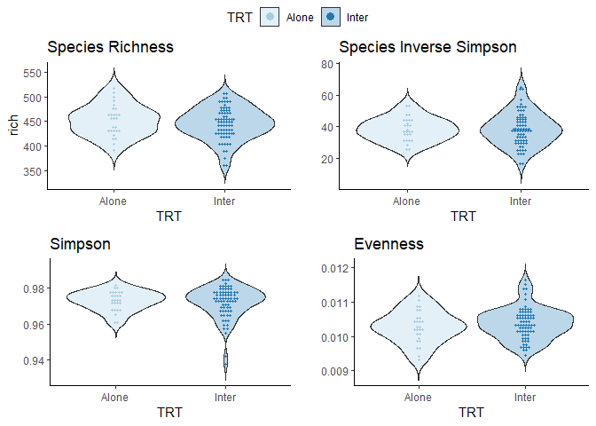
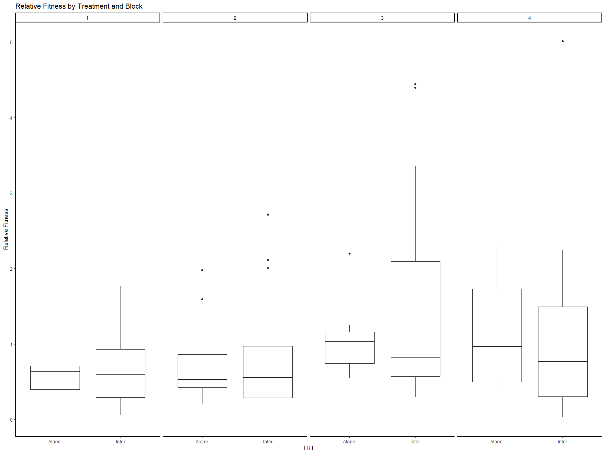
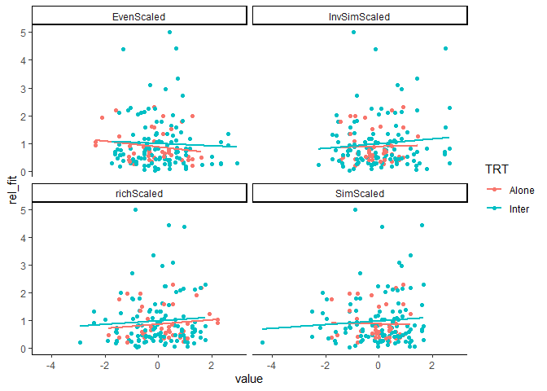

Simplified Analysis
================
Sara Colom
2/8/2020

-   [Objectives](#objectives)
    -   [Sample sizes](#sample-sizes)
        -   [Table sample number by species and
            treatment](#table-sample-number-by-species-and-treatment)
        -   [Table number of maternal line per
            species](#table-number-of-maternal-line-per-species)
-   [Load Libraries](#load-libraries)
-   [Read in Data](#read-in-data)
-   [Sample sizes](#sample-sizes-1)
    -   [Alpha Diversity](#alpha-diversity)
-   [Community Composition](#community-composition)
    -   [Beta Diversity](#beta-diversity)
-   [Testing linear relationships between root architecture & microbial
    diversity](#testing-linear-relationships-between-root-architecture--microbial-diversity)
    -   [Prep root data](#prep-root-data)
        -   [Evaluate relationship between alpha diversity and root
            traits](#evaluate-relationship-between-alpha-diversity-and-root-traits)
        -   [Within species (root traits and
            alphadiv)](#within-species-root-traits-and-alphadiv)
    -   [Plotting significant linear
        associations](#plotting-significant-linear-associations)
-   [Figure 1](#figure-1)
-   [7/29/2022](#7292022)
    -   [Regression on plant fitness](#regression-on-plant-fitness)
    -   [ANCOVA](#ancova)
        -   [Revaluation controling for *ALL* root
            traits](#revaluation-controling-for-all-root-traits)
    -   [9/22/2022](#9222022)
-   [Export models](#export-models)

# Objectives

Evaluate microbial community diversity at the Genus level and its
relationship with plant root architecture and plant fitness across and
between stressful enviornments.

## Sample sizes

### Table sample number by species and treatment

| Species      | Treatment   | N   |
|--------------|-------------|-----|
| I. purpurea  | Alone       | 27  |
| I. purpurea  | Competition | 73  |
| I. hederacea | Competition | 73  |

### Table number of maternal line per species

| Species      | Number of ML |
|--------------|--------------|
| I. purpurea  | 10           |
| I. hederacea | 5            |

# Load Libraries

``` r
library(phyloseq)
library(tidyverse)
library(ape)
library(vegan)
library(scales)
library(grid)
library(multcomp)
library(multcompView)
library(ggpubr)
library(ggcorrplot)
library(RColorBrewer)
library(broom)
library(ggthemes)
library(corrplot)
library(Hmisc)
library(emmeans)
library(lmerTest)
library(interactions)
library(jtools)
library(MASS)
library(stringr)
library(broom)

source("miSeq.R")
source("functions.R")
```

# Read in Data

``` r
physeq1 <- readRDS("../DataSets/physeq_clean")
physeq.scale <- readRDS("../DataSets/physeq_scaled")
alpha <- readRDS("../DataSets/alpha")

RootData <- read.csv("../DataSets/RootTraits_PCs.csv")
LeafData <- read.csv("../DataSets/SizeFitData.csv")
Fitness = read.csv("../DataSets/FitPA4.csv")
```

# Sample sizes

#### Samples by block within IP

``` r
alpha %>% 
  filter(Species == "Ip") %>% 
  count(Block)
```

    ##   Block  n
    ## 1     1 24
    ## 2     2 25
    ## 3     3 26
    ## 4     4 25

#### Samples of treatment within IP

``` r
alpha %>% 
  filter(Species == "Ip") %>% 
  count(TRT)
```

    ##     TRT  n
    ## 1 Alone 27
    ## 2 Inter 73

## Alpha Diversity

``` r
# Visualize data distribution w Violin plots within I.purpurea

p <- ggplot(alpha %>% filter(Species == "Ip"), aes(x = TRT, y = rich)) +
  geom_violin(trim = FALSE, aes(fill = TRT), alpha = 0.3) + 
  geom_dotplot(binaxis = 'y', stackdir = 'center', dotsize = 1, aes(color = TRT, fill = TRT)) +
  theme_classic() +
  scale_color_brewer(palette = "Paired") +
  scale_fill_brewer(palette = "Paired") +
  ggtitle("Species Richness")


q <- ggplot(alpha %>% filter(Species == "Ip"), aes(x = TRT, y = InvSimp)) +
  geom_violin(trim = FALSE, aes(fill = TRT), alpha = 0.3) + 
  geom_dotplot(binaxis = 'y', stackdir = 'center', dotsize = 1, aes(color = TRT, fill = TRT)) +
  theme_classic() +
  scale_color_brewer(palette = "Paired") +
  scale_fill_brewer(palette = "Paired") +
  ggtitle("Species Inverse Simpson") +
  ylab("")


t <- ggplot(alpha %>% filter(Species == "Ip"), aes(x = TRT, y = sim)) +
  geom_violin(trim = FALSE, aes(fill= TRT), alpha = 0.3) + 
  geom_dotplot(binaxis = 'y', stackdir = 'center', dotsize = 1, aes(color = TRT, fill = TRT)) +
  theme_classic() +
  scale_color_brewer(palette = "Paired") +
  scale_fill_brewer(palette = "Paired") +
  ggtitle("Simpson") +
  ylab("")

v <- ggplot(alpha %>% filter(Species == "Ip"), aes(x = TRT, y = even)) +
  geom_violin(trim = FALSE, aes(fill = TRT), alpha = 0.3) + 
  geom_dotplot(binaxis = 'y', stackdir = 'center', dotsize = 1, aes(color = TRT, fill = TRT)) +
  theme_classic() +
  scale_color_brewer(palette = "Paired") +
  scale_fill_brewer(palette = "Paired") +
  ggtitle("Evenness") +
  ylab("")

ggarrange(p, q, t, v, common.legend = T, ncol = 2, nrow = 2)
```

<!-- -->

# Community Composition

## Beta Diversity

``` r
physeq.bray <- phyloseq::distance(physeq = physeq.scale, method = "bray")

# # # # # # # # # # # # # # # # # # # # # 
# Subsample for within I. purpurea only
# # # # # # # # # # # # # # # # # # # # # 

physeq.Purp <- subset_samples(physeq.scale, Species == "Ip")
sampledf.Purp<- data.frame(sample_data(physeq.Purp))

# Calculate bray curtis for I.purpurea samples only
physeq.Purp.bray <- phyloseq::distance(physeq = physeq.Purp, method = "bray")
```

``` r
# Beta diversity pcoa Bray-Curtis DNA only 
physeq.pcoa <-
  ordinate(
    physeq = physeq.scale,
    method = "PCoA",
    distance = "bray"
  )

physeq.pcoa.vectors <- data.frame(physeq.pcoa$vectors[, 1:4])

physeq.pcoa.vectors$Duplicates <- row.names(physeq.pcoa.vectors)

SampData <- data.frame(sample_data(physeq1))

colnames(SampData)[1] <- "Duplicates"

SampData <- subset(SampData, SampData$TRT == "Inter"|SampData$TRT == "Alone")

physeq.pcoa.df <- droplevels(merge(physeq.pcoa.vectors, SampData, by="Duplicates"))
```

# Testing linear relationships between root architecture & microbial diversity

## Prep root data

``` r
RootAlphaObs <- merge(alpha, RootData[c("Sample_ID", "PC1", "PC2", "PC3", "PC4")])
```

### Evaluate relationship between alpha diversity and root traits

``` r
#summary(glht(SimpInvPC1, mcp(rank="Tukey")))

#################################################################
##################### SUBSET for I.purpurea #####################
#################################################################

RootAlphaPurp <- droplevels(RootAlphaObs %>% filter(Species == "Ip"))
RootAlphaPurp$Comp <- sub(".*\\-", "", RootAlphaPurp$Combos)


### Linear regressions

SimpPC1 <- lm(sim ~ PC1 + Block + TRT, RootAlphaPurp) 
summary(SimpPC1)
```

    ## 
    ## Call:
    ## lm(formula = sim ~ PC1 + Block + TRT, data = RootAlphaPurp)
    ## 
    ## Residuals:
    ##       Min        1Q    Median        3Q       Max 
    ## -0.027453 -0.003862  0.001500  0.005865  0.011300 
    ## 
    ## Coefficients:
    ##              Estimate Std. Error t value Pr(>|t|)    
    ## (Intercept)  0.977989   0.003869 252.755   <2e-16 ***
    ## PC1          0.001447   0.001258   1.150   0.2554    
    ## Block2      -0.005401   0.010369  -0.521   0.6047    
    ## Block3      -0.009643   0.010882  -0.886   0.3797    
    ## Block4      -0.002049   0.002635  -0.777   0.4405    
    ## TRTInter    -0.004216   0.002470  -1.707   0.0939 .  
    ## ---
    ## Signif. codes:  0 '***' 0.001 '**' 0.01 '*' 0.05 '.' 0.1 ' ' 1
    ## 
    ## Residual standard error: 0.008187 on 51 degrees of freedom
    ## Multiple R-squared:  0.1337, Adjusted R-squared:  0.04877 
    ## F-statistic: 1.574 on 5 and 51 DF,  p-value: 0.1841

``` r
SimpInvPC1 <- lm(InvSimp ~ PC1 + Comp + TRT + Block, RootAlphaPurp) 
summary(SimpInvPC1)
```

    ## 
    ## Call:
    ## lm(formula = InvSimp ~ PC1 + Comp + TRT + Block, data = RootAlphaPurp)
    ## 
    ## Residuals:
    ##      Min       1Q   Median       3Q      Max 
    ## -14.0281  -6.9591   0.3038   6.3289  18.8379 
    ## 
    ## Coefficients: (1 not defined because of singularities)
    ##                  Estimate Std. Error t value Pr(>|t|)    
    ## (Intercept)       42.7370     4.3928   9.729 6.18e-13 ***
    ## PC1                1.0167     1.4322   0.710   0.4812    
    ## CompPA 4.12 Ihed  -2.5142     3.6273  -0.693   0.4916    
    ## CompPA 4.15 Ihed  -0.2098     3.6612  -0.057   0.9545    
    ## CompPA 4.2 Ihed   -9.5479     4.1700  -2.290   0.0265 *  
    ## CompPA 4.3 Ihed   -3.6759     4.0327  -0.912   0.3666    
    ## TRTInter               NA         NA      NA       NA    
    ## Block2            -1.2232    11.8157  -0.104   0.9180    
    ## Block3            -5.0956    12.3933  -0.411   0.6828    
    ## Block4            -2.9551     2.9900  -0.988   0.3280    
    ## ---
    ## Signif. codes:  0 '***' 0.001 '**' 0.01 '*' 0.05 '.' 0.1 ' ' 1
    ## 
    ## Residual standard error: 9.233 on 48 degrees of freedom
    ## Multiple R-squared:  0.2126, Adjusted R-squared:  0.08133 
    ## F-statistic:  1.62 on 8 and 48 DF,  p-value: 0.1441

``` r
RichPC1 <- lm(rich ~ PC1 + Block + TRT, RootAlphaPurp) 
summary(RichPC1)
```

    ## 
    ## Call:
    ## lm(formula = rich ~ PC1 + Block + TRT, data = RootAlphaPurp)
    ## 
    ## Residuals:
    ##     Min      1Q  Median      3Q     Max 
    ## -68.694 -17.875   1.742  20.104  51.312 
    ## 
    ## Coefficients:
    ##             Estimate Std. Error t value Pr(>|t|)    
    ## (Intercept)  461.869     14.307  32.283   <2e-16 ***
    ## PC1            3.379      4.650   0.727   0.4707    
    ## Block2        -7.192     38.340  -0.188   0.8519    
    ## Block3        -2.043     40.236  -0.051   0.9597    
    ## Block4         1.186      9.744   0.122   0.9036    
    ## TRTInter     -17.545      9.133  -1.921   0.0603 .  
    ## ---
    ## Signif. codes:  0 '***' 0.001 '**' 0.01 '*' 0.05 '.' 0.1 ' ' 1
    ## 
    ## Residual standard error: 30.27 on 51 degrees of freedom
    ## Multiple R-squared:  0.1664, Adjusted R-squared:  0.08472 
    ## F-statistic: 2.037 on 5 and 51 DF,  p-value: 0.08903

``` r
EvenPC1 <- lm(even ~ PC1 + Block + TRT , RootAlphaPurp) 
summary(EvenPC1)
```

    ## 
    ## Call:
    ## lm(formula = even ~ PC1 + Block + TRT, data = RootAlphaPurp)
    ## 
    ## Residuals:
    ##        Min         1Q     Median         3Q        Max 
    ## -8.015e-04 -3.058e-04  1.160e-06  2.792e-04  9.880e-04 
    ## 
    ## Coefficients:
    ##               Estimate Std. Error t value Pr(>|t|)    
    ## (Intercept)  1.033e-02  2.037e-04  50.696   <2e-16 ***
    ## PC1         -6.197e-06  6.620e-05  -0.094    0.926    
    ## Block2      -1.131e-04  5.458e-04  -0.207    0.837    
    ## Block3      -3.416e-04  5.728e-04  -0.596    0.554    
    ## Block4      -1.537e-04  1.387e-04  -1.108    0.273    
    ## TRTInter     1.765e-04  1.300e-04   1.358    0.180    
    ## ---
    ## Signif. codes:  0 '***' 0.001 '**' 0.01 '*' 0.05 '.' 0.1 ' ' 1
    ## 
    ## Residual standard error: 0.0004309 on 51 degrees of freedom
    ## Multiple R-squared:  0.1239, Adjusted R-squared:  0.03796 
    ## F-statistic: 1.442 on 5 and 51 DF,  p-value: 0.2253

``` r
SimpPC2 <- lm(sim ~ PC2 + Block + TRT, RootAlphaPurp) 
summary(SimpPC2)
```

    ## 
    ## Call:
    ## lm(formula = sim ~ PC2 + Block + TRT, data = RootAlphaPurp)
    ## 
    ## Residuals:
    ##       Min        1Q    Median        3Q       Max 
    ## -0.027561 -0.003682  0.001345  0.005432  0.011845 
    ## 
    ## Coefficients:
    ##               Estimate Std. Error t value Pr(>|t|)    
    ## (Intercept)  0.9721778  0.0029179 333.173   <2e-16 ***
    ## PC2         -0.0009071  0.0006315  -1.436    0.157    
    ## Block2       0.0059736  0.0046160   1.294    0.201    
    ## Block3       0.0038107  0.0032096   1.187    0.241    
    ## Block4       0.0001549  0.0032208   0.048    0.962    
    ## TRTInter    -0.0028856  0.0024702  -1.168    0.248    
    ## ---
    ## Signif. codes:  0 '***' 0.001 '**' 0.01 '*' 0.05 '.' 0.1 ' ' 1
    ## 
    ## Residual standard error: 0.00813 on 51 degrees of freedom
    ## Multiple R-squared:  0.1458, Adjusted R-squared:  0.06203 
    ## F-statistic: 1.741 on 5 and 51 DF,  p-value: 0.1421

``` r
SimpInvPC2 <- lm(InvSimp ~ PC2 + Comp + TRT + Block, RootAlphaPurp) 
summary(SimpInvPC2)
```

    ## 
    ## Call:
    ## lm(formula = InvSimp ~ PC2 + Comp + TRT + Block, data = RootAlphaPurp)
    ## 
    ## Residuals:
    ##      Min       1Q   Median       3Q      Max 
    ## -13.8113  -6.6027  -0.0319   5.2411  20.5597 
    ## 
    ## Coefficients: (1 not defined because of singularities)
    ##                  Estimate Std. Error t value Pr(>|t|)    
    ## (Intercept)       38.8561     3.3502  11.598 1.59e-15 ***
    ## PC2               -0.5592     0.7312  -0.765   0.4481    
    ## CompPA 4.12 Ihed  -1.9226     3.6054  -0.533   0.5963    
    ## CompPA 4.15 Ihed   0.6735     3.6180   0.186   0.8531    
    ## CompPA 4.2 Ihed   -8.6322     4.2973  -2.009   0.0502 .  
    ## CompPA 4.3 Ihed   -2.4873     4.0792  -0.610   0.5449    
    ## TRTInter               NA         NA      NA       NA    
    ## Block2             6.6866     5.4195   1.234   0.2233    
    ## Block3             4.2155     3.7854   1.114   0.2710    
    ## Block4            -1.6399     3.7052  -0.443   0.6600    
    ## ---
    ## Signif. codes:  0 '***' 0.001 '**' 0.01 '*' 0.05 '.' 0.1 ' ' 1
    ## 
    ## Residual standard error: 9.225 on 48 degrees of freedom
    ## Multiple R-squared:  0.2139, Adjusted R-squared:  0.08286 
    ## F-statistic: 1.632 on 8 and 48 DF,  p-value: 0.1405

``` r
RichPC2 <- lm(rich ~ PC2 + Block + TRT, RootAlphaPurp) 
summary(RichPC2)
```

    ## 
    ## Call:
    ## lm(formula = rich ~ PC2 + Block + TRT, data = RootAlphaPurp)
    ## 
    ## Residuals:
    ##     Min      1Q  Median      3Q     Max 
    ## -65.527 -11.917   3.751  21.397  48.599 
    ## 
    ## Coefficients:
    ##             Estimate Std. Error t value Pr(>|t|)    
    ## (Intercept)  438.929     10.272  42.732  < 2e-16 ***
    ## PC2           -5.734      2.223  -2.579  0.01282 *  
    ## Block2        22.156     16.249   1.363  0.17872    
    ## Block3        35.137     11.298   3.110  0.00306 ** 
    ## Block4        17.473     11.338   1.541  0.12946    
    ## TRTInter     -11.287      8.696  -1.298  0.20012    
    ## ---
    ## Signif. codes:  0 '***' 0.001 '**' 0.01 '*' 0.05 '.' 0.1 ' ' 1
    ## 
    ## Residual standard error: 28.62 on 51 degrees of freedom
    ## Multiple R-squared:  0.255,  Adjusted R-squared:  0.182 
    ## F-statistic: 3.491 on 5 and 51 DF,  p-value: 0.008644

``` r
car::Anova(mod = lm(rich ~ PC2 + Block + TRT*PC2, RootAlphaPurp), type = "III")
```

    ## Anova Table (Type III tests)
    ## 
    ## Response: rich
    ##              Sum Sq Df   F value  Pr(>F)    
    ## (Intercept) 1331420  1 1609.8076 < 2e-16 ***
    ## PC2            3433  1    4.1509 0.04692 *  
    ## Block          8117  3    3.2714 0.02865 *  
    ## TRT             750  1    0.9064 0.34565    
    ## PC2:TRT         416  1    0.5030 0.48150    
    ## Residuals     41353 50                      
    ## ---
    ## Signif. codes:  0 '***' 0.001 '**' 0.01 '*' 0.05 '.' 0.1 ' ' 1

``` r
EvenPC2 <- lm(even ~ PC2 + Block + TRT , RootAlphaPurp) 
summary(EvenPC2) 
```

    ## 
    ## Call:
    ## lm(formula = even ~ PC2 + Block + TRT, data = RootAlphaPurp)
    ## 
    ## Residuals:
    ##        Min         1Q     Median         3Q        Max 
    ## -7.790e-04 -2.985e-04 -1.367e-05  2.307e-04  1.030e-03 
    ## 
    ## Coefficients:
    ##               Estimate Std. Error t value Pr(>|t|)    
    ## (Intercept)  1.053e-02  1.474e-04  71.425  < 2e-16 ***
    ## PC2          7.252e-05  3.190e-05   2.273  0.02725 *  
    ## Block2      -2.146e-04  2.332e-04  -0.920  0.36176    
    ## Block3      -5.085e-04  1.621e-04  -3.136  0.00284 ** 
    ## Block4      -3.746e-04  1.627e-04  -2.303  0.02541 *  
    ## TRTInter     1.110e-04  1.248e-04   0.890  0.37769    
    ## ---
    ## Signif. codes:  0 '***' 0.001 '**' 0.01 '*' 0.05 '.' 0.1 ' ' 1
    ## 
    ## Residual standard error: 0.0004107 on 51 degrees of freedom
    ## Multiple R-squared:  0.2043, Adjusted R-squared:  0.1263 
    ## F-statistic: 2.619 on 5 and 51 DF,  p-value: 0.03493

``` r
SimpPC3 <- lm(sim ~ PC3 + Block + TRT, RootAlphaPurp) 
summary(SimpPC3)
```

    ## 
    ## Call:
    ## lm(formula = sim ~ PC3 + Block + TRT, data = RootAlphaPurp)
    ## 
    ## Residuals:
    ##       Min        1Q    Median        3Q       Max 
    ## -0.027765 -0.002862  0.001317  0.006049  0.012040 
    ## 
    ## Coefficients:
    ##               Estimate Std. Error t value Pr(>|t|)    
    ## (Intercept)  0.9737709  0.0024996 389.573   <2e-16 ***
    ## PC3          0.0009578  0.0007577   1.264    0.212    
    ## Block2       0.0062684  0.0046770   1.340    0.186    
    ## Block3       0.0027008  0.0030730   0.879    0.384    
    ## Block4      -0.0028575  0.0025835  -1.106    0.274    
    ## TRTInter    -0.0029872  0.0024794  -1.205    0.234    
    ## ---
    ## Signif. codes:  0 '***' 0.001 '**' 0.01 '*' 0.05 '.' 0.1 ' ' 1
    ## 
    ## Residual standard error: 0.008166 on 51 degrees of freedom
    ## Multiple R-squared:  0.1382, Adjusted R-squared:  0.05373 
    ## F-statistic: 1.636 on 5 and 51 DF,  p-value: 0.1673

``` r
SimpInvPC3 <- lm(InvSimp ~ PC3 + Comp + TRT + Block, RootAlphaPurp) 
summary(SimpInvPC3)
```

    ## 
    ## Call:
    ## lm(formula = InvSimp ~ PC3 + Comp + TRT + Block, data = RootAlphaPurp)
    ## 
    ## Residuals:
    ##      Min       1Q   Median       3Q      Max 
    ## -13.3897  -7.2801   0.0318   5.5277  19.0761 
    ## 
    ## Coefficients: (1 not defined because of singularities)
    ##                  Estimate Std. Error t value Pr(>|t|)    
    ## (Intercept)       39.8540     2.8711  13.881   <2e-16 ***
    ## PC3                0.5259     0.8919   0.590   0.5582    
    ## CompPA 4.12 Ihed  -1.5109     3.7682  -0.401   0.6902    
    ## CompPA 4.15 Ihed   0.3203     3.5946   0.089   0.9294    
    ## CompPA 4.2 Ihed   -8.9321     4.2637  -2.095   0.0415 *  
    ## CompPA 4.3 Ihed   -2.7888     4.0417  -0.690   0.4935    
    ## TRTInter               NA         NA      NA       NA    
    ## Block2             6.6726     5.4507   1.224   0.2269    
    ## Block3             3.6502     3.6522   0.999   0.3226    
    ## Block4            -3.4573     2.9385  -1.177   0.2452    
    ## ---
    ## Signif. codes:  0 '***' 0.001 '**' 0.01 '*' 0.05 '.' 0.1 ' ' 1
    ## 
    ## Residual standard error: 9.247 on 48 degrees of freedom
    ## Multiple R-squared:   0.21,  Adjusted R-squared:  0.07836 
    ## F-statistic: 1.595 on 8 and 48 DF,  p-value: 0.1513

``` r
RichPC3 <- lm(rich ~ PC3 + Block + TRT, RootAlphaPurp) 
summary(RichPC3)
```

    ## 
    ## Call:
    ## lm(formula = rich ~ PC3 + Block + TRT, data = RootAlphaPurp)
    ## 
    ## Residuals:
    ##     Min      1Q  Median      3Q     Max 
    ## -70.160 -16.679   2.978  20.134  52.500 
    ## 
    ## Coefficients:
    ##             Estimate Std. Error t value Pr(>|t|)    
    ## (Intercept) 452.2049     9.2684  48.790   <2e-16 ***
    ## PC3           1.9983     2.8096   0.711    0.480    
    ## Block2       19.8187    17.3422   1.143    0.258    
    ## Block3       26.7079    11.3946   2.344    0.023 *  
    ## Block4       -0.6489     9.5797  -0.068    0.946    
    ## TRTInter    -14.8465     9.1935  -1.615    0.113    
    ## ---
    ## Signif. codes:  0 '***' 0.001 '**' 0.01 '*' 0.05 '.' 0.1 ' ' 1
    ## 
    ## Residual standard error: 30.28 on 51 degrees of freedom
    ## Multiple R-squared:  0.1661, Adjusted R-squared:  0.08432 
    ## F-statistic: 2.031 on 5 and 51 DF,  p-value: 0.08978

``` r
EvenPC3 <- lm(even ~ PC3 + Block + TRT , RootAlphaPurp) 
summary(EvenPC3)
```

    ## 
    ## Call:
    ## lm(formula = even ~ PC3 + Block + TRT, data = RootAlphaPurp)
    ## 
    ## Residuals:
    ##        Min         1Q     Median         3Q        Max 
    ## -8.037e-04 -3.090e-04 -1.690e-06  2.763e-04  9.947e-04 
    ## 
    ## Coefficients:
    ##               Estimate Std. Error t value Pr(>|t|)    
    ## (Intercept)  1.034e-02  1.319e-04  78.365   <2e-16 ***
    ## PC3          2.841e-06  3.999e-05   0.071   0.9436    
    ## Block2      -1.559e-04  2.468e-04  -0.632   0.5304    
    ## Block3      -3.921e-04  1.622e-04  -2.418   0.0192 *  
    ## Block4      -1.518e-04  1.364e-04  -1.113   0.2708    
    ## TRTInter     1.763e-04  1.309e-04   1.347   0.1839    
    ## ---
    ## Signif. codes:  0 '***' 0.001 '**' 0.01 '*' 0.05 '.' 0.1 ' ' 1
    ## 
    ## Residual standard error: 0.000431 on 51 degrees of freedom
    ## Multiple R-squared:  0.1238, Adjusted R-squared:  0.03789 
    ## F-statistic: 1.441 on 5 and 51 DF,  p-value: 0.2256

``` r
SimpPC4 <- lm(sim ~ PC4 + Block + TRT, RootAlphaPurp) 
summary(SimpPC4)
```

    ## 
    ## Call:
    ## lm(formula = sim ~ PC4 + Block + TRT, data = RootAlphaPurp)
    ## 
    ## Residuals:
    ##       Min        1Q    Median        3Q       Max 
    ## -0.020413 -0.004944  0.001874  0.005665  0.012687 
    ## 
    ## Coefficients:
    ##               Estimate Std. Error t value Pr(>|t|)    
    ## (Intercept)  0.9764140  0.0024003 406.792  < 2e-16 ***
    ## PC4          0.0024831  0.0009036   2.748  0.00827 ** 
    ## Block2       0.0012787  0.0046058   0.278  0.78242    
    ## Block3       0.0006558  0.0029679   0.221  0.82601    
    ## Block4      -0.0047031  0.0025559  -1.840  0.07158 .  
    ## TRTInter    -0.0028974  0.0023099  -1.254  0.21544    
    ## ---
    ## Signif. codes:  0 '***' 0.001 '**' 0.01 '*' 0.05 '.' 0.1 ' ' 1
    ## 
    ## Residual standard error: 0.007739 on 51 degrees of freedom
    ## Multiple R-squared:  0.2259, Adjusted R-squared:   0.15 
    ## F-statistic: 2.976 on 5 and 51 DF,  p-value: 0.01969

``` r
car::Anova(mod = lm(sim ~ PC4 + Block + TRT*PC4, RootAlphaPurp), type = "III")
```

    ## Anova Table (Type III tests)
    ## 
    ## Response: sim
    ##             Sum Sq Df    F value Pr(>F)    
    ## (Intercept) 9.1182  1 1.5163e+05 <2e-16 ***
    ## PC4         0.0000  1 1.9700e-01 0.6591    
    ## Block       0.0003  3 1.4874e+00 0.2293    
    ## TRT         0.0001  1 8.4520e-01 0.3623    
    ## PC4:TRT     0.0000  1 7.9930e-01 0.3756    
    ## Residuals   0.0030 50                      
    ## ---
    ## Signif. codes:  0 '***' 0.001 '**' 0.01 '*' 0.05 '.' 0.1 ' ' 1

``` r
# Repeat & remove outlier
SimpPC4_out <- lm(sim ~ PC4 + Block + TRT, RootAlphaPurp %>% filter(sim > 0.94)) 
summary(SimpPC4_out)
```

    ## 
    ## Call:
    ## lm(formula = sim ~ PC4 + Block + TRT, data = RootAlphaPurp %>% 
    ##     filter(sim > 0.94))
    ## 
    ## Residuals:
    ##       Min        1Q    Median        3Q       Max 
    ## -0.017811 -0.003811  0.001589  0.004450  0.011490 
    ## 
    ## Coefficients:
    ##               Estimate Std. Error t value Pr(>|t|)    
    ## (Intercept)  0.9747198  0.0022354 436.044   <2e-16 ***
    ## PC4          0.0008668  0.0009460   0.916    0.364    
    ## Block2       0.0035840  0.0042372   0.846    0.402    
    ## Block3       0.0016636  0.0027118   0.613    0.542    
    ## Block4      -0.0021819  0.0024349  -0.896    0.374    
    ## TRTInter    -0.0026408  0.0020996  -1.258    0.214    
    ## ---
    ## Signif. codes:  0 '***' 0.001 '**' 0.01 '*' 0.05 '.' 0.1 ' ' 1
    ## 
    ## Residual standard error: 0.00703 on 50 degrees of freedom
    ## Multiple R-squared:  0.102,  Adjusted R-squared:  0.01223 
    ## F-statistic: 1.136 on 5 and 50 DF,  p-value: 0.3537

``` r
SimpInvPC4 <- lm(InvSimp ~ PC4 + Comp + TRT + Block, RootAlphaPurp) 
summary(SimpInvPC4)
```

    ## 
    ## Call:
    ## lm(formula = InvSimp ~ PC4 + Comp + TRT + Block, data = RootAlphaPurp)
    ## 
    ## Residuals:
    ##      Min       1Q   Median       3Q      Max 
    ## -13.1982  -7.7521   0.3428   6.3656  21.7090 
    ## 
    ## Coefficients: (1 not defined because of singularities)
    ##                  Estimate Std. Error t value Pr(>|t|)    
    ## (Intercept)       41.6988     2.8055  14.863   <2e-16 ***
    ## PC4                1.9003     1.0889   1.745   0.0873 .  
    ## CompPA 4.12 Ihed  -2.0636     3.5041  -0.589   0.5587    
    ## CompPA 4.15 Ihed   0.2956     3.4983   0.084   0.9330    
    ## CompPA 4.2 Ihed   -8.0009     4.1457  -1.930   0.0595 .  
    ## CompPA 4.3 Ihed   -1.7723     3.9605  -0.448   0.6565    
    ## TRTInter               NA         NA      NA       NA    
    ## Block2             3.0685     5.5619   0.552   0.5837    
    ## Block3             2.1513     3.5765   0.602   0.5503    
    ## Block4            -4.8794     2.9836  -1.635   0.1085    
    ## ---
    ## Signif. codes:  0 '***' 0.001 '**' 0.01 '*' 0.05 '.' 0.1 ' ' 1
    ## 
    ## Residual standard error: 9 on 48 degrees of freedom
    ## Multiple R-squared:  0.2518, Adjusted R-squared:  0.1271 
    ## F-statistic: 2.019 on 8 and 48 DF,  p-value: 0.06403

``` r
RichPC4 <- lm(rich ~ PC4 + Block + TRT, RootAlphaPurp) 
summary(RichPC4)
```

    ## 
    ## Call:
    ## lm(formula = rich ~ PC4 + Block + TRT, data = RootAlphaPurp)
    ## 
    ## Residuals:
    ##    Min     1Q Median     3Q    Max 
    ## -65.92 -15.72   0.98  20.30  53.09 
    ## 
    ## Coefficients:
    ##             Estimate Std. Error t value Pr(>|t|)    
    ## (Intercept)  456.445      9.346  48.836   <2e-16 ***
    ## PC4            3.503      3.518   0.996   0.3241    
    ## Block2        12.109     17.934   0.675   0.5026    
    ## Block3        23.597     11.557   2.042   0.0464 *  
    ## Block4        -3.106      9.953  -0.312   0.7563    
    ## TRTInter     -15.185      8.995  -1.688   0.0975 .  
    ## ---
    ## Signif. codes:  0 '***' 0.001 '**' 0.01 '*' 0.05 '.' 0.1 ' ' 1
    ## 
    ## Residual standard error: 30.14 on 51 degrees of freedom
    ## Multiple R-squared:  0.1739, Adjusted R-squared:  0.09287 
    ## F-statistic: 2.147 on 5 and 51 DF,  p-value: 0.07469

``` r
EvenPC4 <- lm(even ~ PC4 + Block + TRT , RootAlphaPurp) 
summary(EvenPC4)
```

    ## 
    ## Call:
    ## lm(formula = even ~ PC4 + Block + TRT, data = RootAlphaPurp)
    ## 
    ## Residuals:
    ##        Min         1Q     Median         3Q        Max 
    ## -7.993e-04 -2.799e-04  2.209e-05  2.921e-04  9.660e-04 
    ## 
    ## Coefficients:
    ##               Estimate Std. Error t value Pr(>|t|)    
    ## (Intercept)  1.036e-02  1.333e-04  77.714   <2e-16 ***
    ## PC4          2.615e-05  5.018e-05   0.521   0.6045    
    ## Block2      -2.010e-04  2.558e-04  -0.786   0.4357    
    ## Block3      -4.111e-04  1.648e-04  -2.494   0.0159 *  
    ## Block4      -1.729e-04  1.420e-04  -1.218   0.2288    
    ## TRTInter     1.824e-04  1.283e-04   1.422   0.1611    
    ## ---
    ## Signif. codes:  0 '***' 0.001 '**' 0.01 '*' 0.05 '.' 0.1 ' ' 1
    ## 
    ## Residual standard error: 0.0004298 on 51 degrees of freedom
    ## Multiple R-squared:  0.1283, Adjusted R-squared:  0.04289 
    ## F-statistic: 1.502 on 5 and 51 DF,  p-value: 0.2057

Make tables for reporting significant results (i.e. PC2 & PC4)

### Within species (root traits and alphadiv)

``` r
### Linear regressions

SimpInvPC2 <- lm(InvSimp ~ PC2 + TRT + Block, RootAlphaPurp) 


SimpInvPC2_res <- SimpInvPC2 %>% 
  tidy() %>% 
  filter(term == "PC2") %>% 
  mutate(`Microbial community metric` = "Inverse Simpson Diversity") %>% 
  rename(b = estimate, SE = `std.error`, `t-statistic` = statistic, `p_value` = `p.value`) %>% 
  relocate(`Microbial community metric`)  


SimpPC2 <- lm(sim ~ PC2 + TRT + Block, RootAlphaPurp) 


SimpPC2_res <- SimpPC2 %>% 
  tidy() %>% 
  filter(term == "PC2") %>% 
  mutate(`Microbial community metric` = "Simpson Diversity") %>% 
  rename(b = estimate, SE = `std.error`, `t-statistic` = statistic, `p_value` = `p.value`) %>% 
  relocate(`Microbial community metric`)  


RichPC2 <- lm(rich ~ PC2 + Block + TRT, RootAlphaPurp) 

RichPC2_res <- RichPC2 %>% 
  tidy() %>% 
  filter(term == "PC2") %>% 
  mutate(`Microbial community metric` = "Sp. richness") %>% 
  rename(b = estimate, SE = `std.error`, `t-statistic` = statistic, `p_value` = `p.value`) %>% 
  relocate(`Microbial community metric`)  

summary(RichPC2)
```

    ## 
    ## Call:
    ## lm(formula = rich ~ PC2 + Block + TRT, data = RootAlphaPurp)
    ## 
    ## Residuals:
    ##     Min      1Q  Median      3Q     Max 
    ## -65.527 -11.917   3.751  21.397  48.599 
    ## 
    ## Coefficients:
    ##             Estimate Std. Error t value Pr(>|t|)    
    ## (Intercept)  438.929     10.272  42.732  < 2e-16 ***
    ## PC2           -5.734      2.223  -2.579  0.01282 *  
    ## Block2        22.156     16.249   1.363  0.17872    
    ## Block3        35.137     11.298   3.110  0.00306 ** 
    ## Block4        17.473     11.338   1.541  0.12946    
    ## TRTInter     -11.287      8.696  -1.298  0.20012    
    ## ---
    ## Signif. codes:  0 '***' 0.001 '**' 0.01 '*' 0.05 '.' 0.1 ' ' 1
    ## 
    ## Residual standard error: 28.62 on 51 degrees of freedom
    ## Multiple R-squared:  0.255,  Adjusted R-squared:  0.182 
    ## F-statistic: 3.491 on 5 and 51 DF,  p-value: 0.008644

``` r
car::Anova(mod = lm(rich ~ PC2 + Block + TRT*PC2, RootAlphaPurp), type = "III")
```

    ## Anova Table (Type III tests)
    ## 
    ## Response: rich
    ##              Sum Sq Df   F value  Pr(>F)    
    ## (Intercept) 1331420  1 1609.8076 < 2e-16 ***
    ## PC2            3433  1    4.1509 0.04692 *  
    ## Block          8117  3    3.2714 0.02865 *  
    ## TRT             750  1    0.9064 0.34565    
    ## PC2:TRT         416  1    0.5030 0.48150    
    ## Residuals     41353 50                      
    ## ---
    ## Signif. codes:  0 '***' 0.001 '**' 0.01 '*' 0.05 '.' 0.1 ' ' 1

``` r
EvenPC2 <- lm(even ~ PC2 + Block + TRT , RootAlphaPurp) 
summary(EvenPC2) 
```

    ## 
    ## Call:
    ## lm(formula = even ~ PC2 + Block + TRT, data = RootAlphaPurp)
    ## 
    ## Residuals:
    ##        Min         1Q     Median         3Q        Max 
    ## -7.790e-04 -2.985e-04 -1.367e-05  2.307e-04  1.030e-03 
    ## 
    ## Coefficients:
    ##               Estimate Std. Error t value Pr(>|t|)    
    ## (Intercept)  1.053e-02  1.474e-04  71.425  < 2e-16 ***
    ## PC2          7.252e-05  3.190e-05   2.273  0.02725 *  
    ## Block2      -2.146e-04  2.332e-04  -0.920  0.36176    
    ## Block3      -5.085e-04  1.621e-04  -3.136  0.00284 ** 
    ## Block4      -3.746e-04  1.627e-04  -2.303  0.02541 *  
    ## TRTInter     1.110e-04  1.248e-04   0.890  0.37769    
    ## ---
    ## Signif. codes:  0 '***' 0.001 '**' 0.01 '*' 0.05 '.' 0.1 ' ' 1
    ## 
    ## Residual standard error: 0.0004107 on 51 degrees of freedom
    ## Multiple R-squared:  0.2043, Adjusted R-squared:  0.1263 
    ## F-statistic: 2.619 on 5 and 51 DF,  p-value: 0.03493

``` r
EvenPC2_res <- EvenPC2 %>% 
  tidy() %>% 
  filter(term == "PC2") %>% 
  mutate(`Microbial community metric` = "Sp. evenness") %>% 
  rename(b = estimate, SE = `std.error`, `t-statistic` = statistic, `p_value` = `p.value`) %>% 
  relocate(`Microbial community metric`)  

microbe_root_lm_res <- SimpInvPC2_res %>% 
  bind_rows(
  RichPC2_res
  ) %>% 
  bind_rows(
    EvenPC2_res
  ) %>% 
  bind_rows(SimpPC2_res) %>% 
  mutate(across(where(is.numeric), function(x) round(x, 3))) %>% 
  tidy_p()
  
microbe_root_lm_res  
```

    ## # A tibble: 4 x 7
    ##   `Microbial community metr~` term       b    SE `t-statistic` p_value `p-value`
    ##   <chr>                       <chr>  <dbl> <dbl>         <dbl>   <dbl> <chr>    
    ## 1 Inverse Simpson Diversity   PC2   -0.776 0.727         -1.07   0.29  0.29     
    ## 2 Sp. richness                PC2   -5.73  2.22          -2.58   0.013 0.013*   
    ## 3 Sp. evenness                PC2    0     0              2.27   0.027 0.027*   
    ## 4 Simpson Diversity           PC2   -0.001 0.001         -1.44   0.157 0.157

PC4

``` r
SimpInvPC4 <- lm(InvSimp ~ PC4 + TRT + Block, RootAlphaPurp) 


SimpInvPC4_res2 <- SimpInvPC4 %>% 
  tidy() %>% 
  filter(term == "PC4") %>% 
  mutate(`Microbial community metric` = "Inverse Simpson Diversity") %>% 
  rename(b = estimate, SE = `std.error`, `t-statistic` = statistic, `p_value` = `p.value`) %>% 
  relocate(`Microbial community metric`)  

SimpPC4 <- lm(sim ~ PC4 + TRT + Block, RootAlphaPurp) 

SimpPC4_res2 <- SimpPC4 %>% 
  tidy() %>% 
  filter(term == "PC4") %>% 
  mutate(`Microbial community metric` = "Simpson Diversity") %>% 
  rename(b = estimate, SE = `std.error`, `t-statistic` = statistic, `p_value` = `p.value`) %>% 
  relocate(`Microbial community metric`)  

RichPC4 <- lm(rich ~ PC4 + Block + TRT, RootAlphaPurp) 

RichPC4_res2 <- RichPC4 %>% 
  tidy() %>% 
  filter(term == "PC4") %>% 
  mutate(`Microbial community metric` = "Sp. richness") %>% 
  rename(b = estimate, SE = `std.error`, `t-statistic` = statistic, `p_value` = `p.value`) %>% 
  relocate(`Microbial community metric`)  

summary(RichPC4)
```

    ## 
    ## Call:
    ## lm(formula = rich ~ PC4 + Block + TRT, data = RootAlphaPurp)
    ## 
    ## Residuals:
    ##    Min     1Q Median     3Q    Max 
    ## -65.92 -15.72   0.98  20.30  53.09 
    ## 
    ## Coefficients:
    ##             Estimate Std. Error t value Pr(>|t|)    
    ## (Intercept)  456.445      9.346  48.836   <2e-16 ***
    ## PC4            3.503      3.518   0.996   0.3241    
    ## Block2        12.109     17.934   0.675   0.5026    
    ## Block3        23.597     11.557   2.042   0.0464 *  
    ## Block4        -3.106      9.953  -0.312   0.7563    
    ## TRTInter     -15.185      8.995  -1.688   0.0975 .  
    ## ---
    ## Signif. codes:  0 '***' 0.001 '**' 0.01 '*' 0.05 '.' 0.1 ' ' 1
    ## 
    ## Residual standard error: 30.14 on 51 degrees of freedom
    ## Multiple R-squared:  0.1739, Adjusted R-squared:  0.09287 
    ## F-statistic: 2.147 on 5 and 51 DF,  p-value: 0.07469

``` r
EvenPC4 <- lm(even ~ PC4 + Block + TRT , RootAlphaPurp) 
summary(EvenPC4) 
```

    ## 
    ## Call:
    ## lm(formula = even ~ PC4 + Block + TRT, data = RootAlphaPurp)
    ## 
    ## Residuals:
    ##        Min         1Q     Median         3Q        Max 
    ## -7.993e-04 -2.799e-04  2.209e-05  2.921e-04  9.660e-04 
    ## 
    ## Coefficients:
    ##               Estimate Std. Error t value Pr(>|t|)    
    ## (Intercept)  1.036e-02  1.333e-04  77.714   <2e-16 ***
    ## PC4          2.615e-05  5.018e-05   0.521   0.6045    
    ## Block2      -2.010e-04  2.558e-04  -0.786   0.4357    
    ## Block3      -4.111e-04  1.648e-04  -2.494   0.0159 *  
    ## Block4      -1.729e-04  1.420e-04  -1.218   0.2288    
    ## TRTInter     1.824e-04  1.283e-04   1.422   0.1611    
    ## ---
    ## Signif. codes:  0 '***' 0.001 '**' 0.01 '*' 0.05 '.' 0.1 ' ' 1
    ## 
    ## Residual standard error: 0.0004298 on 51 degrees of freedom
    ## Multiple R-squared:  0.1283, Adjusted R-squared:  0.04289 
    ## F-statistic: 1.502 on 5 and 51 DF,  p-value: 0.2057

``` r
EvenPC4_res2 <- EvenPC4 %>% 
  tidy() %>% 
  filter(term == "PC4") %>% 
  mutate(`Microbial community metric` = "Sp. evenness") %>% 
  rename(b = estimate, SE = `std.error`, `t-statistic` = statistic, `p_value` = `p.value`) %>% 
  relocate(`Microbial community metric`)  

microbe_root_lm_res2 <- SimpInvPC4_res2 %>% 
  bind_rows(
  RichPC4_res2
  ) %>% 
  bind_rows(
    EvenPC4_res2
  ) %>% 
  bind_rows(SimpPC4_res2) %>% 
  mutate(across(where(is.numeric), function(x) round(x, 3))) %>% 
  tidy_p()
  
microbe_root_lm_res2  
```

    ## # A tibble: 4 x 7
    ##   `Microbial community metric` term      b    SE `t-statistic` p_value `p-value`
    ##   <chr>                        <chr> <dbl> <dbl>         <dbl>   <dbl> <chr>    
    ## 1 Inverse Simpson Diversity    PC4   2.26  1.06          2.13    0.038 0.038*   
    ## 2 Sp. richness                 PC4   3.50  3.52          0.996   0.324 0.324    
    ## 3 Sp. evenness                 PC4   0     0             0.521   0.605 0.605    
    ## 4 Simpson Diversity            PC4   0.002 0.001         2.75    0.008 0.008**

## Plotting significant linear associations

``` r
# Richness and root architecture
P2.rich <- ggplot() +
  geom_point(data = RootAlphaPurp, aes(PC2, rich), alpha = 0.5, size = 3, color = "brown") +
  geom_smooth(data = RootAlphaPurp, method = "lm", aes(PC2, rich), fullrange = TRUE, color = "black", size = 1.2, fill = "#DCDCDC") +
  theme_classic() +
  ylab("Richness") +
  xlab("") +
  theme(axis.text = element_text(color = "black", size = 12)) +
  theme(axis.title = element_text(color = "black", size = 18)) +
  theme(legend.text = element_text(size = 12)) +
  theme(legend.position = "top") +
  guides(colour = guide_legend(override.aes = list(size = 3)))

# Evenness and root architecture
P2.even <- ggplot() +
  geom_point(data = RootAlphaPurp, aes(PC2, even), alpha = 0.5, size = 3, color = "brown") +
  geom_smooth(data = RootAlphaPurp, method = "lm", aes(PC2, even), fullrange = TRUE, color = "black", size = 1.2, fill = "#DCDCDC") +
  theme_classic() +
  ylab("Evenness") +
  xlab("") +
  theme(axis.text = element_text(color = "black", size = 12)) +
  theme(axis.title = element_text(color = "black", size = 18)) +
  theme(legend.text = element_text(size = 12)) +
  theme(legend.position = "top") +
  guides(colour = guide_legend(override.aes = list(size = 3)))
```

``` r
# Calculate relative fitness
# First calculate mean seed number by species and treatment---note* we only have seed output of I. purpurea

Fitness <- Fitness %>% 
  group_by(Species, Trt) %>% 
  mutate(mean_seend_num = mean(SeedNumber, na.rm = T)) %>% 
  mutate(rel_fit = SeedNumber/mean_seend_num) %>% 
  ungroup()

Ipurp.Fit <- Fitness %>%
  filter(Species == "Ip")

Ipurp.Alpha <- alpha %>%
  filter(Species == "Ip")

ggplot(Ipurp.Fit, aes(Trt, rel_fit, fill=Block)) +
  geom_boxplot() +
  scale_fill_brewer("Paired") +
  theme_classic() +
  ylab("Relative Fitness") +
  ggtitle("Relative Fitness by Treatment and Block")
```

<!-- -->

``` r
# Average fitness by block, maternal line and treatment--we use NON standardized fitness (ie size effects not removed)
FitAveraged <- Ipurp.Fit %>% 
  group_by(ML, Trt, Block) %>% 
  mutate(rel_fit_mean = mean(rel_fit, na.rm = T)) %>% 
  ungroup()
```

``` r
####  ####  ####  ####  ####  ####   ####
#  Examine selection on microbiome first
####  ####  ####  ####  ####  ####   ####
FitAveraged$TRT <- FitAveraged$Trt
FitAveraged$Combos <- as.character(FitAveraged$Combos)
FitAveraged[which(FitAveraged$TRT == "Alone"),]$Combos <- "none"
FitAveraged$Combos <- as.factor(FitAveraged$Combos)

BrayFit <- merge(physeq.pcoa.df, FitAveraged)

FitAlpha <- merge(FitAveraged, alpha)
dim(FitAlpha)
```

    ## [1] 158  27

``` r
ggplot(FitAlpha, aes(TRT, rel_fit)) +
  geom_boxplot() +
  scale_fill_brewer("Paired") +
  theme_classic() +
  ylab("Relative Fitness") +
  ggtitle("Relative Fitness by Treatment and Block") +
  facet_grid(~Block)
```

<!-- -->

``` r
# Combine with root data

RootAveraged <- aggregate(list(RootData[c("PC1", "PC2", "PC3", "PC4")]), by=list(RootData$Trt, RootData$ML), FUN = mean) 

colnames(RootAveraged) <- c("Trt", "ML", "PC1", "PC2", "PC3", "PC4")
head(RootAveraged)
```

    ##     Trt         ML         PC1        PC2        PC3         PC4
    ## 1 Alone   PA4.11Ip -0.69794646 -1.3274069  0.7756816 -0.75520608
    ## 2 Inter   PA4.11Ip  0.43519578  0.6954043 -0.1859846  0.10761866
    ## 3 Inter PA4.12Ihed  0.07075942 -0.9146971 -0.2814713 -0.01631047
    ## 4 Alone   PA4.13Ip -2.28254650  1.4831488  0.9299528 -0.64140759
    ## 5 Inter   PA4.13Ip  0.11317327 -0.1860671  0.1006711  0.43992946
    ## 6 Alone   PA4.14Ip  0.70071833 -0.4492977  0.9728631 -0.41237743

``` r
RootFitAlpha <- merge(FitAlpha, RootAveraged)
head(RootFitAlpha)
```

    ##         ML   Trt Species Block Combos   TRT Position Order UniqId
    ## 1 PA4.11Ip Alone      Ip     1   none Alone      138   138  138Ip
    ## 2 PA4.11Ip Alone      Ip     1   none Alone      138   138  138Ip
    ## 3 PA4.11Ip Alone      Ip     1   none Alone       99    99   99Ip
    ## 4 PA4.11Ip Alone      Ip     1   none Alone       99    99   99Ip
    ## 5 PA4.11Ip Alone      Ip     4   none Alone      942   942  942Ip
    ## 6 PA4.11Ip Alone      Ip     4   none Alone      851   851  851Ip
    ##   GerminationDate Comment1 Dead_plant DeathCause RootsHarvested SeedsCounted
    ## 1           43258     <NA>       <NA>         NA              N            Y
    ## 2           43258     <NA>       <NA>         NA              N            Y
    ## 3           43258     <NA>       <NA>         NA              N            Y
    ## 4           43258     <NA>       <NA>         NA              N            Y
    ## 5            <NA>       DG       <NA>         NA              N            Y
    ## 6           43264     <NA>       <NA>         NA              N            Y
    ##   Comp Population SeedNumber mean_seend_num   rel_fit rel_fit_mean Sample_ID
    ## 1 <NA>        PA4         56       224.2419 0.2497303    0.4437172      158P
    ## 2 <NA>        PA4         56       224.2419 0.2497303    0.4437172       84P
    ## 3 <NA>        PA4        143       224.2419 0.6377041    0.4437172      158P
    ## 4 <NA>        PA4        143       224.2419 0.6377041    0.4437172       84P
    ## 5 <NA>        PA4        518       224.2419 2.3100050    1.4627059      814P
    ## 6 <NA>        PA4        111       224.2419 0.4950011    1.4627059      814P
    ##   rich  InvSimp       sim     shan        even        PC1       PC2       PC3
    ## 1  434 31.43535 0.9681887 4.534697 0.010448610 -0.6979465 -1.327407 0.7756816
    ## 2  478 41.08728 0.9756616 4.753743 0.009945068 -0.6979465 -1.327407 0.7756816
    ## 3  434 31.43535 0.9681887 4.534697 0.010448610 -0.6979465 -1.327407 0.7756816
    ## 4  478 41.08728 0.9756616 4.753743 0.009945068 -0.6979465 -1.327407 0.7756816
    ## 5  466 48.22287 0.9792630 4.791226 0.010281601 -0.6979465 -1.327407 0.7756816
    ## 6  466 48.22287 0.9792630 4.791226 0.010281601 -0.6979465 -1.327407 0.7756816
    ##          PC4
    ## 1 -0.7552061
    ## 2 -0.7552061
    ## 3 -0.7552061
    ## 4 -0.7552061
    ## 5 -0.7552061
    ## 6 -0.7552061

``` r
# CombinE root,fitness/bray estimates
RootFitBray <- merge(BrayFit, RootAveraged)


# Plot boxplots of averaged root traits
PC2_Box <- ggplot(RootAveraged, aes(x = "", y = PC2)) +
  geom_boxplot() +
  #geom_jitter() +
  xlab("Root Architecture") +
  theme_classic() +
  Tx+ 
  coord_flip()

# Plot boxplots of averaged root traits
PC1_Box=ggplot(RootAveraged, aes(x = "", y = PC1)) +
  geom_boxplot() +
  #geom_jitter() +
  xlab("Root Topology") +
  theme_classic() +
  Tx+ 
  coord_flip()

# Plot boxplots of averaged root traits
PC4_Box=ggplot(RootAveraged, aes(x = "", y = PC4)) +
  geom_boxplot() +
  #geom_jitter() +
  xlab("Root Morphology") +
  theme_classic() +
  Tx+ 
  coord_flip()
```

# Figure 1

``` r
#ggarrange(P2.rich,P2.even,P4.Sim,P4.simIn,nrow=2,ncol=2)
AB <- ggarrange(P2.rich, P2.even, labels = "AUTO", hjust = -7, vjust = 1.5,font.label = list(size = 14))
```

    ## `geom_smooth()` using formula 'y ~ x'
    ## `geom_smooth()` using formula 'y ~ x'

``` r
# Common x title
x.grob1 <- textGrob("Root architecture (PC2)", 
                   gp = gpar(col="black", fontsize = 25), rot = 0)

gridExtra::grid.arrange(gridExtra::arrangeGrob(AB, bottom = x.grob1, padding = unit(0.05,units = 'in'), nrow=1))
```

<!-- -->

# 7/29/2022

## Regression on plant fitness

-   Evaluate linear relationship of I.purpurea fitness and microbial
    richness, inverse Simpson, and evenness within the control (*alone*)
    treatment for each metric separately.

-   Evaluate if relationship above is impacted by treatment via ANCOVA

-   Assess how I.purpurea fitness in control varies with the three main
    microbial metrics while controlling for root architecture.

Prior to runing models below, I will visualize the relationships between
microbial community metrics and plant fitness and color by treatment.

``` r
# Scale the microbial variables
RootFitAlpha$richScaled <-scale(RootFitAlpha$rich)
RootFitAlpha$SimScaled <-scale(RootFitAlpha$sim)
RootFitAlpha$InvSimScaled <-scale(RootFitAlpha$InvSimp)
RootFitAlpha$EvenScaled <-scale(RootFitAlpha$even)

RootFitAlpha %>% 
  dplyr::select(TRT, matches("Scaled"), rel_fit, Block) %>% 
  pivot_longer(cols = richScaled:EvenScaled, names_to = "vars", values_to = "value") %>% 
  ggplot() +
  geom_point(aes(value, rel_fit, color = TRT)) +
  geom_smooth(aes(value, rel_fit, color = TRT), method='lm', se = F) +
  facet_wrap(~vars) +
  theme_classic()
```

    ## `geom_smooth()` using formula 'y ~ x'

<!-- -->

#### Control treatment

``` r
cntrl_invSim <- lm(rel_fit ~ InvSimScaled, RootFitAlpha %>% 
                   filter(TRT == "Alone"))

cntrl_invSim_res <- cntrl_invSim %>% 
                        tidy() %>% 
                        rename(b = estimate, SE = `std.error`, `t-statistic` = statistic) %>% 
                        mutate(across(where(is.numeric), function(x) round(x, 3))) %>% 
                        rename(`p_value` = `p.value`) %>% 
                        tidy_p()

cntrl_invSim_res
```

    ## # A tibble: 2 x 6
    ##   term             b    SE `t-statistic` p_value `p-value`
    ##   <chr>        <dbl> <dbl>         <dbl>   <dbl> <chr>    
    ## 1 (Intercept)  0.882 0.092          9.57   0     <0.001***
    ## 2 InvSimScaled 0.023 0.13           0.18   0.858 0.858

``` r
cntrl_rich <- lm(rel_fit ~ richScaled, RootFitAlpha %>% 
                   filter(TRT == "Alone"))

cntrl_rich_res <- cntrl_rich %>% 
                        tidy() %>% 
                        rename(b = estimate, SE = `std.error`, `t-statistic` = statistic) %>% 
                        mutate(across(where(is.numeric), function(x) round(x, 3))) %>% 
                        rename(`p_value` = `p.value`) %>% 
                        tidy_p()
cntrl_rich_res
```

    ## # A tibble: 2 x 6
    ##   term            b    SE `t-statistic` p_value `p-value`
    ##   <chr>       <dbl> <dbl>         <dbl>   <dbl> <chr>    
    ## 1 (Intercept) 0.869 0.09          9.61    0     <0.001***
    ## 2 richScaled  0.078 0.093         0.841   0.405 0.405

``` r
cntrl_even <- lm(rel_fit ~ EvenScaled, RootFitAlpha %>% 
                   filter(TRT == "Alone"))

cntrl_even_res <- cntrl_even %>% 
                        tidy() %>% 
                        rename(b = estimate, SE = `std.error`, `t-statistic` = statistic) %>% 
                        mutate(across(where(is.numeric), function(x) round(x, 3))) %>% 
                        rename(`p_value` = `p.value`) %>% 
                        tidy_p()
cntrl_even_res
```

    ## # A tibble: 2 x 6
    ##   term             b    SE `t-statistic` p_value `p-value`
    ##   <chr>        <dbl> <dbl>         <dbl>   <dbl> <chr>    
    ## 1 (Intercept)  0.862 0.09           9.53   0     <0.001***
    ## 2 EvenScaled  -0.107 0.093         -1.14   0.261 0.261

## ANCOVA

``` r
ancova_invSim <- lm(rel_fit ~ InvSimScaled*TRT + Block, RootFitAlpha)

ancova_invSim <- anova(ancova_invSim) %>% 
  tidy() %>% 
  tidy_more()

ancova_rich <- lm(rel_fit ~ richScaled*TRT + Block, RootFitAlpha)

ancova_rich <- anova(ancova_rich) %>% 
  tidy( ) %>% 
  tidy_more()

ancova_even <- lm(rel_fit ~ EvenScaled*TRT + Block, RootFitAlpha)

ancova_even <- anova(ancova_even) %>% 
  tidy() %>% 
  tidy_more()

ancova_invSim
```

    ## # A tibble: 5 x 7
    ##   Term                DF      SS meansq `F-value` p.value P      
    ##   <chr>            <dbl>   <dbl>  <dbl>     <dbl>   <dbl> <chr>  
    ## 1 InvSimScaled         1   0.99   0.99      1.47    0.227 0.227  
    ## 2 TRT                  1   0.277  0.277     0.412   0.522 0.522  
    ## 3 Block                1   7.35   7.35     10.9     0.001 0.001**
    ## 4 InvSimScaled:TRT     1   0.044  0.044     0.065   0.799 0.799  
    ## 5 Residuals          153 103.     0.673    NA      NA     <NA>

``` r
ancova_rich
```

    ## # A tibble: 5 x 7
    ##   Term              DF      SS meansq `F-value` p.value P      
    ##   <chr>          <dbl>   <dbl>  <dbl>     <dbl>   <dbl> <chr>  
    ## 1 richScaled         1   0.636  0.636     0.943   0.333 0.333  
    ## 2 TRT                1   0.442  0.442     0.655   0.419 0.419  
    ## 3 Block              1   7.20   7.20     10.7     0.001 0.001**
    ## 4 richScaled:TRT     1   0.082  0.082     0.122   0.727 0.727  
    ## 5 Residuals        153 103.     0.675    NA      NA     <NA>

``` r
ancova_even
```

    ## # A tibble: 5 x 7
    ##   Term              DF      SS meansq `F-value` p.value P      
    ##   <chr>          <dbl>   <dbl>  <dbl>     <dbl>   <dbl> <chr>  
    ## 1 EvenScaled         1   0.448  0.448     0.664   0.416 0.416  
    ## 2 TRT                1   0.454  0.454     0.673   0.413 0.413  
    ## 3 Block              1   7.15   7.15     10.6     0.001 0.001**
    ## 4 EvenScaled:TRT     1   0.293  0.293     0.434   0.511 0.511  
    ## 5 Residuals        153 103.     0.675    NA      NA     <NA>

Test model with sp. richness, sp. evenness, sp. Inv Simpson, and Root
architecture in the model.

``` r
cntrl_full <- lm(rel_fit ~ InvSimScaled + richScaled + PC2 + Block, RootFitAlpha %>% 
                   filter(TRT == "Alone"))

cntrl_full_res <- cntrl_full %>% 
                        tidy() %>% 
                        rename(b = estimate, SE = `std.error`, `t-statistic` = statistic) %>% 
                        mutate(across(where(is.numeric), function(x) round(x, 3))) %>% 
                        rename(`p_value` = `p.value`) %>% 
                        tidy_p()


cntrl_full_res
```

    ## # A tibble: 5 x 6
    ##   term              b    SE `t-statistic` p_value `p-value`
    ##   <chr>         <dbl> <dbl>         <dbl>   <dbl> <chr>    
    ## 1 (Intercept)   0.316 0.201         1.57    0.125 0.125    
    ## 2 InvSimScaled -0.12  0.172        -0.695   0.491 0.491    
    ## 3 richScaled    0.16  0.124         1.29    0.205 0.205    
    ## 4 PC2          -0.057 0.07         -0.808   0.424 0.424    
    ## 5 Block         0.197 0.068         2.88    0.007 0.007**

### Revaluation controling for *ALL* root traits

-   Add root traits as co-variates in the model and perform across
    treatments

``` r
all_invSim2 <- lm(rel_fit ~ InvSimScaled + InvSimScaled*PC1 + InvSimScaled*PC2 + InvSimScaled*PC3 + InvSimScaled*PC4 + Block, RootFitAlpha)

all_invSim_res2 <- all_invSim2 %>% 
                        tidy() %>% 
                        rename(b = estimate, SE = `std.error`, `t-statistic` = statistic) %>% 
                        mutate(across(where(is.numeric), function(x) round(x, 3))) %>% 
                        rename(`p_value` = `p.value`) %>% 
                        tidy_p()

all_invSim_res2
```

    ## # A tibble: 11 x 6
    ##    term                  b    SE `t-statistic` p_value `p-value`
    ##    <chr>             <dbl> <dbl>         <dbl>   <dbl> <chr>    
    ##  1 (Intercept)       0.498 0.167         2.98    0.003 0.003**  
    ##  2 InvSimScaled      0.028 0.084         0.336   0.737 0.737    
    ##  3 PC1               0.04  0.069         0.578   0.564 0.564    
    ##  4 PC2              -0.118 0.101        -1.16    0.247 0.247    
    ##  5 PC3               0.057 0.192         0.296   0.768 0.768    
    ##  6 PC4               0.067 0.151         0.44    0.66  0.66     
    ##  7 Block             0.185 0.061         3.03    0.003 0.003**  
    ##  8 InvSimScaled:PC1 -0.086 0.08         -1.08    0.283 0.283    
    ##  9 InvSimScaled:PC2 -0.104 0.12         -0.864   0.389 0.389    
    ## 10 InvSimScaled:PC3 -0.02  0.205        -0.096   0.924 0.924    
    ## 11 InvSimScaled:PC4 -0.058 0.167        -0.347   0.729 0.729

``` r
all_rich2 <- lm(rel_fit ~ richScaled + richScaled*PC1 + richScaled*PC2 + richScaled*PC3 + richScaled*PC4 + Block, RootFitAlpha)

all_rich_res2 <- all_rich2 %>% 
                        tidy() %>% 
                        rename(b = estimate, SE = `std.error`, `t-statistic` = statistic) %>% 
                        mutate(across(where(is.numeric), function(x) round(x, 3))) %>% 
                        rename(`p_value` = `p.value`) %>% 
                        tidy_p()
all_rich_res2
```

    ## # A tibble: 11 x 6
    ##    term                b    SE `t-statistic` p_value `p-value`
    ##    <chr>           <dbl> <dbl>         <dbl>   <dbl> <chr>    
    ##  1 (Intercept)     0.498 0.169         2.95    0.004 0.004**  
    ##  2 richScaled      0.047 0.072         0.659   0.511 0.511    
    ##  3 PC1             0.07  0.068         1.02    0.308 0.308    
    ##  4 PC2            -0.056 0.097        -0.581   0.562 0.562    
    ##  5 PC3             0.129 0.185         0.694   0.489 0.489    
    ##  6 PC4             0.058 0.151         0.382   0.703 0.703    
    ##  7 Block           0.179 0.062         2.88    0.005 0.005**  
    ##  8 richScaled:PC1 -0.053 0.071        -0.748   0.456 0.456    
    ##  9 richScaled:PC2 -0.012 0.118        -0.102   0.919 0.919    
    ## 10 richScaled:PC3 -0.136 0.164        -0.83    0.408 0.408    
    ## 11 richScaled:PC4  0.1   0.15          0.666   0.507 0.507

``` r
all_even2 <- lm(rel_fit ~ EvenScaled  + EvenScaled*PC1 + EvenScaled*PC2 + EvenScaled*PC3 + EvenScaled*PC4 + Block, RootFitAlpha)

all_even_res2 <- all_even2 %>% 
                        tidy() %>% 
                        rename(b = estimate, SE = `std.error`, `t-statistic` = statistic) %>% 
                        mutate(across(where(is.numeric), function(x) round(x, 3))) %>% 
                        rename(`p_value` = `p.value`) %>% 
                        tidy_p()
all_even_res2
```

    ## # A tibble: 11 x 6
    ##    term                b    SE `t-statistic` p_value `p-value`
    ##    <chr>           <dbl> <dbl>         <dbl>   <dbl> <chr>    
    ##  1 (Intercept)     0.516 0.168         3.08    0.002 0.002**  
    ##  2 EvenScaled     -0.042 0.07         -0.607   0.545 0.545    
    ##  3 PC1             0.082 0.068         1.22    0.226 0.226    
    ##  4 PC2            -0.039 0.092        -0.42    0.675 0.675    
    ##  5 PC3             0.132 0.18          0.735   0.463 0.463    
    ##  6 PC4             0.067 0.147         0.453   0.651 0.651    
    ##  7 Block           0.176 0.061         2.86    0.005 0.005**  
    ##  8 EvenScaled:PC1  0.007 0.073         0.096   0.923 0.923    
    ##  9 EvenScaled:PC2 -0.136 0.137        -0.996   0.321 0.321    
    ## 10 EvenScaled:PC3  0.07  0.178         0.393   0.695 0.695    
    ## 11 EvenScaled:PC4 -0.235 0.158        -1.48    0.141 0.141

Re-run ANCOVA with root traits in the model.

``` r
library(car)
```

    ## Warning: package 'car' was built under R version 4.1.3

    ## Loading required package: carData

    ## 
    ## Attaching package: 'car'

    ## The following object is masked from 'package:dplyr':
    ## 
    ##     recode

    ## The following object is masked from 'package:purrr':
    ## 
    ##     some

``` r
ancova_invSim_m <- lm(rel_fit ~ InvSimScaled*TRT + Block + InvSimScaled*PC1 + InvSimScaled*PC2 + InvSimScaled*PC3 + InvSimScaled*PC4 , RootFitAlpha)

ancova_invSim <- Anova(ancova_invSim_m, type = "III") %>% 
  tidy() %>% 
  tidy_more()

ancova_rich_m <- lm(rel_fit ~ richScaled*TRT + Block + richScaled*PC1 + richScaled*PC2 + richScaled*PC3 + richScaled*PC4 , RootFitAlpha)

ancova_rich <- Anova(ancova_rich_m, type = "III") %>% 
  tidy( ) %>% 
  tidy_more()

ancova_even_m <- lm(rel_fit ~ EvenScaled*TRT + Block + EvenScaled*PC1 + EvenScaled*PC2 + EvenScaled*PC3 + EvenScaled*PC4 , RootFitAlpha)

ancova_even <- Anova(ancova_even_m, type = "III") %>% 
  tidy() %>% 
  tidy_more()

ancova_invSim
```

    ## # A tibble: 14 x 6
    ##    Term                 SS    DF `F-value` p.value P      
    ##    <chr>             <dbl> <dbl>     <dbl>   <dbl> <chr>  
    ##  1 (Intercept)       1.08      1     1.58    0.21  0.21   
    ##  2 InvSimScaled      0.715     1     1.05    0.307 0.307  
    ##  3 TRT               0.584     1     0.859   0.355 0.355  
    ##  4 Block             6.47      1     9.52    0.002 0.002**
    ##  5 PC1               0.002     1     0.003   0.956 0.956  
    ##  6 PC2               0.843     1     1.24    0.267 0.267  
    ##  7 PC3               0.261     1     0.384   0.537 0.537  
    ##  8 PC4               0.106     1     0.156   0.693 0.693  
    ##  9 InvSimScaled:TRT  0.928     1     1.36    0.245 0.245  
    ## 10 InvSimScaled:PC1  1.57      1     2.31    0.131 0.131  
    ## 11 InvSimScaled:PC2  0.705     1     1.04    0.31  0.31   
    ## 12 InvSimScaled:PC3  0.012     1     0.017   0.896 0.896  
    ## 13 InvSimScaled:PC4  0.017     1     0.025   0.874 0.874  
    ## 14 Residuals        98.6     145    NA      NA     <NA>

``` r
ancova_rich
```

    ## # A tibble: 14 x 6
    ##    Term                SS    DF `F-value` p.value P      
    ##    <chr>            <dbl> <dbl>     <dbl>   <dbl> <chr>  
    ##  1 (Intercept)      0.779     1     1.13    0.29  0.29   
    ##  2 richScaled       0.194     1     0.282   0.596 0.596  
    ##  3 TRT              0.934     1     1.35    0.247 0.247  
    ##  4 Block            5.89      1     8.54    0.004 0.004**
    ##  5 PC1              0.014     1     0.02    0.887 0.887  
    ##  6 PC2              0.593     1     0.859   0.355 0.355  
    ##  7 PC3              0.516     1     0.748   0.389 0.389  
    ##  8 PC4              0.176     1     0.256   0.614 0.614  
    ##  9 richScaled:TRT   0.063     1     0.091   0.763 0.763  
    ## 10 richScaled:PC1   0.146     1     0.211   0.647 0.647  
    ## 11 richScaled:PC2   0.008     1     0.011   0.916 0.916  
    ## 12 richScaled:PC3   0.405     1     0.587   0.445 0.445  
    ## 13 richScaled:PC4   0.1       1     0.145   0.704 0.704  
    ## 14 Residuals      100       145    NA      NA     <NA>

``` r
ancova_even
```

    ## # A tibble: 14 x 6
    ##    Term               SS    DF `F-value` p.value P      
    ##    <chr>           <dbl> <dbl>     <dbl>   <dbl> <chr>  
    ##  1 (Intercept)     0.819     1     1.21    0.272 0.272  
    ##  2 EvenScaled      0.965     1     1.43    0.234 0.234  
    ##  3 TRT             0.96      1     1.42    0.235 0.235  
    ##  4 Block           5.79      1     8.58    0.004 0.004**
    ##  5 PC1             0.064     1     0.095   0.758 0.758  
    ##  6 PC2             0.512     1     0.76    0.385 0.385  
    ##  7 PC3             0.549     1     0.814   0.368 0.368  
    ##  8 PC4             0.293     1     0.434   0.511 0.511  
    ##  9 EvenScaled:TRT  0.715     1     1.06    0.305 0.305  
    ## 10 EvenScaled:PC1  0.099     1     0.147   0.702 0.702  
    ## 11 EvenScaled:PC2  0.926     1     1.37    0.243 0.243  
    ## 12 EvenScaled:PC3  0.132     1     0.196   0.659 0.659  
    ## 13 EvenScaled:PC4  0.537     1     0.795   0.374 0.374  
    ## 14 Residuals      97.8     145    NA      NA     <NA>

t-tests for model with interaction

``` r
ancova_invSim_tres <- ancova_invSim_m %>% 
  tidy() %>% 
  rename(b = estimate, SE = `std.error`, `t-statistic` = statistic) %>% 
  mutate(across(where(is.numeric), function(x) round(x, 3))) %>% 
  rename(`p_value` = `p.value`) %>% 
  tidy_p() 

ancova_rich_tres <- ancova_rich_m  %>% 
  tidy() %>% 
  rename(b = estimate, SE = `std.error`, `t-statistic` = statistic) %>% 
  mutate(across(where(is.numeric), function(x) round(x, 3))) %>% 
  rename(`p_value` = `p.value`) %>% 
  tidy_p() 

ancova_even_tres <- ancova_even_m %>% 
  tidy() %>% 
  rename(b = estimate, SE = `std.error`, `t-statistic` = statistic) %>% 
  mutate(across(where(is.numeric), function(x) round(x, 3))) %>% 
  rename(`p_value` = `p.value`) %>% 
  tidy_p() 

ancova_invSim_tres
```

    ## # A tibble: 13 x 6
    ##    term                       b    SE `t-statistic` p_value `p-value`
    ##    <chr>                  <dbl> <dbl>         <dbl>   <dbl> <chr>    
    ##  1 (Intercept)            0.311 0.247         1.26    0.21  0.21     
    ##  2 InvSimScaled          -0.267 0.261        -1.02    0.307 0.307    
    ##  3 TRTInter               0.197 0.213         0.927   0.355 0.355    
    ##  4 Block                  0.188 0.061         3.09    0.002 0.002**  
    ##  5 PC1                    0.005 0.083         0.055   0.956 0.956    
    ##  6 PC2                   -0.118 0.106        -1.11    0.267 0.267    
    ##  7 PC3                    0.122 0.197         0.619   0.537 0.537    
    ##  8 PC4                    0.06  0.153         0.395   0.693 0.693    
    ##  9 InvSimScaled:TRTInter  0.318 0.272         1.17    0.245 0.245    
    ## 10 InvSimScaled:PC1      -0.15  0.099        -1.52    0.131 0.131    
    ## 11 InvSimScaled:PC2      -0.131 0.129        -1.02    0.31  0.31     
    ## 12 InvSimScaled:PC3       0.027 0.207         0.131   0.896 0.896    
    ## 13 InvSimScaled:PC4      -0.027 0.172        -0.159   0.874 0.874

``` r
ancova_rich_tres
```

    ## # A tibble: 13 x 6
    ##    term                     b    SE `t-statistic` p_value `p-value`
    ##    <chr>                <dbl> <dbl>         <dbl>   <dbl> <chr>    
    ##  1 (Intercept)          0.273 0.257         1.06    0.29  0.29     
    ##  2 richScaled           0.107 0.201         0.531   0.596 0.596    
    ##  3 TRTInter             0.26  0.223         1.16    0.247 0.247    
    ##  4 Block                0.182 0.062         2.92    0.004 0.004**  
    ##  5 PC1                  0.012 0.085         0.143   0.887 0.887    
    ##  6 PC2                 -0.096 0.104        -0.927   0.355 0.355    
    ##  7 PC3                  0.163 0.188         0.865   0.389 0.389    
    ##  8 PC4                  0.078 0.155         0.505   0.614 0.614    
    ##  9 richScaled:TRTInter -0.073 0.243        -0.302   0.763 0.763    
    ## 10 richScaled:PC1      -0.046 0.099        -0.459   0.647 0.647    
    ## 11 richScaled:PC2       0.013 0.125         0.106   0.916 0.916    
    ## 12 richScaled:PC3      -0.127 0.165        -0.766   0.445 0.445    
    ## 13 richScaled:PC4       0.061 0.159         0.381   0.704 0.704

``` r
ancova_even_tres
```

    ## # A tibble: 13 x 6
    ##    term                     b    SE `t-statistic` p_value `p-value`
    ##    <chr>                <dbl> <dbl>         <dbl>   <dbl> <chr>    
    ##  1 (Intercept)          0.281 0.255         1.10    0.272 0.272    
    ##  2 EvenScaled          -0.213 0.178        -1.20    0.234 0.234    
    ##  3 TRTInter             0.262 0.22          1.19    0.235 0.235    
    ##  4 Block                0.18  0.062         2.93    0.004 0.004**  
    ##  5 PC1                  0.026 0.083         0.308   0.758 0.758    
    ##  6 PC2                 -0.086 0.099        -0.872   0.385 0.385    
    ##  7 PC3                  0.165 0.183         0.902   0.368 0.368    
    ##  8 PC4                  0.098 0.149         0.659   0.511 0.511    
    ##  9 EvenScaled:TRTInter  0.222 0.215         1.03    0.305 0.305    
    ## 10 EvenScaled:PC1      -0.034 0.088        -0.383   0.702 0.702    
    ## 11 EvenScaled:PC2      -0.163 0.139        -1.17    0.243 0.243    
    ## 12 EvenScaled:PC3       0.079 0.178         0.443   0.659 0.659    
    ## 13 EvenScaled:PC4      -0.153 0.172        -0.892   0.374 0.374

OUT of curiosity I ran the fuller model within competition.

``` r
comp_invSim2 <- lm(rel_fit ~ InvSimScaled*PC2 + InvSimScaled*PC1 + InvSimScaled*PC3 + InvSimScaled*PC4 + Block, RootFitAlpha %>% 
                   filter(TRT != "Alone"))

comp_invSim_res2 <- comp_invSim2 %>% 
                        tidy() %>% 
                        rename(b = estimate, SE = `std.error`, `t-statistic` = statistic) %>% 
                        mutate(across(where(is.numeric), function(x) round(x, 3))) %>% 
                        rename(`p_value` = `p.value`) %>% 
                        tidy_p()

comp_invSim_res2
```

    ## # A tibble: 11 x 6
    ##    term                  b    SE `t-statistic` p_value `p-value`
    ##    <chr>             <dbl> <dbl>         <dbl>   <dbl> <chr>    
    ##  1 (Intercept)       0.482 0.238         2.03    0.045 0.045*   
    ##  2 InvSimScaled      0.037 0.105         0.354   0.724 0.724    
    ##  3 PC2              -0.045 0.217        -0.207   0.836 0.836    
    ##  4 PC1               0.031 0.154         0.204   0.839 0.839    
    ##  5 PC3               0.4   0.336         1.19    0.236 0.236    
    ##  6 PC4               0.127 0.315         0.403   0.688 0.688    
    ##  7 Block             0.182 0.084         2.16    0.033 0.033*   
    ##  8 InvSimScaled:PC2 -0.262 0.211        -1.24    0.218 0.218    
    ##  9 InvSimScaled:PC1 -0.173 0.142        -1.22    0.226 0.226    
    ## 10 InvSimScaled:PC3 -0.041 0.3          -0.137   0.891 0.891    
    ## 11 InvSimScaled:PC4 -0.04  0.315        -0.127   0.899 0.899

``` r
comp_rich2 <- lm(rel_fit ~ richScaled*PC2 + richScaled*PC1 + richScaled*PC3 + richScaled*PC4 + Block, RootFitAlpha %>% 
                   filter(TRT != "Alone"))

comp_rich_res2 <- comp_rich2 %>% 
                        tidy() %>% 
                        rename(b = estimate, SE = `std.error`, `t-statistic` = statistic) %>% 
                        mutate(across(where(is.numeric), function(x) round(x, 3))) %>% 
                        rename(`p_value` = `p.value`) %>% 
                        tidy_p()
comp_rich_res2
```

    ## # A tibble: 11 x 6
    ##    term                b    SE `t-statistic` p_value `p-value`
    ##    <chr>           <dbl> <dbl>         <dbl>   <dbl> <chr>    
    ##  1 (Intercept)     0.444 0.237         1.88    0.064 0.064    
    ##  2 richScaled      0.164 0.12          1.36    0.175 0.175    
    ##  3 PC2            -0.08  0.214        -0.373   0.71  0.71     
    ##  4 PC1             0.052 0.159         0.329   0.743 0.743    
    ##  5 PC3             0.389 0.323         1.20    0.232 0.232    
    ##  6 PC4            -0.047 0.303        -0.155   0.877 0.877    
    ##  7 Block           0.193 0.084         2.3     0.023 0.023*   
    ##  8 richScaled:PC2  0.058 0.21          0.275   0.784 0.784    
    ##  9 richScaled:PC1 -0.267 0.185        -1.44    0.153 0.153    
    ## 10 richScaled:PC3 -0.228 0.265        -0.862   0.391 0.391    
    ## 11 richScaled:PC4  0.603 0.306         1.97    0.052 0.052

``` r
comp_even2 <- lm(rel_fit ~ EvenScaled*PC2 + EvenScaled*PC1 + EvenScaled*PC3 + EvenScaled*PC4 + Block, RootFitAlpha %>% 
                   filter(TRT != "Alone"))

comp_even_res2 <- comp_even2 %>% 
                        tidy() %>% 
                        rename(b = estimate, SE = `std.error`, `t-statistic` = statistic) %>% 
                        mutate(across(where(is.numeric), function(x) round(x, 3))) %>% 
                        rename(`p_value` = `p.value`) %>% 
                        tidy_p()
comp_even_res2
```

    ## # A tibble: 11 x 6
    ##    term                b    SE `t-statistic` p_value `p-value`
    ##    <chr>           <dbl> <dbl>         <dbl>   <dbl> <chr>    
    ##  1 (Intercept)     0.44  0.231         1.91    0.059 0.059    
    ##  2 EvenScaled     -0.121 0.112        -1.08    0.283 0.283    
    ##  3 PC2             0.011 0.21          0.053   0.958 0.958    
    ##  4 PC1             0.075 0.15          0.499   0.619 0.619    
    ##  5 PC3             0.379 0.306         1.24    0.219 0.219    
    ##  6 PC4             0.092 0.294         0.315   0.754 0.754    
    ##  7 Block           0.201 0.082         2.45    0.016 0.016*   
    ##  8 EvenScaled:PC2 -0.253 0.201        -1.26    0.21  0.21     
    ##  9 EvenScaled:PC1  0.138 0.164         0.841   0.402 0.402    
    ## 10 EvenScaled:PC3  0.244 0.278         0.879   0.381 0.381    
    ## 11 EvenScaled:PC4 -0.808 0.303        -2.66    0.009 0.009**

Regression overall across both treatments for ea trait–no interaction
terms. Just controlling for root traits.

``` r
all_invSim <- lm(rel_fit ~ InvSimScaled*Block + PC1 + PC2 + PC3 + PC4, RootFitAlpha)

all_invSim_res <- all_invSim  %>% 
                        tidy() %>% 
                        rename(b = estimate, SE = `std.error`, `t-statistic` = statistic) %>% 
                        mutate(across(where(is.numeric), function(x) round(x, 3))) %>% 
                        rename(`p_value` = `p.value`) %>% 
                        tidy_p()

all_invSim_res
```

    ## # A tibble: 8 x 6
    ##   term                    b    SE `t-statistic` p_value `p-value`
    ##   <chr>               <dbl> <dbl>         <dbl>   <dbl> <chr>    
    ## 1 (Intercept)         0.426 0.168         2.53    0.012 0.012*   
    ## 2 InvSimScaled       -0.297 0.194        -1.54    0.127 0.127    
    ## 3 Block               0.209 0.062         3.39    0.001 0.001**  
    ## 4 PC1                 0.041 0.068         0.61    0.543 0.543    
    ## 5 PC2                -0.068 0.089        -0.757   0.45  0.45     
    ## 6 PC3                 0.079 0.179         0.441   0.66  0.66     
    ## 7 PC4                 0.083 0.145         0.573   0.568 0.568    
    ## 8 InvSimScaled:Block  0.135 0.07          1.93    0.056 0.056

``` r
all_rich <- lm(rel_fit ~ richScaled + PC1 + PC2 + PC3 + PC4 + Block, RootFitAlpha)

all_rich_res <- all_rich %>% 
                        tidy() %>% 
                        rename(b = estimate, SE = `std.error`, `t-statistic` = statistic) %>% 
                        mutate(across(where(is.numeric), function(x) round(x, 3))) %>% 
                        rename(`p_value` = `p.value`) %>% 
                        tidy_p()
all_rich_res
```

    ## # A tibble: 7 x 6
    ##   term             b    SE `t-statistic` p_value `p-value`
    ##   <chr>        <dbl> <dbl>         <dbl>   <dbl> <chr>    
    ## 1 (Intercept)  0.502 0.166         3.03    0.003 0.003**  
    ## 2 richScaled   0.029 0.067         0.439   0.662 0.662    
    ## 3 PC1          0.062 0.067         0.929   0.354 0.354    
    ## 4 PC2         -0.069 0.09         -0.767   0.444 0.444    
    ## 5 PC3          0.103 0.179         0.575   0.566 0.566    
    ## 6 PC4          0.074 0.147         0.507   0.613 0.613    
    ## 7 Block        0.18  0.061         2.96    0.004 0.004**

``` r
all_even <- lm(rel_fit ~ EvenScaled  + PC1 + PC2 + PC3 + PC4 + Block, RootFitAlpha)

all_even_res <- all_even %>% 
                        tidy() %>% 
                        rename(b = estimate, SE = `std.error`, `t-statistic` = statistic) %>% 
                        mutate(across(where(is.numeric), function(x) round(x, 3))) %>% 
                        rename(`p_value` = `p.value`) %>% 
                        tidy_p()
all_even_res
```

    ## # A tibble: 7 x 6
    ##   term             b    SE `t-statistic` p_value `p-value`
    ##   <chr>        <dbl> <dbl>         <dbl>   <dbl> <chr>    
    ## 1 (Intercept)  0.503 0.167         3.02    0.003 0.003**  
    ## 2 EvenScaled  -0.018 0.067        -0.267   0.79  0.79     
    ## 3 PC1          0.064 0.067         0.96    0.339 0.339    
    ## 4 PC2         -0.07  0.091        -0.775   0.44  0.44     
    ## 5 PC3          0.107 0.179         0.6     0.549 0.549    
    ## 6 PC4          0.079 0.146         0.543   0.588 0.588    
    ## 7 Block        0.179 0.061         2.94    0.004 0.004**

Investigating quadratic effects (i.e. nonlinear relationships.)

``` r
RootFitAlpha <- RootFitAlpha %>% 
  mutate(InvSimScaled2 = InvSimScaled*InvSimScaled,
         richScaled2 = richScaled*richScaled,
         EvenScaled2 = EvenScaled*EvenScaled)

all_rich2 <- lm(rel_fit ~ InvSimScaled + InvSimScaled2 + InvSimScaled*TRT + Block + InvSimScaled*PC1 + InvSimScaled*PC2 + InvSimScaled*PC3 + InvSimScaled*PC4, RootFitAlpha)

InvSim2_res <- all_rich2 %>%
  tidy() %>% 
  rename(b = estimate, SE = `std.error`, `t-statistic` = statistic) %>% 
                        mutate(across(where(is.numeric), function(x) round(x, 3))) %>% 
                        rename(`p_value` = `p.value`) %>% 
                        tidy_p()


all_rich2 <- lm(rel_fit ~ richScaled + richScaled2 +richScaled*TRT + Block + richScaled*PC1 + richScaled*PC2 + richScaled*PC3 + richScaled*PC4, RootFitAlpha)

Rich2_res <- all_rich2 %>%
  tidy() %>% 
  rename(b = estimate, SE = `std.error`, `t-statistic` = statistic) %>% 
                        mutate(across(where(is.numeric), function(x) round(x, 3))) %>% 
                        rename(`p_value` = `p.value`) %>% 
                        tidy_p()

all_even2 <- lm(rel_fit ~ EvenScaled + EvenScaled2 + EvenScaled*TRT + EvenScaled*PC1 + EvenScaled*PC2 + EvenScaled*PC3 + EvenScaled*PC4 + Block, RootFitAlpha)

Even2_res <- all_even2 %>%
  tidy() %>% 
  rename(b = estimate, SE = `std.error`, `t-statistic` = statistic) %>% 
                        mutate(across(where(is.numeric), function(x) round(x, 3))) %>% 
                        rename(`p_value` = `p.value`) %>% 
                        tidy_p()

InvSim2_res
```

    ## # A tibble: 14 x 6
    ##    term                       b    SE `t-statistic` p_value `p-value`
    ##    <chr>                  <dbl> <dbl>         <dbl>   <dbl> <chr>    
    ##  1 (Intercept)            0.3   0.247         1.21    0.227 0.227    
    ##  2 InvSimScaled          -0.221 0.265        -0.834   0.406 0.406    
    ##  3 InvSimScaled2          0.061 0.06          1.02    0.308 0.308    
    ##  4 TRTInter               0.163 0.216         0.757   0.45  0.45     
    ##  5 Block                  0.184 0.061         3.02    0.003 0.003**  
    ##  6 PC1                    0.001 0.083         0.017   0.986 0.986    
    ##  7 PC2                   -0.117 0.106        -1.11    0.269 0.269    
    ##  8 PC3                    0.097 0.198         0.49    0.625 0.625    
    ##  9 PC4                    0.055 0.153         0.363   0.717 0.717    
    ## 10 InvSimScaled:TRTInter  0.244 0.282         0.867   0.387 0.387    
    ## 11 InvSimScaled:PC1      -0.16  0.099        -1.61    0.109 0.109    
    ## 12 InvSimScaled:PC2      -0.104 0.131        -0.79    0.431 0.431    
    ## 13 InvSimScaled:PC3      -0.024 0.213        -0.113   0.911 0.911    
    ## 14 InvSimScaled:PC4      -0.1   0.186        -0.538   0.592 0.592

``` r
Even2_res
```

    ## # A tibble: 14 x 6
    ##    term                     b    SE `t-statistic` p_value `p-value`
    ##    <chr>                <dbl> <dbl>         <dbl>   <dbl> <chr>    
    ##  1 (Intercept)          0.383 0.278         1.38    0.171 0.171    
    ##  2 EvenScaled          -0.23  0.179        -1.28    0.201 0.201    
    ##  3 EvenScaled2         -0.05  0.055        -0.916   0.361 0.361    
    ##  4 TRTInter             0.228 0.223         1.02    0.309 0.309    
    ##  5 PC1                  0.032 0.084         0.387   0.699 0.699    
    ##  6 PC2                 -0.081 0.099        -0.816   0.416 0.416    
    ##  7 PC3                  0.129 0.187         0.687   0.493 0.493    
    ##  8 PC4                  0.111 0.15          0.743   0.459 0.459    
    ##  9 Block                0.174 0.062         2.80    0.006 0.006**  
    ## 10 EvenScaled:TRTInter  0.259 0.219         1.18    0.24  0.24     
    ## 11 EvenScaled:PC1      -0.037 0.089        -0.418   0.677 0.677    
    ## 12 EvenScaled:PC2      -0.154 0.14         -1.1     0.273 0.273    
    ## 13 EvenScaled:PC3       0.083 0.178         0.468   0.641 0.641    
    ## 14 EvenScaled:PC4      -0.212 0.183        -1.16    0.249 0.249

``` r
Rich2_res
```

    ## # A tibble: 14 x 6
    ##    term                     b    SE `t-statistic` p_value `p-value`
    ##    <chr>                <dbl> <dbl>         <dbl>   <dbl> <chr>    
    ##  1 (Intercept)          0.259 0.289         0.894   0.373 0.373    
    ##  2 richScaled           0.103 0.205         0.501   0.617 0.617    
    ##  3 richScaled2          0.007 0.061         0.109   0.914 0.914    
    ##  4 TRTInter             0.264 0.227         1.16    0.247 0.247    
    ##  5 Block                0.184 0.064         2.86    0.005 0.005**  
    ##  6 PC1                  0.011 0.086         0.125   0.901 0.901    
    ##  7 PC2                 -0.097 0.104        -0.928   0.355 0.355    
    ##  8 PC3                  0.165 0.19          0.868   0.387 0.387    
    ##  9 PC4                  0.075 0.158         0.472   0.638 0.638    
    ## 10 richScaled:TRTInter -0.067 0.251        -0.268   0.789 0.789    
    ## 11 richScaled:PC1      -0.048 0.102        -0.471   0.639 0.639    
    ## 12 richScaled:PC2       0.013 0.125         0.105   0.916 0.916    
    ## 13 richScaled:PC3      -0.128 0.166        -0.77    0.443 0.443    
    ## 14 richScaled:PC4       0.054 0.171         0.314   0.754 0.754

## 9/22/2022

Evaluate the model w/o treatment and treatment interactions (ANCOVA)
with all root traits and then with ONLY PC2 across all treatments.

``` r
ancova_invSim_m <- lm(rel_fit ~ InvSimScaled + Block + InvSimScaled*PC1 + InvSimScaled*PC2 + InvSimScaled*PC3 + InvSimScaled*PC4 , RootFitAlpha)

ancova_invSim_all <- Anova(ancova_invSim_m, type = "III") %>% 
  tidy() %>% 
  tidy_more()

ancova_rich_m <- lm(rel_fit ~ richScaled + Block + richScaled*PC1 + richScaled*PC2 + richScaled*PC3 + richScaled*PC4 , RootFitAlpha)

ancova_rich_all <- Anova(ancova_rich_m, type = "III") %>% 
  tidy( ) %>% 
  tidy_more()

ancova_even_m <- lm(rel_fit ~ EvenScaled + Block + EvenScaled*PC1 + EvenScaled*PC2 + EvenScaled*PC3 + EvenScaled*PC4 , RootFitAlpha)

ancova_even_all <- Anova(ancova_even_m, type = "III") %>% 
  tidy() %>% 
  tidy_more()

ancova_invSim_all
```

    ## # A tibble: 12 x 6
    ##    Term                  SS    DF `F-value` p.value P      
    ##    <chr>              <dbl> <dbl>     <dbl>   <dbl> <chr>  
    ##  1 (Intercept)        6.06      1     8.90    0.003 0.003**
    ##  2 InvSimScaled       0.077     1     0.113   0.737 0.737  
    ##  3 Block              6.24      1     9.16    0.003 0.003**
    ##  4 PC1                0.228     1     0.334   0.564 0.564  
    ##  5 PC2                0.92      1     1.35    0.247 0.247  
    ##  6 PC3                0.06      1     0.087   0.768 0.768  
    ##  7 PC4                0.132     1     0.194   0.66  0.66   
    ##  8 InvSimScaled:PC1   0.793     1     1.16    0.283 0.283  
    ##  9 InvSimScaled:PC2   0.509     1     0.747   0.389 0.389  
    ## 10 InvSimScaled:PC3   0.006     1     0.009   0.924 0.924  
    ## 11 InvSimScaled:PC4   0.082     1     0.12    0.729 0.729  
    ## 12 Residuals        100.      147    NA      NA     <NA>

``` r
ancova_rich_all
```

    ## # A tibble: 12 x 6
    ##    Term                SS    DF `F-value` p.value P      
    ##    <chr>            <dbl> <dbl>     <dbl>   <dbl> <chr>  
    ##  1 (Intercept)      5.98      1     8.70    0.004 0.004**
    ##  2 richScaled       0.298     1     0.434   0.511 0.511  
    ##  3 Block            5.72      1     8.32    0.005 0.005**
    ##  4 PC1              0.718     1     1.04    0.308 0.308  
    ##  5 PC2              0.232     1     0.338   0.562 0.562  
    ##  6 PC3              0.331     1     0.482   0.489 0.489  
    ##  7 PC4              0.1       1     0.146   0.703 0.703  
    ##  8 richScaled:PC1   0.384     1     0.559   0.456 0.456  
    ##  9 richScaled:PC2   0.007     1     0.01    0.919 0.919  
    ## 10 richScaled:PC3   0.473     1     0.689   0.408 0.408  
    ## 11 richScaled:PC4   0.304     1     0.443   0.507 0.507  
    ## 12 Residuals      101.      147    NA      NA     <NA>

``` r
ancova_even_all
```

    ## # A tibble: 12 x 6
    ##    Term               SS    DF `F-value` p.value P      
    ##    <chr>           <dbl> <dbl>     <dbl>   <dbl> <chr>  
    ##  1 (Intercept)     6.38      1     9.46    0.002 0.002**
    ##  2 EvenScaled      0.249     1     0.369   0.545 0.545  
    ##  3 Block           5.50      1     8.15    0.005 0.005**
    ##  4 PC1             0.998     1     1.48    0.226 0.226  
    ##  5 PC2             0.119     1     0.176   0.675 0.675  
    ##  6 PC3             0.365     1     0.54    0.463 0.463  
    ##  7 PC4             0.138     1     0.205   0.651 0.651  
    ##  8 EvenScaled:PC1  0.006     1     0.009   0.923 0.923  
    ##  9 EvenScaled:PC2  0.669     1     0.992   0.321 0.321  
    ## 10 EvenScaled:PC3  0.104     1     0.155   0.695 0.695  
    ## 11 EvenScaled:PC4  1.48      1     2.19    0.141 0.141  
    ## 12 Residuals      99.2     147    NA      NA     <NA>

With just PC2

*Within* alone treatment

``` r
ancova_invSim_m <- lm(rel_fit ~ InvSimScaled + Block + InvSimScaled*PC2, RootFitAlpha)

ancova_invSim2 <- Anova(ancova_invSim_m, type = "III") %>% 
  tidy() %>% 
  tidy_more()

ancova_rich_m <- lm(rel_fit ~ richScaled + Block + richScaled*PC2, RootFitAlpha)

ancova_rich2 <- Anova(ancova_rich_m, type = "III") %>% 
  tidy( ) %>% 
  tidy_more()

ancova_even_m <- lm(rel_fit ~ EvenScaled + Block + EvenScaled*PC2, RootFitAlpha)

ancova_even2 <- Anova(ancova_even_m, type = "III") %>% 
  tidy() %>% 
  tidy_more()

ancova_invSim2
```

    ## # A tibble: 6 x 6
    ##   Term                  SS    DF `F-value` p.value P      
    ##   <chr>              <dbl> <dbl>     <dbl>   <dbl> <chr>  
    ## 1 (Intercept)        5.89      1     8.85    0.003 0.003**
    ## 2 InvSimScaled       0.278     1     0.417   0.519 0.519  
    ## 3 Block              6.64      1     9.98    0.002 0.002**
    ## 4 PC2                1.29      1     1.94    0.165 0.165  
    ## 5 InvSimScaled:PC2   0.657     1     0.986   0.322 0.322  
    ## 6 Residuals        102.      153    NA      NA     <NA>

``` r
ancova_rich2
```

    ## # A tibble: 6 x 6
    ##   Term                SS    DF `F-value` p.value P      
    ##   <chr>            <dbl> <dbl>     <dbl>   <dbl> <chr>  
    ## 1 (Intercept)      5.88      1     8.74    0.004 0.004**
    ## 2 richScaled       0.227     1     0.337   0.562 0.562  
    ## 3 Block            6.92      1    10.3     0.002 0.002**
    ## 4 PC2              0.671     1     0.997   0.32  0.32   
    ## 5 richScaled:PC2   0.027     1     0.04    0.843 0.843  
    ## 6 Residuals      103.      153    NA      NA     <NA>

``` r
ancova_even2
```

    ## # A tibble: 6 x 6
    ##   Term                SS    DF `F-value` p.value P      
    ##   <chr>            <dbl> <dbl>     <dbl>   <dbl> <chr>  
    ## 1 (Intercept)      5.75      1     8.60    0.004 0.004**
    ## 2 EvenScaled       0.049     1     0.073   0.787 0.787  
    ## 3 Block            7.16      1    10.7     0.001 0.001**
    ## 4 PC2              0.61      1     0.913   0.341 0.341  
    ## 5 EvenScaled:PC2   0.856     1     1.28    0.26  0.26   
    ## 6 Residuals      102.      153    NA      NA     <NA>

By treatment

``` r
ancova_invSim_m <- lm(rel_fit ~ InvSimScaled*TRT + Block + InvSimScaled*PC2, RootFitAlpha)

ancova_invSim2trt <- Anova(ancova_invSim_m, type = "III") %>% 
  tidy() %>% 
  tidy_more()

ancova_rich_m <- lm(rel_fit ~ richScaled*TRT + Block + richScaled*PC2, RootFitAlpha)

ancova_rich2trt <- Anova(ancova_rich_m, type = "III") %>% 
  tidy( ) %>% 
  tidy_more()

ancova_even_m <- lm(rel_fit ~ EvenScaled*TRT + Block + EvenScaled*PC2, RootFitAlpha)

ancova_even2trt <- Anova(ancova_even_m, type = "III") %>% 
  tidy() %>% 
  tidy_more()

ancova_invSim2trt
```

    ## # A tibble: 8 x 6
    ##   Term                  SS    DF `F-value` p.value P      
    ##   <chr>              <dbl> <dbl>     <dbl>   <dbl> <chr>  
    ## 1 (Intercept)        1.98      1     2.96    0.088 0.088  
    ## 2 InvSimScaled       0         1     0       0.987 0.987  
    ## 3 TRT                0.781     1     1.17    0.282 0.282  
    ## 4 Block              6.68      1     9.99    0.002 0.002**
    ## 5 PC2                1.72      1     2.57    0.111 0.111  
    ## 6 InvSimScaled:TRT   0.038     1     0.056   0.813 0.813  
    ## 7 InvSimScaled:PC2   0.57      1     0.851   0.358 0.358  
    ## 8 Residuals        101.      151    NA      NA     <NA>

``` r
ancova_rich2trt
```

    ## # A tibble: 8 x 6
    ##   Term                SS    DF `F-value` p.value P      
    ##   <chr>            <dbl> <dbl>     <dbl>   <dbl> <chr>  
    ## 1 (Intercept)      1.39      1     2.07    0.152 0.152  
    ## 2 richScaled       0.648     1     0.965   0.327 0.327  
    ## 3 TRT              1.34      1     2.00    0.159 0.159  
    ## 4 Block            7.21      1    10.7     0.001 0.001**
    ## 5 PC2              1.34      1     2.00    0.159 0.159  
    ## 6 richScaled:TRT   0.385     1     0.573   0.45  0.45   
    ## 7 richScaled:PC2   0.179     1     0.267   0.606 0.606  
    ## 8 Residuals      101.      151    NA      NA     <NA>

``` r
ancova_even2trt
```

    ## # A tibble: 8 x 6
    ##   Term              SS    DF `F-value` p.value P      
    ##   <chr>          <dbl> <dbl>     <dbl>   <dbl> <chr>  
    ## 1 (Intercept)     1.09     1      1.64   0.202 0.202  
    ## 2 EvenScaled      1.16     1      1.76   0.187 0.187  
    ## 3 TRT             1.68     1      2.54   0.113 0.113  
    ## 4 Block           7.61     1     11.5    0.001 0.001**
    ## 5 PC2             1.45     1      2.20   0.14  0.14   
    ## 6 EvenScaled:TRT  1.13     1      1.71   0.193 0.193  
    ## 7 EvenScaled:PC2  1.62     1      2.46   0.119 0.119  
    ## 8 Residuals      99.9    151     NA     NA     <NA>

#### MANTEL test (supplimentary)

``` r
#  Here we use the Family mean values of root traits---this would indicate evidence for 'phenotypic selection' 

  # Load matrix Bray distances of OTU abundance
  OTU_table = t(otu_table(physeq1)) # Write out OTU table
  

  # Pull out Root traits of interest and save these to the Sampled data frame
  SampledFit = merge(FitAveraged, sampledf.Purp, by = c("TRT", "ML", "Block"))


# Pull out Root traits of interest and save these to the Sampled data frame
SampledRoots = merge(RootAlphaObs, sampledf.Purp)
SampledRootsIp = subset(SampledRoots, Species == "Ip")

OTU_table = OTU_table[row.names(OTU_table) %in% SampledRootsIp$Sample_ID,]

    OTU = OTU_table
    Roots = SampledRootsIp

  # Calculate root architecture distances with euclidean distance 

    PC2 = SampledRootsIp$PC2 # isolate PC2, i.e. root architecture
    PC2.dist = dist(PC2)

  # Calculate Bray distance matrix for OTU table

    Bray = vegdist(OTU, method = "bray")

    
# OTU Bray vs Root architecture

    OTU_pc2 = mantel(Bray, PC2.dist, method = "spearman", permutations = 9999, na.rm = TRUE)

    # Marginally significant--very low r value
    # Mantel statistic r: 0.06836  
    # Significance: 0.07
    
# Repeat for root topology, size and morphology

  PC1 = SampledRootsIp$PC1 # isolate 
  PC1.dist = dist(PC1)
  PC3 = SampledRootsIp$PC3 # isolate 
  PC3.dist=dist(PC3)
  PC4 = SampledRootsIp$PC1 # isolate 
  PC4.dist = dist(PC4)

# Examine overall distances in root system; i.e. use all PCs in distance calculation

    PCall = SampledRootsIp[grep("PC",names(SampledRootsIp))]
    PC.dist = dist(PCall)

    OTU_pc = mantel(Bray, PC.dist, method = "spearman", permutations = 9999, na.rm = TRUE)

###             examine mantel test using observed values of roots ###

OTU_pc1 = mantel(Bray, PC1.dist, method = "spearman", permutations = 9999, na.rm = TRUE)
# OTU_pc2 = mantel(Bray,PC2.dist, method = "spearman", permutations = 9999, na.rm = TRUE)
OTU_pc3 = mantel(Bray, PC3.dist, method = "spearman", permutations = 9999, na.rm = TRUE)
OTU_pc4 = mantel(Bray, PC4.dist, method = "spearman", permutations = 9999, na.rm = TRUE)
```

PC1 Mantel

``` r
OTU_pc1
```

    ## 
    ## Mantel statistic based on Spearman's rank correlation rho 
    ## 
    ## Call:
    ## mantel(xdis = Bray, ydis = PC1.dist, method = "spearman", permutations = 9999,      na.rm = TRUE) 
    ## 
    ## Mantel statistic r: -0.04189 
    ##       Significance: 0.7608 
    ## 
    ## Upper quantiles of permutations (null model):
    ##    90%    95%  97.5%    99% 
    ## 0.0731 0.0971 0.1174 0.1434 
    ## Permutation: free
    ## Number of permutations: 9999

PC2 Mantel

``` r
OTU_pc2
```

    ## 
    ## Mantel statistic based on Spearman's rank correlation rho 
    ## 
    ## Call:
    ## mantel(xdis = Bray, ydis = PC2.dist, method = "spearman", permutations = 9999,      na.rm = TRUE) 
    ## 
    ## Mantel statistic r: 0.06836 
    ##       Significance: 0.068 
    ## 
    ## Upper quantiles of permutations (null model):
    ##    90%    95%  97.5%    99% 
    ## 0.0584 0.0757 0.0909 0.1106 
    ## Permutation: free
    ## Number of permutations: 9999

PC3 Mantel

``` r
OTU_pc3
```

    ## 
    ## Mantel statistic based on Spearman's rank correlation rho 
    ## 
    ## Call:
    ## mantel(xdis = Bray, ydis = PC3.dist, method = "spearman", permutations = 9999,      na.rm = TRUE) 
    ## 
    ## Mantel statistic r: 0.07133 
    ##       Significance: 0.1236 
    ## 
    ## Upper quantiles of permutations (null model):
    ##    90%    95%  97.5%    99% 
    ## 0.0792 0.1047 0.1250 0.1497 
    ## Permutation: free
    ## Number of permutations: 9999

PC4 Mantel

``` r
OTU_pc4
```

    ## 
    ## Mantel statistic based on Spearman's rank correlation rho 
    ## 
    ## Call:
    ## mantel(xdis = Bray, ydis = PC4.dist, method = "spearman", permutations = 9999,      na.rm = TRUE) 
    ## 
    ## Mantel statistic r: -0.04189 
    ##       Significance: 0.7723 
    ## 
    ## Upper quantiles of permutations (null model):
    ##    90%    95%  97.5%    99% 
    ## 0.0742 0.0953 0.1158 0.1412 
    ## Permutation: free
    ## Number of permutations: 9999

# Export models

``` r
tables <- list(cntrl_even_res = cntrl_even_res, 
all_even_res2 = all_even_res2, 
cntrl_invSim_res = cntrl_invSim_res, 
all_invSim_res2 = all_invSim_res2, 
cntrl_rich_res = cntrl_rich_res, 
all_rich_res2 = all_rich_res2, 
ancova_even = ancova_even, 
ancova_invSim = ancova_invSim, 
ancova_rich = ancova_rich,
comp_even_res2 = comp_even_res2, 
comp_invSim_res2 = comp_invSim_res2, 
comp_rich_res2 = comp_rich_res2,
Even2_res = Even2_res, 
Rich2_res = Rich2_res, 
InvSim2_res = InvSim2_res,
ancova_invSim_tres = ancova_invSim_tres,
ancova_rich_tres = ancova_rich_tres,
ancova_even_tres = ancova_even_tres,
ancova_invSim_all = ancova_invSim_all,
ancova_rich_all = ancova_rich_all,
ancova_even_all = ancova_even_all,
ancova_even2 = ancova_even2, 
ancova_invSim2 = ancova_invSim2, 
ancova_rich2 = ancova_rich2,
ancova_even2trt = ancova_even2trt, ancova_invSim2trt = ancova_invSim2trt, ancova_rich2trt = ancova_rich2trt)

writexl::write_xlsx(tables, "selection_tables.xlsx")
```
