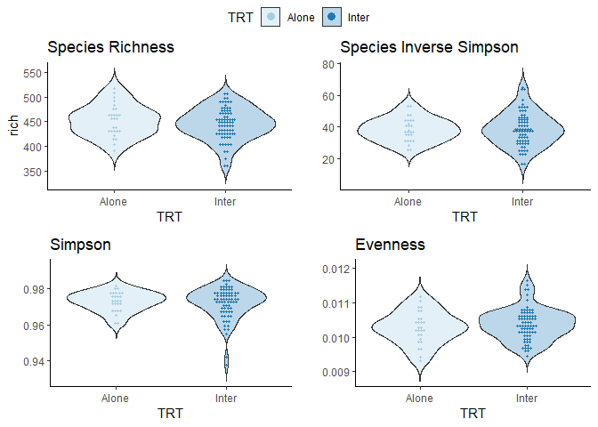
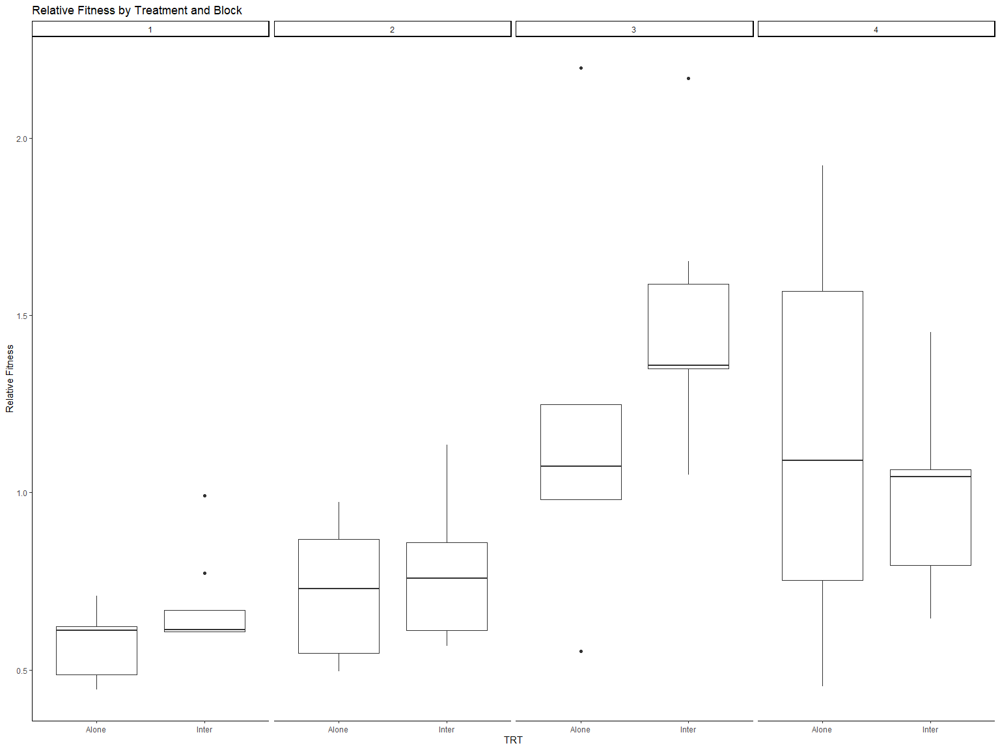
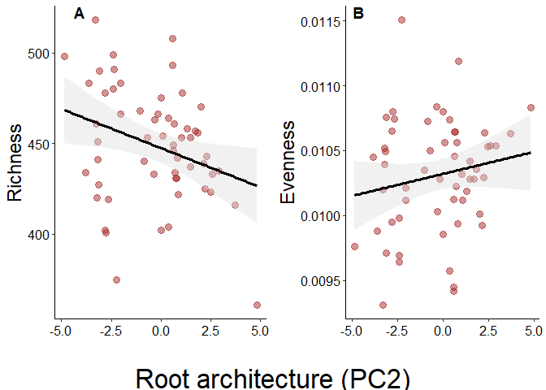
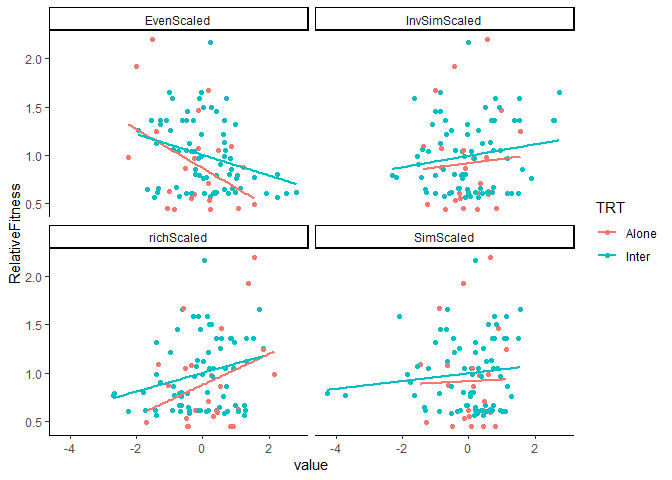

Simplified Analysis
================
Sara Colom
2/8/2020

-   [Objectives](#objectives)
    -   [Sample sizes](#sample-sizes)
        -   [Table sample number by species and
            treatment](#table-sample-number-by-species-and-treatment)
        -   [Table number of maternal line per
            species](#table-number-of-maternal-line-per-species)
-   [Load Libraries](#load-libraries)
-   [Read in Data](#read-in-data)
-   [Sample sizes](#sample-sizes-1)
    -   [Alpha Diversity](#alpha-diversity)
    -   [Test for differences](#test-for-differences)
-   [Linear mixed models](#linear-mixed-models)
-   [ANOVA Test for treatment within I.
    purpurea](#anova-test-for-treatment-within-i-purpurea)
-   [Community Composition](#community-composition)
    -   [Beta Diversity](#beta-diversity)
-   [PERMANOVA (Table 2)](#permanova-table-2)
-   [Testing linear relationships between root architecture & microbial
    diversity](#testing-linear-relationships-between-root-architecture--microbial-diversity)
    -   [Prep root data](#prep-root-data)
        -   [Within species (root traits and
            alphadiv)](#within-species-root-traits-and-alphadiv)
    -   [Plotting significant linear
        associations](#plotting-significant-linear-associations)
-   [Figure 1](#figure-1)
-   [7/29/2022](#7292022)
    -   [Regression on plant fitness](#regression-on-plant-fitness)
    -   [ANCOVA](#ancova)
        -   [Revaluation controling for *ALL* root
            traits](#revaluation-controling-for-all-root-traits)
    -   [9/22/2022](#9222022)
-   [Export models](#export-models)

# Objectives

Evaluate microbial community diversity at the Genus level and its
relationship with plant root architecture and plant fitness across and
between stressful enviornments.

## Sample sizes

### Table sample number by species and treatment

| Species      | Treatment   | N   |
|--------------|-------------|-----|
| I. purpurea  | Alone       | 27  |
| I. purpurea  | Competition | 73  |
| I. hederacea | Competition | 73  |

### Table number of maternal line per species

| Species      | Number of ML |
|--------------|--------------|
| I. purpurea  | 10           |
| I. hederacea | 5            |

# Load Libraries

``` r
library(phyloseq)
library(tidyverse)
library(ape)
library(vegan)
library(scales)
library(grid)
library(multcomp)
library(multcompView)
library(ggpubr)
library(ggcorrplot)
library(RColorBrewer)
library(broom)
library(ggthemes)
library(corrplot)
library(Hmisc)
library(emmeans)
library(lmerTest)
library(interactions)
library(jtools)
library(MASS)
library(stringr)
library(broom)

source("miSeq.R")
source("functions.R")

# Aesthetics
Tx<-theme(axis.text.y = element_text(size = 12),
          axis.title.y = element_text(size = 20)) +
          theme(axis.text.x = element_text(vjust = 1, hjust=1, angle=0, size = 20),
          axis.title.x = element_text(angle=0, size = 12),
          plot.title=element_text(size = 25,hjust=0))

# Aesthetics
Tx2<-theme(axis.text.y = element_text(size = 12),
          axis.title.y = element_text(size = 12)) +
          theme(axis.text.x = element_text(vjust = 1, hjust=1, size = 25),
          axis.title.x = element_text(size = 25),
          plot.title=element_text(size = 25,hjust=0))

GoldGrey <- c("#F1CE63", "#79706E")
GreenBlue <- c("#59A14F", "#4E79A7")
```

# Read in Data

``` r
physeq1 <- readRDS("../DataSets/physeq_clean")
physeq.scale <- readRDS("../DataSets/physeq_scaled")
alpha <- readRDS("../DataSets/alpha")

RootData <- read.csv("../DataSets/RootTraits_PCs.csv")
LeafData <- read.csv("../DataSets/SizeFitData.csv")
Fitness = read.csv("../DataSets/FitPA4.csv")
```

# Sample sizes

#### Samples by block within IP

``` r
alpha %>% 
  filter(Species == "Ip") %>% 
  count(Block)
```

    ##   Block  n
    ## 1     1 24
    ## 2     2 25
    ## 3     3 26
    ## 4     4 25

#### Samples of treatment within IP

``` r
alpha %>% 
  filter(Species == "Ip") %>% 
  count(TRT)
```

    ##     TRT  n
    ## 1 Alone 27
    ## 2 Inter 73

## Alpha Diversity

``` r
# Visualize data distribution w Violin plots within I.purpurea


p <- ggplot(alpha %>% filter(Species == "Ip"), aes(x = TRT, y = rich)) +
  geom_violin(trim = FALSE, aes(fill = TRT), alpha = 0.3) + 
  geom_dotplot(binaxis = 'y', stackdir = 'center', dotsize = 1, aes(color = TRT, fill = TRT)) +
  theme_classic() +
  scale_color_brewer(palette = "Paired") +
  scale_fill_brewer(palette = "Paired") +
  ggtitle("Species Richness")


q <- ggplot(alpha %>% filter(Species == "Ip"), aes(x = TRT, y = InvSimp)) +
  geom_violin(trim = FALSE, aes(fill = TRT), alpha = 0.3) + 
  geom_dotplot(binaxis = 'y', stackdir = 'center', dotsize = 1, aes(color = TRT, fill = TRT)) +
  theme_classic() +
  scale_color_brewer(palette = "Paired") +
  scale_fill_brewer(palette = "Paired") +
  ggtitle("Species Inverse Simpson") +
  ylab("")


t <- ggplot(alpha %>% filter(Species == "Ip"), aes(x = TRT, y = sim)) +
  geom_violin(trim = FALSE, aes(fill= TRT), alpha = 0.3) + 
  geom_dotplot(binaxis = 'y', stackdir = 'center', dotsize = 1, aes(color = TRT, fill = TRT)) +
  theme_classic() +
  scale_color_brewer(palette = "Paired") +
  scale_fill_brewer(palette = "Paired") +
  ggtitle("Simpson") +
  ylab("")

v <- ggplot(alpha %>% filter(Species == "Ip"), aes(x = TRT, y = even)) +
  geom_violin(trim = FALSE, aes(fill = TRT), alpha = 0.3) + 
  geom_dotplot(binaxis = 'y', stackdir = 'center', dotsize = 1, aes(color = TRT, fill = TRT)) +
  theme_classic() +
  scale_color_brewer(palette = "Paired") +
  scale_fill_brewer(palette = "Paired") +
  ggtitle("Evenness") +
  ylab("")

ggarrange(p, q, t, v, common.legend = T, ncol = 2, nrow = 2)
```

<!-- -->

## Test for differences

# Linear mixed models

``` r
# Test for treatment within I. purpurea
RichLmm <- lmer(rich ~ TRT + Block + (1|Block:ML), alpha %>% filter(Species == "Ip"))

InvLmm <- lmer(InvSimp ~ TRT + Block + (1|Block:ML), alpha %>% filter(Species == "Ip"))

SimLmm <- lmer(sim ~ TRT + Block + (1|Block:ML), alpha %>% filter(Species == "Ip"))

EvenLmm <- lmer(even ~ TRT + Block + (1|Block:ML), alpha %>% filter(Species == "Ip"))
```

    ## boundary (singular) fit: see help('isSingular')

``` r
anova(RichLmm)
```

    ## Type III Analysis of Variance Table with Satterthwaite's method
    ##        Sum Sq Mean Sq NumDF  DenDF F value   Pr(>F)   
    ## TRT    1320.5  1320.5     1 87.801  1.4442 0.232690   
    ## Block 13858.8  4619.6     3 26.431  5.0524 0.006744 **
    ## ---
    ## Signif. codes:  0 '***' 0.001 '**' 0.01 '*' 0.05 '.' 0.1 ' ' 1

``` r
ranova(RichLmm)
```

    ## ANOVA-like table for random-effects: Single term deletions
    ## 
    ## Model:
    ## rich ~ TRT + Block + (1 | Block:ML)
    ##                npar  logLik    AIC    LRT Df Pr(>Chisq)
    ## <none>            7 -467.21 948.42                     
    ## (1 | Block:ML)    6 -467.22 946.44 0.0238  1     0.8774

``` r
anova(InvLmm)
```

    ## Type III Analysis of Variance Table with Satterthwaite's method
    ##       Sum Sq Mean Sq NumDF  DenDF F value Pr(>F)  
    ## TRT     0.27   0.273     1 82.613  0.0035 0.9533  
    ## Block 721.76 240.588     3 24.544  3.0419 0.0479 *
    ## ---
    ## Signif. codes:  0 '***' 0.001 '**' 0.01 '*' 0.05 '.' 0.1 ' ' 1

``` r
ranova(InvLmm)
```

    ## ANOVA-like table for random-effects: Single term deletions
    ## 
    ## Model:
    ## InvSimp ~ TRT + Block + (1 | Block:ML)
    ##                npar  logLik    AIC    LRT Df Pr(>Chisq)
    ## <none>            7 -354.94 723.88                     
    ## (1 | Block:ML)    6 -355.46 722.92 1.0486  1     0.3058

``` r
anova(SimLmm)
```

    ## Type III Analysis of Variance Table with Satterthwaite's method
    ##           Sum Sq    Mean Sq NumDF  DenDF F value Pr(>F)
    ## TRT   0.00002357 2.3571e-05     1 79.747  0.4399 0.5091
    ## Block 0.00033833 1.1278e-04     3 22.261  2.1049 0.1283

``` r
ranova(SimLmm)
```

    ## ANOVA-like table for random-effects: Single term deletions
    ## 
    ## Model:
    ## sim ~ TRT + Block + (1 | Block:ML)
    ##                npar logLik     AIC    LRT Df Pr(>Chisq)
    ## <none>            7 318.62 -623.24                     
    ## (1 | Block:ML)    6 317.94 -623.89 1.3513  1      0.245

``` r
anova(EvenLmm)
```

    ## Type III Analysis of Variance Table with Satterthwaite's method
    ##           Sum Sq    Mean Sq NumDF DenDF F value   Pr(>F)   
    ## TRT   2.2628e-07 2.2628e-07     1    95  1.1782 0.280475   
    ## Block 2.9697e-06 9.8990e-07     3    95  5.1542 0.002408 **
    ## ---
    ## Signif. codes:  0 '***' 0.001 '**' 0.01 '*' 0.05 '.' 0.1 ' ' 1

``` r
ranova(EvenLmm)
```

    ## ANOVA-like table for random-effects: Single term deletions
    ## 
    ## Model:
    ## even ~ TRT + Block + (1 | Block:ML)
    ##                npar logLik     AIC LRT Df Pr(>Chisq)
    ## <none>            7 591.89 -1169.8                  
    ## (1 | Block:ML)    6 591.89 -1171.8   0  1          1

# ANOVA Test for treatment within I. purpurea

-   Evaluate if microbial community metrics vary by treatment and block.

``` r
alpha.purp <- alpha %>% filter(Species == "Ip")

aov.Richness <- lm(rich ~ TRT + Block, alpha.purp)
aov.simpsonInv <- lm(InvSimp ~ TRT + Block, alpha.purp)
aov.simpson <- lm(sim ~ TRT + Block, alpha.purp)
aov.evenness <- lm(even ~ TRT + Block, alpha.purp)
aov.shannon <- lm(shan ~ TRT + Block, alpha.purp)


#Call for the summary of that ANOVA, which will include P-values
anova(aov.Richness)
```

    FALSE Analysis of Variance Table
    FALSE 
    FALSE Response: rich
    FALSE           Df Sum Sq Mean Sq F value   Pr(>F)   
    FALSE TRT        1    962   961.9  1.0381 0.310860   
    FALSE Block      3  14694  4897.8  5.2858 0.002052 **
    FALSE Residuals 95  88028   926.6                    
    FALSE ---
    FALSE Signif. codes:  0 '***' 0.001 '**' 0.01 '*' 0.05 '.' 0.1 ' ' 1

``` r
anova(aov.simpsonInv)
```

    FALSE Analysis of Variance Table
    FALSE 
    FALSE Response: InvSimp
    FALSE           Df Sum Sq Mean Sq F value  Pr(>F)  
    FALSE TRT        1    2.5    2.54  0.0288 0.86562  
    FALSE Block      3 1031.6  343.85  3.9020 0.01122 *
    FALSE Residuals 95 8371.5   88.12                  
    FALSE ---
    FALSE Signif. codes:  0 '***' 0.001 '**' 0.01 '*' 0.05 '.' 0.1 ' ' 1

``` r
anova(aov.simpson)
```

    FALSE Analysis of Variance Table
    FALSE 
    FALSE Response: sim
    FALSE           Df    Sum Sq    Mean Sq F value  Pr(>F)  
    FALSE TRT        1 0.0000171 1.7100e-05  0.2785 0.59889  
    FALSE Block      3 0.0005091 1.6970e-04  2.7643 0.04617 *
    FALSE Residuals 95 0.0058321 6.1391e-05                  
    FALSE ---
    FALSE Signif. codes:  0 '***' 0.001 '**' 0.01 '*' 0.05 '.' 0.1 ' ' 1

``` r
anova(aov.evenness)
```

    FALSE Analysis of Variance Table
    FALSE 
    FALSE Response: even
    FALSE           Df     Sum Sq    Mean Sq F value   Pr(>F)   
    FALSE TRT        1 1.9700e-07 1.9704e-07  1.0259 0.313685   
    FALSE Block      3 2.9697e-06 9.8990e-07  5.1542 0.002408 **
    FALSE Residuals 95 1.8245e-05 1.9206e-07                    
    FALSE ---
    FALSE Signif. codes:  0 '***' 0.001 '**' 0.01 '*' 0.05 '.' 0.1 ' ' 1

``` r
# No significant differences
```

# Community Composition

## Beta Diversity

``` r
physeq.bray <- phyloseq::distance(physeq = physeq.scale, method = "bray")

# # # # # # # # # # # # # # # # # # # # # 
# Subsample for within I. purpurea only
# # # # # # # # # # # # # # # # # # # # # 

physeq.Purp <- subset_samples(physeq.scale, Species == "Ip")
sampledf.Purp<- data.frame(sample_data(physeq.Purp))

# Calculate bray curtis for I.purpurea samples only
physeq.Purp.bray <- phyloseq::distance(physeq = physeq.Purp, method = "bray")
```

``` r
# Beta diversity pcoa Bray-Curtis DNA only 
physeq.pcoa <-
  ordinate(
    physeq = physeq.scale,
    method = "PCoA",
    distance = "bray"
  )

physeq.pcoa.vectors <- data.frame(physeq.pcoa$vectors[, 1:4])

physeq.pcoa.vectors$Duplicates <- row.names(physeq.pcoa.vectors)

SampData <- data.frame(sample_data(physeq1))

colnames(SampData)[1] <- "Duplicates"

SampData <- subset(SampData, SampData$TRT == "Inter"|SampData$TRT == "Alone")

physeq.pcoa.df <- droplevels(merge(physeq.pcoa.vectors, SampData,by="Duplicates"))
```

# PERMANOVA (Table 2)

``` r
## All experiment, add variable treatment, then species
sampledf <- data.frame(sample_data(physeq.scale))

physeq.purp = subset_samples(physeq.scale, Species == "Ip")

treatment <- sampledf %>% 
  filter(Species == "Ip") %>% 
  pull(TRT)

block <- sampledf %>% 
  filter(Species == "Ip") %>% 
  pull(Block)

output <- adonis(otu_table(physeq.purp) %>% t ~ treatment + block, method = "bray")
```

# Testing linear relationships between root architecture & microbial diversity

## Prep root data

``` r
RootAlphaObs <- merge(alpha, RootData[c("Sample_ID", "PC1", "PC2", "PC3", "PC4")])
```

### Within species (root traits and alphadiv)

``` r
#summary(glht(SimpInvPC1, mcp(rank="Tukey")))

#################################################################
##################### SUBSET for I.purpurea #####################
#################################################################

RootAlphaPurp <- droplevels(RootAlphaObs %>% filter(Species == "Ip"))
RootAlphaPurp$Comp <- sub(".*\\-", "", RootAlphaPurp$Combos)

### Linear regressions

SimpInvPC2 <- lm(InvSimp ~ PC2 + TRT + Block, RootAlphaPurp) 


SimpInvPC2_res <- SimpInvPC2 %>% 
  tidy() %>% 
  filter(term == "PC2") %>% 
  mutate(`Microbial community metric` = "Inverse Simpson Diversity") %>% 
  rename(b = estimate, SE = `std.error`, `t-statistic` = statistic, `p_value` = `p.value`) %>% 
  relocate(`Microbial community metric`)  


SimpPC2 <- lm(sim ~ PC2 + TRT + Block, RootAlphaPurp) 


SimpPC2_res <- SimpPC2 %>% 
  tidy() %>% 
  filter(term == "PC2") %>% 
  mutate(`Microbial community metric` = "Simpson Diversity") %>% 
  rename(b = estimate, SE = `std.error`, `t-statistic` = statistic, `p_value` = `p.value`) %>% 
  relocate(`Microbial community metric`)  


RichPC2 <- lm(rich ~ PC2 + Block + TRT, RootAlphaPurp) 

RichPC2_res <- RichPC2 %>% 
  tidy() %>% 
  filter(term == "PC2") %>% 
  mutate(`Microbial community metric` = "Sp. richness") %>% 
  rename(b = estimate, SE = `std.error`, `t-statistic` = statistic, `p_value` = `p.value`) %>% 
  relocate(`Microbial community metric`)  

summary(RichPC2)
```

    ## 
    ## Call:
    ## lm(formula = rich ~ PC2 + Block + TRT, data = RootAlphaPurp)
    ## 
    ## Residuals:
    ##     Min      1Q  Median      3Q     Max 
    ## -65.527 -11.917   3.751  21.397  48.599 
    ## 
    ## Coefficients:
    ##             Estimate Std. Error t value Pr(>|t|)    
    ## (Intercept)  438.929     10.272  42.732  < 2e-16 ***
    ## PC2           -5.734      2.223  -2.579  0.01282 *  
    ## Block2        22.156     16.249   1.363  0.17872    
    ## Block3        35.137     11.298   3.110  0.00306 ** 
    ## Block4        17.473     11.338   1.541  0.12946    
    ## TRTInter     -11.287      8.696  -1.298  0.20012    
    ## ---
    ## Signif. codes:  0 '***' 0.001 '**' 0.01 '*' 0.05 '.' 0.1 ' ' 1
    ## 
    ## Residual standard error: 28.62 on 51 degrees of freedom
    ## Multiple R-squared:  0.255,  Adjusted R-squared:  0.182 
    ## F-statistic: 3.491 on 5 and 51 DF,  p-value: 0.008644

``` r
car::Anova(mod = lm(rich ~ PC2 + Block + TRT*PC2, RootAlphaPurp), type = "III")
```

    ## Anova Table (Type III tests)
    ## 
    ## Response: rich
    ##              Sum Sq Df   F value  Pr(>F)    
    ## (Intercept) 1331420  1 1609.8076 < 2e-16 ***
    ## PC2            3433  1    4.1509 0.04692 *  
    ## Block          8117  3    3.2714 0.02865 *  
    ## TRT             750  1    0.9064 0.34565    
    ## PC2:TRT         416  1    0.5030 0.48150    
    ## Residuals     41353 50                      
    ## ---
    ## Signif. codes:  0 '***' 0.001 '**' 0.01 '*' 0.05 '.' 0.1 ' ' 1

``` r
EvenPC2 <- lm(even ~ PC2 + Block + TRT , RootAlphaPurp) 
summary(EvenPC2) 
```

    ## 
    ## Call:
    ## lm(formula = even ~ PC2 + Block + TRT, data = RootAlphaPurp)
    ## 
    ## Residuals:
    ##        Min         1Q     Median         3Q        Max 
    ## -7.790e-04 -2.985e-04 -1.367e-05  2.307e-04  1.030e-03 
    ## 
    ## Coefficients:
    ##               Estimate Std. Error t value Pr(>|t|)    
    ## (Intercept)  1.053e-02  1.474e-04  71.425  < 2e-16 ***
    ## PC2          7.252e-05  3.190e-05   2.273  0.02725 *  
    ## Block2      -2.146e-04  2.332e-04  -0.920  0.36176    
    ## Block3      -5.085e-04  1.621e-04  -3.136  0.00284 ** 
    ## Block4      -3.746e-04  1.627e-04  -2.303  0.02541 *  
    ## TRTInter     1.110e-04  1.248e-04   0.890  0.37769    
    ## ---
    ## Signif. codes:  0 '***' 0.001 '**' 0.01 '*' 0.05 '.' 0.1 ' ' 1
    ## 
    ## Residual standard error: 0.0004107 on 51 degrees of freedom
    ## Multiple R-squared:  0.2043, Adjusted R-squared:  0.1263 
    ## F-statistic: 2.619 on 5 and 51 DF,  p-value: 0.03493

``` r
EvenPC2_res <- EvenPC2 %>% 
  tidy() %>% 
  filter(term == "PC2") %>% 
  mutate(`Microbial community metric` = "Sp. evenness") %>% 
  rename(b = estimate, SE = `std.error`, `t-statistic` = statistic, `p_value` = `p.value`) %>% 
  relocate(`Microbial community metric`)  

microbe_root_lm_res <- SimpInvPC2_res %>% 
  bind_rows(
  RichPC2_res
  ) %>% 
  bind_rows(
    EvenPC2_res
  ) %>% 
  bind_rows(SimpPC2_res) %>% 
  mutate(across(where(is.numeric), function(x) round(x, 3))) %>% 
  tidy_p()
  
microbe_root_lm_res  
```

    ## # A tibble: 4 x 7
    ##   `Microbial community metr~` term       b    SE `t-statistic` p_value `p-value`
    ##   <chr>                       <chr>  <dbl> <dbl>         <dbl>   <dbl> <chr>    
    ## 1 Inverse Simpson Diversity   PC2   -0.776 0.727         -1.07   0.29  0.29     
    ## 2 Sp. richness                PC2   -5.73  2.22          -2.58   0.013 0.013*   
    ## 3 Sp. evenness                PC2    0     0              2.27   0.027 0.027*   
    ## 4 Simpson Diversity           PC2   -0.001 0.001         -1.44   0.157 0.157

## Plotting significant linear associations

``` r
# Richness and root architecture
P2.rich <- ggplot() +
  geom_point(data = RootAlphaPurp, aes(PC2, rich), alpha = 0.5, size = 3, color = "brown") +
  geom_smooth(data = RootAlphaPurp, method = "lm", aes(PC2, rich), fullrange = TRUE, color = "black", size = 1.2, fill = "#DCDCDC") +
  theme_classic() +
  ylab("Richness") +
  xlab("") +
  theme(axis.text = element_text(color = "black", size = 12)) +
  theme(axis.title = element_text(color = "black", size = 18)) +
  theme(legend.text = element_text(size = 12)) +
  theme(legend.position = "top") +
  guides(colour = guide_legend(override.aes = list(size = 3)))

# Evenness and root architecture
P2.even <- ggplot() +
  geom_point(data = RootAlphaPurp, aes(PC2, even), alpha = 0.5, size = 3, color = "brown") +
  geom_smooth(data = RootAlphaPurp, method = "lm", aes(PC2, even), fullrange = TRUE, color = "black", size = 1.2, fill = "#DCDCDC") +
  theme_classic() +
  ylab("Evenness") +
  xlab("") +
  theme(axis.text = element_text(color = "black", size = 12)) +
  theme(axis.title = element_text(color = "black", size = 18)) +
  theme(legend.text = element_text(size = 12)) +
  theme(legend.position = "top") +
  guides(colour = guide_legend(override.aes = list(size = 3)))
```

Add Leaf Data.

``` r
LeafData$Sample_ID <- paste(LeafData$Position, ifelse(grepl("Ihed", LeafData$ML), "H", "P"), sep="")
```

``` r
# Calculate relative fitness
# First calculate mean seed number by species and treatment---note* we only have seed output of I. purpurea

MeanSeedNumber <- aggregate(SeedNumber ~ Trt + Species, Fitness, mean)

colnames(MeanSeedNumber) <- c("Trt", "Species", "MeanSeedNumber")

Ipurp.Fit <- Fitness %>%
  filter(Species == "Ip")

Ipurp.Alpha <- alpha %>%
  filter(Species == "Ip")

FitnessPurp <- merge(Ipurp.Fit, MeanSeedNumber, by=c("Trt", "Species"))
FitnessPurp$RelativeFit <- FitnessPurp$SeedNumber/FitnessPurp$MeanSeedNumber
FitnessPurp$Block <- as.factor(FitnessPurp$Block)

FitnessPurp2 <- merge(FitnessPurp, LeafData)
str(FitnessPurp2)
```

    ## 'data.frame':    385 obs. of  24 variables:
    ##  $ Trt            : chr  "Alone" "Alone" "Alone" "Alone" ...
    ##  $ Species        : chr  "Ip" "Ip" "Ip" "Ip" ...
    ##  $ Position       : chr  "102" "114" "136" "138" ...
    ##  $ Block          : Factor w/ 4 levels "1","2","3","4": 1 1 1 1 1 1 1 1 1 1 ...
    ##  $ Order          : int  102 114 136 138 151 153 172 203 204 213 ...
    ##  $ ML             : chr  "PA4.2Ip" "PA4.15Ip" "PA4.2Ip" "PA4.11Ip" ...
    ##  $ UniqId         : chr  "102Ip" "114Ip" "136Ip" "138Ip" ...
    ##  $ GerminationDate: chr  "43258" "43258" "43258" "43258" ...
    ##  $ Comment1       : chr  NA NA NA NA ...
    ##  $ Dead_plant     : chr  NA NA NA NA ...
    ##  $ DeathCause     : logi  NA NA NA NA NA NA ...
    ##  $ RootsHarvested : chr  "N" "N" "N" "N" ...
    ##  $ SeedsCounted   : chr  "Y" "Y" "Y" "Y" ...
    ##  $ Comp           : chr  NA NA NA NA ...
    ##  $ Combos         : chr  NA NA NA NA ...
    ##  $ Population     : chr  "PA4" "PA4" "PA4" "PA4" ...
    ##  $ SeedNumber     : int  96 75 93 56 383 321 256 202 79 172 ...
    ##  $ MeanSeedNumber : num  224 224 224 224 224 ...
    ##  $ RelativeFit    : num  0.428 0.334 0.415 0.25 1.708 ...
    ##  $ Block.1        : int  1 1 1 1 1 1 1 1 1 1 ...
    ##  $ Leaf.Number    : int  6 5 6 7 9 10 11 7 7 8 ...
    ##  $ Comment        : logi  NA NA NA NA NA NA ...
    ##  $ X              : int  1 7 21 23 31 32 39 53 54 57 ...
    ##  $ Sample_ID      : chr  "102P" "114P" "136P" "138P" ...

``` r
FitnessPurp2$Leaf.Number <- as.numeric(as.character(FitnessPurp2$Leaf.Number))

SN1 <- lmer(SeedNumber ~ Trt + Block + Leaf.Number + Block:Trt + (1|ML), FitnessPurp2)
anova(SN1) # Treatment is significant effect on plant seed number; Significant Treatment by Block effect
```

    ## Type III Analysis of Variance Table with Satterthwaite's method
    ##              Sum Sq Mean Sq NumDF  DenDF  F value  Pr(>F)    
    ## Trt           83491   83491     1 370.05   3.9783 0.04682 *  
    ## Block        128423   42808     3 371.69   2.0398 0.10790    
    ## Leaf.Number 2425524 2425524     1 374.69 115.5752 < 2e-16 ***
    ## Trt:Block    164743   54914     3 371.54   2.6166 0.05082 .  
    ## ---
    ## Signif. codes:  0 '***' 0.001 '**' 0.01 '*' 0.05 '.' 0.1 ' ' 1

``` r
ggplot(FitnessPurp, aes(Trt, RelativeFit, fill=Block)) +
  geom_boxplot() +
  scale_fill_brewer("Paired") +
  theme_classic() +
  ylab("Relative Fitness") +
  ggtitle("Relative Fitness by Treatment and Block")
```

<!-- -->

``` r
# Remove size effects from fitness
StdFitness <- FitnessPurp2[c("Trt", "Species", "Block", "ML", "RelativeFit", "Leaf.Number")] # Subset fitness data for variables of interest

# Run one-way ANOVA to remove size effect--i.e., keep residuals
StdFitness$RelativeFitness <- residuals(lm(RelativeFit ~ Leaf.Number, FitnessPurp2)) 

# Compare residuals and non-standard values of fitness
plot(StdFitness$RelativeFit, StdFitness$RelativeFitness)
```

<!-- -->

``` r
# Average fitness by block, maternal line and treatment--we use NON standardized fitness (ie size effects not removed)
FitAveraged = aggregate(RelativeFit ~ Block + Trt + ML, FitnessPurp, mean)
colnames(FitAveraged) <- c("Block", "Trt", "ML", "RelativeFitness")
FitAveraged$TRT <- FitAveraged$Trt
dim(FitAveraged)
```

    ## [1] 76  5

``` r
head(FitAveraged)
```

    ##   Block   Trt       ML RelativeFitness   TRT
    ## 1     1 Alone PA4.11Ip       0.4437172 Alone
    ## 2     2 Alone PA4.11Ip       1.0435158 Alone
    ## 3     3 Alone PA4.11Ip       1.0747321 Alone
    ## 4     4 Alone PA4.11Ip       1.4627059 Alone
    ## 5     1 Inter PA4.11Ip       0.6619616 Inter
    ## 6     2 Inter PA4.11Ip       0.6103389 Inter

``` r
# Average size
SizeAveraged <- aggregate(Leaf.Number ~ Block + Trt + ML + Species, LeafData,mean)
colnames(SizeAveraged) <- c("Block", "Trt", "ML", "Species", "Size")

SizeAveraged$TRT <- SizeAveraged$Trt
dim(SizeAveraged)
```

    ## [1] 76  6

``` r
head(SizeAveraged)
```

    ##   Block   Trt       ML Species      Size   TRT
    ## 1     1 Alone PA4.11Ip      Ip  9.000000 Alone
    ## 2     2 Alone PA4.11Ip      Ip 11.000000 Alone
    ## 3     3 Alone PA4.11Ip      Ip  8.000000 Alone
    ## 4     4 Alone PA4.11Ip      Ip  5.000000 Alone
    ## 5     1 Inter PA4.11Ip      Ip  7.545455 Inter
    ## 6     2 Inter PA4.11Ip      Ip  7.500000 Inter

``` r
SizePurp <- SizeAveraged %>% filter(Species == "Ip")
```

``` r
####  ####  ####  ####  ####  ####   ####
#  Examine selection on microbiome first
####  ####  ####  ####  ####  ####   ####
FitnessPurp$TRT <- FitnessPurp$Trt
FitnessPurp$Combos <- as.character(FitnessPurp$Combos)
FitnessPurp[which(FitnessPurp$TRT == "Alone"),]$Combos <- "none"
FitnessPurp$Combos <- as.factor(FitnessPurp$Combos)

BrayFit <- merge(physeq.pcoa.df,FitAveraged)

FitAlpha <- merge(FitAveraged, alpha)
dim(FitAlpha)
```

    ## [1] 97 13

``` r
ggplot(FitAlpha, aes(TRT, RelativeFitness)) +
  geom_boxplot() +
  scale_fill_brewer("Paired") +
  theme_classic() +
  ylab("Relative Fitness") +
  ggtitle("Relative Fitness by Treatment and Block") +
  facet_grid(~Block)
```

<!-- -->

``` r
# Combine with root data

RootAveraged <- aggregate(list(RootData[c("PC1", "PC2", "PC3", "PC4")]),by=list(RootData$Trt, RootData$ML), FUN = mean) 

colnames(RootAveraged) <- c("Trt", "ML", "PC1", "PC2", "PC3", "PC4")
head(RootAveraged)
```

    ##     Trt         ML         PC1        PC2        PC3         PC4
    ## 1 Alone   PA4.11Ip -0.69794646 -1.3274069  0.7756816 -0.75520608
    ## 2 Inter   PA4.11Ip  0.43519578  0.6954043 -0.1859846  0.10761866
    ## 3 Inter PA4.12Ihed  0.07075942 -0.9146971 -0.2814713 -0.01631047
    ## 4 Alone   PA4.13Ip -2.28254650  1.4831488  0.9299528 -0.64140759
    ## 5 Inter   PA4.13Ip  0.11317327 -0.1860671  0.1006711  0.43992946
    ## 6 Alone   PA4.14Ip  0.70071833 -0.4492977  0.9728631 -0.41237743

``` r
RootFitAlpha <- merge(FitAlpha, RootAveraged)
head(RootFitAlpha)
```

    ##         ML   Trt Block   TRT RelativeFitness Sample_ID Species
    ## 1 PA4.11Ip Alone     1 Alone       0.4437172      158P      Ip
    ## 2 PA4.11Ip Alone     1 Alone       0.4437172       84P      Ip
    ## 3 PA4.11Ip Alone     4 Alone       1.4627059      814P      Ip
    ## 4 PA4.11Ip Alone     3 Alone       1.0747321      674P      Ip
    ## 5 PA4.11Ip Inter     1 Inter       0.6619616      93AP      Ip
    ## 6 PA4.11Ip Inter     1 Inter       0.6619616       21P      Ip
    ##                    Combos rich  InvSimp       sim     shan        even
    ## 1                    none  434 31.43535 0.9681887 4.534697 0.010448610
    ## 2                    none  478 41.08728 0.9756616 4.753743 0.009945068
    ## 3                    none  466 48.22287 0.9792630 4.791226 0.010281601
    ## 4                    none  437 30.30030 0.9669970 4.491512 0.010278060
    ## 5 PA 4.11 Ip-PA 4.15 Ihed  427 35.29942 0.9716709 4.593859 0.010758451
    ## 6  PA 4.11 Ip-PA 4.3 Ihed  489 42.06259 0.9762259 4.752692 0.009719206
    ##          PC1        PC2        PC3        PC4
    ## 1 -0.6979465 -1.3274069  0.7756816 -0.7552061
    ## 2 -0.6979465 -1.3274069  0.7756816 -0.7552061
    ## 3 -0.6979465 -1.3274069  0.7756816 -0.7552061
    ## 4 -0.6979465 -1.3274069  0.7756816 -0.7552061
    ## 5  0.4351958  0.6954043 -0.1859846  0.1076187
    ## 6  0.4351958  0.6954043 -0.1859846  0.1076187

``` r
# CombinE root,fitness/bray estimates
RootFitBray <- merge(BrayFit, RootAveraged)


# Plot boxplots of averaged root traits
PC2_Box <- ggplot(RootAveraged, aes(x = "", y = PC2)) +
  geom_boxplot() +
  #geom_jitter() +
  xlab("Root Architecture") +
  theme_classic() +
  Tx+ 
  coord_flip()

# Plot boxplots of averaged root traits
PC1_Box=ggplot(RootAveraged, aes(x = "", y = PC1)) +
  geom_boxplot() +
  #geom_jitter() +
  xlab("Root Topology") +
  theme_classic() +
  Tx+ 
  coord_flip()

# Plot boxplots of averaged root traits
PC4_Box=ggplot(RootAveraged, aes(x = "", y = PC4)) +
  geom_boxplot() +
  #geom_jitter() +
  xlab("Root Morphology") +
  theme_classic() +
  Tx+ 
  coord_flip()
```

# Figure 1

``` r
#ggarrange(P2.rich,P2.even,P4.Sim,P4.simIn,nrow=2,ncol=2)
AB <- ggarrange(P2.rich, P2.even, labels = "AUTO", hjust = -7, vjust = 1.5,font.label = list(size = 14))
```

    ## `geom_smooth()` using formula 'y ~ x'
    ## `geom_smooth()` using formula 'y ~ x'

``` r
# Common x title
x.grob1 <- textGrob("Root architecture (PC2)", 
                   gp = gpar(col="black", fontsize = 25), rot = 0)

gridExtra::grid.arrange(gridExtra::arrangeGrob(AB, bottom = x.grob1, padding = unit(0.05,units = 'in'), nrow=1))
```

<!-- -->

``` r
# Remove block effects from fitness
RootFitAlpha$FitResidBlk <- resid(lm(RelativeFitness ~ Block, RootFitAlpha))

RootFitAlpha$Comp <- sub(".*\\-", "", RootFitAlpha$Combos)
```

# 7/29/2022

## Regression on plant fitness

-   Evaluate linear relationship of I.purpurea fitness and microbial
    richness, inverse Simpson, and evenness within the control (*alone*)
    treatment for each metric separately.

-   Evaluate if relationship above is impacted by treatment via ANCOVA

-   Assess how I.purpurea fitness in control varies with the three main
    microbial metrics while controlling for root architecture.

Prior to runing models below, I will visualize the relationships between
microbial community metrics and plant fitness and color by treatment.

``` r
# Scale the microbial variables
RootFitAlpha$richScaled <-scale(RootFitAlpha$rich)
RootFitAlpha$SimScaled <-scale(RootFitAlpha$sim)
RootFitAlpha$InvSimScaled <-scale(RootFitAlpha$InvSimp)
RootFitAlpha$EvenScaled <-scale(RootFitAlpha$even)

RootFitAlpha %>% 
  dplyr::select(TRT, matches("Scaled"), RelativeFitness, Block) %>% 
  pivot_longer(cols = richScaled:EvenScaled, names_to = "vars", values_to = "value") %>% 
  ggplot() +
  geom_point(aes(value, RelativeFitness, color = TRT)) +
  geom_smooth(aes(value, RelativeFitness, color = TRT), method='lm', se = F) +
  facet_wrap(~vars) +
  theme_classic()
```

    ## `geom_smooth()` using formula 'y ~ x'

<!-- -->

#### Control treatment

``` r
cntrl_invSim <- lm(RelativeFitness ~ InvSimScaled, RootFitAlpha %>% 
                   filter(TRT == "Alone"))

cntrl_invSim_res <- cntrl_invSim %>% 
                        tidy() %>% 
                        rename(b = estimate, SE = `std.error`, `t-statistic` = statistic) %>% 
                        mutate(across(where(is.numeric), function(x) round(x, 3))) %>% 
                        rename(`p_value` = `p.value`) %>% 
                        tidy_p()

cntrl_invSim_res
```

    ## # A tibble: 2 x 6
    ##   term             b    SE `t-statistic` p_value `p-value`
    ##   <chr>        <dbl> <dbl>         <dbl>   <dbl> <chr>    
    ## 1 (Intercept)  0.916 0.102         9.00    0     <0.001***
    ## 2 InvSimScaled 0.044 0.141         0.316   0.755 0.755

``` r
cntrl_rich <- lm(RelativeFitness ~ richScaled, RootFitAlpha %>% 
                   filter(TRT == "Alone"))

cntrl_rich_res <- cntrl_rich %>% 
                        tidy() %>% 
                        rename(b = estimate, SE = `std.error`, `t-statistic` = statistic) %>% 
                        mutate(across(where(is.numeric), function(x) round(x, 3))) %>% 
                        rename(`p_value` = `p.value`) %>% 
                        tidy_p()
cntrl_rich_res
```

    ## # A tibble: 2 x 6
    ##   term            b    SE `t-statistic` p_value `p-value`
    ##   <chr>       <dbl> <dbl>         <dbl>   <dbl> <chr>    
    ## 1 (Intercept) 0.879 0.099          8.90   0     <0.001***
    ## 2 richScaled  0.159 0.1            1.60   0.125 0.125

``` r
cntrl_even <- lm(RelativeFitness ~ EvenScaled, RootFitAlpha %>% 
                   filter(TRT == "Alone"))

cntrl_even_res <- cntrl_even %>% 
                        tidy() %>% 
                        rename(b = estimate, SE = `std.error`, `t-statistic` = statistic) %>% 
                        mutate(across(where(is.numeric), function(x) round(x, 3))) %>% 
                        rename(`p_value` = `p.value`) %>% 
                        tidy_p()
cntrl_even_res
```

    ## # A tibble: 2 x 6
    ##   term             b    SE `t-statistic` p_value `p-value`
    ##   <chr>        <dbl> <dbl>         <dbl>   <dbl> <chr>    
    ## 1 (Intercept)  0.865 0.096          8.99   0     <0.001***
    ## 2 EvenScaled  -0.2   0.098         -2.05   0.052 0.052

## ANCOVA

``` r
ancova_invSim <- lm(RelativeFitness ~ InvSimScaled*TRT + Block, RootFitAlpha)

ancova_invSim <- anova(ancova_invSim) %>% 
  tidy() %>% 
  tidy_more()

ancova_rich <- lm(RelativeFitness ~ richScaled*TRT + Block, RootFitAlpha)

ancova_rich <- anova(ancova_rich) %>% 
  tidy( ) %>% 
  tidy_more()

ancova_even <- lm(RelativeFitness ~ EvenScaled*TRT + Block, RootFitAlpha)

ancova_even <- anova(ancova_even) %>% 
  tidy() %>% 
  tidy_more()

ancova_invSim
```

    ## # A tibble: 5 x 7
    ##   Term                DF    SS meansq `F-value` p.value P        
    ##   <chr>            <dbl> <dbl>  <dbl>     <dbl>   <dbl> <chr>    
    ## 1 InvSimScaled         1 0.323  0.323     4.25    0.042 0.042*   
    ## 2 TRT                  1 0.105  0.105     1.38    0.243 0.243    
    ## 3 Block                3 7.80   2.60     34.2     0     <0.001***
    ## 4 InvSimScaled:TRT     1 0.002  0.002     0.023   0.881 0.881    
    ## 5 Residuals           90 6.84   0.076    NA      NA     <NA>

``` r
ancova_rich
```

    ## # A tibble: 5 x 7
    ##   Term              DF    SS meansq `F-value` p.value P        
    ##   <chr>          <dbl> <dbl>  <dbl>     <dbl>   <dbl> <chr>    
    ## 1 richScaled         1 1.06   1.06     14.1     0     <0.001***
    ## 2 TRT                1 0.224  0.224     2.98    0.088 0.088    
    ## 3 Block              3 6.95   2.32     30.8     0     <0.001***
    ## 4 richScaled:TRT     1 0.066  0.066     0.881   0.35  0.35     
    ## 5 Residuals         90 6.77   0.075    NA      NA     <NA>

``` r
ancova_even
```

    ## # A tibble: 5 x 7
    ##   Term              DF    SS meansq `F-value` p.value P        
    ##   <chr>          <dbl> <dbl>  <dbl>     <dbl>   <dbl> <chr>    
    ## 1 EvenScaled         1 1.40   1.40      18.9    0     <0.001***
    ## 2 TRT                1 0.261  0.261      3.52   0.064 0.064    
    ## 3 Block              3 6.60   2.20      29.6    0     <0.001***
    ## 4 EvenScaled:TRT     1 0.12   0.12       1.62   0.206 0.206    
    ## 5 Residuals         90 6.68   0.074     NA     NA     <NA>

Test model with sp. richness, sp. evenness, sp. Inv Simpson, and Root
architecture in the model.

``` r
cntrl_full <- lm(RelativeFitness ~ InvSimScaled + richScaled + PC2 + Block, RootFitAlpha %>% 
                   filter(TRT == "Alone"))

cntrl_full_res <- cntrl_full %>% 
                        tidy() %>% 
                        rename(b = estimate, SE = `std.error`, `t-statistic` = statistic) %>% 
                        mutate(across(where(is.numeric), function(x) round(x, 3))) %>% 
                        rename(`p_value` = `p.value`) %>% 
                        tidy_p()


cntrl_full_res
```

    ## # A tibble: 7 x 6
    ##   term              b    SE `t-statistic` p_value `p-value`
    ##   <chr>         <dbl> <dbl>         <dbl>   <dbl> <chr>    
    ## 1 (Intercept)   0.481 0.187         2.57    0.02  0.02*    
    ## 2 InvSimScaled -0.173 0.18         -0.963   0.349 0.349    
    ## 3 richScaled    0.255 0.15          1.70    0.108 0.108    
    ## 4 PC2          -0.04  0.072        -0.562   0.582 0.582    
    ## 5 Block2        0.258 0.261         0.989   0.336 0.336    
    ## 6 Block3        0.491 0.276         1.78    0.094 0.094    
    ## 7 Block4        0.62  0.242         2.56    0.02  0.02*

### Revaluation controling for *ALL* root traits

-   Add root traits as co-variates in the model and perform across
    treatments

``` r
all_invSim2 <- lm(RelativeFitness ~ InvSimScaled + InvSimScaled*PC1 + InvSimScaled*PC2 + InvSimScaled*PC3 + InvSimScaled*PC4 + Block, RootFitAlpha)

all_invSim_res2 <- all_invSim2 %>% 
                        tidy() %>% 
                        rename(b = estimate, SE = `std.error`, `t-statistic` = statistic) %>% 
                        mutate(across(where(is.numeric), function(x) round(x, 3))) %>% 
                        rename(`p_value` = `p.value`) %>% 
                        tidy_p()

all_invSim_res2
```

    ## # A tibble: 13 x 6
    ##    term                  b    SE `t-statistic` p_value `p-value`
    ##    <chr>             <dbl> <dbl>         <dbl>   <dbl> <chr>    
    ##  1 (Intercept)       0.675 0.063        10.7     0     <0.001***
    ##  2 InvSimScaled     -0.019 0.038        -0.497   0.621 0.621    
    ##  3 PC1              -0.002 0.031        -0.067   0.947 0.947    
    ##  4 PC2              -0.042 0.042        -0.982   0.329 0.329    
    ##  5 PC3              -0.141 0.08         -1.77    0.08  0.08     
    ##  6 PC4              -0.01  0.066        -0.159   0.874 0.874    
    ##  7 Block2            0.118 0.082         1.43    0.157 0.157    
    ##  8 Block3            0.756 0.085         8.93    0     <0.001***
    ##  9 Block4            0.412 0.083         4.96    0     <0.001***
    ## 10 InvSimScaled:PC1 -0.006 0.034        -0.187   0.852 0.852    
    ## 11 InvSimScaled:PC2 -0.002 0.055        -0.037   0.97  0.97     
    ## 12 InvSimScaled:PC3  0.041 0.089         0.466   0.642 0.642    
    ## 13 InvSimScaled:PC4 -0.04  0.07         -0.577   0.566 0.566

``` r
all_rich2 <- lm(RelativeFitness ~ richScaled + richScaled*PC1 + richScaled*PC2 + richScaled*PC3 + richScaled*PC4 + Block, RootFitAlpha)

all_rich_res2 <- all_rich2 %>% 
                        tidy() %>% 
                        rename(b = estimate, SE = `std.error`, `t-statistic` = statistic) %>% 
                        mutate(across(where(is.numeric), function(x) round(x, 3))) %>% 
                        rename(`p_value` = `p.value`) %>% 
                        tidy_p()
all_rich_res2
```

    ## # A tibble: 13 x 6
    ##    term                b    SE `t-statistic` p_value `p-value`
    ##    <chr>           <dbl> <dbl>         <dbl>   <dbl> <chr>    
    ##  1 (Intercept)     0.679 0.063        10.8     0     <0.001***
    ##  2 richScaled     -0.001 0.035        -0.027   0.978 0.978    
    ##  3 PC1            -0.011 0.032        -0.347   0.729 0.729    
    ##  4 PC2            -0.05  0.041        -1.21    0.23  0.23     
    ##  5 PC3            -0.163 0.078        -2.08    0.041 0.041*   
    ##  6 PC4            -0.011 0.067        -0.171   0.865 0.865    
    ##  7 Block2          0.121 0.082         1.48    0.143 0.143    
    ##  8 Block3          0.753 0.087         8.70    0     <0.001***
    ##  9 Block4          0.42  0.084         5.03    0     <0.001***
    ## 10 richScaled:PC1  0.001 0.029         0.018   0.985 0.985    
    ## 11 richScaled:PC2 -0.025 0.053        -0.476   0.635 0.635    
    ## 12 richScaled:PC3  0.026 0.075         0.342   0.733 0.733    
    ## 13 richScaled:PC4 -0.068 0.065        -1.04    0.301 0.301

``` r
all_even2 <- lm(RelativeFitness ~ EvenScaled  + EvenScaled*PC1 + EvenScaled*PC2 + EvenScaled*PC3 + EvenScaled*PC4 + Block, RootFitAlpha)

all_even_res2 <- all_even2 %>% 
                        tidy() %>% 
                        rename(b = estimate, SE = `std.error`, `t-statistic` = statistic) %>% 
                        mutate(across(where(is.numeric), function(x) round(x, 3))) %>% 
                        rename(`p_value` = `p.value`) %>% 
                        tidy_p()
all_even_res2
```

    ## # A tibble: 13 x 6
    ##    term                b    SE `t-statistic` p_value `p-value`
    ##    <chr>           <dbl> <dbl>         <dbl>   <dbl> <chr>    
    ##  1 (Intercept)     0.684 0.063        10.9     0     <0.001***
    ##  2 EvenScaled     -0.013 0.033        -0.406   0.686 0.686    
    ##  3 PC1            -0.004 0.031        -0.113   0.91  0.91     
    ##  4 PC2            -0.039 0.04         -0.975   0.333 0.333    
    ##  5 PC3            -0.145 0.077        -1.88    0.064 0.064    
    ##  6 PC4            -0.01  0.066        -0.151   0.88  0.88     
    ##  7 Block2          0.113 0.082         1.37    0.175 0.175    
    ##  8 Block3          0.739 0.086         8.59    0     <0.001***
    ##  9 Block4          0.408 0.083         4.9     0     <0.001***
    ## 10 EvenScaled:PC1 -0.008 0.031        -0.259   0.796 0.796    
    ## 11 EvenScaled:PC2  0.022 0.059         0.382   0.704 0.704    
    ## 12 EvenScaled:PC3 -0.024 0.08         -0.295   0.769 0.769    
    ## 13 EvenScaled:PC4  0.039 0.071         0.551   0.583 0.583

Re-run ANCOVA with root traits in the model.

``` r
library(car)
```

    ## Warning: package 'car' was built under R version 4.1.3

    ## Loading required package: carData

    ## 
    ## Attaching package: 'car'

    ## The following object is masked from 'package:dplyr':
    ## 
    ##     recode

    ## The following object is masked from 'package:purrr':
    ## 
    ##     some

``` r
ancova_invSim_m <- lm(RelativeFitness ~ InvSimScaled*TRT + Block + InvSimScaled*PC1 + InvSimScaled*PC2 + InvSimScaled*PC3 + InvSimScaled*PC4 , RootFitAlpha)

ancova_invSim <- Anova(ancova_invSim_m, type = "III") %>% 
  tidy() %>% 
  tidy_more()

ancova_rich_m <- lm(RelativeFitness ~ richScaled*TRT + Block + richScaled*PC1 + richScaled*PC2 + richScaled*PC3 + richScaled*PC4 , RootFitAlpha)

ancova_rich <- Anova(ancova_rich_m, type = "III") %>% 
  tidy( ) %>% 
  tidy_more()

ancova_even_m <- lm(RelativeFitness ~ EvenScaled*TRT + Block + EvenScaled*PC1 + EvenScaled*PC2 + EvenScaled*PC3 + EvenScaled*PC4 , RootFitAlpha)

ancova_even <- Anova(ancova_even_m, type = "III") %>% 
  tidy() %>% 
  tidy_more()

ancova_invSim
```

    ## # A tibble: 14 x 6
    ##    Term                SS    DF `F-value` p.value P        
    ##    <chr>            <dbl> <dbl>     <dbl>   <dbl> <chr>    
    ##  1 (Intercept)      3.64      1    46.1     0     <0.001***
    ##  2 InvSimScaled     0.024     1     0.304   0.583 0.583    
    ##  3 TRT              0         1     0       0.988 0.988    
    ##  4 Block            7.52      3    31.8     0     <0.001***
    ##  5 PC1              0         1     0.001   0.98  0.98     
    ##  6 PC2              0.051     1     0.646   0.424 0.424    
    ##  7 PC3              0.208     1     2.64    0.108 0.108    
    ##  8 PC4              0.002     1     0.03    0.863 0.863    
    ##  9 InvSimScaled:TRT 0.013     1     0.171   0.68  0.68     
    ## 10 InvSimScaled:PC1 0.012     1     0.146   0.703 0.703    
    ## 11 InvSimScaled:PC2 0.001     1     0.016   0.898 0.898    
    ## 12 InvSimScaled:PC3 0.021     1     0.268   0.606 0.606    
    ## 13 InvSimScaled:PC4 0.015     1     0.19    0.664 0.664    
    ## 14 Residuals        6.47     82    NA      NA     <NA>

``` r
ancova_rich
```

    ## # A tibble: 14 x 6
    ##    Term              SS    DF `F-value` p.value P        
    ##    <chr>          <dbl> <dbl>     <dbl>   <dbl> <chr>    
    ##  1 (Intercept)    2.89      1    37.6     0     <0.001***
    ##  2 richScaled     0.084     1     1.09    0.3   0.3      
    ##  3 TRT            0.013     1     0.172   0.679 0.679    
    ##  4 Block          6.76      3    29.3     0     <0.001***
    ##  5 PC1            0.015     1     0.192   0.662 0.662    
    ##  6 PC2            0.158     1     2.05    0.156 0.156    
    ##  7 PC3            0.311     1     4.03    0.048 0.048*   
    ##  8 PC4            0         1     0       0.985 0.985    
    ##  9 richScaled:TRT 0.101     1     1.31    0.255 0.255    
    ## 10 richScaled:PC1 0.031     1     0.402   0.528 0.528    
    ## 11 richScaled:PC2 0.001     1     0.011   0.915 0.915    
    ## 12 richScaled:PC3 0.008     1     0.104   0.747 0.747    
    ## 13 richScaled:PC4 0.148     1     1.92    0.169 0.169    
    ## 14 Residuals      6.32     82    NA      NA     <NA>

``` r
ancova_even
```

    ## # A tibble: 14 x 6
    ##    Term              SS    DF `F-value` p.value P        
    ##    <chr>          <dbl> <dbl>     <dbl>   <dbl> <chr>    
    ##  1 (Intercept)    2.88      1    37.6     0     <0.001***
    ##  2 EvenScaled     0.186     1     2.43    0.123 0.123    
    ##  3 TRT            0.021     1     0.275   0.601 0.601    
    ##  4 Block          6.53      3    28.4     0     <0.001***
    ##  5 PC1            0.008     1     0.103   0.75  0.75     
    ##  6 PC2            0.113     1     1.48    0.227 0.227    
    ##  7 PC3            0.241     1     3.14    0.08  0.08     
    ##  8 PC4            0         1     0.006   0.941 0.941    
    ##  9 EvenScaled:TRT 0.178     1     2.32    0.131 0.131    
    ## 10 EvenScaled:PC1 0.073     1     0.954   0.331 0.331    
    ## 11 EvenScaled:PC2 0         1     0.004   0.95  0.95     
    ## 12 EvenScaled:PC3 0.002     1     0.028   0.867 0.867    
    ## 13 EvenScaled:PC4 0.092     1     1.20    0.276 0.276    
    ## 14 Residuals      6.28     82    NA      NA     <NA>

t-tests for model with interaction

``` r
ancova_invSim_tres <- ancova_invSim_m %>% 
  tidy() %>% 
  rename(b = estimate, SE = `std.error`, `t-statistic` = statistic) %>% 
  mutate(across(where(is.numeric), function(x) round(x, 3))) %>% 
  rename(`p_value` = `p.value`) %>% 
  tidy_p() 

ancova_rich_tres <- ancova_rich_m  %>% 
  tidy() %>% 
  rename(b = estimate, SE = `std.error`, `t-statistic` = statistic) %>% 
  mutate(across(where(is.numeric), function(x) round(x, 3))) %>% 
  rename(`p_value` = `p.value`) %>% 
  tidy_p() 

ancova_even_tres <- ancova_even_m %>% 
  tidy() %>% 
  rename(b = estimate, SE = `std.error`, `t-statistic` = statistic) %>% 
  mutate(across(where(is.numeric), function(x) round(x, 3))) %>% 
  rename(`p_value` = `p.value`) %>% 
  tidy_p() 

ancova_invSim_tres
```

    ## # A tibble: 15 x 6
    ##    term                       b    SE `t-statistic` p_value `p-value`
    ##    <chr>                  <dbl> <dbl>         <dbl>   <dbl> <chr>    
    ##  1 (Intercept)            0.675 0.099         6.79    0     <0.001***
    ##  2 InvSimScaled          -0.065 0.118        -0.551   0.583 0.583    
    ##  3 TRTInter              -0.001 0.094        -0.016   0.988 0.988    
    ##  4 Block2                 0.117 0.084         1.40    0.166 0.166    
    ##  5 Block3                 0.755 0.086         8.79    0     <0.001***
    ##  6 Block4                 0.414 0.084         4.92    0     <0.001***
    ##  7 PC1                   -0.001 0.037        -0.025   0.98  0.98     
    ##  8 PC2                   -0.037 0.046        -0.804   0.424 0.424    
    ##  9 PC3                   -0.136 0.084        -1.62    0.108 0.108    
    ## 10 PC4                   -0.012 0.067        -0.173   0.863 0.863    
    ## 11 InvSimScaled:TRTInter  0.05  0.121         0.413   0.68  0.68     
    ## 12 InvSimScaled:PC1      -0.016 0.041        -0.383   0.703 0.703    
    ## 13 InvSimScaled:PC2      -0.007 0.058        -0.128   0.898 0.898    
    ## 14 InvSimScaled:PC3       0.047 0.091         0.518   0.606 0.606    
    ## 15 InvSimScaled:PC4      -0.032 0.074        -0.436   0.664 0.664

``` r
ancova_rich_tres
```

    ## # A tibble: 15 x 6
    ##    term                     b    SE `t-statistic` p_value `p-value`
    ##    <chr>                <dbl> <dbl>         <dbl>   <dbl> <chr>    
    ##  1 (Intercept)          0.642 0.105         6.13    0     <0.001***
    ##  2 richScaled           0.09  0.086         1.04    0.3   0.3      
    ##  3 TRTInter             0.042 0.1           0.415   0.679 0.679    
    ##  4 Block2               0.122 0.082         1.49    0.14  0.14     
    ##  5 Block3               0.751 0.087         8.59    0     <0.001***
    ##  6 Block4               0.417 0.084         4.96    0     <0.001***
    ##  7 PC1                 -0.017 0.039        -0.439   0.662 0.662    
    ##  8 PC2                 -0.063 0.044        -1.43    0.156 0.156    
    ##  9 PC3                 -0.16  0.08         -2.01    0.048 0.048*   
    ## 10 PC4                  0.001 0.068         0.018   0.985 0.985    
    ## 11 richScaled:TRTInter -0.113 0.099        -1.15    0.255 0.255    
    ## 12 richScaled:PC1       0.023 0.036         0.634   0.528 0.528    
    ## 13 richScaled:PC2      -0.006 0.056        -0.107   0.915 0.915    
    ## 14 richScaled:PC3       0.024 0.075         0.323   0.747 0.747    
    ## 15 richScaled:PC4      -0.098 0.071        -1.39    0.169 0.169

``` r
ancova_even_tres
```

    ## # A tibble: 15 x 6
    ##    term                     b    SE `t-statistic` p_value `p-value`
    ##    <chr>                <dbl> <dbl>         <dbl>   <dbl> <chr>    
    ##  1 (Intercept)          0.638 0.104         6.13    0     <0.001***
    ##  2 EvenScaled          -0.127 0.081        -1.56    0.123 0.123    
    ##  3 TRTInter             0.052 0.099         0.525   0.601 0.601    
    ##  4 Block2               0.111 0.082         1.35    0.18  0.18     
    ##  5 Block3               0.737 0.086         8.53    0     <0.001***
    ##  6 Block4               0.411 0.083         4.94    0     <0.001***
    ##  7 PC1                 -0.012 0.038        -0.32    0.75  0.75     
    ##  8 PC2                 -0.051 0.042        -1.22    0.227 0.227    
    ##  9 PC3                 -0.14  0.079        -1.77    0.08  0.08     
    ## 10 PC4                  0.005 0.066         0.074   0.941 0.941    
    ## 11 EvenScaled:TRTInter  0.144 0.095         1.52    0.131 0.131    
    ## 12 EvenScaled:PC1      -0.035 0.036        -0.977   0.331 0.331    
    ## 13 EvenScaled:PC2       0.004 0.06          0.063   0.95  0.95     
    ## 14 EvenScaled:PC3      -0.013 0.08         -0.168   0.867 0.867    
    ## 15 EvenScaled:PC4       0.084 0.077         1.10    0.276 0.276

OUT of curiosity I ran the fuller model within competition.

``` r
comp_invSim2 <- lm(RelativeFitness ~ InvSimScaled*PC2 + InvSimScaled*PC1 + InvSimScaled*PC3 + InvSimScaled*PC4 + Block, RootFitAlpha %>% 
                   filter(TRT != "Alone"))

comp_invSim_res2 <- comp_invSim2 %>% 
                        tidy() %>% 
                        rename(b = estimate, SE = `std.error`, `t-statistic` = statistic) %>% 
                        mutate(across(where(is.numeric), function(x) round(x, 3))) %>% 
                        rename(`p_value` = `p.value`) %>% 
                        tidy_p()

comp_invSim_res2
```

    ## # A tibble: 13 x 6
    ##    term                  b    SE `t-statistic` p_value `p-value`
    ##    <chr>             <dbl> <dbl>         <dbl>   <dbl> <chr>    
    ##  1 (Intercept)       0.675 0.06         11.2     0     <0.001***
    ##  2 InvSimScaled     -0.003 0.032        -0.101   0.92  0.92     
    ##  3 PC2              -0.013 0.064        -0.196   0.845 0.845    
    ##  4 PC1               0.012 0.046         0.256   0.799 0.799    
    ##  5 PC3              -0.056 0.098        -0.572   0.569 0.569    
    ##  6 PC4              -0.028 0.094        -0.295   0.769 0.769    
    ##  7 Block2            0.099 0.074         1.34    0.187 0.187    
    ##  8 Block3            0.787 0.077        10.2     0     <0.001***
    ##  9 Block4            0.341 0.076         4.49    0     <0.001***
    ## 10 InvSimScaled:PC2 -0.055 0.068        -0.815   0.418 0.418    
    ## 11 InvSimScaled:PC1 -0.048 0.04         -1.19    0.239 0.239    
    ## 12 InvSimScaled:PC3 -0.055 0.091        -0.606   0.547 0.547    
    ## 13 InvSimScaled:PC4  0.05  0.093         0.539   0.592 0.592

``` r
comp_rich2 <- lm(RelativeFitness ~ richScaled*PC2 + richScaled*PC1 + richScaled*PC3 + richScaled*PC4 + Block, RootFitAlpha %>% 
                   filter(TRT != "Alone"))

comp_rich_res2 <- comp_rich2 %>% 
                        tidy() %>% 
                        rename(b = estimate, SE = `std.error`, `t-statistic` = statistic) %>% 
                        mutate(across(where(is.numeric), function(x) round(x, 3))) %>% 
                        rename(`p_value` = `p.value`) %>% 
                        tidy_p()
comp_rich_res2
```

    ## # A tibble: 13 x 6
    ##    term                b    SE `t-statistic` p_value `p-value`
    ##    <chr>           <dbl> <dbl>         <dbl>   <dbl> <chr>    
    ##  1 (Intercept)     0.684 0.061        11.2     0     <0.001***
    ##  2 richScaled     -0.004 0.035        -0.12    0.905 0.905    
    ##  3 PC2            -0.012 0.064        -0.193   0.848 0.848    
    ##  4 PC1            -0.003 0.048        -0.056   0.956 0.956    
    ##  5 PC3            -0.077 0.097        -0.795   0.43  0.43     
    ##  6 PC4            -0.031 0.092        -0.342   0.734 0.734    
    ##  7 Block2          0.09  0.075         1.20    0.234 0.234    
    ##  8 Block3          0.785 0.078        10.1     0     <0.001***
    ##  9 Block4          0.345 0.077         4.51    0     <0.001***
    ## 10 richScaled:PC2 -0.034 0.067        -0.505   0.616 0.616    
    ## 11 richScaled:PC1 -0.046 0.046        -0.992   0.325 0.325    
    ## 12 richScaled:PC3 -0.05  0.089        -0.56    0.578 0.578    
    ## 13 richScaled:PC4  0     0.099         0.002   0.998 >0.99

``` r
comp_even2 <- lm(RelativeFitness ~ EvenScaled*PC2 + EvenScaled*PC1 + EvenScaled*PC3 + EvenScaled*PC4 + Block, RootFitAlpha %>% 
                   filter(TRT != "Alone"))

comp_even_res2 <- comp_even2 %>% 
                        tidy() %>% 
                        rename(b = estimate, SE = `std.error`, `t-statistic` = statistic) %>% 
                        mutate(across(where(is.numeric), function(x) round(x, 3))) %>% 
                        rename(`p_value` = `p.value`) %>% 
                        tidy_p()
comp_even_res2
```

    ## # A tibble: 13 x 6
    ##    term                b    SE `t-statistic` p_value `p-value`
    ##    <chr>           <dbl> <dbl>         <dbl>   <dbl> <chr>    
    ##  1 (Intercept)     0.681 0.06         11.3     0     <0.001***
    ##  2 EvenScaled      0.008 0.036         0.223   0.824 0.824    
    ##  3 PC2            -0.005 0.064        -0.073   0.942 0.942    
    ##  4 PC1             0.008 0.047         0.163   0.871 0.871    
    ##  5 PC3            -0.063 0.096        -0.658   0.513 0.513    
    ##  6 PC4            -0.027 0.092        -0.29    0.773 0.773    
    ##  7 Block2          0.101 0.076         1.33    0.189 0.189    
    ##  8 Block3          0.778 0.077        10.2     0     <0.001***
    ##  9 Block4          0.343 0.077         4.44    0     <0.001***
    ## 10 EvenScaled:PC2 -0.005 0.062        -0.087   0.931 0.931    
    ## 11 EvenScaled:PC1  0.006 0.049         0.112   0.911 0.911    
    ## 12 EvenScaled:PC3 -0.013 0.092        -0.143   0.887 0.887    
    ## 13 EvenScaled:PC4  0.034 0.098         0.343   0.733 0.733

Regression overall across both treatments for ea trait–no interaction
terms. Just controlling for root traits.

``` r
all_invSim <- lm(RelativeFitness ~ InvSimScaled*Block + PC1 + PC2 + PC3 + PC4, RootFitAlpha)

all_invSim_res <- all_invSim  %>% 
                        tidy() %>% 
                        rename(b = estimate, SE = `std.error`, `t-statistic` = statistic) %>% 
                        mutate(across(where(is.numeric), function(x) round(x, 3))) %>% 
                        rename(`p_value` = `p.value`) %>% 
                        tidy_p()

all_invSim_res
```

    ## # A tibble: 12 x 6
    ##    term                     b    SE `t-statistic` p_value `p-value`
    ##    <chr>                <dbl> <dbl>         <dbl>   <dbl> <chr>    
    ##  1 (Intercept)          0.675 0.062        10.8     0     <0.001***
    ##  2 InvSimScaled        -0.031 0.064        -0.476   0.635 0.635    
    ##  3 Block2               0.112 0.081         1.38    0.171 0.171    
    ##  4 Block3               0.741 0.086         8.59    0     <0.001***
    ##  5 Block4               0.404 0.087         4.63    0     <0.001***
    ##  6 PC1                  0.003 0.031         0.095   0.924 0.924    
    ##  7 PC2                 -0.034 0.039        -0.866   0.389 0.389    
    ##  8 PC3                 -0.132 0.078        -1.69    0.094 0.094    
    ##  9 PC4                 -0.01  0.064        -0.163   0.871 0.871    
    ## 10 InvSimScaled:Block2  0.035 0.097         0.358   0.721 0.721    
    ## 11 InvSimScaled:Block3  0.055 0.08          0.684   0.496 0.496    
    ## 12 InvSimScaled:Block4  0.008 0.094         0.089   0.93  0.93

``` r
all_rich <- lm(RelativeFitness ~ richScaled + PC1 + PC2 + PC3 + PC4 + Block, RootFitAlpha)

all_rich_res <- all_rich %>% 
                        tidy() %>% 
                        rename(b = estimate, SE = `std.error`, `t-statistic` = statistic) %>% 
                        mutate(across(where(is.numeric), function(x) round(x, 3))) %>% 
                        rename(`p_value` = `p.value`) %>% 
                        tidy_p()
all_rich_res
```

    ## # A tibble: 9 x 6
    ##   term             b    SE `t-statistic` p_value `p-value`
    ##   <chr>        <dbl> <dbl>         <dbl>   <dbl> <chr>    
    ## 1 (Intercept)  0.681 0.061        11.2     0     <0.001***
    ## 2 richScaled   0.011 0.031         0.36    0.72  0.72     
    ## 3 PC1          0.001 0.03          0.036   0.971 0.971    
    ## 4 PC2         -0.034 0.038        -0.884   0.379 0.379    
    ## 5 PC3         -0.14  0.074        -1.88    0.064 0.064    
    ## 6 PC4         -0.015 0.064        -0.234   0.815 0.815    
    ## 7 Block2       0.109 0.079         1.37    0.174 0.174    
    ## 8 Block3       0.742 0.084         8.89    0     <0.001***
    ## 9 Block4       0.41  0.08          5.10    0     <0.001***

``` r
all_even <- lm(RelativeFitness ~ EvenScaled  + PC1 + PC2 + PC3 + PC4 + Block, RootFitAlpha)

all_even_res <- all_even %>% 
                        tidy() %>% 
                        rename(b = estimate, SE = `std.error`, `t-statistic` = statistic) %>% 
                        mutate(across(where(is.numeric), function(x) round(x, 3))) %>% 
                        rename(`p_value` = `p.value`) %>% 
                        tidy_p()
all_even_res
```

    ## # A tibble: 9 x 6
    ##   term             b    SE `t-statistic` p_value `p-value`
    ##   <chr>        <dbl> <dbl>         <dbl>   <dbl> <chr>    
    ## 1 (Intercept)  0.682 0.061        11.3     0     <0.001***
    ## 2 EvenScaled  -0.018 0.031        -0.596   0.553 0.553    
    ## 3 PC1          0.003 0.03          0.089   0.93  0.93     
    ## 4 PC2         -0.032 0.038        -0.841   0.403 0.403    
    ## 5 PC3         -0.136 0.074        -1.83    0.071 0.071    
    ## 6 PC4         -0.017 0.063        -0.265   0.791 0.791    
    ## 7 Block2       0.112 0.08          1.42    0.161 0.161    
    ## 8 Block3       0.738 0.083         8.88    0     <0.001***
    ## 9 Block4       0.406 0.08          5.06    0     <0.001***

Investigating quadratic effects (i.e. nonlinear relationships.)

``` r
RootFitAlpha <- RootFitAlpha %>% 
  mutate(InvSimScaled2 = InvSimScaled*InvSimScaled,
         richScaled2 = richScaled*richScaled,
         EvenScaled2 = EvenScaled*EvenScaled)

all_rich2 <- lm(RelativeFitness ~ InvSimScaled + InvSimScaled2 + InvSimScaled*TRT + Block + InvSimScaled*PC1 + InvSimScaled*PC2 + InvSimScaled*PC3 + InvSimScaled*PC4, RootFitAlpha)

InvSim2_res <- all_rich2 %>%
  tidy() %>% 
  rename(b = estimate, SE = `std.error`, `t-statistic` = statistic) %>% 
                        mutate(across(where(is.numeric), function(x) round(x, 3))) %>% 
                        rename(`p_value` = `p.value`) %>% 
                        tidy_p()


all_rich2 <- lm(RelativeFitness ~ richScaled + richScaled2 +richScaled*TRT + Block + richScaled*PC1 + richScaled*PC2 + richScaled*PC3 + richScaled*PC4, RootFitAlpha)

Rich2_res <- all_rich2 %>%
  tidy() %>% 
  rename(b = estimate, SE = `std.error`, `t-statistic` = statistic) %>% 
                        mutate(across(where(is.numeric), function(x) round(x, 3))) %>% 
                        rename(`p_value` = `p.value`) %>% 
                        tidy_p()

all_even2 <- lm(RelativeFitness ~ EvenScaled + EvenScaled2 + EvenScaled*TRT + EvenScaled*PC1 + EvenScaled*PC2 + EvenScaled*PC3 + EvenScaled*PC4 + Block, RootFitAlpha)

Even2_res <- all_even2 %>%
  tidy() %>% 
  rename(b = estimate, SE = `std.error`, `t-statistic` = statistic) %>% 
                        mutate(across(where(is.numeric), function(x) round(x, 3))) %>% 
                        rename(`p_value` = `p.value`) %>% 
                        tidy_p()

InvSim2_res
```

    ## # A tibble: 16 x 6
    ##    term                       b    SE `t-statistic` p_value `p-value`
    ##    <chr>                  <dbl> <dbl>         <dbl>   <dbl> <chr>    
    ##  1 (Intercept)            0.672 0.1           6.75    0     <0.001***
    ##  2 InvSimScaled          -0.055 0.119        -0.459   0.648 0.648    
    ##  3 InvSimScaled2          0.02  0.026         0.752   0.454 0.454    
    ##  4 TRTInter              -0.014 0.095        -0.151   0.88  0.88     
    ##  5 Block2                 0.12  0.084         1.43    0.157 0.157    
    ##  6 Block3                 0.746 0.087         8.59    0     <0.001***
    ##  7 Block4                 0.415 0.084         4.91    0     <0.001***
    ##  8 PC1                    0     0.037        -0.007   0.995 >0.99    
    ##  9 PC2                   -0.035 0.046        -0.774   0.441 0.441    
    ## 10 PC3                   -0.144 0.084        -1.70    0.092 0.092    
    ## 11 PC4                   -0.014 0.067        -0.206   0.837 0.837    
    ## 12 InvSimScaled:TRTInter  0.036 0.122         0.295   0.769 0.769    
    ## 13 InvSimScaled:PC1      -0.022 0.042        -0.524   0.602 0.602    
    ## 14 InvSimScaled:PC2      -0.002 0.059        -0.029   0.977 0.977    
    ## 15 InvSimScaled:PC3       0.026 0.096         0.268   0.789 0.789    
    ## 16 InvSimScaled:PC4      -0.053 0.079        -0.674   0.502 0.502

``` r
Even2_res
```

    ## # A tibble: 16 x 6
    ##    term                     b    SE `t-statistic` p_value `p-value`
    ##    <chr>                <dbl> <dbl>         <dbl>   <dbl> <chr>    
    ##  1 (Intercept)          0.691 0.111         6.23    0     <0.001***
    ##  2 EvenScaled          -0.142 0.082        -1.74    0.085 0.085    
    ##  3 EvenScaled2         -0.033 0.025        -1.34    0.185 0.185    
    ##  4 TRTInter             0.027 0.1           0.266   0.791 0.791    
    ##  5 PC1                 -0.004 0.038        -0.106   0.916 0.916    
    ##  6 PC2                 -0.046 0.042        -1.09    0.28  0.28     
    ##  7 PC3                 -0.155 0.079        -1.96    0.054 0.054    
    ##  8 PC4                  0.014 0.066         0.205   0.838 0.838    
    ##  9 Block2               0.12  0.082         1.46    0.147 0.147    
    ## 10 Block3               0.742 0.086         8.61    0     <0.001***
    ## 11 Block4               0.399 0.083         4.80    0     <0.001***
    ## 12 EvenScaled:TRTInter  0.17  0.096         1.77    0.081 0.081    
    ## 13 EvenScaled:PC1      -0.041 0.036        -1.14    0.259 0.259    
    ## 14 EvenScaled:PC2       0.01  0.06          0.164   0.87  0.87     
    ## 15 EvenScaled:PC3      -0.004 0.08         -0.054   0.957 0.957    
    ## 16 EvenScaled:PC4       0.04  0.084         0.478   0.634 0.634

``` r
Rich2_res
```

    ## # A tibble: 16 x 6
    ##    term                     b    SE `t-statistic` p_value `p-value`
    ##    <chr>                <dbl> <dbl>         <dbl>   <dbl> <chr>    
    ##  1 (Intercept)          0.676 0.117         5.78    0     <0.001***
    ##  2 richScaled           0.104 0.089         1.16    0.248 0.248    
    ##  3 richScaled2         -0.019 0.029        -0.659   0.512 0.512    
    ##  4 TRTInter             0.029 0.102         0.285   0.776 0.776    
    ##  5 Block2               0.114 0.084         1.36    0.178 0.178    
    ##  6 Block3               0.75  0.088         8.55    0     <0.001***
    ##  7 Block4               0.401 0.088         4.56    0     <0.001***
    ##  8 PC1                 -0.013 0.039        -0.341   0.734 0.734    
    ##  9 PC2                 -0.061 0.044        -1.38    0.172 0.172    
    ## 10 PC3                 -0.166 0.081        -2.06    0.043 0.043*   
    ## 11 PC4                  0.011 0.069         0.153   0.879 0.879    
    ## 12 richScaled:TRTInter -0.136 0.105        -1.29    0.2   0.2      
    ## 13 richScaled:PC1       0.034 0.04          0.849   0.398 0.398    
    ## 14 richScaled:PC2      -0.005 0.056        -0.09    0.928 0.928    
    ## 15 richScaled:PC3       0.031 0.076         0.403   0.688 0.688    
    ## 16 richScaled:PC4      -0.074 0.08         -0.922   0.359 0.359

## 9/22/2022

Evaluate the model w/o treatment and treatment interactions (ANCOVA)
with all root traits and then with ONLY PC2 across all treatments.

``` r
ancova_invSim_m <- lm(RelativeFitness ~ InvSimScaled + Block + InvSimScaled*PC1 + InvSimScaled*PC2 + InvSimScaled*PC3 + InvSimScaled*PC4 , RootFitAlpha)

ancova_invSim_all <- Anova(ancova_invSim_m, type = "III") %>% 
  tidy() %>% 
  tidy_more()

ancova_rich_m <- lm(RelativeFitness ~ richScaled + Block + richScaled*PC1 + richScaled*PC2 + richScaled*PC3 + richScaled*PC4 , RootFitAlpha)

ancova_rich_all <- Anova(ancova_rich_m, type = "III") %>% 
  tidy( ) %>% 
  tidy_more()

ancova_even_m <- lm(RelativeFitness ~ EvenScaled + Block + EvenScaled*PC1 + EvenScaled*PC2 + EvenScaled*PC3 + EvenScaled*PC4 , RootFitAlpha)

ancova_even_all <- Anova(ancova_even_m, type = "III") %>% 
  tidy() %>% 
  tidy_more()

ancova_invSim_all
```

    ## # A tibble: 12 x 6
    ##    Term                SS    DF `F-value` p.value P        
    ##    <chr>            <dbl> <dbl>     <dbl>   <dbl> <chr>    
    ##  1 (Intercept)      8.87      1   115.      0     <0.001***
    ##  2 InvSimScaled     0.019     1     0.247   0.621 0.621    
    ##  3 Block            7.53      3    32.5     0     <0.001***
    ##  4 PC1              0         1     0.004   0.947 0.947    
    ##  5 PC2              0.074     1     0.964   0.329 0.329    
    ##  6 PC3              0.243     1     3.14    0.08  0.08     
    ##  7 PC4              0.002     1     0.025   0.874 0.874    
    ##  8 InvSimScaled:PC1 0.003     1     0.035   0.852 0.852    
    ##  9 InvSimScaled:PC2 0         1     0.001   0.97  0.97     
    ## 10 InvSimScaled:PC3 0.017     1     0.217   0.642 0.642    
    ## 11 InvSimScaled:PC4 0.026     1     0.332   0.566 0.566    
    ## 12 Residuals        6.48     84    NA      NA     <NA>

``` r
ancova_rich_all
```

    ## # A tibble: 12 x 6
    ##    Term              SS    DF `F-value` p.value P        
    ##    <chr>          <dbl> <dbl>     <dbl>   <dbl> <chr>    
    ##  1 (Intercept)    8.99      1   118.      0     <0.001***
    ##  2 richScaled     0         1     0.001   0.978 0.978    
    ##  3 Block          6.88      3    30.0     0     <0.001***
    ##  4 PC1            0.009     1     0.121   0.729 0.729    
    ##  5 PC2            0.112     1     1.46    0.23  0.23     
    ##  6 PC3            0.33      1     4.31    0.041 0.041*   
    ##  7 PC4            0.002     1     0.029   0.865 0.865    
    ##  8 richScaled:PC1 0         1     0       0.985 0.985    
    ##  9 richScaled:PC2 0.017     1     0.227   0.635 0.635    
    ## 10 richScaled:PC3 0.009     1     0.117   0.733 0.733    
    ## 11 richScaled:PC4 0.083     1     1.08    0.301 0.301    
    ## 12 Residuals      6.42     84    NA      NA     <NA>

``` r
ancova_even_all
```

    ## # A tibble: 12 x 6
    ##    Term              SS    DF `F-value` p.value P        
    ##    <chr>          <dbl> <dbl>     <dbl>   <dbl> <chr>    
    ##  1 (Intercept)    9.18      1   119.      0     <0.001***
    ##  2 EvenScaled     0.013     1     0.165   0.686 0.686    
    ##  3 Block          6.62      3    28.7     0     <0.001***
    ##  4 PC1            0.001     1     0.013   0.91  0.91     
    ##  5 PC2            0.073     1     0.95    0.333 0.333    
    ##  6 PC3            0.271     1     3.52    0.064 0.064    
    ##  7 PC4            0.002     1     0.023   0.88  0.88     
    ##  8 EvenScaled:PC1 0.005     1     0.067   0.796 0.796    
    ##  9 EvenScaled:PC2 0.011     1     0.146   0.704 0.704    
    ## 10 EvenScaled:PC3 0.007     1     0.087   0.769 0.769    
    ## 11 EvenScaled:PC4 0.023     1     0.303   0.583 0.583    
    ## 12 Residuals      6.46     84    NA      NA     <NA>

With just PC2

*Within* alone treatment

``` r
ancova_invSim_m <- lm(RelativeFitness ~ InvSimScaled + Block + InvSimScaled*PC2, RootFitAlpha)

ancova_invSim2 <- Anova(ancova_invSim_m, type = "III") %>% 
  tidy() %>% 
  tidy_more()

ancova_rich_m <- lm(RelativeFitness ~ richScaled + Block + richScaled*PC2, RootFitAlpha)

ancova_rich2 <- Anova(ancova_rich_m, type = "III") %>% 
  tidy( ) %>% 
  tidy_more()

ancova_even_m <- lm(RelativeFitness ~ EvenScaled + Block + EvenScaled*PC2, RootFitAlpha)

ancova_even2 <- Anova(ancova_even_m, type = "III") %>% 
  tidy() %>% 
  tidy_more()

ancova_invSim2
```

    ## # A tibble: 6 x 6
    ##   Term                SS    DF `F-value` p.value P        
    ##   <chr>            <dbl> <dbl>     <dbl>   <dbl> <chr>    
    ## 1 (Intercept)      9.65      1   126.      0     <0.001***
    ## 2 InvSimScaled     0.01      1     0.136   0.713 0.713    
    ## 3 Block            7.68      3    33.5     0     <0.001***
    ## 4 PC2              0.005     1     0.062   0.804 0.804    
    ## 5 InvSimScaled:PC2 0.005     1     0.063   0.802 0.802    
    ## 6 Residuals        6.89     90    NA      NA     <NA>

``` r
ancova_rich2
```

    ## # A tibble: 6 x 6
    ##   Term              SS    DF `F-value` p.value P        
    ##   <chr>          <dbl> <dbl>     <dbl>   <dbl> <chr>    
    ## 1 (Intercept)    9.73      1   128.      0     <0.001***
    ## 2 richScaled     0.005     1     0.066   0.798 0.798    
    ## 3 Block          6.94      3    30.3     0     <0.001***
    ## 4 PC2            0.007     1     0.098   0.755 0.755    
    ## 5 richScaled:PC2 0.035     1     0.464   0.497 0.497    
    ## 6 Residuals      6.86     90    NA      NA     <NA>

``` r
ancova_even2
```

    ## # A tibble: 6 x 6
    ##   Term              SS    DF `F-value` p.value P        
    ##   <chr>          <dbl> <dbl>     <dbl>   <dbl> <chr>    
    ## 1 (Intercept)    9.89      1   130.      0     <0.001***
    ## 2 EvenScaled     0.035     1     0.457   0.501 0.501    
    ## 3 Block          6.69      3    29.4     0     <0.001***
    ## 4 PC2            0.004     1     0.053   0.819 0.819    
    ## 5 EvenScaled:PC2 0.038     1     0.507   0.478 0.478    
    ## 6 Residuals      6.83     90    NA      NA     <NA>

By treatment

``` r
ancova_invSim_m <- lm(RelativeFitness ~ InvSimScaled*TRT + Block + InvSimScaled*PC2, RootFitAlpha)

ancova_invSim2trt <- Anova(ancova_invSim_m, type = "III") %>% 
  tidy() %>% 
  tidy_more()

ancova_rich_m <- lm(RelativeFitness ~ richScaled*TRT + Block + richScaled*PC2, RootFitAlpha)

ancova_rich2trt <- Anova(ancova_rich_m, type = "III") %>% 
  tidy( ) %>% 
  tidy_more()

ancova_even_m <- lm(RelativeFitness ~ EvenScaled*TRT + Block + EvenScaled*PC2, RootFitAlpha)

ancova_even2trt <- Anova(ancova_even_m, type = "III") %>% 
  tidy() %>% 
  tidy_more()

ancova_invSim2trt
```

    ## # A tibble: 8 x 6
    ##   Term                SS    DF `F-value` p.value P        
    ##   <chr>            <dbl> <dbl>     <dbl>   <dbl> <chr>    
    ## 1 (Intercept)      4.73      1    61.0     0     <0.001***
    ## 2 InvSimScaled     0.002     1     0.031   0.86  0.86     
    ## 3 TRT              0.058     1     0.746   0.39  0.39     
    ## 4 Block            7.64      3    32.8     0     <0.001***
    ## 5 PC2              0.012     1     0.153   0.697 0.697    
    ## 6 InvSimScaled:TRT 0         1     0.003   0.955 0.955    
    ## 7 InvSimScaled:PC2 0.001     1     0.007   0.932 0.932    
    ## 8 Residuals        6.83     88    NA      NA     <NA>

``` r
ancova_rich2trt
```

    ## # A tibble: 8 x 6
    ##   Term              SS    DF `F-value` p.value P        
    ##   <chr>          <dbl> <dbl>     <dbl>   <dbl> <chr>    
    ## 1 (Intercept)    4.11      1    53.7     0     <0.001***
    ## 2 richScaled     0.077     1     1.01    0.318 0.318    
    ## 3 TRT            0.089     1     1.17    0.283 0.283    
    ## 4 Block          6.81      3    29.6     0     <0.001***
    ## 5 PC2            0.033     1     0.428   0.515 0.515    
    ## 6 richScaled:TRT 0.067     1     0.875   0.352 0.352    
    ## 7 richScaled:PC2 0.003     1     0.035   0.852 0.852    
    ## 8 Residuals      6.74     88    NA      NA     <NA>

``` r
ancova_even2trt
```

    ## # A tibble: 8 x 6
    ##   Term              SS    DF `F-value` p.value P        
    ##   <chr>          <dbl> <dbl>     <dbl>   <dbl> <chr>    
    ## 1 (Intercept)    4.08      1    54.0     0     <0.001***
    ## 2 EvenScaled     0.16      1     2.12    0.149 0.149    
    ## 3 TRT            0.117     1     1.55    0.216 0.216    
    ## 4 Block          6.48      3    28.6     0     <0.001***
    ## 5 PC2            0.03      1     0.393   0.532 0.532    
    ## 6 EvenScaled:TRT 0.111     1     1.47    0.229 0.229    
    ## 7 EvenScaled:PC2 0.002     1     0.022   0.883 0.883    
    ## 8 Residuals      6.65     88    NA      NA     <NA>

#### MANTEL test (supplimentary)

``` r
#  Here we use the Family mean values of root traits---this would indicate evidence for 'phenotypic selection' 

  # Load matrix Bray distances of OTU abundance
  OTU_table = t(otu_table(physeq1)) # Write out OTU table
  

  # Pull out Root traits of interest and save these to the Sampled data frame
  SampledFit = merge(FitAveraged, sampledf, by = c("TRT", "ML", "Block"))


# Pull out Root traits of interest and save these to the Sampled data frame
SampledRoots = merge(RootAlphaObs, sampledf)
SampledRootsIp = subset(SampledRoots, Species == "Ip")

OTU_table = OTU_table[row.names(OTU_table) %in% SampledRootsIp$Sample_ID,]

    OTU = OTU_table
    Roots = SampledRootsIp

  # Calculate root architecture distances with euclidean distance 

    PC2 = SampledRootsIp$PC2 # isolate PC2, i.e. root architecture
    PC2.dist = dist(PC2)

  # Calculate Bray distance matrix for OTU table

    Bray = vegdist(OTU, method = "bray")

    
# OTU Bray vs Root architecture

    OTU_pc2 = mantel(Bray, PC2.dist, method = "spearman", permutations = 9999, na.rm = TRUE)

    # Marginally significant--very low r value
    # Mantel statistic r: 0.06836  
    # Significance: 0.07
    
# Repeat for root topology, size and morphology

  PC1 = SampledRootsIp$PC1 # isolate 
  PC1.dist = dist(PC1)
  PC3 = SampledRootsIp$PC3 # isolate 
  PC3.dist=dist(PC3)
  PC4 = SampledRootsIp$PC1 # isolate 
  PC4.dist = dist(PC4)

# Examine overall distances in root system; i.e. use all PCs in distance calculation

    PCall = SampledRootsIp[grep("PC",names(SampledRootsIp))]
    PC.dist = dist(PCall)

    OTU_pc = mantel(Bray, PC.dist, method = "spearman", permutations = 9999, na.rm = TRUE)

###             examine mantel test using observed values of roots ###

OTU_pc1 = mantel(Bray, PC1.dist, method = "spearman", permutations = 9999, na.rm = TRUE)
# OTU_pc2 = mantel(Bray,PC2.dist, method = "spearman", permutations = 9999, na.rm = TRUE)
OTU_pc3 = mantel(Bray, PC3.dist, method = "spearman", permutations = 9999, na.rm = TRUE)
OTU_pc4 = mantel(Bray, PC4.dist, method = "spearman", permutations = 9999, na.rm = TRUE)
```

PC1 Mantel

``` r
OTU_pc1
```

    ## 
    ## Mantel statistic based on Spearman's rank correlation rho 
    ## 
    ## Call:
    ## mantel(xdis = Bray, ydis = PC1.dist, method = "spearman", permutations = 9999,      na.rm = TRUE) 
    ## 
    ## Mantel statistic r: -0.04189 
    ##       Significance: 0.7716 
    ## 
    ## Upper quantiles of permutations (null model):
    ##    90%    95%  97.5%    99% 
    ## 0.0750 0.0978 0.1187 0.1409 
    ## Permutation: free
    ## Number of permutations: 9999

PC2 Mantel

``` r
OTU_pc2
```

    ## 
    ## Mantel statistic based on Spearman's rank correlation rho 
    ## 
    ## Call:
    ## mantel(xdis = Bray, ydis = PC2.dist, method = "spearman", permutations = 9999,      na.rm = TRUE) 
    ## 
    ## Mantel statistic r: 0.06836 
    ##       Significance: 0.0718 
    ## 
    ## Upper quantiles of permutations (null model):
    ##    90%    95%  97.5%    99% 
    ## 0.0592 0.0783 0.0947 0.1109 
    ## Permutation: free
    ## Number of permutations: 9999

PC3 Mantel

``` r
OTU_pc3
```

    ## 
    ## Mantel statistic based on Spearman's rank correlation rho 
    ## 
    ## Call:
    ## mantel(xdis = Bray, ydis = PC3.dist, method = "spearman", permutations = 9999,      na.rm = TRUE) 
    ## 
    ## Mantel statistic r: 0.07133 
    ##       Significance: 0.1276 
    ## 
    ## Upper quantiles of permutations (null model):
    ##    90%    95%  97.5%    99% 
    ## 0.0809 0.1063 0.1257 0.1497 
    ## Permutation: free
    ## Number of permutations: 9999

PC4 Mantel

``` r
OTU_pc4
```

    ## 
    ## Mantel statistic based on Spearman's rank correlation rho 
    ## 
    ## Call:
    ## mantel(xdis = Bray, ydis = PC4.dist, method = "spearman", permutations = 9999,      na.rm = TRUE) 
    ## 
    ## Mantel statistic r: -0.04189 
    ##       Significance: 0.7599 
    ## 
    ## Upper quantiles of permutations (null model):
    ##    90%    95%  97.5%    99% 
    ## 0.0731 0.0947 0.1151 0.1377 
    ## Permutation: free
    ## Number of permutations: 9999

# Export models

``` r
tables <- list(cntrl_even_res = cntrl_even_res, 
all_even_res2 = all_even_res2, 
cntrl_invSim_res = cntrl_invSim_res, 
all_invSim_res2 = all_invSim_res2, 
cntrl_rich_res = cntrl_rich_res, 
all_rich_res2 = all_rich_res2, 
ancova_even = ancova_even, 
ancova_invSim = ancova_invSim, 
ancova_rich = ancova_rich,
comp_even_res2 = comp_even_res2, 
comp_invSim_res2 = comp_invSim_res2, 
comp_rich_res2 = comp_rich_res2,
Even2_res = Even2_res, 
Rich2_res = Rich2_res, 
InvSim2_res = InvSim2_res,
ancova_invSim_tres = ancova_invSim_tres,
ancova_rich_tres = ancova_rich_tres,
ancova_even_tres = ancova_even_tres,
ancova_invSim_all = ancova_invSim_all,
ancova_rich_all = ancova_rich_all,
ancova_even_all = ancova_even_all,
ancova_even2 = ancova_even2, 
ancova_invSim2 = ancova_invSim2, 
ancova_rich2 = ancova_rich2,
ancova_even2trt = ancova_even2trt, ancova_invSim2trt = ancova_invSim2trt, ancova_rich2trt = ancova_rich2trt)

writexl::write_xlsx(tables, "selection_tables.xlsx")
```
