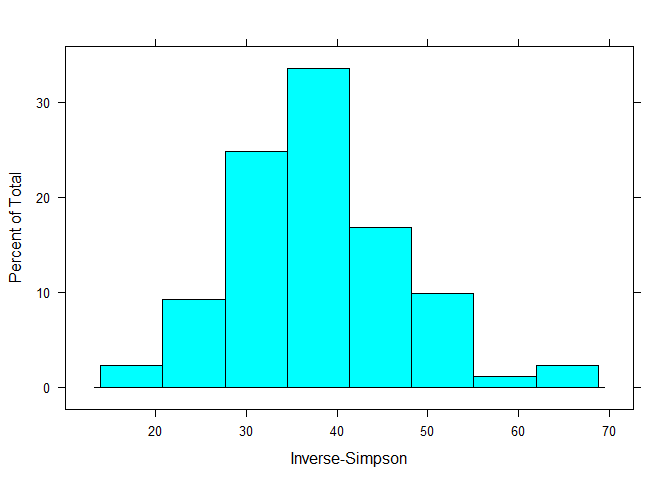
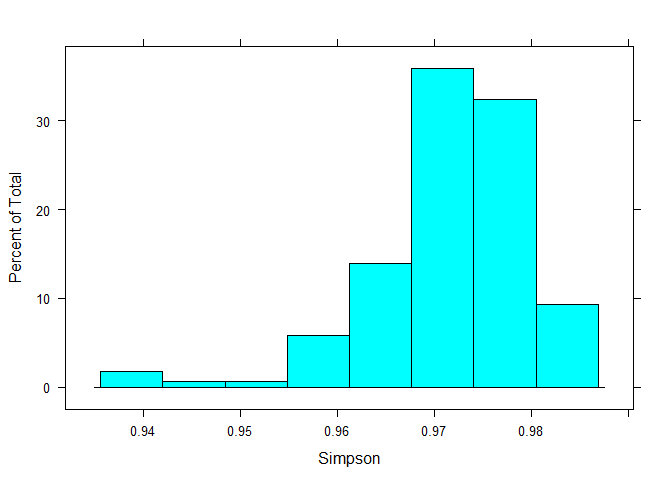
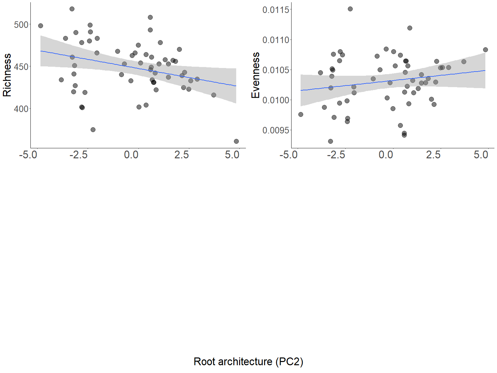
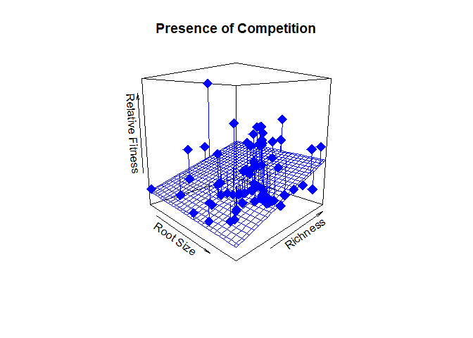

RhizMicrobiome\_GenusLevel
================
Sara Colom
2/8/2020

  - [Sample sizes](#sample-sizes)
      - [Table sample number by species and
        treatment](#table-sample-number-by-species-and-treatment)
      - [Table number of maternal line per
        species](#table-number-of-maternal-line-per-species)
  - [Load Libraries](#load-libraries)
  - [Read in Data](#read-in-data)
      - [Sequence depth and pruning](#sequence-depth-and-pruning)
  - [Community Composition](#community-composition)
      - [Beta Diversity](#beta-diversity)
  - [PERMANOVA (Table 2)](#permanova-table-2)
      - [Test for differently abundant
        OTUs](#test-for-differently-abundant-otus)
          - [Visualize the different groups at the family
            level](#visualize-the-different-groups-at-the-family-level)
      - [Testing if different at the phylum
        level](#testing-if-different-at-the-phylum-level)
      - [Family level](#family-level)
      - [Alpha Diversity](#alpha-diversity)
      - [Alpha Diversity](#alpha-diversity-1)
          - [Note: Measures of
            alpha-diversity](#note-measures-of-alpha-diversity)
      - [Test for differences](#test-for-differences)
  - [Alpha Diversity distribution](#alpha-diversity-distribution)
  - [Linear mixed models](#linear-mixed-models)
  - [ANOVA Test for treatment within I. purpurea (Table
    1)](#anova-test-for-treatment-within-i-purpurea-table-1)
  - [Correlations with root traits](#correlations-with-root-traits)
      - [Prep root data](#prep-root-data)
      - [Within species (root traits and
        alphadiv)](#within-species-root-traits-and-alphadiv)
      - [Plotting significant linear associations (Table
        3)](#plotting-significant-linear-associations-table-3)
      - [Linear mixed models (not
        reported)](#linear-mixed-models-not-reported)
      - [Selection on microbe
        variables](#selection-on-microbe-variables)
          - [Selection on richness](#selection-on-richness)
          - [Selection on Inverse
            Simpson](#selection-on-inverse-simpson)
      - [Selection on Simpson](#selection-on-simpson)
      - [Selection on Evenness](#selection-on-evenness)
  - [ANCOVA](#ancova)
  - [Plotting 3D Plane](#plotting-3d-plane)
  - [Quadratic relationships w
    fitness](#quadratic-relationships-w-fitness)
  - [Quadratic w Root Size](#quadratic-w-root-size)
  - [MANTEL (Table 4)](#mantel-table-4)
      - [MANTEL between Bray Curtis and Relative
        Fitnesses](#mantel-between-bray-curtis-and-relative-fitnesses)
      - [MANTEL PARTIAL REGRESSION: between Bray Curtis and ROOTS onto
        Relative
        Fitnesses](#mantel-partial-regression-between-bray-curtis-and-roots-onto-relative-fitnesses)

## Sample sizes

### Table sample number by species and treatment

| Species      | Treatment   | N  |
| ------------ | ----------- | -- |
| I. purpurea  | Alone       | 27 |
| I. purpurea  | Competition | 78 |
| I. hederacea | Competition | 78 |

### Table number of maternal line per species

| Species      | Number of ML |
| ------------ | ------------ |
| I. purpurea  | 10           |
| I. hederacea | 5            |

# Load Libraries

``` r
library(phyloseq)
library(ggplot2)
library(ape)
library(vegan)
library(plyr)
library(dplyr)
library(scales)
library(grid)
library(reshape2)
library(pegas)
library(pgirmess)
library(multcomp)
library(multcompView)
library(ggpubr)
library(ggcorrplot)
library(RColorBrewer)
library(plotly)
library(ggthemes)
library(corrplot)
library(Hmisc)
library(emmeans)
library(lmerTest)


source("miSeq.R")

# Aesthetics
Tx<-theme(axis.text.y = element_text(size = 20),
          axis.title.y = element_text(size = 20)) +
          theme(axis.text.x = element_text(vjust = 1, hjust=1, angle=0, size = 20),
          axis.title.x = element_text(angle=0, size = 20),
          plot.title=element_text(size = 25,hjust=0))

# Margins
Margin<-theme(
  panel.background = element_rect(fill = "white"),
  plot.margin = margin(2, 2, 2, 2, "cm"),
  plot.background = element_rect(
    fill = "white",
    colour = "black",
    size = 1
  )
)

# Aesthetics
Tx2<-theme(axis.text.y = element_text(size = 20),
          axis.title.y = element_text(size = 25)) +
          theme(axis.text.x = element_text(vjust = 1, hjust=1, size = 25),
          axis.title.x = element_text(size = 25),
          plot.title=element_text(size = 25,hjust=0))

GoldGrey=c("#F1CE63", "#79706E")
GreenBlue=c("#59A14F", "#4E79A7")
```

# Read in Data

``` r
### loading mothur output with FWDB+silva taxonomy and sample metadata. 
### Experiments run in 


sharedfile <- "../DataSets/stability.trim.contigs.good.unique.good.filter.unique.precluster.pick.pick.opti_mcc.shared"
taxfile <- "../DataSets/stability.trim.contigs.good.unique.good.filter.unique.precluster.pick.pick.opti_mcc.0.03.cons.taxonomy"

mothurdata <- import_mothur(mothur_shared_file = sharedfile, mothur_constaxonomy_file = taxfile)

sampledata <- read.csv('../DataSets/MetaDataTest.csv')

SAMPLE <- sampledata
row.names(SAMPLE)=SAMPLE$Sample_ID

SAMPLE <- subset(SAMPLE, SAMPLE$TRT == "Alone"|SAMPLE$TRT == "Inter")
SAMPLE <- sample_data(SAMPLE)

### create phyloseq object
physeq.all <- merge_phyloseq(mothurdata, SAMPLE) # Modified version worked


### We need to change the taxonomy names: when using the fwdb taxonomy we need to add different headers after removing the last column, which contains no information except for 1 Verrucomicrobia taxon

#   tax_table(physeq.all) <- tax_table(physeq.all)[,-7] # this removes the final column
colnames(tax_table(physeq.all))<-c("Kingdom", "Phylum", "Class", "Order", "Family", "Genus")


#   tax_table(physeq.all) <-cbind(tax_table(physeq.all),row.names(tax_table(physeq.all)))

### removing non-bacterial reads (was already done in mothur, but just to be safe after merging taxonomies)
#   physeq.all <- subset_taxa(physeq.all, Kingdom == "Bacteria")
```

``` r
## Aggregate at the genus level, then saving ea componant externally to reload and save time.

        # physeq_genus <- physeq.all %>%
         #tax_glom(taxrank = "Genus") 

        # otu=data.frame(otu_table(physeq_genus))
        
        # meta=data.frame(sample_data(physeq_genus))
        # tax=data.frame(tax_table(physeq_genus))
        
        # write.csv(x = otu,file = "otu_table.csv",row.names = TRUE)
        # write.csv(x = tax,file = "tax_table.csv")# 
        # write.csv(x = meta,file = "sample_table.csv",row.names = F)


otu <- read.csv("../DataSets/otu_table.csv", row.names = 1)

colnames(otu) <- gsub('X', "", colnames(otu))

otu <- otu_table(otu, taxa_are_rows = TRUE)


tax <- read.csv('../DataSets/tax_table.csv', row.names = 1)
taxRows <- row.names(tax)
taxCols <- colnames(tax)
tax <- tax_table(as.matrix(tax))

#row.names(tax)=taxRows
#colnames(tax)=taxCols


meta <- read.csv('../DataSets/MetaDataTest.csv')
namesKeep <- colnames(otu)

row.names(meta) <- meta$Sample_ID

meta <- meta[which(meta$Sample_ID %in% namesKeep), ]

meta <- sample_data(meta)
   
physeq_genus <- merge_phyloseq(otu, tax, meta)
```

``` r
### ADD THE PROTEOBACTERIA CLASSES TO THE PHYLA NAME FIELD IN PHYLOSEQ OBJECT TAXONOMY 

phy <- data.frame(tax_table(physeq_genus))
Phylum <- as.character(phy$Phylum)
Class <- as.character(phy$Class)
for  (i in 1:length(Phylum)){ 
  if (Phylum[i] == "Proteobacteria"){
    if (Class[i] == "unclassified"){
      Phylum[i] <- Phylum[i]       
    } else {
      Phylum[i] <- Class[i]
    }
  } 
}


Phylum <- as.character(phy$Phylum)
Class <- as.character(phy$Class)
phy$Phylum <- Phylum
t <- tax_table(as.matrix(phy))
```

## Sequence depth and pruning

``` r
physeq <- (physeq.all2)
physeq <- prune_taxa(taxa_sums(physeq) > 0, physeq) # Remove taxa with no counts

#check number of reads in each sample, differences in count are in part due differet numbers of chlorophyl reads depending on time of experiment

# Make a data frame with a column for the read counts of each sample
sample_sum_df <- data.frame(sum = sample_sums(physeq))

# Histogram of sample read counts
ggplot(sample_sum_df, aes(x = sum)) + 
  geom_histogram(color = "black", fill = "#59A14F", binwidth = 2500) +
  ggtitle("Distribution of sample sequencing depth") + 
  xlab("Read counts") +
  theme(axis.title.y = element_blank()) +
  theme_classic()
```

<!-- -->

``` r
# Scales reads to smallest library size 
source("https://raw.githubusercontent.com/michberr/MicrobeMiseq/master/R/miseqR.R")
#physeq.scale <- scale_reads(physeq, min(sample_sums(physeq)))

##### Normalization #######

# Scales reads by 
# 1) taking proportions,
# 2) multiplying by a given library size of n
# 3) rounding down

physeq1 <- prune_samples(sample_sums(physeq) > 20000, physeq)

sample_sum_df1 <- data.frame(sum = sample_sums(physeq1))

# Histogram of sample read counts
ggplot(sample_sum_df1, aes(x = sum)) + 
  geom_histogram(color = "black", fill = "#59A14F", binwidth = 2500) +
  ggtitle("Distribution of sample sequencing depth after pruning") + 
  xlab("Read counts") +
  theme(axis.title.y = element_blank()) +
  theme_classic()
```

<!-- -->

``` r
n <- min(sample_sums(physeq1))
  physeq.scale <-
    transform_sample_counts(physeq1, function(x) {
      (n * x/sum(x))  # Transform to rel. abundance
    })
  
physeq.scale <- prune_taxa(taxa_sums(physeq.scale) > 0, physeq.scale)


physeq1
```

    ## phyloseq-class experiment-level object
    ## otu_table()   OTU Table:         [ 1098 taxa and 173 samples ]
    ## sample_data() Sample Data:       [ 173 samples by 9 sample variables ]
    ## tax_table()   Taxonomy Table:    [ 1098 taxa by 6 taxonomic ranks ]

# Community Composition

## Beta Diversity

``` r
# Beta diversity pcoa Bray-Curtis DNA only 
physeq.pcoa <-
  ordinate(
    physeq = physeq.scale,
    method = "PCoA",
    distance = "bray"
  )

physeq.pcoa.vectors <- data.frame(physeq.pcoa$vectors[, 1:4])

physeq.pcoa.vectors$Duplicates <- row.names(physeq.pcoa.vectors)

SampData <- data.frame(sample_data(physeq))

colnames(SampData)[1] <- "Duplicates"

SampData <- subset(SampData, SampData$TRT == "Inter"|SampData$TRT == "Alone")

physeq.pcoa.df <- droplevels(merge(physeq.pcoa.vectors, SampData,by="Duplicates"))

bray_values <- physeq.pcoa$values
bray_rel_eigens <- bray_values$Relative_eig

bray_rel_eigen1 <- bray_rel_eigens[1]
bray_rel_eigen1_percent <- round(bray_rel_eigen1 * 100, digits = 1)

bray_rel_eigen2 <- bray_rel_eigens[2]
bray_rel_eigen2_percent <- round(bray_rel_eigen2 * 100, digits = 1)

bray_rel_eigen3 <- bray_rel_eigens[3]
bray_rel_eigen3_percent <- round(bray_rel_eigen3 * 100, digits = 1)

bray_rel_eigen4 <- bray_rel_eigens[4]
bray_rel_eigen4_percent <- round(bray_rel_eigen4 * 100, digits = 1)

bray_rel_eigen5 <- bray_rel_eigens[5]
bray_rel_eigen5_percent <- round(bray_rel_eigen5 * 100, digits = 1)

# Prep axis labels & title
bray_axis1 <- paste("PCoA 1:",bray_rel_eigen1_percent, "%")
bray_axis2 <- paste("PCoA 2:",bray_rel_eigen2_percent, "%")
bray_axis3 <- paste("PCoA 3:",bray_rel_eigen3_percent, "%")
bray_axis4 <- paste("PCoA 4:",bray_rel_eigen4_percent, "%")
PCoA_title <- paste("Bray-Curtis, ",ntaxa(physeq.scale), "OTUs")


pcoa_exp_trt <- ggplot(physeq.pcoa.df, aes(Axis.1, Axis.2, color = TRT, fill = TRT)) +
  xlab(bray_axis1) + 
  ylab(bray_axis2) +
  geom_point(alpha = 0.9) + 
  theme_classic() +
  scale_fill_manual(values = c("#00B050", "grey"), "Treatment", labels = c("Alone", "Competition")) +
  scale_color_manual(values = c("#00B050", "grey"), "Treatment", labels = c("Alone", "Competition")) +
  stat_ellipse(geom = "polygon", alpha = 1/6, aes(fill = TRT)) +
  Tx +
  theme(axis.text.x = element_text(angle = 45), axis.text = element_text(color="black", size = 15,vjust = 0.5,hjust = 1))
#  scale_fill_discrete(name = "Treatment", labels = c("Alone", "Competition")) +
 # scale_color_discrete(name = "Treatment", labels = c("Alone", "Competition"))


pcoa_exp_trtA <- ggplot(physeq.pcoa.df, aes(Axis.3, Axis.4, color = TRT,fill = TRT)) +
  xlab(bray_axis3) + 
  ylab(bray_axis4) + 
  geom_point(alpha = 0.9) + 
  theme_classic() +
  scale_fill_manual(values = GoldGrey, "Treatment", labels = c("Alone", "Competition")) +
  scale_color_manual(values = GoldGrey, "Treatment", labels = c("Alone", "Competition")) +
  stat_ellipse(geom = "polygon", alpha = 1/6, aes(fill = TRT)) +
  Tx


pcoa_exp_sp <- ggplot(physeq.pcoa.df, aes(Axis.1, Axis.2, color = Species,fill = Species)) +
  xlab("") + 
  ylab(bray_axis2) +
  geom_point(alpha = 0.9) + 
  theme_classic() +
 scale_fill_manual(values = GreenBlue, "Species", labels = c("I. hederacea", "I. purpurea")) +
  scale_color_manual(values = GreenBlue, "Species", labels = c("I. hederacea", "I. purpurea")) +
   stat_ellipse(geom = "polygon", alpha = 1/6, aes(fill = Species)) +
  Tx


pcoa_exp_spA <- ggplot(physeq.pcoa.df, aes(Axis.3, Axis.4, color = Species,fill = Species)) +
  xlab("") + 
  ylab(bray_axis4) +
  geom_point(alpha = 0.9) + 
  theme_classic() +
  scale_fill_manual(values = GreenBlue, "Species", labels = c("I. hederacea", "I. purpurea")) +
  scale_color_manual(values = GreenBlue, "Species", labels = c("I. hederacea", "I. purpurea")) +
  stat_ellipse(geom = "polygon", alpha = 1/6, aes(fill = Species)) +
  Tx

A <- ggarrange(pcoa_exp_trt,pcoa_exp_trtA,common.legend = T, Labels = c("C", "D"),font.label = list(size = 15, color = "black", face =
  "plain"),hjust = -8,vjust = 1)

B <- ggarrange(pcoa_exp_sp,pcoa_exp_spA,common.legend = T, labels = c("A", "B"),font.label = list(size = 15, color = "black", face =
  "plain"),hjust = -8,vjust = 1)

MainFig <- ggarrange(B, A, nrow = 2)

annotate_figure(MainFig,
                top = text_grob(PCoA_title, face = "plain", size = 25, lineheight = 2)
)
```

<!-- -->

``` r
physeq.pcoa.df$TrtSp <- paste(physeq.pcoa.df$TRT, physeq.pcoa.df$Species, sep="")

p <- plot_ly(physeq.pcoa.df, x = ~Axis.1, y = ~Axis.2, z = ~Axis.3, color = ~TrtSp) %>%
  add_markers() %>%
  layout(scene = list(xaxis = list(title = bray_axis1),
                     yaxis = list(title = bray_axis2),
                     zaxis = list(title = bray_axis3)))


p1 <- plot_ly(physeq.pcoa.df, x = ~Axis.1, y = ~Axis.2, z = ~Axis.4, color = ~Species) %>%
  add_markers() %>%
  layout(scene = list(xaxis = list(title = bray_axis1),
                     yaxis = list(title = bray_axis2),
                     zaxis = list(title = bray_axis4)))

p3 <- plot_ly(physeq.pcoa.df, x = ~Axis.1, y = ~Axis.2, z = ~Axis.4, color = ~Species) %>%
  add_markers() %>%
  layout(scene = list(xaxis = list(title = bray_axis1),
                     yaxis = list(title = bray_axis3),
                     zaxis = list(title = bray_axis4)))
```

# PERMANOVA (Table 2)

``` r
## All experiment, add variable treatment, then species
sampledf <- data.frame(sample_data(physeq.scale))

physeq.purp = subset_samples(physeq.scale, Species == "Ip")

treatment <- sampledf %>% 
  filter(Species == "Ip") %>% 
  pull(TRT)

block <- sampledf %>% 
  filter(Species == "Ip") %>% 
  pull(Block)

adonis(otu_table(physeq.purp) %>% t ~ treatment + block, method = "bray")
```

    FALSE 
    FALSE Call:
    FALSE adonis(formula = otu_table(physeq.purp) %>% t ~ treatment + block,      method = "bray") 
    FALSE 
    FALSE Permutation: free
    FALSE Number of permutations: 999
    FALSE 
    FALSE Terms added sequentially (first to last)
    FALSE 
    FALSE           Df SumsOfSqs  MeanSqs F.Model      R2 Pr(>F)    
    FALSE treatment  1    0.0258 0.025835  0.8460 0.00796  0.534    
    FALSE block      3    0.3189 0.106312  3.4813 0.09826  0.001 ***
    FALSE Residuals 95    2.9011 0.030538         0.89378           
    FALSE Total     99    3.2459                  1.00000           
    FALSE ---
    FALSE Signif. codes:  0 '***' 0.001 '**' 0.01 '*' 0.05 '.' 0.1 ' ' 1

``` r
physeq.bray <- phyloseq::distance(physeq = physeq.scale, method = "bray")

# # # # # # # # # # # # # # # # # # # # # 
# Subsample for within I. purpurea only
# # # # # # # # # # # # # # # # # # # # # 

physeq.Purp <- subset_samples(physeq.scale, Species == "Ip")
sampledf.Purp<- data.frame(sample_data(physeq.Purp))

# Calculate bray curtis for summer samples only
physeq.Purp.bray <- phyloseq::distance(physeq = physeq.Purp, method = "bray")
```

## Test for differently abundant OTUs

### Visualize the different groups at the family level

``` r
# Check for 'core' microbiome members as the phylum level which taxa are present
# at 1 % overall abundance and at least 75% of samples 

PhylumGlom <- tax_glom(physeq.Purp,taxrank = "Phylum")
FamGlom <- tax_glom(physeq.Purp,taxrank = "Family")
ClassGlom <- tax_glom(physeq.Purp,taxrank = "Class")


coreTaxa <- filter_taxa(PhylumGlom, function(x) sum(x > 1) > (0.75 * length(x)), TRUE)

coreTaxaFamily <- filter_taxa(FamGlom, function(x) sum(x > 1) > (0.75 * length(x)), TRUE)

## Plot at phylum level


physeq1_phylumAlone <- coreTaxa  %>%
  subset_samples(TRT == "Alone")%>%
  transform_sample_counts(function(x) {x/sum(x)} ) %>% # Transform to rel. abundance
  psmelt()      


physeq1_phylumComp <- coreTaxa  %>%
  subset_samples(TRT != "Alone")%>%
  transform_sample_counts(function(x) {x/sum(x)} ) %>% # Transform to rel. abundance
  psmelt()       

physeq1_phylum <- rbind(physeq1_phylumAlone,physeq1_phylumComp)

# Melt to long format
physeq1_phylum <- physeq1_phylum[order(physeq1_phylum$Phylum), ] 

#colnames(physeq1_phylum)[13]="Phylum"

# Sort data frame alphabetically by phylum
# Set colors for plotting
phylum_colors <- c(
  "#CBD588", "#5F7FC7", "orange", "#DA5724", "#508578", "#CD9BCD",
   "#AD6F3B", "#673770", "#D14285", "#652926", "#C84248", 
  "#8569D5", "#5E738F", "#D1A33D", "#8A7C64", "#599861"
)


#colnames(physeq1_phylum)[which(names(physeq1_phylum)%in%"Rank2")]="Phylum"

# Plot 
ggplot(physeq1_phylum, aes(x = TRT, y = Abundance, fill = Phylum)) + 
  geom_bar(stat = "identity",position='dodge') +
  #scale_fill_manual(values = phylum_colors) +
  theme(axis.title.x = element_blank()) + 
  ylab("Relative Abundance (Phyla > 75 %) \n") +
  ggtitle("Phylum Composition  \n Bacterial Communities by Sampling per Treatment") +
  theme_classic() +
  ylab("Relative Abundance")
```

<!-- -->

## Testing if different at the phylum level

``` r
PhlyaList <- as.list(unique(physeq1_phylum$Phylum))

KrusMicrTest <- function(Microbe){
  Result = kruskal.test(Abundance ~ TRT, data = physeq1_phylum[which(physeq1_phylum$Phylum == Microbe),]) 

ResDf <- data.frame("ChiSq" = Result$statistic, "Pval"=Result$p.value, "Phylum" = paste(Microbe))  
  return(ResDf)  
}

AllResults <- lapply(PhlyaList, KrusMicrTest)
KruskalRes <- do.call('rbind', AllResults)
```

## Family level

``` r
# Family level
physeq1_FamilyAlone <- coreTaxaFamily  %>%
  subset_samples(TRT == "Alone")%>%
  transform_sample_counts(function(x) {x/sum(x)} ) %>% # Transform to rel. abundance
  psmelt()                                      # Melt to long format

physeq1_FamilyComp <- coreTaxaFamily  %>%
  subset_samples(TRT != "Alone")%>%
  transform_sample_counts(function(x) {x/sum(x)} ) %>% # Transform to rel. abundance
  psmelt()       

physeq1_Family <- rbind(physeq1_FamilyAlone,physeq1_FamilyComp)


FamList <- as.list(unique(physeq1_Family$Family))

KrusMicrTest<-function(Microbe){
  Result <- kruskal.test(Abundance ~ TRT, data = physeq1_Family[which(physeq1_Family$Family == Microbe), ]) 

ResDf <- data.frame("ChiSq" = Result$statistic, "Pval"= Result$p.value, "Family" = paste(Microbe))  
  return(ResDf)  
}

AllResultsFamily <- lapply(FamList, KrusMicrTest)
KruskalResFamily <- do.call('rbind', AllResultsFamily)

KruskalResFamily %>% 
  filter(Pval < 0.055)
```

    ##                                  ChiSq        Pval          Family
    ## Kruskal-Wallis chi-squared54  5.192655 0.022682540   Subgroup_2_fa
    ## Kruskal-Wallis chi-squared69  3.904351 0.048161234     Gaiellaceae
    ## Kruskal-Wallis chi-squared139 3.752445 0.052730323  Lineage_IIa_fa
    ## Kruskal-Wallis chi-squared177 4.186783 0.040740338          SM2D12
    ## Kruskal-Wallis chi-squared180 4.509080 0.033715377        AKYG1722
    ## Kruskal-Wallis chi-squared181 3.904351 0.048161234 Microtrichaceae
    ## Kruskal-Wallis chi-squared207 8.682062 0.003213572           A0839

``` r
# Do false discovery rate for mulitple corrections

KruskalResFamily$AdjPval <- p.adjust(KruskalResFamily$Pval, method = "fdr", n = 213)
```

## Alpha Diversity

``` r
hist(sample_sums(physeq1))
```

<!-- -->

``` r
# Remove sample with less than 20K reads, this looks WAAAY off
# Rarify first
ps.rarefied <- rarefy_even_depth(physeq1, rngseed = 1, sample.size = min(sample_sums(physeq1)), replace = F)

plot_richness(ps.rarefied,x = "TRT",measures = c("Observed", "Shannon")) +
  geom_boxplot() +
  theme_classic()
```

<!-- -->

## Alpha Diversity

#### Note: Measures of alpha-diversity

*_Inverse Simpson_* it is an indication of the richness in a community
with uniform evenness that would have the same level of diversity. So
while measures such as the Shannon index are somewhat abstract, the
inverse of the Simpson index has some biological interpretation. Other
advantages of the Simpson-based metrics are that they do not tend to be
as affected by sampling effort as the Shannon index.

  - *_Species richness_* is simply a count of species, and it does not
    take into account the abundances of the species or their relative
    abundance distributions.

  - *_Simpson’s Diversity Index_* is a measure of diversity which takes
    into account the number of species present, as well as the relative
    abundance of each species. As species richness and evenness
    increase, so diversity increases.

<!-- end list -->

``` r
### I commented out the subsampling to save time. The matrices produced were saved and then reoponed from their tab delmited formats into corresponding matrices.

set.seed(3)

r <- rarefy_even_depth(physeq1, sample.size = n, verbose = FALSE, replace = TRUE)
         
 ## Calculate richness
rich <- as.numeric(as.matrix(estimate_richness(r, measures = "Observed")))

## Calculate Inverse Simpson

simp <- as.numeric(as.matrix(estimate_richness(r, measures = "InvSimpson")))

sim<- as.numeric(as.matrix(estimate_richness(r, measures = "Simpson")))

s <- rarefy_even_depth(physeq1, sample.size = n, verbose = FALSE, replace = TRUE)

shan <- as.numeric(as.matrix(estimate_richness(r, measures = "Shannon")))

InvSimp <- simp
```

``` r
# Create a new dataframe to hold the means and standard deviations of richness estimates

length(rich)
```

    ## [1] 173

``` r
Sample_ID <- sample_names(physeq1)
Block <- sample_data(physeq1)$Block
Species <-sample_data(physeq1)$Species
TRT <- sample_data(physeq1)$TRT
Combos <-sample_data(physeq1)$Combos
ML <- sample_data(physeq1)$ML

alpha <- data.frame(Sample_ID,ML, Block, TRT, Species, Combos, rich, InvSimp, sim, shan)

alpha$even <- alpha$shan/alpha$rich

# DO VIOLIN PLOT HERE!!!


p <- ggplot(alpha %>% filter(TRT == "Inter"), aes(x = Species, y = rich)) +
  geom_violin(trim = FALSE, aes(fill = Species), alpha = 0.3) + 
  geom_dotplot(binaxis = 'y', stackdir = 'center', dotsize = 1, aes(color = Species, fill = Species)) +
  theme_classic() +
  scale_color_brewer(palette = "Paired") +
  scale_fill_brewer(palette = "Paired") +
  ggtitle("Mean Species Richness")


q <- ggplot(alpha %>% filter(TRT == "Inter"), aes(x = Species, y = InvSimp)) +
  geom_violin(trim = FALSE, aes(fill = Species), alpha = 0.3) + 
  geom_dotplot(binaxis = 'y', stackdir = 'center', dotsize = 1, aes(color = Species, fill = Species)) +
  theme_classic() +
  scale_color_brewer(palette = "Paired") +
  scale_fill_brewer(palette = "Paired") +
  ggtitle("Mean Species Inverse Simpson") +
  ylab("")


t <- ggplot(alpha %>% filter(TRT == "Inter"), aes(x = Species, y = sim)) +
  geom_violin(trim = FALSE, aes(fill=Species), alpha = 0.3) + 
  geom_dotplot(binaxis = 'y', stackdir = 'center', dotsize = 1, aes(color = Species, fill = Species)) +
  theme_classic() +
  scale_color_brewer(palette = "Paired") +
  scale_fill_brewer(palette = "Paired") +
  ggtitle("Mean Simpson") +
  ylab("")

v <- ggplot(alpha %>% filter(TRT == "Inter"), aes(x = Species, y = even)) +
  geom_violin(trim = FALSE, aes(fill = Species), alpha = 0.3) + 
  geom_dotplot(binaxis = 'y', stackdir = 'center', dotsize = 1, aes(color = Species, fill = Species)) +
  theme_classic() +
  scale_color_brewer(palette = "Paired") +
  scale_fill_brewer(palette = "Paired") +
  ggtitle("Mean Evenness") +
  ylab("")


ggarrange(p, q, t, v, common.legend = T, ncol = 2, nrow = 2)
```

    ## `stat_bindot()` using `bins = 30`. Pick better value with `binwidth`.
    ## `stat_bindot()` using `bins = 30`. Pick better value with `binwidth`.
    ## `stat_bindot()` using `bins = 30`. Pick better value with `binwidth`.
    ## `stat_bindot()` using `bins = 30`. Pick better value with `binwidth`.
    ## `stat_bindot()` using `bins = 30`. Pick better value with `binwidth`.

<!-- -->

``` r
      ### Treatment

pT <- ggplot(alpha %>% filter(Species == "Ip"), aes(x = TRT, y = rich)) +
  geom_violin(trim = FALSE, aes(fill = TRT), alpha = 0.3) + 
  geom_dotplot(binaxis = 'y', stackdir = 'center', dotsize = 1, aes(color = TRT,fill = TRT)) +
  theme_classic() +
  scale_color_manual(values = c("#B2DF8A", "#fee090")) +
  scale_fill_manual(values = c("#B2DF8A", "#fee090")) +
  ggtitle("Mean Treatment Richness")


qT <- ggplot(alpha %>% filter(Species == "Ip"), aes(x = TRT, y = InvSimp)) +
  geom_violin(trim = FALSE, aes(fill = TRT), alpha = 0.3) + 
  geom_dotplot(binaxis = 'y', stackdir = 'center', dotsize=1, aes(color = TRT, fill = TRT)) +
  theme_classic() +
  scale_color_manual(values = c("#B2DF8A", "#fee090")) +
  scale_fill_manual(values = c("#B2DF8A", "#fee090")) +
  ggtitle("Mean Treatment Inverse Simpson") +
  ylab(" ")

ggarrange(pT, qT, common.legend = T)
```

    ## `stat_bindot()` using `bins = 30`. Pick better value with `binwidth`.
    ## `stat_bindot()` using `bins = 30`. Pick better value with `binwidth`.
    ## `stat_bindot()` using `bins = 30`. Pick better value with `binwidth`.

<!-- -->

## Test for differences

# Alpha Diversity distribution

``` r
# first check for normality. To test for normalcy statistically, we can run the Shapiro-Wilk test of normality.

shapiro.test(alpha$rich) # Not normal
```

    FALSE 
    FALSE   Shapiro-Wilk normality test
    FALSE 
    FALSE data:  alpha$rich
    FALSE W = 0.98976, p-value = 0.248

``` r
shapiro.test(alpha$even) # Normal
```

    FALSE 
    FALSE   Shapiro-Wilk normality test
    FALSE 
    FALSE data:  alpha$even
    FALSE W = 0.98147, p-value = 0.02095

``` r
shapiro.test(alpha$sim) # Normal
```

    FALSE 
    FALSE   Shapiro-Wilk normality test
    FALSE 
    FALSE data:  alpha$sim
    FALSE W = 0.90285, p-value = 2.957e-09

``` r
histogram(alpha$rich,xlab = "Richness") # Note richness though, not normal, looks close to normal.
```

<!-- -->

``` r
histogram(alpha$InvSimp, xlab = "Inverse-Simpson")
```

<!-- -->

``` r
histogram(alpha$sim, xlab = "Simpson")
```

<!-- -->

# Linear mixed models

``` r
# Test for treatment within I. purpurea


RichLmm <- lmer(rich ~ TRT + Block + (1|Block:ML), alpha %>% filter(Species == "Ip"))

InvLmm <- lmer(InvSimp ~ TRT + Block + (1|Block:ML), alpha %>% filter(Species == "Ip"))

SimLmm <- lmer(sim ~ TRT + Block + (1|Block:ML), alpha %>% filter(Species == "Ip"))

EvenLmm <- lmer(even ~ TRT + Block + (1|Block:ML), alpha %>% filter(Species == "Ip"))

anova(RichLmm)
```

    ## Type III Analysis of Variance Table with Satterthwaite's method
    ##        Sum Sq Mean Sq NumDF  DenDF F value   Pr(>F)   
    ## TRT     722.5   722.5     1 86.835  0.8307 0.364582   
    ## Block 14285.4  4761.8     3 27.740  5.4751 0.004382 **
    ## ---
    ## Signif. codes:  0 '***' 0.001 '**' 0.01 '*' 0.05 '.' 0.1 ' ' 1

``` r
ranova(RichLmm)
```

    ## ANOVA-like table for random-effects: Single term deletions
    ## 
    ## Model:
    ## rich ~ TRT + Block + (1 | Block:ML)
    ##                npar  logLik    AIC     LRT Df Pr(>Chisq)
    ## <none>            7 -466.25 946.49                      
    ## (1 | Block:ML)    6 -466.38 944.75 0.26058  1     0.6097

``` r
anova(InvLmm)
```

    ## Type III Analysis of Variance Table with Satterthwaite's method
    ##       Sum Sq Mean Sq NumDF  DenDF F value  Pr(>F)  
    ## TRT     2.59   2.587     1 80.632  0.0339 0.85435  
    ## Block 654.09 218.030     3 23.898  2.8583 0.05823 .
    ## ---
    ## Signif. codes:  0 '***' 0.001 '**' 0.01 '*' 0.05 '.' 0.1 ' ' 1

``` r
ranova(InvLmm)
```

    ## ANOVA-like table for random-effects: Single term deletions
    ## 
    ## Model:
    ## InvSimp ~ TRT + Block + (1 | Block:ML)
    ##                npar  logLik    AIC    LRT Df Pr(>Chisq)
    ## <none>            7 -354.65 723.29                     
    ## (1 | Block:ML)    6 -355.47 722.95 1.6554  1     0.1982

``` r
anova(SimLmm)
```

    ## Type III Analysis of Variance Table with Satterthwaite's method
    ##           Sum Sq    Mean Sq NumDF  DenDF F value Pr(>F)
    ## TRT   2.9109e-05 2.9109e-05     1 77.631  0.5805 0.4484
    ## Block 2.9617e-04 9.8724e-05     3 22.199  1.9687 0.1479

``` r
ranova(SimLmm)
```

    ## ANOVA-like table for random-effects: Single term deletions
    ## 
    ## Model:
    ## sim ~ TRT + Block + (1 | Block:ML)
    ##                npar logLik     AIC    LRT Df Pr(>Chisq)
    ## <none>            7 319.98 -625.96                     
    ## (1 | Block:ML)    6 318.89 -625.79 2.1764  1     0.1401

``` r
anova(EvenLmm)
```

    ## Type III Analysis of Variance Table with Satterthwaite's method
    ##           Sum Sq    Mean Sq NumDF  DenDF F value   Pr(>F)   
    ## TRT   4.6400e-08 4.6370e-08     1 89.780  0.2445 0.622164   
    ## Block 3.4367e-06 1.1455e-06     3 34.653  6.0411 0.002016 **
    ## ---
    ## Signif. codes:  0 '***' 0.001 '**' 0.01 '*' 0.05 '.' 0.1 ' ' 1

``` r
ranova(EvenLmm)
```

    ## ANOVA-like table for random-effects: Single term deletions
    ## 
    ## Model:
    ## even ~ TRT + Block + (1 | Block:ML)
    ##                npar logLik   AIC     LRT Df Pr(>Chisq)
    ## <none>            7 591.53 -1169                      
    ## (1 | Block:ML)    6 591.48 -1171 0.08574  1     0.7697

# ANOVA Test for treatment within I. purpurea (Table 1)

``` r
alpha.purp <- alpha %>% filter(Species == "Ip")

aov.Richness <- lm(rich ~ TRT + Block, alpha.purp)
aov.simpsonInv <- lm(InvSimp ~ TRT + Block, alpha.purp)
aov.simpson <- lm(sim ~ TRT + Block, alpha.purp)
aov.evenness <- lm(even ~ TRT + Block, alpha.purp)
aov.shannon <- lm(shan ~ TRT + Block, alpha.purp)


#Call for the summary of that ANOVA, which will include P-values
anova(aov.Richness)
```

    FALSE Analysis of Variance Table
    FALSE 
    FALSE Response: rich
    FALSE           Df Sum Sq Mean Sq F value    Pr(>F)    
    FALSE TRT        1    489   489.3  0.5375 0.4652822    
    FALSE Block      3  17153  5717.7  6.2813 0.0006192 ***
    FALSE Residuals 95  86476   910.3                      
    FALSE ---
    FALSE Signif. codes:  0 '***' 0.001 '**' 0.01 '*' 0.05 '.' 0.1 ' ' 1

``` r
anova(aov.simpsonInv)
```

    FALSE Analysis of Variance Table
    FALSE 
    FALSE Response: InvSimp
    FALSE           Df Sum Sq Mean Sq F value  Pr(>F)  
    FALSE TRT        1    0.2    0.16  0.0018 0.96612  
    FALSE Block      3 1019.7  339.91  3.8562 0.01187 *
    FALSE Residuals 95 8373.8   88.14                  
    FALSE ---
    FALSE Signif. codes:  0 '***' 0.001 '**' 0.01 '*' 0.05 '.' 0.1 ' ' 1

``` r
anova(aov.simpson)
```

    FALSE Analysis of Variance Table
    FALSE 
    FALSE Response: sim
    FALSE           Df    Sum Sq    Mean Sq F value  Pr(>F)  
    FALSE TRT        1 0.0000255 2.5540e-05  0.4244 0.51632  
    FALSE Block      3 0.0004895 1.6315e-04  2.7112 0.04933 *
    FALSE Residuals 95 0.0057168 6.0177e-05                  
    FALSE ---
    FALSE Signif. codes:  0 '***' 0.001 '**' 0.01 '*' 0.05 '.' 0.1 ' ' 1

``` r
anova(aov.evenness)
```

    FALSE Analysis of Variance Table
    FALSE 
    FALSE Response: even
    FALSE           Df     Sum Sq    Mean Sq F value    Pr(>F)    
    FALSE TRT        1 3.4700e-08 3.4720e-08  0.1792 0.6729822    
    FALSE Block      3 3.7634e-06 1.2545e-06  6.4766 0.0004908 ***
    FALSE Residuals 95 1.8401e-05 1.9369e-07                      
    FALSE ---
    FALSE Signif. codes:  0 '***' 0.001 '**' 0.01 '*' 0.05 '.' 0.1 ' ' 1

``` r
# No significant differences
```

# Correlations with root traits

## Prep root data

``` r
RootData <- read.csv("../DataSets/RootTraits_PCs.csv")

RootAlphaObs <- merge(alpha, RootData[c("Sample_ID", "PC1", "PC2", "PC3", "PC4")])
```

## Within species (root traits and alphadiv)

``` r
library(multcomp)

#summary(glht(SimpInvPC1, mcp(rank="Tukey")))

#################################################################
##################### SUBSET for I.purpurea #####################
#################################################################


RootAlphaPurp <- droplevels(RootAlphaObs %>% filter(Species == "Ip"))
RootAlphaPurp$Comp <- sub(".*\\-", "", RootAlphaPurp$Combos)

### Linear regressions

SimpPC1 <- lm(sim ~ PC1 + Block + TRT, RootAlphaPurp) 
summary(SimpPC1)
```

    ## 
    ## Call:
    ## lm(formula = sim ~ PC1 + Block + TRT, data = RootAlphaPurp)
    ## 
    ## Residuals:
    ##       Min        1Q    Median        3Q       Max 
    ## -0.025913 -0.004089  0.001551  0.005449  0.010946 
    ## 
    ## Coefficients:
    ##              Estimate Std. Error t value Pr(>|t|)    
    ## (Intercept)  0.977714   0.003803 257.090   <2e-16 ***
    ## PC1          0.001396   0.001236   1.130    0.264    
    ## Block2      -0.004774   0.010191  -0.468    0.641    
    ## Block3      -0.009040   0.010696  -0.845    0.402    
    ## Block4      -0.001657   0.002590  -0.640    0.525    
    ## TRTInter    -0.004250   0.002428  -1.751    0.086 .  
    ## ---
    ## Signif. codes:  0 '***' 0.001 '**' 0.01 '*' 0.05 '.' 0.1 ' ' 1
    ## 
    ## Residual standard error: 0.008047 on 51 degrees of freedom
    ## Multiple R-squared:  0.1316, Adjusted R-squared:  0.04647 
    ## F-statistic: 1.546 on 5 and 51 DF,  p-value: 0.1923

``` r
SimpInvPC1 <- lm(InvSimp ~ PC1 + Comp + TRT + Block, RootAlphaPurp) 
summary(SimpInvPC1)
```

    ## 
    ## Call:
    ## lm(formula = InvSimp ~ PC1 + Comp + TRT + Block, data = RootAlphaPurp)
    ## 
    ## Residuals:
    ##      Min       1Q   Median       3Q      Max 
    ## -15.1824  -6.8687  -0.0265   6.3398  19.2896 
    ## 
    ## Coefficients: (1 not defined because of singularities)
    ##                  Estimate Std. Error t value Pr(>|t|)    
    ## (Intercept)        42.913      4.388   9.779 5.24e-13 ***
    ## PC1                 1.164      1.431   0.814    0.420    
    ## CompPA 4.12 Ihed   -2.807      3.624  -0.775    0.442    
    ## CompPA 4.15 Ihed   -0.445      3.658  -0.122    0.904    
    ## CompPA 4.2 Ihed    -9.861      4.166  -2.367    0.022 *  
    ## CompPA 4.3 Ihed    -3.453      4.029  -0.857    0.396    
    ## TRTInter               NA         NA      NA       NA    
    ## Block2             -2.257     11.804  -0.191    0.849    
    ## Block3             -5.930     12.381  -0.479    0.634    
    ## Block4             -2.485      2.987  -0.832    0.410    
    ## ---
    ## Signif. codes:  0 '***' 0.001 '**' 0.01 '*' 0.05 '.' 0.1 ' ' 1
    ## 
    ## Residual standard error: 9.223 on 48 degrees of freedom
    ## Multiple R-squared:  0.2152, Adjusted R-squared:  0.08438 
    ## F-statistic: 1.645 on 8 and 48 DF,  p-value: 0.137

``` r
RichPC1 <- lm(rich ~ PC1 + Block + TRT, RootAlphaPurp) 
summary(RichPC1)
```

    ## 
    ## Call:
    ## lm(formula = rich ~ PC1 + Block + TRT, data = RootAlphaPurp)
    ## 
    ## Residuals:
    ##     Min      1Q  Median      3Q     Max 
    ## -69.028 -16.083   5.175  20.745  51.125 
    ## 
    ## Coefficients:
    ##             Estimate Std. Error t value Pr(>|t|)    
    ## (Intercept) 461.3236    13.9640  33.037   <2e-16 ***
    ## PC1           3.3914     4.5387   0.747    0.458    
    ## Block2       -7.9641    37.4211  -0.213    0.832    
    ## Block3       -3.3032    39.2724  -0.084    0.933    
    ## Block4        0.3686     9.5104   0.039    0.969    
    ## TRTInter    -14.7918     8.9143  -1.659    0.103    
    ## ---
    ## Signif. codes:  0 '***' 0.001 '**' 0.01 '*' 0.05 '.' 0.1 ' ' 1
    ## 
    ## Residual standard error: 29.55 on 51 degrees of freedom
    ## Multiple R-squared:  0.1565, Adjusted R-squared:  0.07382 
    ## F-statistic: 1.893 on 5 and 51 DF,  p-value: 0.1119

``` r
EvenPC1 <- lm(even ~ PC1 + Block + TRT , RootAlphaPurp) 
summary(EvenPC1)
```

    ## 
    ## Call:
    ## lm(formula = even ~ PC1 + Block + TRT, data = RootAlphaPurp)
    ## 
    ## Residuals:
    ##        Min         1Q     Median         3Q        Max 
    ## -8.393e-04 -2.697e-04  1.163e-05  2.727e-04  1.151e-03 
    ## 
    ## Coefficients:
    ##               Estimate Std. Error t value Pr(>|t|)    
    ## (Intercept)  1.035e-02  2.014e-04  51.383   <2e-16 ***
    ## PC1         -1.488e-06  6.547e-05  -0.023    0.982    
    ## Block2      -1.341e-04  5.398e-04  -0.248    0.805    
    ## Block3      -3.566e-04  5.665e-04  -0.629    0.532    
    ## Block4      -1.274e-04  1.372e-04  -0.929    0.357    
    ## TRTInter     1.062e-04  1.286e-04   0.826    0.413    
    ## ---
    ## Signif. codes:  0 '***' 0.001 '**' 0.01 '*' 0.05 '.' 0.1 ' ' 1
    ## 
    ## Residual standard error: 0.0004262 on 51 degrees of freedom
    ## Multiple R-squared:  0.101,  Adjusted R-squared:  0.01288 
    ## F-statistic: 1.146 on 5 and 51 DF,  p-value: 0.3484

``` r
SimpPC2 <- lm(sim ~ PC2 + Block + TRT, RootAlphaPurp) 
summary(SimpPC2)
```

    ## 
    ## Call:
    ## lm(formula = sim ~ PC2 + Block + TRT, data = RootAlphaPurp)
    ## 
    ## Residuals:
    ##       Min        1Q    Median        3Q       Max 
    ## -0.025979 -0.003929  0.001515  0.005217  0.012015 
    ## 
    ## Coefficients:
    ##               Estimate Std. Error t value Pr(>|t|)    
    ## (Intercept)  0.9720777  0.0028672 339.029   <2e-16 ***
    ## PC2         -0.0008864  0.0006205  -1.428    0.159    
    ## Block2       0.0062110  0.0045358   1.369    0.177    
    ## Block3       0.0039608  0.0031538   1.256    0.215    
    ## Block4       0.0005031  0.0031648   0.159    0.874    
    ## TRTInter    -0.0029566  0.0024273  -1.218    0.229    
    ## ---
    ## Signif. codes:  0 '***' 0.001 '**' 0.01 '*' 0.05 '.' 0.1 ' ' 1
    ## 
    ## Residual standard error: 0.007989 on 51 degrees of freedom
    ## Multiple R-squared:  0.1441, Adjusted R-squared:  0.06022 
    ## F-statistic: 1.718 on 5 and 51 DF,  p-value: 0.1474

``` r
SimpInvPC2 <- lm(InvSimp ~ PC2 + Comp + TRT + Block, RootAlphaPurp) 
summary(SimpInvPC2)
```

    ## 
    ## Call:
    ## lm(formula = InvSimp ~ PC2 + Comp + TRT + Block, data = RootAlphaPurp)
    ## 
    ## Residuals:
    ##     Min      1Q  Median      3Q     Max 
    ## -14.895  -6.622  -0.226   4.403  21.241 
    ## 
    ## Coefficients: (1 not defined because of singularities)
    ##                  Estimate Std. Error t value Pr(>|t|)    
    ## (Intercept)       38.5229     3.3477  11.507  2.1e-15 ***
    ## PC2               -0.6194     0.7306  -0.848   0.4008    
    ## CompPA 4.12 Ihed  -2.1387     3.6027  -0.594   0.5556    
    ## CompPA 4.15 Ihed   0.5527     3.6153   0.153   0.8791    
    ## CompPA 4.2 Ihed   -8.8425     4.2941  -2.059   0.0449 *  
    ## CompPA 4.3 Ihed   -2.1189     4.0761  -0.520   0.6056    
    ## TRTInter               NA         NA      NA       NA    
    ## Block2             6.7845     5.4154   1.253   0.2163    
    ## Block3             4.6992     3.7826   1.242   0.2201    
    ## Block4            -1.0441     3.7024  -0.282   0.7791    
    ## ---
    ## Signif. codes:  0 '***' 0.001 '**' 0.01 '*' 0.05 '.' 0.1 ' ' 1
    ## 
    ## Residual standard error: 9.218 on 48 degrees of freedom
    ## Multiple R-squared:  0.2161, Adjusted R-squared:  0.08545 
    ## F-statistic: 1.654 on 8 and 48 DF,  p-value: 0.1346

``` r
RichPC2 <- lm(rich ~ PC2 + Block + TRT, RootAlphaPurp) 
summary(RichPC2)
```

    ## 
    ## Call:
    ## lm(formula = rich ~ PC2 + Block + TRT, data = RootAlphaPurp)
    ## 
    ## Residuals:
    ##     Min      1Q  Median      3Q     Max 
    ## -63.830 -12.931   5.487  16.077  45.898 
    ## 
    ## Coefficients:
    ##             Estimate Std. Error t value Pr(>|t|)    
    ## (Intercept)  441.161     10.229  43.128  < 2e-16 ***
    ## PC2           -4.650      2.214  -2.101  0.04063 *  
    ## Block2        20.640     16.182   1.275  0.20793    
    ## Block3        32.252     11.252   2.866  0.00602 ** 
    ## Block4        13.312     11.291   1.179  0.24386    
    ## TRTInter      -9.473      8.660  -1.094  0.27910    
    ## ---
    ## Signif. codes:  0 '***' 0.001 '**' 0.01 '*' 0.05 '.' 0.1 ' ' 1
    ## 
    ## Residual standard error: 28.5 on 51 degrees of freedom
    ## Multiple R-squared:  0.2152, Adjusted R-squared:  0.1382 
    ## F-statistic: 2.797 on 5 and 51 DF,  p-value: 0.02625

``` r
car::Anova(mod = lm(rich ~ PC2 + Block + TRT*PC2, RootAlphaPurp), type = "III")
```

    ## Anova Table (Type III tests)
    ## 
    ## Response: rich
    ##              Sum Sq Df   F value  Pr(>F)    
    ## (Intercept) 1335941  1 1655.7132 < 2e-16 ***
    ## PC2            3721  1    4.6111 0.03664 *  
    ## Block          7027  3    2.9031 0.04385 *  
    ## TRT             300  1    0.3724 0.54447    
    ## PC2:TRT        1081  1    1.3403 0.25248    
    ## Residuals     40343 50                      
    ## ---
    ## Signif. codes:  0 '***' 0.001 '**' 0.01 '*' 0.05 '.' 0.1 ' ' 1

``` r
EvenPC2 <- lm(even ~ PC2 + Block + TRT , RootAlphaPurp) 
summary(EvenPC2) # significant root term
```

    ## 
    ## Call:
    ## lm(formula = even ~ PC2 + Block + TRT, data = RootAlphaPurp)
    ## 
    ## Residuals:
    ##        Min         1Q     Median         3Q        Max 
    ## -7.922e-04 -2.511e-04 -1.532e-05  2.504e-04  9.836e-04 
    ## 
    ## Coefficients:
    ##               Estimate Std. Error t value Pr(>|t|)    
    ## (Intercept)  1.048e-02  1.497e-04  69.988  < 2e-16 ***
    ## PC2          4.844e-05  3.240e-05   1.495  0.14110    
    ## Block2      -1.823e-04  2.369e-04  -0.770  0.44497    
    ## Block3      -4.460e-04  1.647e-04  -2.708  0.00919 ** 
    ## Block4      -2.761e-04  1.653e-04  -1.671  0.10093    
    ## TRTInter     6.340e-05  1.267e-04   0.500  0.61907    
    ## ---
    ## Signif. codes:  0 '***' 0.001 '**' 0.01 '*' 0.05 '.' 0.1 ' ' 1
    ## 
    ## Residual standard error: 0.0004172 on 51 degrees of freedom
    ## Multiple R-squared:  0.1387, Adjusted R-squared:  0.05431 
    ## F-statistic: 1.643 on 5 and 51 DF,  p-value: 0.1655

``` r
car::Anova(mod = lm(even ~ PC2 + Block + TRT*PC2, RootAlphaPurp), type = "III")
```

    ## Anova Table (Type III tests)
    ## 
    ## Response: even
    ##                 Sum Sq Df   F value  Pr(>F)    
    ## (Intercept) 0.00078193  1 4775.4796 < 2e-16 ***
    ## PC2         0.00000107  1    6.5643 0.01346 *  
    ## Block       0.00000125  3    2.5527 0.06593 .  
    ## TRT         0.00000001  1    0.0638 0.80164    
    ## PC2:TRT     0.00000069  1    4.2014 0.04565 *  
    ## Residuals   0.00000819 50                      
    ## ---
    ## Signif. codes:  0 '***' 0.001 '**' 0.01 '*' 0.05 '.' 0.1 ' ' 1

``` r
SimpPC3 <- lm(sim ~ PC3 + Block + TRT, RootAlphaPurp) 
summary(SimpPC3)
```

    ## 
    ## Call:
    ## lm(formula = sim ~ PC3 + Block + TRT, data = RootAlphaPurp)
    ## 
    ## Residuals:
    ##       Min        1Q    Median        3Q       Max 
    ## -0.026158 -0.003069  0.001113  0.005599  0.012072 
    ## 
    ## Coefficients:
    ##               Estimate Std. Error t value Pr(>|t|)    
    ## (Intercept)  0.9736291  0.0024555 396.510   <2e-16 ***
    ## PC3          0.0009426  0.0007443   1.266    0.211    
    ## Block2       0.0065060  0.0045945   1.416    0.163    
    ## Block3       0.0028786  0.0030188   0.954    0.345    
    ## Block4      -0.0024420  0.0025380  -0.962    0.341    
    ## TRTInter    -0.0030511  0.0024356  -1.253    0.216    
    ## ---
    ## Signif. codes:  0 '***' 0.001 '**' 0.01 '*' 0.05 '.' 0.1 ' ' 1
    ## 
    ## Residual standard error: 0.008022 on 51 degrees of freedom
    ## Multiple R-squared:  0.137,  Adjusted R-squared:  0.05241 
    ## F-statistic:  1.62 on 5 and 51 DF,  p-value: 0.1717

``` r
SimpInvPC3 <- lm(InvSimp ~ PC3 + Comp + TRT + Block, RootAlphaPurp) 
summary(SimpInvPC3)
```

    ## 
    ## Call:
    ## lm(formula = InvSimp ~ PC3 + Comp + TRT + Block, data = RootAlphaPurp)
    ## 
    ## Residuals:
    ##      Min       1Q   Median       3Q      Max 
    ## -14.3626  -7.0512   0.1407   4.7450  19.6930 
    ## 
    ## Coefficients: (1 not defined because of singularities)
    ##                  Estimate Std. Error t value Pr(>|t|)    
    ## (Intercept)       39.6753     2.8728  13.810   <2e-16 ***
    ## PC3                0.5283     0.8924   0.592   0.5567    
    ## CompPA 4.12 Ihed  -1.7504     3.7705  -0.464   0.6446    
    ## CompPA 4.15 Ihed   0.1599     3.5968   0.044   0.9647    
    ## CompPA 4.2 Ihed   -9.2276     4.2662  -2.163   0.0356 *  
    ## CompPA 4.3 Ihed   -2.4949     4.0441  -0.617   0.5402    
    ## TRTInter               NA         NA      NA       NA    
    ## Block2             6.7244     5.4540   1.233   0.2236    
    ## Block3             4.0393     3.6544   1.105   0.2745    
    ## Block4            -3.0488     2.9402  -1.037   0.3050    
    ## ---
    ## Signif. codes:  0 '***' 0.001 '**' 0.01 '*' 0.05 '.' 0.1 ' ' 1
    ## 
    ## Residual standard error: 9.253 on 48 degrees of freedom
    ## Multiple R-squared:  0.2101, Adjusted R-squared:  0.07848 
    ## F-statistic: 1.596 on 8 and 48 DF,  p-value: 0.151

``` r
RichPC3 <- lm(rich ~ PC3 + Block + TRT, RootAlphaPurp) 
summary(RichPC3)
```

    ## 
    ## Call:
    ## lm(formula = rich ~ PC3 + Block + TRT, data = RootAlphaPurp)
    ## 
    ## Residuals:
    ##     Min      1Q  Median      3Q     Max 
    ## -70.428 -14.877   4.729  20.250  52.317 
    ## 
    ## Coefficients:
    ##             Estimate Std. Error t value Pr(>|t|)    
    ## (Intercept)  451.607      9.045  49.927   <2e-16 ***
    ## PC3            2.029      2.742   0.740   0.4628    
    ## Block2        19.167     16.925   1.132   0.2627    
    ## Block3        25.558     11.120   2.298   0.0257 *  
    ## Block4        -1.478      9.349  -0.158   0.8750    
    ## TRTInter     -12.067      8.972  -1.345   0.1846    
    ## ---
    ## Signif. codes:  0 '***' 0.001 '**' 0.01 '*' 0.05 '.' 0.1 ' ' 1
    ## 
    ## Residual standard error: 29.55 on 51 degrees of freedom
    ## Multiple R-squared:  0.1563, Adjusted R-squared:  0.07362 
    ## F-statistic:  1.89 on 5 and 51 DF,  p-value: 0.1124

``` r
EvenPC3 <- lm(even ~ PC3 + Block + TRT , RootAlphaPurp) 
summary(EvenPC3)
```

    ## 
    ## Call:
    ## lm(formula = even ~ PC3 + Block + TRT, data = RootAlphaPurp)
    ## 
    ## Residuals:
    ##        Min         1Q     Median         3Q        Max 
    ## -8.463e-04 -2.835e-04  7.430e-06  2.711e-04  1.154e-03 
    ## 
    ## Coefficients:
    ##               Estimate Std. Error t value Pr(>|t|)    
    ## (Intercept)  1.035e-02  1.305e-04  79.346   <2e-16 ***
    ## PC3          2.680e-06  3.955e-05   0.068   0.9462    
    ## Block2      -1.423e-04  2.441e-04  -0.583   0.5624    
    ## Block3      -3.680e-04  1.604e-04  -2.294   0.0259 *  
    ## Block4      -1.274e-04  1.348e-04  -0.945   0.3491    
    ## TRTInter     1.075e-04  1.294e-04   0.831   0.4098    
    ## ---
    ## Signif. codes:  0 '***' 0.001 '**' 0.01 '*' 0.05 '.' 0.1 ' ' 1
    ## 
    ## Residual standard error: 0.0004262 on 51 degrees of freedom
    ## Multiple R-squared:  0.1011, Adjusted R-squared:  0.01296 
    ## F-statistic: 1.147 on 5 and 51 DF,  p-value: 0.348

``` r
SimpPC4 <- lm(sim ~ PC4 + Block + TRT, RootAlphaPurp) 
summary(SimpPC4)
```

    ## 
    ## Call:
    ## lm(formula = sim ~ PC4 + Block + TRT, data = RootAlphaPurp)
    ## 
    ## Residuals:
    ##       Min        1Q    Median        3Q       Max 
    ## -0.019168 -0.004139  0.001441  0.004914  0.012811 
    ## 
    ## Coefficients:
    ##               Estimate Std. Error t value Pr(>|t|)    
    ## (Intercept)  0.9761853  0.0023658 412.618  < 2e-16 ***
    ## PC4          0.0023845  0.0008906   2.677  0.00996 ** 
    ## Block2       0.0016908  0.0045397   0.372  0.71109    
    ## Block3       0.0009068  0.0029253   0.310  0.75783    
    ## Block4      -0.0042090  0.0025193  -1.671  0.10090    
    ## TRTInter    -0.0029812  0.0022768  -1.309  0.19626    
    ## ---
    ## Signif. codes:  0 '***' 0.001 '**' 0.01 '*' 0.05 '.' 0.1 ' ' 1
    ## 
    ## Residual standard error: 0.007628 on 51 degrees of freedom
    ## Multiple R-squared:  0.2196, Adjusted R-squared:  0.1431 
    ## F-statistic:  2.87 on 5 and 51 DF,  p-value: 0.02334

``` r
car::Anova(mod = lm(sim ~ PC4 + Block + TRT*PC4, RootAlphaPurp), type = "III")
```

    ## Anova Table (Type III tests)
    ## 
    ## Response: sim
    ##             Sum Sq Df    F value Pr(>F)    
    ## (Intercept) 9.1135  1 1.5623e+05 <2e-16 ***
    ## PC4         0.0000  1 1.4100e-01 0.7088    
    ## Block       0.0002  3 1.3255e+00 0.2765    
    ## TRT         0.0001  1 9.2140e-01 0.3417    
    ## PC4:TRT     0.0001  1 8.7570e-01 0.3539    
    ## Residuals   0.0029 50                      
    ## ---
    ## Signif. codes:  0 '***' 0.001 '**' 0.01 '*' 0.05 '.' 0.1 ' ' 1

``` r
SimpInvPC4 <- lm(InvSimp ~ PC4 + Comp + TRT + Block, RootAlphaPurp) 
summary(SimpInvPC4)
```

    ## 
    ## Call:
    ## lm(formula = InvSimp ~ PC4 + Comp + TRT + Block, data = RootAlphaPurp)
    ## 
    ## Residuals:
    ##      Min       1Q   Median       3Q      Max 
    ## -13.7870  -6.8851  -0.0433   5.8343  22.2947 
    ## 
    ## Coefficients: (1 not defined because of singularities)
    ##                  Estimate Std. Error t value Pr(>|t|)    
    ## (Intercept)       41.4934     2.8111  14.761   <2e-16 ***
    ## PC4                1.8610     1.0910   1.706   0.0945 .  
    ## CompPA 4.12 Ihed  -2.3082     3.5110  -0.657   0.5141    
    ## CompPA 4.15 Ihed   0.1353     3.5051   0.039   0.9694    
    ## CompPA 4.2 Ihed   -8.3286     4.1539  -2.005   0.0506 .  
    ## CompPA 4.3 Ihed   -1.5098     3.9682  -0.380   0.7053    
    ## TRTInter               NA         NA      NA       NA    
    ## Block2             3.1842     5.5728   0.571   0.5704    
    ## Block3             2.5632     3.5835   0.715   0.4779    
    ## Block4            -4.4394     2.9895  -1.485   0.1441    
    ## ---
    ## Signif. codes:  0 '***' 0.001 '**' 0.01 '*' 0.05 '.' 0.1 ' ' 1
    ## 
    ## Residual standard error: 9.017 on 48 degrees of freedom
    ## Multiple R-squared:  0.2498, Adjusted R-squared:  0.1248 
    ## F-statistic: 1.998 on 8 and 48 DF,  p-value: 0.06685

``` r
RichPC4 <- lm(rich ~ PC4 + Block + TRT, RootAlphaPurp) 
summary(RichPC4)
```

    ## 
    ## Call:
    ## lm(formula = rich ~ PC4 + Block + TRT, data = RootAlphaPurp)
    ## 
    ## Residuals:
    ##     Min      1Q  Median      3Q     Max 
    ## -66.473 -15.325   2.131  18.811  52.732 
    ## 
    ## Coefficients:
    ##             Estimate Std. Error t value Pr(>|t|)    
    ## (Intercept)  455.077      9.168  49.638   <2e-16 ***
    ## PC4            2.458      3.451   0.712   0.4796    
    ## Block2        13.109     17.592   0.745   0.4596    
    ## Block3        23.157     11.336   2.043   0.0463 *  
    ## Block4        -3.060      9.763  -0.313   0.7552    
    ## TRTInter     -12.755      8.823  -1.446   0.1544    
    ## ---
    ## Signif. codes:  0 '***' 0.001 '**' 0.01 '*' 0.05 '.' 0.1 ' ' 1
    ## 
    ## Residual standard error: 29.56 on 51 degrees of freedom
    ## Multiple R-squared:  0.1557, Adjusted R-squared:  0.0729 
    ## F-statistic: 1.881 on 5 and 51 DF,  p-value: 0.1141

``` r
EvenPC4 <- lm(even ~ PC4 + Block + TRT , RootAlphaPurp) 
summary(EvenPC4)
```

    ## 
    ## Call:
    ## lm(formula = even ~ PC4 + Block + TRT, data = RootAlphaPurp)
    ## 
    ## Residuals:
    ##        Min         1Q     Median         3Q        Max 
    ## -8.471e-04 -2.314e-04  3.760e-06  2.935e-04  1.019e-03 
    ## 
    ## Coefficients:
    ##               Estimate Std. Error t value Pr(>|t|)    
    ## (Intercept)  1.039e-02  1.307e-04  79.554   <2e-16 ***
    ## PC4          5.380e-05  4.919e-05   1.094   0.2792    
    ## Block2      -2.317e-04  2.507e-04  -0.924   0.3597    
    ## Block3      -4.060e-04  1.615e-04  -2.513   0.0152 *  
    ## Block4      -1.715e-04  1.391e-04  -1.233   0.2233    
    ## TRTInter     1.225e-04  1.257e-04   0.974   0.3346    
    ## ---
    ## Signif. codes:  0 '***' 0.001 '**' 0.01 '*' 0.05 '.' 0.1 ' ' 1
    ## 
    ## Residual standard error: 0.0004213 on 51 degrees of freedom
    ## Multiple R-squared:  0.1216, Adjusted R-squared:  0.0355 
    ## F-statistic: 1.412 on 5 and 51 DF,  p-value: 0.2357

## Plotting significant linear associations (Table 3)

``` r
# Richness and root architecture
P2.rich <- ggplot() +
  geom_point(data = RootAlphaPurp, aes(PC2,rich), alpha = 0.5, size = 5) +
  geom_smooth(data = RootAlphaPurp, method = "lm", aes(PC2,rich), fullrange = TRUE) +
  theme_classic() +
  ylab("Richness") +
  xlab("") +
  Tx2
#+ 
  #annotate("text", x = -1, y = 500, label = "paste(italic(R) ^ 2, \" = 0.15\")", parse = TRUE,hjust=0, size=5) + 
 # annotate("text", x = -1, y = 490, label = "paste(italic(B), \" = -4.65 +/-1.81\")", parse = TRUE,hjust=0, size=5) +
 # annotate("text", x = -1, y = 480, label = "paste(italic(P), \" = 0.01\")", parse = TRUE,hjust=0, size=5)

# Evenness and root architecture
P2.even <- ggplot() +
  geom_point(data = RootAlphaPurp, aes(PC2, even), alpha = 0.5, size = 5) +
  geom_smooth(data = RootAlphaPurp, method = "lm", aes(PC2, even), fullrange = TRUE) +
  theme_classic() +
  ylab("Evenness") +
  xlab("") +
  Tx2#+ 
  #annotate("text", x = -4.5, y = .0114, label = "paste(italic(R) ^ 2, \" = 0.12\")", parse = TRUE,hjust=0, size=5) + 
#  annotate("text", x = -4.5, y = .0112, label = "paste(italic(B), \" = -7.29E-5 +/-3.28E-5\")", parse = TRUE,hjust=0, size=5) +
 # annotate("text", x = -4.5, y =.011, label = "paste(italic(P), \" = 0.04\")", parse = TRUE,hjust=0, size=5)


# Root morphology on species diversity Simpson metric

P4.Sim <- ggplot() +
  geom_point(data = RootAlphaPurp, aes(PC4, sim), alpha = 0.5, size = 5) +
  geom_smooth(data = RootAlphaPurp, method = "lm", aes(PC4, sim), fullrange = TRUE) +
  theme_classic() +
  ylab("Simpson") +
  xlab("") +
  Tx2#+
  #annotate("text", x = -5, y = .988, label = "paste(italic(R) ^ 2, \" = 0.18\")", parse = TRUE,hjust=0, size=5) + 
  #annotate("text", x = -5, y = .985, label = "paste(italic(B), \" = 2.22E-4 +/-6.99E-4\")", parse = TRUE,hjust=0, size=5) +
 # annotate("text", x =-5, y = .982, label = "paste(italic(P), \" < 0.01\")", parse = TRUE,hjust=0, size=5)


P4.simIn <- ggplot() +
  geom_point(data = RootAlphaPurp, aes(PC4, InvSimp), alpha = 0.5, size = 5) +
  geom_smooth(data = RootAlphaPurp, method = "lm", aes(PC4, InvSimp), fullrange = TRUE) +
  theme_classic() +
  ylab("Inverse Simpson") +
  xlab("") +
  Tx2#+
 # annotate("text", x = -5, y = 60, label = "paste(italic(R) ^ 2, \" = 0.12\")", parse = TRUE,hjust=0, size=5) + 
 # annotate("text", x = -5, y = 57, label = "paste(italic(B), \" = 2.08 +/-1.05\")", parse = TRUE,hjust=0, size=5) +
 # annotate("text", x =-5, y = 54, label = "paste(italic(P), \" = 0.02\")", parse = TRUE,hjust=0, size=5)
```

## Linear mixed models (not reported)

``` r
### Simpson
SimpLMM <- lmer(sim ~ TRT + Block + (1|ML), alpha %>% filter(Species == "Ip")) 
```

    ## boundary (singular) fit: see ?isSingular

``` r
anova(SimpLMM)
```

    ## Type III Analysis of Variance Table with Satterthwaite's method
    ##           Sum Sq    Mean Sq NumDF DenDF F value  Pr(>F)  
    ## TRT   0.00004598 0.00004598     1    95  0.7641 0.38426  
    ## Block 0.00048946 0.00016315     3    95  2.7112 0.04933 *
    ## ---
    ## Signif. codes:  0 '***' 0.001 '**' 0.01 '*' 0.05 '.' 0.1 ' ' 1

``` r
ranova(SimpLMM)
```

    ## ANOVA-like table for random-effects: Single term deletions
    ## 
    ## Model:
    ## sim ~ TRT + Block + (1 | ML)
    ##          npar logLik     AIC        LRT Df Pr(>Chisq)
    ## <none>      7 318.89 -623.79                         
    ## (1 | ML)    6 318.89 -625.79 5.6843e-13  1          1

``` r
### Inverse Simpson
SimpInvLMM <- lmer(InvSimp ~ TRT + Block + (1|ML), alpha %>% filter(Species == "Ip")) 
```

    ## boundary (singular) fit: see ?isSingular

``` r
anova(SimpInvLMM)
```

    ## Type III Analysis of Variance Table with Satterthwaite's method
    ##        Sum Sq Mean Sq NumDF DenDF F value  Pr(>F)  
    ## TRT      3.57    3.57     1    95  0.0405 0.84103  
    ## Block 1019.72  339.91     3    95  3.8562 0.01187 *
    ## ---
    ## Signif. codes:  0 '***' 0.001 '**' 0.01 '*' 0.05 '.' 0.1 ' ' 1

``` r
ranova(SimpInvLMM)
```

    ## ANOVA-like table for random-effects: Single term deletions
    ## 
    ## Model:
    ## InvSimp ~ TRT + Block + (1 | ML)
    ##          npar  logLik    AIC LRT Df Pr(>Chisq)
    ## <none>      7 -355.47 724.95                  
    ## (1 | ML)    6 -355.47 722.95   0  1          1

``` r
### Inverse Simpson
RichLMM <- lmer(rich ~ TRT + Block + (1|ML), alpha %>% filter(Species == "Ip")) 
anova(RichLMM)
```

    ## Type III Analysis of Variance Table with Satterthwaite's method
    ##        Sum Sq Mean Sq NumDF  DenDF F value    Pr(>F)    
    ## TRT     810.5   810.5     1 91.227  0.9006 0.3451189    
    ## Block 16734.2  5578.1     3 92.197  6.1985 0.0006969 ***
    ## ---
    ## Signif. codes:  0 '***' 0.001 '**' 0.01 '*' 0.05 '.' 0.1 ' ' 1

``` r
ranova(RichLMM)
```

    ## ANOVA-like table for random-effects: Single term deletions
    ## 
    ## Model:
    ## rich ~ TRT + Block + (1 | ML)
    ##          npar  logLik    AIC      LRT Df Pr(>Chisq)
    ## <none>      7 -466.34 946.68                       
    ## (1 | ML)    6 -466.38 944.75 0.074917  1     0.7843

``` r
LeafData <- read.csv("../DataSets/SizeFitData.csv")

LeafData$Sample_ID <- paste(LeafData$Position, ifelse(grepl("Ihed", LeafData$ML), "H", "P"), sep="")
```

``` r
Fitness = read.csv("../DataSets/FitPA4.csv")

library(dplyr)
# Calculate relative fitness
  # First calculate mean seed number by species and treatment---note* we only have seed output of I. purpurea
MeanSeedNumber <- aggregate(SeedNumber ~ Trt + Species, Fitness, mean)

colnames(MeanSeedNumber) <- c("Trt", "Species", "MeanSeedNumber")

Ipurp.Fit <- Fitness %>%
  filter(Species == "Ip")

Ipurp.Alpha <- alpha %>%
  filter(Species == "Ip")

FitnessPurp <- merge(Ipurp.Fit, MeanSeedNumber, by=c("Trt", "Species"))
FitnessPurp$RelativeFit <- FitnessPurp$SeedNumber/FitnessPurp$MeanSeedNumber
FitnessPurp$Block <- as.factor(FitnessPurp$Block)

FitnessPurp2 <- merge(FitnessPurp, LeafData)
str(FitnessPurp2)
```

    ## 'data.frame':    385 obs. of  24 variables:
    ##  $ Trt            : chr  "Alone" "Alone" "Alone" "Alone" ...
    ##  $ Species        : chr  "Ip" "Ip" "Ip" "Ip" ...
    ##  $ Position       : chr  "102" "114" "136" "138" ...
    ##  $ Block          : Factor w/ 4 levels "1","2","3","4": 1 1 1 1 1 1 1 1 1 1 ...
    ##  $ Order          : int  102 114 136 138 151 153 172 203 204 213 ...
    ##  $ ML             : chr  "PA4.2Ip" "PA4.15Ip" "PA4.2Ip" "PA4.11Ip" ...
    ##  $ UniqId         : chr  "102Ip" "114Ip" "136Ip" "138Ip" ...
    ##  $ GerminationDate: chr  "43258" "43258" "43258" "43258" ...
    ##  $ Comment1       : chr  NA NA NA NA ...
    ##  $ Dead_plant     : chr  NA NA NA NA ...
    ##  $ DeathCause     : logi  NA NA NA NA NA NA ...
    ##  $ RootsHarvested : chr  "N" "N" "N" "N" ...
    ##  $ SeedsCounted   : chr  "Y" "Y" "Y" "Y" ...
    ##  $ Comp           : chr  NA NA NA NA ...
    ##  $ Combos         : chr  NA NA NA NA ...
    ##  $ Population     : chr  "PA4" "PA4" "PA4" "PA4" ...
    ##  $ SeedNumber     : int  96 75 93 56 383 321 256 202 79 172 ...
    ##  $ MeanSeedNumber : num  224 224 224 224 224 ...
    ##  $ RelativeFit    : num  0.428 0.334 0.415 0.25 1.708 ...
    ##  $ Block.1        : int  1 1 1 1 1 1 1 1 1 1 ...
    ##  $ Leaf.Number    : int  6 5 6 7 9 10 11 7 7 8 ...
    ##  $ Comment        : logi  NA NA NA NA NA NA ...
    ##  $ X              : int  1 7 21 23 31 32 39 53 54 57 ...
    ##  $ Sample_ID      : chr  "102P" "114P" "136P" "138P" ...

``` r
FitnessPurp2$Leaf.Number <- as.numeric(as.character(FitnessPurp2$Leaf.Number))

SN1 <- lmer(SeedNumber~Trt + Block + Leaf.Number + Block:Trt + (1|ML), FitnessPurp2)
anova(SN1) # Treatment is significant effect on plant seed number; Significant Treatment by Block effect
```

    ## Type III Analysis of Variance Table with Satterthwaite's method
    ##              Sum Sq Mean Sq NumDF  DenDF  F value  Pr(>F)    
    ## Trt           83491   83491     1 370.05   3.9783 0.04682 *  
    ## Block        128423   42808     3 371.69   2.0398 0.10790    
    ## Leaf.Number 2425524 2425524     1 374.69 115.5752 < 2e-16 ***
    ## Trt:Block    164743   54914     3 371.54   2.6166 0.05082 .  
    ## ---
    ## Signif. codes:  0 '***' 0.001 '**' 0.01 '*' 0.05 '.' 0.1 ' ' 1

``` r
ggplot(FitnessPurp, aes(Trt, RelativeFit, fill=Block)) +
  geom_boxplot() +
  scale_fill_brewer("Paired") +
  theme_classic() +
  ylab("Relative Fitness") +
  ggtitle("Relative Fitness by Treatment and Block")
```

<!-- -->

``` r
# Remove size effects from fitness
StdFitness <- FitnessPurp2[c("Trt", "Species", "Block", "ML", "RelativeFit", "Leaf.Number")] # Subset fitness data for variables of interest

# Run one-way ANOVA to remove size effect--i.e., keep residuals
StdFitness$RelativeFitness <- residuals(lm(RelativeFit ~ Leaf.Number, FitnessPurp2)) 

# Compare residuals and non-standard values of fitness
plot(StdFitness$RelativeFit, StdFitness$RelativeFitness)
```

<!-- -->

``` r
# Average fitness by block, maternal line and treatment--we use NON standardized fitness (ie size effects not removed)
FitAveraged = aggregate(RelativeFit ~ Block + Trt + ML, FitnessPurp, mean)
colnames(FitAveraged) <- c("Block", "Trt", "ML", "RelativeFitness")
FitAveraged$TRT <- FitAveraged$Trt
dim(FitAveraged)
```

    ## [1] 76  5

``` r
head(FitAveraged)
```

    ##   Block   Trt       ML RelativeFitness   TRT
    ## 1     1 Alone PA4.11Ip       0.4437172 Alone
    ## 2     2 Alone PA4.11Ip       1.0435158 Alone
    ## 3     3 Alone PA4.11Ip       1.0747321 Alone
    ## 4     4 Alone PA4.11Ip       1.4627059 Alone
    ## 5     1 Inter PA4.11Ip       0.6619616 Inter
    ## 6     2 Inter PA4.11Ip       0.6103389 Inter

``` r
# Average size
SizeAveraged <- aggregate(Leaf.Number ~ Block + Trt + ML + Species, LeafData,mean)
colnames(SizeAveraged) <- c("Block", "Trt", "ML", "Species", "Size")

SizeAveraged$TRT <- SizeAveraged$Trt
dim(SizeAveraged)
```

    ## [1] 76  6

``` r
head(SizeAveraged)
```

    ##   Block   Trt       ML Species      Size   TRT
    ## 1     1 Alone PA4.11Ip      Ip  9.000000 Alone
    ## 2     2 Alone PA4.11Ip      Ip 11.000000 Alone
    ## 3     3 Alone PA4.11Ip      Ip  8.000000 Alone
    ## 4     4 Alone PA4.11Ip      Ip  5.000000 Alone
    ## 5     1 Inter PA4.11Ip      Ip  7.545455 Inter
    ## 6     2 Inter PA4.11Ip      Ip  7.500000 Inter

``` r
SizePurp <- SizeAveraged %>% filter(Species == "Ip")
```

``` r
####  ####  ####  ####  ####  ####   ####
#  Examine selection on microbiome first
####  ####  ####  ####  ####  ####   ####
FitnessPurp$TRT <- FitnessPurp$Trt
FitnessPurp$Combos <- as.character(FitnessPurp$Combos)
FitnessPurp[which(FitnessPurp$TRT == "Alone"),]$Combos <- "none"
FitnessPurp$Combos <- as.factor(FitnessPurp$Combos)

BrayFit <- merge(physeq.pcoa.df,FitAveraged)

FitAlpha <- merge(FitAveraged, alpha)
dim(FitAlpha)
```

    ## [1] 97 13

``` r
ggplot(FitAlpha, aes(TRT, RelativeFitness)) +
  geom_boxplot() +
  scale_fill_brewer("Paired") +
  theme_classic() +
  ylab("Relative Fitness") +
  ggtitle("Relative Fitness by Treatment and Block") +
  facet_grid(~Block)
```

<!-- -->

``` r
# Combine with root data
library(dplyr)

RootAveraged <- aggregate(list(RootData[c("PC1", "PC2", "PC3", "PC4")]),by=list(RootData$Trt, RootData$ML),FUN=mean) 

colnames(RootAveraged) <- c("Trt", "ML", "PC1", "PC2", "PC3", "PC4")
head(RootAveraged)
```

    ##     Trt         ML         PC1        PC2        PC3         PC4
    ## 1 Alone   PA4.11Ip -0.69794646 -1.3274069  0.7756816 -0.75520608
    ## 2 Inter   PA4.11Ip  0.43519578  0.6954043 -0.1859846  0.10761866
    ## 3 Inter PA4.12Ihed  0.07075942 -0.9146971 -0.2814713 -0.01631047
    ## 4 Alone   PA4.13Ip -2.28254650  1.4831488  0.9299528 -0.64140759
    ## 5 Inter   PA4.13Ip  0.11317327 -0.1860671  0.1006711  0.43992946
    ## 6 Alone   PA4.14Ip  0.70071833 -0.4492977  0.9728631 -0.41237743

``` r
RootFitAlpha <- merge(FitAlpha, RootAveraged)
head(RootFitAlpha)
```

    ##         ML   Trt Block   TRT RelativeFitness Sample_ID Species
    ## 1 PA4.11Ip Alone     1 Alone       0.4437172      158P      Ip
    ## 2 PA4.11Ip Alone     1 Alone       0.4437172       84P      Ip
    ## 3 PA4.11Ip Alone     4 Alone       1.4627059      814P      Ip
    ## 4 PA4.11Ip Alone     3 Alone       1.0747321      674P      Ip
    ## 5 PA4.11Ip Inter     1 Inter       0.6619616      93AP      Ip
    ## 6 PA4.11Ip Inter     1 Inter       0.6619616       21P      Ip
    ##                    Combos rich  InvSimp       sim     shan        even
    ## 1                    none  438 32.14901 0.9688948 4.540882 0.010367310
    ## 2                    none  469 40.49775 0.9753073 4.743175 0.010113379
    ## 3                    none  470 49.95141 0.9799805 4.811543 0.010237326
    ## 4                    none  438 30.34271 0.9670432 4.490600 0.010252510
    ## 5 PA 4.11 Ip-PA 4.15 Ihed  428 34.68229 0.9711668 4.592985 0.010731273
    ## 6  PA 4.11 Ip-PA 4.3 Ihed  490 41.12687 0.9756850 4.734381 0.009662001
    ##          PC1        PC2        PC3        PC4
    ## 1 -0.6979465 -1.3274069  0.7756816 -0.7552061
    ## 2 -0.6979465 -1.3274069  0.7756816 -0.7552061
    ## 3 -0.6979465 -1.3274069  0.7756816 -0.7552061
    ## 4 -0.6979465 -1.3274069  0.7756816 -0.7552061
    ## 5  0.4351958  0.6954043 -0.1859846  0.1076187
    ## 6  0.4351958  0.6954043 -0.1859846  0.1076187

``` r
#RootFitLeafAlpha=merge(RootFitAlpha, LeafData[c("Sample_ID", "Leaf.Number")],by="Sample_ID")

#RootFitLeafAlpha$Leaf.Number=as.numeric(as.character(RootFitLeafAlpha$Leaf.Number))


# CombinE root,fitness/bray estimates
RootFitBray <- merge(BrayFit, RootAveraged)


# Plot boxplots of averaged root traits
PC2_Box <- ggplot(RootAveraged, aes(x = "", y = PC2)) +
  geom_boxplot() +
  #geom_jitter() +
  xlab("Root Architecture") +
  theme_classic() +
  Tx+ 
  coord_flip()

# Plot boxplots of averaged root traits
PC1_Box=ggplot(RootAveraged, aes(x = "", y = PC1)) +
  geom_boxplot() +
  #geom_jitter() +
  xlab("Root Topology") +
  theme_classic() +
  Tx+ 
  coord_flip()

# Plot boxplots of averaged root traits
PC4_Box=ggplot(RootAveraged, aes(x = "", y = PC4)) +
  geom_boxplot() +
  #geom_jitter() +
  xlab("Root Morphology") +
  theme_classic() +
  Tx+ 
  coord_flip()

#ggarrange(P2.rich,P2.even,P4.Sim,P4.simIn,nrow=2,ncol=2)
AB <- cowplot::plot_grid(P2.rich,P2.even, align = "hv", ncol = 2, Labels = c("A", "B"), label_size = 22 ,hjust = -11,vjust = 1, Label_x = -0.16)
```

    ## `geom_smooth()` using formula 'y ~ x'
    ## `geom_smooth()` using formula 'y ~ x'

    ## Warning in as_grob.default(plot): Cannot convert object of class character into
    ## a grob.

    ## Warning in as_grob.default(plot): Cannot convert object of class numeric into a
    ## grob.

    ## Warning: Graphs cannot be vertically aligned unless the axis parameter is set.
    ## Placing graphs unaligned.

    ## Warning: Graphs cannot be horizontally aligned unless the axis parameter is set.
    ## Placing graphs unaligned.

``` r
ab <- cowplot::plot_grid(P4.Sim,P4.simIn, align = "hv", ncol = 2, Labels =c("A", "B"), label_size =22 ,hjust = -11,vjust=1, Label_x = -0.17)
```

    ## `geom_smooth()` using formula 'y ~ x'
    ## `geom_smooth()` using formula 'y ~ x'

    ## Warning in as_grob.default(plot): Cannot convert object of class character into
    ## a grob.

    ## Warning in as_grob.default(plot): Cannot convert object of class numeric into a
    ## grob.

    ## Warning: Graphs cannot be vertically aligned unless the axis parameter is set.
    ## Placing graphs unaligned.

    ## Warning: Graphs cannot be horizontally aligned unless the axis parameter is set.
    ## Placing graphs unaligned.

``` r
P4.simIn +
  xlab("Root morphology (PC4)")
```

    ## `geom_smooth()` using formula 'y ~ x'

<!-- -->

``` r
# Common x title

x.grob <- textGrob("Root morphology (PC4)", 
                   gp=gpar(col="black", fontsize = 25), rot=0)

gridExtra::grid.arrange(gridExtra::arrangeGrob(ab,bottom = x.grob, padding = unit(0.5,units = 'in'), nrow=1))
```

<!-- -->

``` r
# Common x title
x.grob1 <- textGrob("Root architecture (PC2)", 
                   gp = gpar(col="black", fontsize = 25), rot = 0)

gridExtra::grid.arrange(gridExtra::arrangeGrob(AB, bottom = x.grob1, padding = unit(0.5,units = 'in'), nrow=1))
```

<!-- -->

## Selection on microbe variables

``` r
# Quadratic microbe term
FitAlpha$even2 <- (FitAlpha$even*FitAlpha$even)
FitAlpha$rich2 <- (FitAlpha$rich*FitAlpha$rich)
FitAlpha$InSim2 <- (FitAlpha$InvSimp*FitAlpha$InvSimp)
FitAlpha$sim2 <- (FitAlpha$sim*FitAlpha$sim)
```

### Selection on richness

``` r
summary(lm(RelativeFitness ~ Block +rich+rich2, FitAlpha %>% filter(TRT == "Alone")))
```

    ## 
    ## Call:
    ## lm(formula = RelativeFitness ~ Block + rich + rich2, data = FitAlpha %>% 
    ##     filter(TRT == "Alone"))
    ## 
    ## Residuals:
    ##      Min       1Q   Median       3Q      Max 
    ## -0.76778 -0.15718  0.02043  0.15764  0.96640 
    ## 
    ## Coefficients:
    ##               Estimate Std. Error t value Pr(>|t|)  
    ## (Intercept) -4.782e+00  1.484e+01  -0.322   0.7510  
    ## Block2       2.161e-01  2.815e-01   0.768   0.4526  
    ## Block3       6.251e-01  3.275e-01   1.909   0.0724 .
    ## Block4       6.203e-01  2.563e-01   2.420   0.0263 *
    ## rich         2.174e-02  6.557e-02   0.332   0.7441  
    ## rich2       -2.192e-05  7.260e-05  -0.302   0.7661  
    ## ---
    ## Signif. codes:  0 '***' 0.001 '**' 0.01 '*' 0.05 '.' 0.1 ' ' 1
    ## 
    ## Residual standard error: 0.4483 on 18 degrees of freedom
    ## Multiple R-squared:  0.3389, Adjusted R-squared:  0.1552 
    ## F-statistic: 1.845 on 5 and 18 DF,  p-value: 0.1546

``` r
summary(lm(RelativeFitness ~ Block +rich+rich2, FitAlpha %>% filter(TRT != "Alone")))
```

    ## 
    ## Call:
    ## lm(formula = RelativeFitness ~ Block + rich + rich2, data = FitAlpha %>% 
    ##     filter(TRT != "Alone"))
    ## 
    ## Residuals:
    ##      Min       1Q   Median       3Q      Max 
    ## -0.40008 -0.11500 -0.03417  0.06389  0.67945 
    ## 
    ## Coefficients:
    ##               Estimate Std. Error t value Pr(>|t|)    
    ## (Intercept) -3.912e+00  3.525e+00  -1.110    0.271    
    ## Block2       7.256e-02  6.792e-02   1.068    0.289    
    ## Block3       7.810e-01  7.060e-02  11.063  < 2e-16 ***
    ## Block4       3.080e-01  7.056e-02   4.365  4.5e-05 ***
    ## rich         2.162e-02  1.618e-02   1.337    0.186    
    ## rich2       -2.521e-05  1.848e-05  -1.364    0.177    
    ## ---
    ## Signif. codes:  0 '***' 0.001 '**' 0.01 '*' 0.05 '.' 0.1 ' ' 1
    ## 
    ## Residual standard error: 0.2015 on 67 degrees of freedom
    ## Multiple R-squared:  0.7129, Adjusted R-squared:  0.6915 
    ## F-statistic: 33.27 on 5 and 67 DF,  p-value: < 2.2e-16

``` r
richness_sel <- lm(RelativeFitness ~ TRT*Block +rich, FitAlpha)
summary(richness_sel) # No evidence of indirect selection
```

    ## 
    ## Call:
    ## lm(formula = RelativeFitness ~ TRT * Block + rich, data = FitAlpha)
    ## 
    ## Residuals:
    ##      Min       1Q   Median       3Q      Max 
    ## -0.70710 -0.12919 -0.02788  0.09149  0.98736 
    ## 
    ## Coefficients:
    ##                   Estimate Std. Error t value Pr(>|t|)    
    ## (Intercept)      5.460e-01  4.567e-01   1.196 0.235057    
    ## TRTInter         1.137e-01  1.304e-01   0.872 0.385400    
    ## Block2           1.486e-01  1.588e-01   0.936 0.352025    
    ## Block3           6.352e-01  1.670e-01   3.803 0.000264 ***
    ## Block4           5.845e-01  1.518e-01   3.851 0.000223 ***
    ## rich             6.147e-05  9.665e-04   0.064 0.949433    
    ## TRTInter:Block2 -6.287e-02  1.828e-01  -0.344 0.731724    
    ## TRTInter:Block3  1.243e-01  1.875e-01   0.663 0.509046    
    ## TRTInter:Block4 -2.569e-01  1.781e-01  -1.442 0.152767    
    ## ---
    ## Signif. codes:  0 '***' 0.001 '**' 0.01 '*' 0.05 '.' 0.1 ' ' 1
    ## 
    ## Residual standard error: 0.2719 on 88 degrees of freedom
    ## Multiple R-squared:  0.5681, Adjusted R-squared:  0.5289 
    ## F-statistic: 14.47 on 8 and 88 DF,  p-value: 2.82e-13

``` r
anova(richness_sel)
```

    ## Analysis of Variance Table
    ## 
    ## Response: RelativeFitness
    ##           Df Sum Sq Mean Sq F value    Pr(>F)    
    ## TRT        1 0.1156 0.11565  1.5644    0.2143    
    ## Block      3 8.0999 2.69998 36.5237 1.991e-15 ***
    ## rich       1 0.0007 0.00074  0.0100    0.9206    
    ## TRT:Block  3 0.3420 0.11401  1.5423    0.2092    
    ## Residuals 88 6.5053 0.07392                      
    ## ---
    ## Signif. codes:  0 '***' 0.001 '**' 0.01 '*' 0.05 '.' 0.1 ' ' 1

``` r
ggplot(FitAlpha) +
  geom_point(aes(RelativeFitness, rich), alpha = 0.5, size = 5) +
  geom_smooth(method = "lm", aes(RelativeFitness, rich), fullrange = TRUE) +
  theme_classic() +
  ylab("Relative fitness") +
  xlab("Richness") +
  Tx2
```

    ## `geom_smooth()` using formula 'y ~ x'

<!-- -->

### Selection on Inverse Simpson

``` r
summary(lm(RelativeFitness ~ Block +InvSimp+InSim2, FitAlpha %>% filter(TRT == "Alone")))
```

    ## 
    ## Call:
    ## lm(formula = RelativeFitness ~ Block + InvSimp + InSim2, data = FitAlpha %>% 
    ##     filter(TRT == "Alone"))
    ## 
    ## Residuals:
    ##      Min       1Q   Median       3Q      Max 
    ## -0.72794 -0.16171 -0.07476  0.15952  0.99323 
    ## 
    ## Coefficients:
    ##               Estimate Std. Error t value Pr(>|t|)  
    ## (Intercept)  1.2245446  2.4778488   0.494   0.6271  
    ## Block2       0.1437664  0.2678070   0.537   0.5980  
    ## Block3       0.6026939  0.2865032   2.104   0.0497 *
    ## Block4       0.5638220  0.2665017   2.116   0.0486 *
    ## InvSimp     -0.0384988  0.1289182  -0.299   0.7686  
    ## InSim2       0.0005537  0.0016845   0.329   0.7462  
    ## ---
    ## Signif. codes:  0 '***' 0.001 '**' 0.01 '*' 0.05 '.' 0.1 ' ' 1
    ## 
    ## Residual standard error: 0.4511 on 18 degrees of freedom
    ## Multiple R-squared:  0.3307, Adjusted R-squared:  0.1448 
    ## F-statistic: 1.779 on 5 and 18 DF,  p-value: 0.1681

``` r
summary(lm(RelativeFitness ~ Block +InvSimp+InSim2, FitAlpha %>% filter(TRT != "Alone")))
```

    ## 
    ## Call:
    ## lm(formula = RelativeFitness ~ Block + InvSimp + InSim2, data = FitAlpha %>% 
    ##     filter(TRT != "Alone"))
    ## 
    ## Residuals:
    ##      Min       1Q   Median       3Q      Max 
    ## -0.39102 -0.10578 -0.02046  0.06653  0.72093 
    ## 
    ## Coefficients:
    ##               Estimate Std. Error t value Pr(>|t|)    
    ## (Intercept)  0.8783595  0.2616631   3.357   0.0013 ** 
    ## Block2       0.0960596  0.0688532   1.395   0.1676    
    ## Block3       0.7748040  0.0707763  10.947  < 2e-16 ***
    ## Block4       0.3239341  0.0699966   4.628 1.75e-05 ***
    ## InvSimp     -0.0084139  0.0131073  -0.642   0.5231    
    ## InSim2       0.0000797  0.0001594   0.500   0.6188    
    ## ---
    ## Signif. codes:  0 '***' 0.001 '**' 0.01 '*' 0.05 '.' 0.1 ' ' 1
    ## 
    ## Residual standard error: 0.2033 on 67 degrees of freedom
    ## Multiple R-squared:  0.7076, Adjusted R-squared:  0.6858 
    ## F-statistic: 32.43 on 5 and 67 DF,  p-value: < 2.2e-16

``` r
Invn_sel <- lm(RelativeFitness ~ TRT*Block + InvSimp + Block, FitAlpha)
summary(Invn_sel) # No evidence of indirect selection
```

    ## 
    ## Call:
    ## lm(formula = RelativeFitness ~ TRT * Block + InvSimp + Block, 
    ##     data = FitAlpha)
    ## 
    ## Residuals:
    ##      Min       1Q   Median       3Q      Max 
    ## -0.70446 -0.13892 -0.02628  0.10480  0.99079 
    ## 
    ## Coefficients:
    ##                  Estimate Std. Error t value Pr(>|t|)    
    ## (Intercept)      0.621953   0.163469   3.805 0.000262 ***
    ## TRTInter         0.108704   0.129364   0.840 0.403021    
    ## Block2           0.143200   0.157134   0.911 0.364617    
    ## Block3           0.639571   0.164617   3.885 0.000198 ***
    ## Block4           0.581061   0.151280   3.841 0.000231 ***
    ## InvSimp         -0.001223   0.003073  -0.398 0.691607    
    ## TRTInter:Block2 -0.053758   0.182185  -0.295 0.768633    
    ## TRTInter:Block3  0.132316   0.188405   0.702 0.484348    
    ## TRTInter:Block4 -0.256252   0.177547  -1.443 0.152490    
    ## ---
    ## Signif. codes:  0 '***' 0.001 '**' 0.01 '*' 0.05 '.' 0.1 ' ' 1
    ## 
    ## Residual standard error: 0.2717 on 88 degrees of freedom
    ## Multiple R-squared:  0.5689, Adjusted R-squared:  0.5297 
    ## F-statistic: 14.52 on 8 and 88 DF,  p-value: 2.621e-13

``` r
ggplot(FitAlpha) +
  geom_point(aes(RelativeFitness, InvSimp), alpha = 0.5, size = 5) +
  geom_smooth(method = "lm", aes(RelativeFitness, InvSimp), fullrange = TRUE) +
  theme_classic() +
  ylab("Relative fitness") +
  xlab("Inverse Simpson") +
  Tx2
```

    ## `geom_smooth()` using formula 'y ~ x'

<!-- -->

## Selection on Simpson

``` r
summary(lm(RelativeFitness ~ Block + sim + sim2, FitAlpha %>% filter(TRT == "Alone")))
```

    ## 
    ## Call:
    ## lm(formula = RelativeFitness ~ Block + sim + sim2, data = FitAlpha %>% 
    ##     filter(TRT == "Alone"))
    ## 
    ## Residuals:
    ##      Min       1Q   Median       3Q      Max 
    ## -0.73337 -0.16327 -0.04302  0.15161  0.97669 
    ## 
    ## Coefficients:
    ##               Estimate Std. Error t value Pr(>|t|)  
    ## (Intercept)   505.8054  2683.2055   0.189   0.8526  
    ## Block2          0.1527     0.2674   0.571   0.5751  
    ## Block3          0.6235     0.2801   2.226   0.0390 *
    ## Block4          0.5805     0.2646   2.194   0.0416 *
    ## sim         -1044.6519  5528.5995  -0.189   0.8522  
    ## sim2          539.9678  2847.8159   0.190   0.8517  
    ## ---
    ## Signif. codes:  0 '***' 0.001 '**' 0.01 '*' 0.05 '.' 0.1 ' ' 1
    ## 
    ## Residual standard error: 0.4523 on 18 degrees of freedom
    ## Multiple R-squared:  0.327,  Adjusted R-squared:  0.1401 
    ## F-statistic: 1.749 on 5 and 18 DF,  p-value: 0.1745

``` r
summary(lm(RelativeFitness ~ Block + sim + sim2, FitAlpha %>% filter(TRT != "Alone")))
```

    ## 
    ## Call:
    ## lm(formula = RelativeFitness ~ Block + sim + sim2, data = FitAlpha %>% 
    ##     filter(TRT != "Alone"))
    ## 
    ## Residuals:
    ##      Min       1Q   Median       3Q      Max 
    ## -0.39577 -0.12630 -0.02806  0.06455  0.70350 
    ## 
    ## Coefficients:
    ##               Estimate Std. Error t value Pr(>|t|)    
    ## (Intercept) -140.09666  179.23344  -0.782    0.437    
    ## Block2         0.09012    0.06877   1.310    0.195    
    ## Block3         0.78114    0.06978  11.194  < 2e-16 ***
    ## Block4         0.32065    0.06990   4.587 2.02e-05 ***
    ## sim          293.89560  371.35441   0.791    0.431    
    ## sim2        -153.34409  192.34029  -0.797    0.428    
    ## ---
    ## Signif. codes:  0 '***' 0.001 '**' 0.01 '*' 0.05 '.' 0.1 ' ' 1
    ## 
    ## Residual standard error: 0.2029 on 67 degrees of freedom
    ## Multiple R-squared:  0.7089, Adjusted R-squared:  0.6871 
    ## F-statistic: 32.63 on 5 and 67 DF,  p-value: < 2.2e-16

``` r
sim_sel <- lm(RelativeFitness ~ TRT*Block + sim, FitAlpha)
summary(sim_sel) # NS
```

    ## 
    ## Call:
    ## lm(formula = RelativeFitness ~ TRT * Block + sim, data = FitAlpha)
    ## 
    ## Residuals:
    ##      Min       1Q   Median       3Q      Max 
    ## -0.70247 -0.13828 -0.02239  0.09839  0.99092 
    ## 
    ## Coefficients:
    ##                 Estimate Std. Error t value Pr(>|t|)    
    ## (Intercept)      2.03179    3.59005   0.566 0.572868    
    ## TRTInter         0.10572    0.13009   0.813 0.418603    
    ## Block2           0.14276    0.15719   0.908 0.366234    
    ## Block3           0.63813    0.16451   3.879 0.000202 ***
    ## Block4           0.57980    0.15143   3.829 0.000241 ***
    ## sim             -1.49634    3.68361  -0.406 0.685571    
    ## TRTInter:Block2 -0.05152    0.18279  -0.282 0.778718    
    ## TRTInter:Block3  0.13233    0.18836   0.703 0.484193    
    ## TRTInter:Block4 -0.25406    0.17761  -1.430 0.156132    
    ## ---
    ## Signif. codes:  0 '***' 0.001 '**' 0.01 '*' 0.05 '.' 0.1 ' ' 1
    ## 
    ## Residual standard error: 0.2716 on 88 degrees of freedom
    ## Multiple R-squared:  0.5689, Adjusted R-squared:  0.5297 
    ## F-statistic: 14.52 on 8 and 88 DF,  p-value: 2.613e-13

``` r
ggplot(FitAlpha) +
  geom_point(aes(RelativeFitness, sim), alpha = 0.5, size = 5) +
  geom_smooth(method = "lm", aes(RelativeFitness, sim), fullrange = TRUE) +
  theme_classic() +
  ylab("Relative fitness") +
  xlab("Simpson") +
  Tx2
```

    ## `geom_smooth()` using formula 'y ~ x'

<!-- -->

## Selection on Evenness

``` r
summary(lm(RelativeFitness ~ Block + even + even2 , FitAlpha %>% filter(TRT == "Alone")))
```

    ## 
    ## Call:
    ## lm(formula = RelativeFitness ~ Block + even + even2, data = FitAlpha %>% 
    ##     filter(TRT == "Alone"))
    ## 
    ## Residuals:
    ##      Min       1Q   Median       3Q      Max 
    ## -0.76353 -0.14814  0.01831  0.17144  0.95393 
    ## 
    ## Coefficients:
    ##               Estimate Std. Error t value Pr(>|t|)  
    ## (Intercept) -1.897e+01  3.613e+01  -0.525   0.6060  
    ## Block2       2.438e-01  2.866e-01   0.851   0.4062  
    ## Block3       6.496e-01  3.251e-01   1.998   0.0610 .
    ## Block4       6.212e-01  2.528e-01   2.457   0.0244 *
    ## even         3.934e+03  7.017e+03   0.561   0.5820  
    ## even2       -1.978e+05  3.411e+05  -0.580   0.5692  
    ## ---
    ## Signif. codes:  0 '***' 0.001 '**' 0.01 '*' 0.05 '.' 0.1 ' ' 1
    ## 
    ## Residual standard error: 0.4459 on 18 degrees of freedom
    ## Multiple R-squared:  0.3459, Adjusted R-squared:  0.1642 
    ## F-statistic: 1.904 on 5 and 18 DF,  p-value: 0.1437

``` r
summary(lm(RelativeFitness ~ Block + even + even2, FitAlpha %>% filter(TRT != "Alone"))) # Significant quadratic term for evenness on fitnes (super low slope tho)
```

    ## 
    ## Call:
    ## lm(formula = RelativeFitness ~ Block + even + even2, data = FitAlpha %>% 
    ##     filter(TRT != "Alone"))
    ## 
    ## Residuals:
    ##      Min       1Q   Median       3Q      Max 
    ## -0.42744 -0.11072 -0.02726  0.06120  0.67277 
    ## 
    ## Coefficients:
    ##               Estimate Std. Error t value Pr(>|t|)    
    ## (Intercept) -2.024e+01  8.853e+00  -2.286   0.0254 *  
    ## Block2       1.083e-01  6.675e-02   1.622   0.1094    
    ## Block3       7.765e-01  6.784e-02  11.446  < 2e-16 ***
    ## Block4       3.155e-01  6.789e-02   4.647 1.63e-05 ***
    ## even         4.008e+03  1.694e+03   2.367   0.0208 *  
    ## even2       -1.916e+05  8.095e+04  -2.368   0.0208 *  
    ## ---
    ## Signif. codes:  0 '***' 0.001 '**' 0.01 '*' 0.05 '.' 0.1 ' ' 1
    ## 
    ## Residual standard error: 0.1966 on 67 degrees of freedom
    ## Multiple R-squared:  0.7266, Adjusted R-squared:  0.7062 
    ## F-statistic: 35.61 on 5 and 67 DF,  p-value: < 2.2e-16

``` r
even_sel <- lm(RelativeFitness ~ TRT*Block + TRT*even2 + even, FitAlpha) # if we include block by treatment interaction there is marginal significance for a treatment by evenness squared effect
even_sel2 <- lm(RelativeFitness ~ Block + TRT*even2 + even, FitAlpha) # if we include block by treatment interaction there is marginal significance for a treatment by evenness squared effect

anova(even_sel, even_sel2) # Based on RSS--second model/simpler one is a bit better
```

    ## Analysis of Variance Table
    ## 
    ## Model 1: RelativeFitness ~ TRT * Block + TRT * even2 + even
    ## Model 2: RelativeFitness ~ Block + TRT * even2 + even
    ##   Res.Df    RSS Df Sum of Sq      F Pr(>F)
    ## 1     86 6.1700                           
    ## 2     89 6.5506 -3  -0.38065 1.7685 0.1592

``` r
anova(even_sel) # NS
```

    ## Analysis of Variance Table
    ## 
    ## Response: RelativeFitness
    ##           Df Sum Sq Mean Sq F value    Pr(>F)    
    ## TRT        1 0.1156 0.11565  1.6120   0.20764    
    ## Block      3 8.0999 2.69998 37.6336 1.247e-15 ***
    ## even2      1 0.0011 0.00114  0.0159   0.90000    
    ## even       1 0.2834 0.28339  3.9500   0.05005 .  
    ## TRT:Block  3 0.2995 0.09982  1.3913   0.25094    
    ## TRT:even2  1 0.0941 0.09414  1.3122   0.25518    
    ## Residuals 86 6.1700 0.07174                      
    ## ---
    ## Signif. codes:  0 '***' 0.001 '**' 0.01 '*' 0.05 '.' 0.1 ' ' 1

``` r
ggplot(FitAlpha) +
  geom_point(aes(RelativeFitness, even), alpha = 0.5, size = 5) +
  stat_smooth(method = "lm",formula = y ~poly(x, 2), aes(RelativeFitness,even)) +
  theme_classic() +
  ylab("Relative fitness") +
  xlab("Evenness") +
  Tx2
```

<!-- -->

``` r
# Remove block effects from fitness
RootFitAlpha$FitResidBlk <- resid(lm(RelativeFitness ~ Block, RootFitAlpha))

RootFitAlpha$Comp <- sub(".*\\-", "", RootFitAlpha$Combos)
```

# ANCOVA

``` r
#RootFitAlpha<-merge(SizePurp, RootFitAlpha)

library(interactions)
```

    ## Warning: package 'interactions' was built under R version 4.0.5

``` r
library(jtools)
```

    ## Warning: package 'jtools' was built under R version 4.0.5

    ## 
    ## Attaching package: 'jtools'

    ## The following object is masked from 'package:Hmisc':
    ## 
    ##     %nin%

``` r
# Scale the microbial variables
RootFitAlpha$richScaled<-scale(RootFitAlpha$rich)
RootFitAlpha$SimScaled<-scale(RootFitAlpha$sim)
RootFitAlpha$InvSimScaled<-scale(RootFitAlpha$InvSimp)
RootFitAlpha$EvenScaled<-scale(RootFitAlpha$even)


# ANCOVA MUltivariate Linear Regressions


ANCOVA<-(lm(RelativeFitness~TRT + Block+ TRT:Block + PC1*TRT+PC2*TRT+PC3*TRT+PC4*TRT+richScaled*TRT+InvSimScaled*TRT+EvenScaled*TRT+PC1*Block + PC2*Block + PC3*Block + PC4*Block+richScaled*Block+InvSimScaled*Block+EvenScaled*Block, RootFitAlpha)) # Full model reported

# Step wise backward regression
library(MASS)

step<-stepAIC(ANCOVA,direction = "backward",trace=FALSE)
step$anova
```

    ## Stepwise Model Path 
    ## Analysis of Deviance Table
    ## 
    ## Initial Model:
    ## RelativeFitness ~ TRT + Block + TRT:Block + PC1 * TRT + PC2 * 
    ##     TRT + PC3 * TRT + PC4 * TRT + richScaled * TRT + InvSimScaled * 
    ##     TRT + EvenScaled * TRT + PC1 * Block + PC2 * Block + PC3 * 
    ##     Block + PC4 * Block + richScaled * Block + InvSimScaled * 
    ##     Block + EvenScaled * Block
    ## 
    ## Final Model:
    ## RelativeFitness ~ TRT + Block + PC1 + PC2 + PC3 + PC4 + richScaled + 
    ##     InvSimScaled + EvenScaled + TRT:Block + TRT:PC1 + TRT:PC3 + 
    ##     TRT:richScaled + TRT:EvenScaled + Block:PC1 + Block:PC2 + 
    ##     Block:PC3 + Block:PC4 + Block:richScaled + Block:InvSimScaled + 
    ##     Block:EvenScaled
    ## 
    ## 
    ##                 Step Df     Deviance Resid. Df Resid. Dev       AIC
    ## 1                                           54   3.067904 -249.0105
    ## 2          - TRT:PC4  1 0.0003925392        55   3.068297 -250.9981
    ## 3 - TRT:InvSimScaled  1 0.0010519640        56   3.069349 -252.9648
    ## 4          - TRT:PC2  1 0.0178515210        57   3.087200 -254.4023

``` r
model<-lm(RelativeFitness ~ TRT + Block + PC1 + PC2 + PC3 + PC4 + richScaled + 
    InvSimScaled + EvenScaled + TRT:Block + TRT:PC1 + TRT:PC3 + 
    TRT:richScaled + TRT:EvenScaled + Block:PC1 + Block:PC2 + 
    Block:PC3 + Block:PC4 + Block:richScaled + Block:InvSimScaled + 
    Block:EvenScaled, RootFitAlpha
)


# anova(model) # Type I sum of squres--sequence order matters, interactions not accounted

car::Anova(model, type="III") # Report the type three sums of squares~
```

    ## Anova Table (Type III tests)
    ## 
    ## Response: RelativeFitness
    ##                     Sum Sq Df F value    Pr(>F)    
    ## (Intercept)        0.24510  1  4.5253 0.0377369 *  
    ## TRT                0.00101  1  0.0187 0.8918013    
    ## Block              0.74100  3  4.5604 0.0062253 ** 
    ## PC1                0.00615  1  0.1136 0.7373097    
    ## PC2                0.00000  1  0.0000 0.9972442    
    ## PC3                0.00055  1  0.0102 0.9198950    
    ## PC4                0.08862  1  1.6361 0.2060388    
    ## richScaled         0.05296  1  0.9778 0.3269241    
    ## InvSimScaled       0.00621  1  0.1147 0.7360484    
    ## EvenScaled         0.02861  1  0.5283 0.4703179    
    ## TRT:Block          0.22565  3  1.3887 0.2555041    
    ## TRT:PC1            0.08757  1  1.6168 0.2087063    
    ## TRT:PC3            0.11924  1  2.2016 0.1433789    
    ## TRT:richScaled     0.68469  1 12.6416 0.0007669 ***
    ## TRT:EvenScaled     0.38296  1  7.0707 0.0101540 *  
    ## Block:PC1          0.94583  3  5.8211 0.0015312 ** 
    ## Block:PC2          0.22324  3  1.3739 0.2599481    
    ## Block:PC3          0.34665  3  2.1335 0.1059988    
    ## Block:PC4          0.93296  3  5.7419 0.0016695 ** 
    ## Block:richScaled   0.76481  3  4.7070 0.0052740 ** 
    ## Block:InvSimScaled 0.77204  3  4.7515 0.0050158 ** 
    ## Block:EvenScaled   0.81627  3  5.0237 0.0036945 ** 
    ## Residuals          3.08720 57                      
    ## ---
    ## Signif. codes:  0 '***' 0.001 '**' 0.01 '*' 0.05 '.' 0.1 ' ' 1

``` r
summary(model)
```

    ## 
    ## Call:
    ## lm(formula = RelativeFitness ~ TRT + Block + PC1 + PC2 + PC3 + 
    ##     PC4 + richScaled + InvSimScaled + EvenScaled + TRT:Block + 
    ##     TRT:PC1 + TRT:PC3 + TRT:richScaled + TRT:EvenScaled + Block:PC1 + 
    ##     Block:PC2 + Block:PC3 + Block:PC4 + Block:richScaled + Block:InvSimScaled + 
    ##     Block:EvenScaled, data = RootFitAlpha)
    ## 
    ## Residuals:
    ##      Min       1Q   Median       3Q      Max 
    ## -0.56598 -0.09578  0.00822  0.08666  0.43809 
    ## 
    ## Coefficients:
    ##                       Estimate Std. Error t value Pr(>|t|)    
    ## (Intercept)          0.6392370  0.3004961   2.127 0.037737 *  
    ## TRTInter             0.0424486  0.3106733   0.137 0.891801    
    ## Block2              -0.0673500  0.3430442  -0.196 0.845050    
    ## Block3               1.0014387  0.3799815   2.635 0.010803 *  
    ## Block4               0.6150408  0.3262660   1.885 0.064519 .  
    ## PC1                 -0.0359859  0.1067641  -0.337 0.737310    
    ## PC2                  0.0002985  0.0860441   0.003 0.997244    
    ## PC3                 -0.0224075  0.2218291  -0.101 0.919895    
    ## PC4                  0.3063960  0.2395371   1.279 0.206039    
    ## richScaled           0.4925408  0.4981033   0.989 0.326924    
    ## InvSimScaled         0.0809904  0.2390914   0.339 0.736048    
    ## EvenScaled           0.3025203  0.4162312   0.727 0.470318    
    ## TRTInter:Block2      0.2330727  0.3647153   0.639 0.525348    
    ## TRTInter:Block3     -0.2592813  0.3938341  -0.658 0.512963    
    ## TRTInter:Block4     -0.2772685  0.3409214  -0.813 0.419435    
    ## TRTInter:PC1         0.1220293  0.0959709   1.272 0.208706    
    ## TRTInter:PC3         0.2364852  0.1593813   1.484 0.143379    
    ## TRTInter:richScaled -0.9246592  0.2600638  -3.556 0.000767 ***
    ## TRTInter:EvenScaled -0.6920045  0.2602429  -2.659 0.010154 *  
    ## Block2:PC1          -0.1719978  0.1476103  -1.165 0.248785    
    ## Block3:PC1           0.1572861  0.1331693   1.181 0.242468    
    ## Block4:PC1          -0.2417372  0.1361833  -1.775 0.081223 .  
    ## Block2:PC2          -0.1453858  0.1188121  -1.224 0.226114    
    ## Block3:PC2           0.0375128  0.1349632   0.278 0.782058    
    ## Block4:PC2          -0.1642986  0.1133752  -1.449 0.152773    
    ## Block2:PC3          -0.2493708  0.2676602  -0.932 0.355437    
    ## Block3:PC3          -0.4001045  0.2686927  -1.489 0.141979    
    ## Block4:PC3          -0.5651317  0.2416262  -2.339 0.022872 *  
    ## Block2:PC4          -0.1301215  0.2689076  -0.484 0.630318    
    ## Block3:PC4          -0.8433792  0.2838053  -2.972 0.004332 ** 
    ## Block4:PC4          -0.3562023  0.2707383  -1.316 0.193552    
    ## Block2:richScaled    0.1514140  0.6146058   0.246 0.806289    
    ## Block3:richScaled   -0.1556220  0.6000539  -0.259 0.796302    
    ## Block4:richScaled    1.5956764  0.5597162   2.851 0.006061 ** 
    ## Block2:InvSimScaled  0.0052766  0.3072940   0.017 0.986360    
    ## Block3:InvSimScaled  0.1526490  0.2999660   0.509 0.612795    
    ## Block4:InvSimScaled -0.8472454  0.3183182  -2.662 0.010086 *  
    ## Block2:EvenScaled    0.1549927  0.4569147   0.339 0.735694    
    ## Block3:EvenScaled   -0.0098227  0.4857665  -0.020 0.983938    
    ## Block4:EvenScaled    1.4085267  0.4564406   3.086 0.003130 ** 
    ## ---
    ## Signif. codes:  0 '***' 0.001 '**' 0.01 '*' 0.05 '.' 0.1 ' ' 1
    ## 
    ## Residual standard error: 0.2327 on 57 degrees of freedom
    ## Multiple R-squared:  0.7951, Adjusted R-squared:  0.6548 
    ## F-statistic:  5.67 on 39 and 57 DF,  p-value: 2.347e-09

``` r
# summary(ANCOVA)


# Within treatment
summary(lm(RelativeFitness ~ PC1+PC2+PC3+PC4+richScaled+InvSimScaled+EvenScaled, RootFitAlpha %>% filter(TRT == "Alone"))) # Alone
```

    ## 
    ## Call:
    ## lm(formula = RelativeFitness ~ PC1 + PC2 + PC3 + PC4 + richScaled + 
    ##     InvSimScaled + EvenScaled, data = RootFitAlpha %>% filter(TRT == 
    ##     "Alone"))
    ## 
    ## Residuals:
    ##      Min       1Q   Median       3Q      Max 
    ## -0.65527 -0.36350 -0.01676  0.15837  1.11675 
    ## 
    ## Coefficients:
    ##              Estimate Std. Error t value Pr(>|t|)    
    ## (Intercept)   1.19180    0.26101   4.566 0.000317 ***
    ## PC1           0.11315    0.10126   1.117 0.280323    
    ## PC2          -0.06178    0.10034  -0.616 0.546754    
    ## PC3          -0.09833    0.24045  -0.409 0.687997    
    ## PC4           0.27516    0.19198   1.433 0.171042    
    ## richScaled   -0.51528    1.02996  -0.500 0.623679    
    ## InvSimScaled  0.22793    0.50149   0.455 0.655573    
    ## EvenScaled   -0.47705    0.80077  -0.596 0.559680    
    ## ---
    ## Signif. codes:  0 '***' 0.001 '**' 0.01 '*' 0.05 '.' 0.1 ' ' 1
    ## 
    ## Residual standard error: 0.5148 on 16 degrees of freedom
    ## Multiple R-squared:  0.2252, Adjusted R-squared:  -0.1138 
    ## F-statistic: 0.6644 on 7 and 16 DF,  p-value: 0.6988

``` r
summary(lm(RelativeFitness ~ PC1+PC2+PC3+PC4+richScaled+InvSimScaled+EvenScaled, RootFitAlpha %>% filter(TRT != "Alone"))) # Competition
```

    ## 
    ## Call:
    ## lm(formula = RelativeFitness ~ PC1 + PC2 + PC3 + PC4 + richScaled + 
    ##     InvSimScaled + EvenScaled, data = RootFitAlpha %>% filter(TRT != 
    ##     "Alone"))
    ## 
    ## Residuals:
    ##      Min       1Q   Median       3Q      Max 
    ## -0.54692 -0.23888 -0.00611  0.18116  1.18505 
    ## 
    ## Coefficients:
    ##              Estimate Std. Error t value Pr(>|t|)    
    ## (Intercept)   1.02089    0.04986  20.475   <2e-16 ***
    ## PC1          -0.05715    0.07348  -0.778   0.4395    
    ## PC2          -0.07680    0.10330  -0.743   0.4599    
    ## PC3          -0.15487    0.14909  -1.039   0.3028    
    ## PC4           0.05670    0.14838   0.382   0.7036    
    ## richScaled   -0.34046    0.21754  -1.565   0.1224    
    ## InvSimScaled  0.21529    0.11258   1.912   0.0602 .  
    ## EvenScaled   -0.34478    0.16285  -2.117   0.0381 *  
    ## ---
    ## Signif. codes:  0 '***' 0.001 '**' 0.01 '*' 0.05 '.' 0.1 ' ' 1
    ## 
    ## Residual standard error: 0.3478 on 65 degrees of freedom
    ## Multiple R-squared:  0.1702, Adjusted R-squared:  0.08079 
    ## F-statistic: 1.904 on 7 and 65 DF,  p-value: 0.08309

``` r
# report
summary(lm(RelativeFitness~rich, RootFitAlpha %>% filter(TRT == "Alone"))) # Alone
```

    ## 
    ## Call:
    ## lm(formula = RelativeFitness ~ rich, data = RootFitAlpha %>% 
    ##     filter(TRT == "Alone"))
    ## 
    ## Residuals:
    ##     Min      1Q  Median      3Q     Max 
    ## -0.5321 -0.3509 -0.1776  0.1987  1.1775 
    ## 
    ## Coefficients:
    ##              Estimate Std. Error t value Pr(>|t|)
    ## (Intercept) -0.586848   1.407729  -0.417    0.681
    ## rich         0.003302   0.003089   1.069    0.297
    ## 
    ## Residual standard error: 0.4863 on 22 degrees of freedom
    ## Multiple R-squared:  0.04935,    Adjusted R-squared:  0.006143 
    ## F-statistic: 1.142 on 1 and 22 DF,  p-value: 0.2968

``` r
summary(lm(RelativeFitness~rich, RootFitAlpha %>% filter(TRT != "Alone"))) # Competition
```

    ## 
    ## Call:
    ## lm(formula = RelativeFitness ~ rich, data = RootFitAlpha %>% 
    ##     filter(TRT != "Alone"))
    ## 
    ## Residuals:
    ##      Min       1Q   Median       3Q      Max 
    ## -0.52182 -0.29143  0.00441  0.22627  1.15249 
    ## 
    ## Coefficients:
    ##              Estimate Std. Error t value Pr(>|t|)  
    ## (Intercept) -0.415027   0.571708  -0.726   0.4703  
    ## rich         0.003152   0.001276   2.471   0.0159 *
    ## ---
    ## Signif. codes:  0 '***' 0.001 '**' 0.01 '*' 0.05 '.' 0.1 ' ' 1
    ## 
    ## Residual standard error: 0.3506 on 71 degrees of freedom
    ## Multiple R-squared:  0.07918,    Adjusted R-squared:  0.06621 
    ## F-statistic: 6.105 on 1 and 71 DF,  p-value: 0.01588

``` r
# plot
ggplot(data=RootFitAlpha, aes(rich, RelativeFitness,color=TRT)) +
geom_point(alpha=0.5, size = 3) + 
geom_smooth(method=lm, se=FALSE, fullrange=TRUE, size = 2) +
  theme_classic() +
  xlab("Richness") +
  Tx+
  theme(axis.text.x = element_text(angle=0,hjust = 0.5), axis.text = element_text(color="black", size=15)) + 
  scale_color_manual(values = c("#d8b365", "#5ab4ac"), "Treatment", labels = c("Alone", "Competition")) + 
  theme(legend.position = c(0.2, 0.9))
```

    ## `geom_smooth()` using formula 'y ~ x'

<!-- -->

``` r
# Plot
EvenPlot1<-ggplot() +
  geom_point(data=RootFitAlpha %>% filter(TRT == "Alone"), aes(EvenScaled,RelativeFitness), size = 3, alpha=0.5) +
#    geom_smooth(data=RootFitAlpha %>% filter(TRT == "Alone"), aes(even,RelativeFitness),method = "lm", fullrange = TRUE, se=FALSE) +
  geom_abline(slope=-0.47, intercept = 1.18,color="blue", size = 2) +
  theme_classic() +
  xlab("Evenness") +
  Tx+
  theme(axis.text.x = element_text(angle=45), axis.text = element_text(color="black", size=15,vjust = 0.5,hjust=1)) +
  scale_x_continuous(breaks = scales::pretty_breaks(n = 5))


EvenPlot2<-ggplot() +
  geom_point(data=RootFitAlpha %>% filter(TRT=="Inter"), aes(EvenScaled,RelativeFitness), size = 3, alpha=0.5) +
#    geom_smooth(data=RootFitAlpha %>% filter(TRT=="Inter"), aes(EvenScaled,RelativeFitness),method = "lm", fullrange = TRUE, se=FALSE) +
    geom_abline(slope=-0.28, intercept = 1.03,color="blue", size = 2) +

  theme_classic() +
  xlab("Evenness") +
  Tx+
  theme(axis.text.x = element_text(angle=45), axis.text = element_text(color="black", size=15,vjust = 0.5,hjust=1)) +
  scale_x_continuous(breaks = scales::pretty_breaks(n = 5))

ggplot() +
  geom_point(data=RootFitAlpha, aes(EvenScaled,RelativeFitness,color=TRT), size = 3, alpha=0.5) +
#    geom_smooth(data=RootFitAlpha %>% filter(TRT=="Inter"), aes(EvenScaled,RelativeFitness),method = "lm", fullrange = TRUE, se=FALSE) +
    geom_abline(slope=-0.47, intercept = 1.18,color="red", size = 2, Linetype="dashed") +

    geom_abline(slope=-0.28, intercept = 1.03,color="black", size = 2) +

  theme_classic() +
  xlab("Evenness") +
  Tx2+
  theme(axis.text.x = element_text(angle=45), axis.text = element_text(color="black", size=15,vjust = 0.5,hjust=1)) +
  scale_x_continuous(breaks = scales::pretty_breaks(n = 5)) + scale_color_manual(values = c("red", "black"), "Treatment", labels = c("Alone", "Competition"))
```

    ## Warning: Ignoring unknown parameters: Linetype

<!-- -->

``` r
#ggarrange(P2.rich,P2.even,P4.Sim,P4.simIn,nrow=2,ncol=2)
cowplot::plot_grid(EvenPlot1,EvenPlot2, align = "hv", ncol = 2, Labels =c("A", "B"), label_size =22 ,hjust = -9,vjust=2, Label_x = -0.16)
```

    ## Warning in as_grob.default(plot): Cannot convert object of class character into
    ## a grob.

    ## Warning in as_grob.default(plot): Cannot convert object of class numeric into a
    ## grob.

    ## Warning: Graphs cannot be vertically aligned unless the axis parameter is set.
    ## Placing graphs unaligned.

    ## Warning: Graphs cannot be horizontally aligned unless the axis parameter is set.
    ## Placing graphs unaligned.

<!-- -->

``` r
Block1<-ggplot() +
  geom_point(data=RootFitAlpha %>% filter(Block=="1"), aes(even,RelativeFitness), size = 3, alpha=0.5) +
    geom_smooth(data=RootFitAlpha %>% filter(Block=="1"), aes(even,RelativeFitness), se=FALSE,method = "lm", fullrange = TRUE) +
    theme_classic() +
  xlab("Eveness") +
  Tx+
  theme(axis.text.x = element_text(angle=45), axis.text = element_text(color="black", size=15,vjust = 0.5,hjust=1))
   
Block2<-ggplot() +
  geom_point(data=RootFitAlpha %>% filter(Block=="2"), aes(even,RelativeFitness), size = 3, alpha=0.5) +
    geom_smooth(data=RootFitAlpha %>% filter(Block=="2"), aes(even,RelativeFitness), se=FALSE,method = "lm", fullrange = TRUE) +
    theme_classic() +
  xlab("Eveness") +
  Tx+
  theme(axis.text.x = element_text(angle=45), axis.text = element_text(color="black", size=15,vjust = 0.5,hjust=1))


Block3<-ggplot() +
  geom_point(data=RootFitAlpha %>% filter(Block=="3"), aes(even,RelativeFitness), size = 3, alpha=0.5) +
    geom_smooth(data=RootFitAlpha %>% filter(Block=="3"), aes(even,RelativeFitness), se=FALSE,method = "lm", fullrange = TRUE) +
    theme_classic() +
  xlab("Eveness") +
  Tx+
  theme(axis.text.x = element_text(angle=45), axis.text = element_text(color="black", size=15,vjust = 0.5,hjust=1))


Block4<-ggplot() +
  geom_point(data=RootFitAlpha %>% filter(Block=="4"), aes(even,RelativeFitness), size = 3, alpha=0.5) +
    geom_smooth(data=RootFitAlpha %>% filter(Block=="4"), aes(even,RelativeFitness),method = "lm", fullrange = TRUE) +
    theme_classic() +
  xlab("Eveness") +
  Tx+
  theme(axis.text.x = element_text(angle=45), axis.text = element_text(color="black", size=15,vjust = 0.5,hjust=1))

# Modeling each diversity metric alone w ea root trait

summary(lm(RelativeFitness ~ PC1+PC2+PC3+PC4+sim, RootFitAlpha %>% filter(TRT == "Alone")))
```

    ## 
    ## Call:
    ## lm(formula = RelativeFitness ~ PC1 + PC2 + PC3 + PC4 + sim, data = RootFitAlpha %>% 
    ##     filter(TRT == "Alone"))
    ## 
    ## Residuals:
    ##      Min       1Q   Median       3Q      Max 
    ## -0.64046 -0.33318 -0.03233  0.17649  1.10695 
    ## 
    ## Coefficients:
    ##             Estimate Std. Error t value Pr(>|t|)
    ## (Intercept) -1.11336   19.85554  -0.056    0.956
    ## PC1          0.11912    0.09783   1.218    0.239
    ## PC2         -0.06316    0.09600  -0.658    0.519
    ## PC3         -0.08917    0.21144  -0.422    0.678
    ## PC4          0.28521    0.17809   1.601    0.127
    ## sim          2.35087   20.37384   0.115    0.909
    ## 
    ## Residual standard error: 0.4966 on 18 degrees of freedom
    ## Multiple R-squared:  0.1889, Adjusted R-squared:  -0.03644 
    ## F-statistic: 0.8383 on 5 and 18 DF,  p-value: 0.5398

``` r
summary(lm(RelativeFitness ~ PC1+PC2+PC3+PC4+sim, RootFitAlpha %>% filter(TRT != "Alone")))
```

    ## 
    ## Call:
    ## lm(formula = RelativeFitness ~ PC1 + PC2 + PC3 + PC4 + sim, data = RootFitAlpha %>% 
    ##     filter(TRT != "Alone"))
    ## 
    ## Residuals:
    ##     Min      1Q  Median      3Q     Max 
    ## -0.4411 -0.3044 -0.0328  0.2461  1.1739 
    ## 
    ## Coefficients:
    ##             Estimate Std. Error t value Pr(>|t|)
    ## (Intercept) -4.65769    5.05817  -0.921    0.360
    ## PC1         -0.10564    0.07418  -1.424    0.159
    ## PC2         -0.10696    0.10738  -0.996    0.323
    ## PC3         -0.13251    0.15698  -0.844    0.402
    ## PC4          0.10197    0.15161   0.673    0.504
    ## sim          5.85531    5.20659   1.125    0.265
    ## 
    ## Residual standard error: 0.366 on 67 degrees of freedom
    ## Multiple R-squared:  0.05301,    Adjusted R-squared:  -0.01766 
    ## F-statistic: 0.7501 on 5 and 67 DF,  p-value: 0.5889

``` r
#anova(lm(RelativeFitness ~ PC1*TRT*sim+PC2*TRT*sim+PC3*TRT*sim+PC4*TRT*sim, RootFitAlpha))


summary(lm(RelativeFitness ~ PC1+PC2+PC3+PC4+InvSimp, RootFitAlpha %>% filter(TRT == "Alone")))
```

    ## 
    ## Call:
    ## lm(formula = RelativeFitness ~ PC1 + PC2 + PC3 + PC4 + InvSimp, 
    ##     data = RootFitAlpha %>% filter(TRT == "Alone"))
    ## 
    ## Residuals:
    ##      Min       1Q   Median       3Q      Max 
    ## -0.65876 -0.33372 -0.03118  0.17714  1.09537 
    ## 
    ## Coefficients:
    ##              Estimate Std. Error t value Pr(>|t|)
    ## (Intercept)  0.923980   0.654251   1.412    0.175
    ## PC1          0.113351   0.097126   1.167    0.258
    ## PC2         -0.072210   0.095532  -0.756    0.460
    ## PC3         -0.098058   0.211636  -0.463    0.649
    ## PC4          0.285481   0.177212   1.611    0.125
    ## InvSimp      0.006374   0.015661   0.407    0.689
    ## 
    ## Residual standard error: 0.4945 on 18 degrees of freedom
    ## Multiple R-squared:  0.1957, Adjusted R-squared:  -0.02775 
    ## F-statistic: 0.8758 on 5 and 18 DF,  p-value: 0.5167

``` r
summary(lm(RelativeFitness ~ PC1+PC2+PC3+PC4+InvSimp, RootFitAlpha %>% filter(TRT != "Alone")))
```

    ## 
    ## Call:
    ## lm(formula = RelativeFitness ~ PC1 + PC2 + PC3 + PC4 + InvSimp, 
    ##     data = RootFitAlpha %>% filter(TRT != "Alone"))
    ## 
    ## Residuals:
    ##      Min       1Q   Median       3Q      Max 
    ## -0.44971 -0.29590 -0.03359  0.24061  1.17180 
    ## 
    ## Coefficients:
    ##              Estimate Std. Error t value Pr(>|t|)    
    ## (Intercept)  0.768634   0.169360   4.538 2.42e-05 ***
    ## PC1         -0.107618   0.073255  -1.469    0.146    
    ## PC2         -0.095472   0.106639  -0.895    0.374    
    ## PC3         -0.142339   0.155210  -0.917    0.362    
    ## PC4          0.109338   0.149831   0.730    0.468    
    ## InvSimp      0.006920   0.004265   1.623    0.109    
    ## ---
    ## Signif. codes:  0 '***' 0.001 '**' 0.01 '*' 0.05 '.' 0.1 ' ' 1
    ## 
    ## Residual standard error: 0.3624 on 67 degrees of freedom
    ## Multiple R-squared:  0.07161,    Adjusted R-squared:  0.002327 
    ## F-statistic: 1.034 on 5 and 67 DF,  p-value: 0.4052

``` r
#anova(lm(RelativeFitness ~ PC1*TRT*InvSimp+PC2*TRT*InvSimp+PC3*TRT*InvSimp+PC4*TRT*InvSimp, RootFitAlpha))

summary(lm(RelativeFitness ~ PC1+PC2+PC3+PC4+even, RootFitAlpha %>% filter(TRT == "Alone")))
```

    ## 
    ## Call:
    ## lm(formula = RelativeFitness ~ PC1 + PC2 + PC3 + PC4 + even, 
    ##     data = RootFitAlpha %>% filter(TRT == "Alone"))
    ## 
    ## Residuals:
    ##      Min       1Q   Median       3Q      Max 
    ## -0.69049 -0.37972 -0.01275  0.17676  1.05574 
    ## 
    ## Coefficients:
    ##               Estimate Std. Error t value Pr(>|t|)
    ## (Intercept)    2.93188    2.33749   1.254    0.226
    ## PC1            0.11083    0.09502   1.166    0.259
    ## PC2           -0.06680    0.08985  -0.743    0.467
    ## PC3           -0.06227    0.21041  -0.296    0.771
    ## PC4            0.26011    0.17820   1.460    0.162
    ## even        -175.15200  232.54798  -0.753    0.461
    ## 
    ## Residual standard error: 0.4891 on 18 degrees of freedom
    ## Multiple R-squared:  0.2131, Adjusted R-squared:  -0.00552 
    ## F-statistic: 0.9747 on 5 and 18 DF,  p-value: 0.4595

``` r
summary(lm(RelativeFitness ~ PC1+PC2+PC3+PC4+even, RootFitAlpha %>% filter(TRT != "Alone")))
```

    ## 
    ## Call:
    ## lm(formula = RelativeFitness ~ PC1 + PC2 + PC3 + PC4 + even, 
    ##     data = RootFitAlpha %>% filter(TRT != "Alone"))
    ## 
    ## Residuals:
    ##      Min       1Q   Median       3Q      Max 
    ## -0.61444 -0.26118 -0.04755  0.18507  1.15920 
    ## 
    ## Coefficients:
    ##               Estimate Std. Error t value Pr(>|t|)    
    ## (Intercept)    3.45225    0.96146   3.591 0.000623 ***
    ## PC1           -0.07636    0.07134  -1.070 0.288286    
    ## PC2           -0.10885    0.10356  -1.051 0.296967    
    ## PC3           -0.12895    0.14979  -0.861 0.392396    
    ## PC4            0.02806    0.14976   0.187 0.851950    
    ## even        -235.09142   93.20238  -2.522 0.014038 *  
    ## ---
    ## Signif. codes:  0 '***' 0.001 '**' 0.01 '*' 0.05 '.' 0.1 ' ' 1
    ## 
    ## Residual standard error: 0.353 on 67 degrees of freedom
    ## Multiple R-squared:  0.1188, Adjusted R-squared:  0.05305 
    ## F-statistic: 1.807 on 5 and 67 DF,  p-value: 0.1234

``` r
summary(lm(RelativeFitness ~ PC1+PC2+PC3+PC4+rich, RootFitAlpha %>% filter(TRT == "Alone")))
```

    ## 
    ## Call:
    ## lm(formula = RelativeFitness ~ PC1 + PC2 + PC3 + PC4 + rich, 
    ##     data = RootFitAlpha %>% filter(TRT == "Alone"))
    ## 
    ## Residuals:
    ##      Min       1Q   Median       3Q      Max 
    ## -0.66464 -0.36169 -0.01656  0.18186  1.05703 
    ## 
    ## Coefficients:
    ##              Estimate Std. Error t value Pr(>|t|)
    ## (Intercept)  0.139515   1.596558   0.087    0.931
    ## PC1          0.109769   0.096009   1.143    0.268
    ## PC2         -0.071597   0.091532  -0.782    0.444
    ## PC3         -0.070739   0.210066  -0.337    0.740
    ## PC4          0.266377   0.178046   1.496    0.152
    ## rich         0.002200   0.003358   0.655    0.521
    ## 
    ## Residual standard error: 0.4909 on 18 degrees of freedom
    ## Multiple R-squared:  0.2072, Adjusted R-squared:  -0.01305 
    ## F-statistic: 0.9408 on 5 and 18 DF,  p-value: 0.4786

``` r
summary(lm(RelativeFitness ~ PC1+PC2+PC3+PC4+rich, RootFitAlpha %>% filter(TRT != "Alone")))
```

    ## 
    ## Call:
    ## lm(formula = RelativeFitness ~ PC1 + PC2 + PC3 + PC4 + rich, 
    ##     data = RootFitAlpha %>% filter(TRT != "Alone"))
    ## 
    ## Residuals:
    ##      Min       1Q   Median       3Q      Max 
    ## -0.54249 -0.29142 -0.02661  0.19999  1.12502 
    ## 
    ## Coefficients:
    ##              Estimate Std. Error t value Pr(>|t|)  
    ## (Intercept) -0.449014   0.612846  -0.733   0.4663  
    ## PC1         -0.101024   0.071243  -1.418   0.1608  
    ## PC2         -0.105190   0.103923  -1.012   0.3151  
    ## PC3         -0.151197   0.151227  -1.000   0.3210  
    ## PC4          0.042397   0.149299   0.284   0.7773  
    ## rich         0.003301   0.001363   2.422   0.0181 *
    ## ---
    ## Signif. codes:  0 '***' 0.001 '**' 0.01 '*' 0.05 '.' 0.1 ' ' 1
    ## 
    ## Residual standard error: 0.3542 on 67 degrees of freedom
    ## Multiple R-squared:  0.1128, Adjusted R-squared:  0.04661 
    ## F-statistic: 1.704 on 5 and 67 DF,  p-value: 0.1457

``` r
# Interactions on fitness trait by alpha
EvenPC<-lm(RelativeFitness~TRT + Block+ TRT:Block+ TRT*PC1*EvenScaled+ TRT*PC2*EvenScaled+ TRT*PC3*EvenScaled+ TRT*PC4*EvenScaled, RootFitAlpha)
anova(EvenPC)
```

    ## Analysis of Variance Table
    ## 
    ## Response: RelativeFitness
    ##                    Df Sum Sq Mean Sq F value    Pr(>F)    
    ## TRT                 1 0.1156 0.11565  1.5561   0.21634    
    ## Block               3 8.0999 2.69998 36.3284 2.431e-14 ***
    ## PC1                 1 0.0374 0.03735  0.5026   0.48068    
    ## EvenScaled          1 0.0001 0.00007  0.0009   0.97566    
    ## PC2                 1 0.0023 0.00229  0.0308   0.86126    
    ## PC3                 1 0.2501 0.25011  3.3652   0.07078 .  
    ## PC4                 1 0.0023 0.00235  0.0316   0.85945    
    ## TRT:Block           3 0.3251 0.10835  1.4579   0.23337    
    ## TRT:PC1             1 0.0042 0.00416  0.0560   0.81359    
    ## TRT:EvenScaled      1 0.0134 0.01341  0.1804   0.67231    
    ## PC1:EvenScaled      1 0.0411 0.04111  0.5531   0.45949    
    ## TRT:PC2             1 0.0000 0.00000  0.0000   0.99874    
    ## EvenScaled:PC2      1 0.0491 0.04913  0.6611   0.41890    
    ## TRT:PC3             1 0.1061 0.10613  1.4279   0.23608    
    ## EvenScaled:PC3      1 0.0231 0.02306  0.3102   0.57928    
    ## TRT:PC4             1 0.0008 0.00075  0.0101   0.92025    
    ## EvenScaled:PC4      1 0.1750 0.17503  2.3550   0.12932    
    ## TRT:PC1:EvenScaled  1 0.0318 0.03179  0.4277   0.51521    
    ## TRT:EvenScaled:PC2  1 0.2882 0.28822  3.8781   0.05282 .  
    ## TRT:EvenScaled:PC3  1 0.0838 0.08385  1.1282   0.29177    
    ## TRT:EvenScaled:PC4  1 0.1374 0.13741  1.8489   0.17822    
    ## Residuals          71 5.2768 0.07432                      
    ## ---
    ## Signif. codes:  0 '***' 0.001 '**' 0.01 '*' 0.05 '.' 0.1 ' ' 1

``` r
simPC<-lm(RelativeFitness~TRT + Block+ TRT:Block+ TRT*PC1*SimScaled+ TRT*PC2*SimScaled+ TRT*PC3*SimScaled+ TRT*PC4*SimScaled, RootFitAlpha)
anova(simPC)
```

    ## Analysis of Variance Table
    ## 
    ## Response: RelativeFitness
    ##                   Df Sum Sq Mean Sq F value    Pr(>F)    
    ## TRT                1 0.1156 0.11565  1.5013   0.22452    
    ## Block              3 8.0999 2.69998 35.0498 5.187e-14 ***
    ## PC1                1 0.0374 0.03735  0.4849   0.48848    
    ## SimScaled          1 0.0130 0.01295  0.1681   0.68302    
    ## PC2                1 0.0023 0.00229  0.0297   0.86357    
    ## PC3                1 0.2375 0.23753  3.0835   0.08340 .  
    ## PC4                1 0.0022 0.00215  0.0279   0.86778    
    ## TRT:Block          3 0.3188 0.10628  1.3797   0.25602    
    ## TRT:PC1            1 0.0033 0.00326  0.0423   0.83760    
    ## TRT:SimScaled      1 0.0298 0.02983  0.3872   0.53576    
    ## PC1:SimScaled      1 0.0677 0.06766  0.8783   0.35184    
    ## TRT:PC2            1 0.0009 0.00094  0.0121   0.91258    
    ## SimScaled:PC2      1 0.0003 0.00028  0.0037   0.95184    
    ## TRT:PC3            1 0.0946 0.09460  1.2281   0.27152    
    ## SimScaled:PC3      1 0.0020 0.00205  0.0266   0.87094    
    ## TRT:PC4            1 0.0001 0.00008  0.0011   0.97374    
    ## SimScaled:PC4      1 0.0000 0.00002  0.0002   0.98878    
    ## TRT:PC1:SimScaled  1 0.0002 0.00021  0.0028   0.95805    
    ## TRT:SimScaled:PC2  1 0.0259 0.02588  0.3360   0.56399    
    ## TRT:SimScaled:PC3  1 0.5268 0.52683  6.8391   0.01089 *  
    ## TRT:SimScaled:PC4  1 0.0160 0.01601  0.2079   0.64982    
    ## Residuals         71 5.4693 0.07703                      
    ## ---
    ## Signif. codes:  0 '***' 0.001 '**' 0.01 '*' 0.05 '.' 0.1 ' ' 1

``` r
richPC<-lm(RelativeFitness~TRT + Block+ TRT:Block+ TRT*PC1*richScaled+ TRT*PC2*richScaled+ TRT*PC3*richScaled+ TRT*PC4*richScaled, RootFitAlpha)
anova(richPC)
```

    ## Analysis of Variance Table
    ## 
    ## Response: RelativeFitness
    ##                    Df Sum Sq Mean Sq F value   Pr(>F)    
    ## TRT                 1 0.1156 0.11565  1.5734  0.21383    
    ## Block               3 8.0999 2.69998 36.7322 1.92e-14 ***
    ## PC1                 1 0.0374 0.03735  0.5082  0.47826    
    ## richScaled          1 0.0034 0.00342  0.0466  0.82972    
    ## PC2                 1 0.0020 0.00198  0.0270  0.87002    
    ## PC3                 1 0.2473 0.24728  3.3641  0.07082 .  
    ## PC4                 1 0.0021 0.00208  0.0283  0.86679    
    ## TRT:Block           3 0.3198 0.10660  1.4503  0.23548    
    ## TRT:PC1             1 0.0034 0.00342  0.0466  0.82978    
    ## TRT:richScaled      1 0.0454 0.04544  0.6182  0.43433    
    ## PC1:richScaled      1 0.0063 0.00627  0.0853  0.77106    
    ## TRT:PC2             1 0.0005 0.00054  0.0074  0.93164    
    ## richScaled:PC2      1 0.0271 0.02709  0.3686  0.54571    
    ## TRT:PC3             1 0.0907 0.09068  1.2336  0.27046    
    ## richScaled:PC3      1 0.0329 0.03294  0.4482  0.50536    
    ## TRT:PC4             1 0.0074 0.00740  0.1006  0.75202    
    ## richScaled:PC4      1 0.1536 0.15364  2.0902  0.15264    
    ## TRT:PC1:richScaled  1 0.0722 0.07219  0.9821  0.32505    
    ## TRT:richScaled:PC2  1 0.0867 0.08671  1.1797  0.28110    
    ## TRT:richScaled:PC3  1 0.4068 0.40680  5.5343  0.02142 *  
    ## TRT:richScaled:PC4  1 0.0842 0.08421  1.1457  0.28808    
    ## Residuals          71 5.2188 0.07350                     
    ## ---
    ## Signif. codes:  0 '***' 0.001 '**' 0.01 '*' 0.05 '.' 0.1 ' ' 1

``` r
InSimPC<-lm(RelativeFitness~TRT + Block+ TRT:Block+ TRT*PC1*InvSimScaled+ TRT*PC2*InvSimScaled+ TRT*PC3*InvSimScaled+ TRT*PC4*InvSimScaled, RootFitAlpha)
anova(InSimPC)
```

    ## Analysis of Variance Table
    ## 
    ## Response: RelativeFitness
    ##                      Df Sum Sq Mean Sq F value    Pr(>F)    
    ## TRT                   1 0.1156 0.11565  1.5220  0.221389    
    ## Block                 3 8.0999 2.69998 35.5325 3.889e-14 ***
    ## PC1                   1 0.0374 0.03735  0.4916  0.485510    
    ## InvSimScaled          1 0.0070 0.00700  0.0922  0.762325    
    ## PC2                   1 0.0025 0.00250  0.0329  0.856508    
    ## PC3                   1 0.2436 0.24358  3.2056  0.077648 .  
    ## PC4                   1 0.0024 0.00238  0.0313  0.860032    
    ## TRT:Block             3 0.3173 0.10577  1.3920  0.252330    
    ## TRT:PC1               1 0.0032 0.00324  0.0427  0.836900    
    ## TRT:InvSimScaled      1 0.0462 0.04619  0.6078  0.438200    
    ## PC1:InvSimScaled      1 0.0236 0.02363  0.3110  0.578819    
    ## TRT:PC2               1 0.0004 0.00036  0.0047  0.945478    
    ## InvSimScaled:PC2      1 0.0029 0.00293  0.0385  0.844989    
    ## TRT:PC3               1 0.0999 0.09989  1.3145  0.255426    
    ## InvSimScaled:PC3      1 0.0277 0.02773  0.3650  0.547668    
    ## TRT:PC4               1 0.0011 0.00107  0.0140  0.906010    
    ## InvSimScaled:PC4      1 0.0014 0.00137  0.0180  0.893520    
    ## TRT:PC1:InvSimScaled  1 0.0038 0.00382  0.0502  0.823320    
    ## TRT:InvSimScaled:PC2  1 0.0073 0.00726  0.0955  0.758222    
    ## TRT:InvSimScaled:PC3  1 0.5899 0.58989  7.7631  0.006834 ** 
    ## TRT:InvSimScaled:PC4  1 0.0356 0.03558  0.4682  0.496032    
    ## Residuals            71 5.3950 0.07599                      
    ## ---
    ## Signif. codes:  0 '***' 0.001 '**' 0.01 '*' 0.05 '.' 0.1 ' ' 1

``` r
summary(lm(RelativeFitness ~ Block + PC1*InvSimScaled+PC2*InvSimScaled+PC3*InvSimScaled+PC4*InvSimScaled, RootFitAlpha %>% filter(TRT == "Alone")))
```

    ## 
    ## Call:
    ## lm(formula = RelativeFitness ~ Block + PC1 * InvSimScaled + PC2 * 
    ##     InvSimScaled + PC3 * InvSimScaled + PC4 * InvSimScaled, data = RootFitAlpha %>% 
    ##     filter(TRT == "Alone"))
    ## 
    ## Residuals:
    ##      Min       1Q   Median       3Q      Max 
    ## -0.72692 -0.11913 -0.04308  0.08452  0.91982 
    ## 
    ## Coefficients:
    ##                  Estimate Std. Error t value Pr(>|t|)  
    ## (Intercept)       0.50891    0.39710   1.282   0.2263  
    ## Block2           -0.05491    0.34603  -0.159   0.8768  
    ## Block3            0.83661    0.43317   1.931   0.0796 .
    ## Block4            0.67075    0.37075   1.809   0.0978 .
    ## PC1              -0.12973    0.13886  -0.934   0.3702  
    ## InvSimScaled     -0.31900    0.41829  -0.763   0.4617  
    ## PC2              -0.03644    0.12179  -0.299   0.7703  
    ## PC3              -0.33979    0.25122  -1.353   0.2034  
    ## PC4              -0.12650    0.28217  -0.448   0.6626  
    ## PC1:InvSimScaled  0.11263    0.19416   0.580   0.5736  
    ## InvSimScaled:PC2  0.11157    0.19604   0.569   0.5807  
    ## InvSimScaled:PC3  0.76513    0.54636   1.400   0.1890  
    ## InvSimScaled:PC4 -0.12023    0.40752  -0.295   0.7735  
    ## ---
    ## Signif. codes:  0 '***' 0.001 '**' 0.01 '*' 0.05 '.' 0.1 ' ' 1
    ## 
    ## Residual standard error: 0.497 on 11 degrees of freedom
    ## Multiple R-squared:  0.5034, Adjusted R-squared:  -0.03832 
    ## F-statistic: 0.9293 on 12 and 11 DF,  p-value: 0.5518

``` r
summary(lm(RelativeFitness ~ Block + PC1*InvSimScaled+PC2*InvSimScaled+PC3*InvSimScaled+PC4*InvSimScaled, RootFitAlpha %>% filter(TRT != "Alone")))
```

    ## 
    ## Call:
    ## lm(formula = RelativeFitness ~ Block + PC1 * InvSimScaled + PC2 * 
    ##     InvSimScaled + PC3 * InvSimScaled + PC4 * InvSimScaled, data = RootFitAlpha %>% 
    ##     filter(TRT != "Alone"))
    ## 
    ## Residuals:
    ##      Min       1Q   Median       3Q      Max 
    ## -0.36723 -0.12311 -0.01760  0.06151  0.65827 
    ## 
    ## Coefficients:
    ##                  Estimate Std. Error t value Pr(>|t|)    
    ## (Intercept)       0.67407    0.06061  11.121 3.28e-16 ***
    ## Block2            0.09780    0.07447   1.313    0.194    
    ## Block3            0.78840    0.07756  10.164 1.15e-14 ***
    ## Block4            0.34081    0.07599   4.485 3.36e-05 ***
    ## PC1               0.01231    0.04575   0.269    0.789    
    ## InvSimScaled     -0.00109    0.03253  -0.034    0.973    
    ## PC2              -0.01358    0.06448  -0.211    0.834    
    ## PC3              -0.05420    0.09847  -0.550    0.584    
    ## PC4              -0.03046    0.09365  -0.325    0.746    
    ## PC1:InvSimScaled -0.04502    0.04092  -1.100    0.276    
    ## InvSimScaled:PC2 -0.04689    0.06757  -0.694    0.490    
    ## InvSimScaled:PC3 -0.05001    0.08975  -0.557    0.579    
    ## InvSimScaled:PC4  0.05564    0.09377   0.593    0.555    
    ## ---
    ## Signif. codes:  0 '***' 0.001 '**' 0.01 '*' 0.05 '.' 0.1 ' ' 1
    ## 
    ## Residual standard error: 0.2113 on 60 degrees of freedom
    ## Multiple R-squared:  0.7174, Adjusted R-squared:  0.6609 
    ## F-statistic: 12.69 on 12 and 60 DF,  p-value: 2.25e-12

``` r
summary(lm(RelativeFitness ~ Block + PC1*richScaled+PC2*richScaled+PC3*richScaled+PC4*richScaled, RootFitAlpha %>% filter(TRT == "Alone")))
```

    ## 
    ## Call:
    ## lm(formula = RelativeFitness ~ Block + PC1 * richScaled + PC2 * 
    ##     richScaled + PC3 * richScaled + PC4 * richScaled, data = RootFitAlpha %>% 
    ##     filter(TRT == "Alone"))
    ## 
    ## Residuals:
    ##      Min       1Q   Median       3Q      Max 
    ## -0.83640 -0.14920 -0.03204  0.07207  0.78150 
    ## 
    ## Coefficients:
    ##                Estimate Std. Error t value Pr(>|t|)  
    ## (Intercept)     0.58309    0.40323   1.446   0.1760  
    ## Block2          0.19163    0.36954   0.519   0.6143  
    ## Block3          0.78498    0.43239   1.815   0.0968 .
    ## Block4          0.84798    0.37643   2.253   0.0457 *
    ## PC1            -0.17192    0.13795  -1.246   0.2386  
    ## richScaled     -0.01822    0.23978  -0.076   0.9408  
    ## PC2            -0.03140    0.12151  -0.258   0.8008  
    ## PC3            -0.64867    0.34239  -1.895   0.0847 .
    ## PC4            -0.30313    0.31334  -0.967   0.3541  
    ## PC1:richScaled  0.19871    0.13351   1.488   0.1647  
    ## richScaled:PC2 -0.16302    0.20947  -0.778   0.4528  
    ## richScaled:PC3  0.48619    0.31869   1.526   0.1553  
    ## richScaled:PC4  0.25025    0.35766   0.700   0.4987  
    ## ---
    ## Signif. codes:  0 '***' 0.001 '**' 0.01 '*' 0.05 '.' 0.1 ' ' 1
    ## 
    ## Residual standard error: 0.4779 on 11 degrees of freedom
    ## Multiple R-squared:  0.5408, Adjusted R-squared:  0.03996 
    ## F-statistic:  1.08 on 12 and 11 DF,  p-value: 0.4528

``` r
summary(lm(RelativeFitness ~ Block + PC1*richScaled+PC2*richScaled+PC3*richScaled+PC4*richScaled, RootFitAlpha %>% filter(TRT != "Alone")))
```

    ## 
    ## Call:
    ## lm(formula = RelativeFitness ~ Block + PC1 * richScaled + PC2 * 
    ##     richScaled + PC3 * richScaled + PC4 * richScaled, data = RootFitAlpha %>% 
    ##     filter(TRT != "Alone"))
    ## 
    ## Residuals:
    ##      Min       1Q   Median       3Q      Max 
    ## -0.37363 -0.11899 -0.00473  0.09868  0.63145 
    ## 
    ## Coefficients:
    ##                 Estimate Std. Error t value Pr(>|t|)    
    ## (Intercept)     0.688810   0.061639  11.175 2.70e-16 ***
    ## Block2          0.084889   0.075918   1.118    0.268    
    ## Block3          0.775488   0.078829   9.838 3.96e-14 ***
    ## Block4          0.336408   0.077154   4.360 5.18e-05 ***
    ## PC1             0.002981   0.047517   0.063    0.950    
    ## richScaled     -0.001138   0.035133  -0.032    0.974    
    ## PC2            -0.008701   0.064342  -0.135    0.893    
    ## PC3            -0.078577   0.099235  -0.792    0.432    
    ## PC4            -0.033945   0.092841  -0.366    0.716    
    ## PC1:richScaled -0.037013   0.045435  -0.815    0.418    
    ## richScaled:PC2 -0.043755   0.068029  -0.643    0.523    
    ## richScaled:PC3 -0.071180   0.093756  -0.759    0.451    
    ## richScaled:PC4 -0.008935   0.103536  -0.086    0.932    
    ## ---
    ## Signif. codes:  0 '***' 0.001 '**' 0.01 '*' 0.05 '.' 0.1 ' ' 1
    ## 
    ## Residual standard error: 0.2124 on 60 degrees of freedom
    ## Multiple R-squared:  0.7144, Adjusted R-squared:  0.6573 
    ## F-statistic: 12.51 on 12 and 60 DF,  p-value: 3.035e-12

``` r
summary(lm(RelativeFitness ~ Block + PC1*richScaled+PC2*richScaled+PC3*richScaled+PC4*richScaled, RootFitAlpha %>% filter(TRT == "Alone")))
```

    ## 
    ## Call:
    ## lm(formula = RelativeFitness ~ Block + PC1 * richScaled + PC2 * 
    ##     richScaled + PC3 * richScaled + PC4 * richScaled, data = RootFitAlpha %>% 
    ##     filter(TRT == "Alone"))
    ## 
    ## Residuals:
    ##      Min       1Q   Median       3Q      Max 
    ## -0.83640 -0.14920 -0.03204  0.07207  0.78150 
    ## 
    ## Coefficients:
    ##                Estimate Std. Error t value Pr(>|t|)  
    ## (Intercept)     0.58309    0.40323   1.446   0.1760  
    ## Block2          0.19163    0.36954   0.519   0.6143  
    ## Block3          0.78498    0.43239   1.815   0.0968 .
    ## Block4          0.84798    0.37643   2.253   0.0457 *
    ## PC1            -0.17192    0.13795  -1.246   0.2386  
    ## richScaled     -0.01822    0.23978  -0.076   0.9408  
    ## PC2            -0.03140    0.12151  -0.258   0.8008  
    ## PC3            -0.64867    0.34239  -1.895   0.0847 .
    ## PC4            -0.30313    0.31334  -0.967   0.3541  
    ## PC1:richScaled  0.19871    0.13351   1.488   0.1647  
    ## richScaled:PC2 -0.16302    0.20947  -0.778   0.4528  
    ## richScaled:PC3  0.48619    0.31869   1.526   0.1553  
    ## richScaled:PC4  0.25025    0.35766   0.700   0.4987  
    ## ---
    ## Signif. codes:  0 '***' 0.001 '**' 0.01 '*' 0.05 '.' 0.1 ' ' 1
    ## 
    ## Residual standard error: 0.4779 on 11 degrees of freedom
    ## Multiple R-squared:  0.5408, Adjusted R-squared:  0.03996 
    ## F-statistic:  1.08 on 12 and 11 DF,  p-value: 0.4528

``` r
summary(lm(RelativeFitness ~ Block + PC1*richScaled+PC2*richScaled+PC3*richScaled+PC4*richScaled, RootFitAlpha %>% filter(TRT != "Alone")))
```

    ## 
    ## Call:
    ## lm(formula = RelativeFitness ~ Block + PC1 * richScaled + PC2 * 
    ##     richScaled + PC3 * richScaled + PC4 * richScaled, data = RootFitAlpha %>% 
    ##     filter(TRT != "Alone"))
    ## 
    ## Residuals:
    ##      Min       1Q   Median       3Q      Max 
    ## -0.37363 -0.11899 -0.00473  0.09868  0.63145 
    ## 
    ## Coefficients:
    ##                 Estimate Std. Error t value Pr(>|t|)    
    ## (Intercept)     0.688810   0.061639  11.175 2.70e-16 ***
    ## Block2          0.084889   0.075918   1.118    0.268    
    ## Block3          0.775488   0.078829   9.838 3.96e-14 ***
    ## Block4          0.336408   0.077154   4.360 5.18e-05 ***
    ## PC1             0.002981   0.047517   0.063    0.950    
    ## richScaled     -0.001138   0.035133  -0.032    0.974    
    ## PC2            -0.008701   0.064342  -0.135    0.893    
    ## PC3            -0.078577   0.099235  -0.792    0.432    
    ## PC4            -0.033945   0.092841  -0.366    0.716    
    ## PC1:richScaled -0.037013   0.045435  -0.815    0.418    
    ## richScaled:PC2 -0.043755   0.068029  -0.643    0.523    
    ## richScaled:PC3 -0.071180   0.093756  -0.759    0.451    
    ## richScaled:PC4 -0.008935   0.103536  -0.086    0.932    
    ## ---
    ## Signif. codes:  0 '***' 0.001 '**' 0.01 '*' 0.05 '.' 0.1 ' ' 1
    ## 
    ## Residual standard error: 0.2124 on 60 degrees of freedom
    ## Multiple R-squared:  0.7144, Adjusted R-squared:  0.6573 
    ## F-statistic: 12.51 on 12 and 60 DF,  p-value: 3.035e-12

# Plotting 3D Plane

``` r
library(scatterplot3d) # This library will allow us to draw 3d plot
library("plot3D")
```

    ## Warning: package 'plot3D' was built under R version 4.0.5

``` r
#Subset by treatment
RootFitAlphaAlone=RootFitAlpha %>% filter(TRT == "Alone")
RootFitAlphaComp=RootFitAlpha %>% filter(TRT != "Alone")

# Input data
x <- RootFitAlphaAlone$PC3
y <- RootFitAlphaAlone$sim
z <- RootFitAlphaAlone$RelativeFitness


# Compute the linear regression (z = ax + by + d)
fit <- lm(z ~ x + y)
# predict values on regular xy grid
grid.lines = 26
x.pred <- seq(min(x), max(x), length.out = grid.lines)
y.pred <- seq(min(y), max(y), length.out = grid.lines)
xy <- expand.grid( x = x.pred, y = y.pred)
z.pred <- matrix(predict(fit, newdata = xy), 
                 nrow = grid.lines, ncol = grid.lines)
# fitted points for droplines to surface
fitpoints <- predict(fit)

# Root trait × Treatment × Simpson diversity

# scatter plot with regression plane
scatter3D(x, y, z, pch = 18, cex = 2, 
    theta =135, phi = 10, colvar = NULL, col = "blue",
    xlab = "Root Size", ylab = "Simpson Diversity", zlab = "Relative Fitness",  
    surf = list(x = x.pred, y = y.pred, z = z.pred,  
    facets = NA, fit = fitpoints), main = "Absence of Competition")
```

<!-- -->

``` r
# Repeat for competition treatment
# Input data
x <- RootFitAlphaComp$PC3
y <- RootFitAlphaComp$sim
z <- RootFitAlphaComp$RelativeFitness


# Compute the linear regression (z = ax + by + d)
fit <- lm(z ~ x + y)
# predict values on regular xy grid
grid.lines = 26
x.pred <- seq(min(x), max(x), length.out = grid.lines)
y.pred <- seq(min(y), max(y), length.out = grid.lines)
xy <- expand.grid( x = x.pred, y = y.pred)
z.pred <- matrix(predict(fit, newdata = xy), 
                 nrow = grid.lines, ncol = grid.lines)
# fitted points for droplines to surface
fitpoints <- predict(fit)
# scatter plot with regression plane

s3d <- scatterplot3d(x,y,z,  highlight.3d=FALSE, scale.y=.5, pch=16, main = "Presence of Competition",
    xlab = "Root Size", ylab = "Simpson Diversity", zlab = "Relative Fitness", color="steelblue", angle = 30) # Now adding some points to the "scatterplot3d"


s3d$points3d(seq(10,20,2), seq(85,60,-5), seq(60,10,-10),col="steelblue", type="h", pch=16, scale = 2)# Now adding a regression plane to the "scatterplot3d"attach(trees)
```

    ## Warning in segments(x, y, x, y2, ...): "scale" is not a graphical parameter

    ## Warning in plot.xy(xy.coords(x, y), type = type, ...): "scale" is not a
    ## graphical parameter

``` r
my.lm <- lm(z ~ x + y)
s3d$plane3d(my.lm, lty.box = "solid")
```

<!-- -->

``` r
scatter3D(x, y, z, pch = 18, cex = 2, 
    theta =45, phi = 10, colvar = NULL, col = "blue",
    xlab = "Root Size", ylab = "Simpson Diversity", zlab = "Relative Fitness",  
    surf = list(x = x.pred, y = y.pred, z = z.pred,  
    facets = NA, fit = fitpoints), main = "Presence of Competition")

points3D(x, y, z, pch = 16, col="black", alpha = 0.8, add=TRUE)
```

<!-- -->

``` r
# Root trait × Treatment × Inverse Simpson diversity

  # Competition treatment
  y <- RootFitAlphaComp$InvSimp
  
  # Compute the linear regression (z = ax + by + d)
  fit <- lm(z ~ x + y)
  # predict values on regular xy grid
  grid.lines = 26
  x.pred <- seq(min(x), max(x), length.out = grid.lines)
  y.pred <- seq(min(y), max(y), length.out = grid.lines)
  xy <- expand.grid( x = x.pred, y = y.pred)
  z.pred <- matrix(predict(fit, newdata = xy), 
                   nrow = grid.lines, ncol = grid.lines)
  
  scatter3D(x, y, z, pch = 18, cex = 2, 
      theta =45, phi = 10, colvar = NULL, col = "blue",
      xlab = "Root Size", ylab = "Inverse Simpson Diversity", zlab = "Relative Fitness",  
      surf = list(x = x.pred, y = y.pred, z = z.pred,  
      facets = NA, fit = fitpoints), main = "Presence of Competition")
  
  points3D(x, y, z, pch = 16, col="black", alpha = 0.8, add=TRUE)
```

<!-- -->

``` r
  # Absence of competition treatment
  y <- RootFitAlphaAlone$InvSimp
  x<-RootFitAlphaAlone$PC3
  z<-RootFitAlphaAlone$RelativeFitness
  # Compute the linear regression (z = ax + by + d)
  fit <- lm(z ~ x + y)
  # fitted points for droplines to surface
  fitpoints <- predict(fit)
  # predict values on regular xy grid
  grid.lines = 26
  x.pred <- seq(min(x), max(x), length.out = grid.lines)
  y.pred <- seq(min(y), max(y), length.out = grid.lines)
  xy <- expand.grid( x = x.pred, y = y.pred)
  z.pred <- matrix(predict(fit, newdata = xy), 
                   nrow = grid.lines, ncol = grid.lines)
  
  scatter3D(x, y, z, pch = 18, cex = 2, 
      theta =45, phi = 10, colvar = NULL, col = "blue",
      xlab = "Root Size", ylab = "Inverse Simpson Diversity", zlab = "Relative Fitness",  
      surf = list(x = x.pred, y = y.pred, z = z.pred,  
      facets = NA, fit = fitpoints), main = "Absence of Competition")
```

<!-- -->

``` r
# Root trait × Treatment × Richness
  
    # Competition treatment
  y <- RootFitAlphaComp$rich
  x<-RootFitAlphaComp$PC3
  z<-RootFitAlphaComp$RelativeFitness  
  # Compute the linear regression (z = ax + by + d)
  fit <- lm(z ~ x + y)
  fitpoints <- predict(fit)

  # predict values on regular xy grid
  grid.lines = 26
  x.pred <- seq(min(x), max(x), length.out = grid.lines)
  y.pred <- seq(min(y), max(y), length.out = grid.lines)
  xy <- expand.grid( x = x.pred, y = y.pred)
  z.pred <- matrix(predict(fit, newdata = xy), 
                   nrow = grid.lines, ncol = grid.lines)
  
  scatter3D(x, y, z, pch = 18, cex = 2, 
      theta =45, phi = 10, colvar = NULL, col = "blue",
      xlab = "Root Size", ylab = "Richness", zlab = "Relative Fitness",  
      surf = list(x = x.pred, y = y.pred, z = z.pred,  
      facets = NA, fit = fitpoints), main = "Presence of Competition")
```

<!-- -->

``` r
  # Absence of competition treatment
  y <- RootFitAlphaAlone$rich
  x<-RootFitAlphaAlone$PC3
  z<-RootFitAlphaAlone$RelativeFitness
  # Compute the linear regression (z = ax + by + d)
  fit <- lm(z ~ x + y)
  # fitted points for droplines to surface
  fitpoints <- predict(fit)
  # predict values on regular xy grid
  grid.lines = 26
  x.pred <- seq(min(x), max(x), length.out = grid.lines)
  y.pred <- seq(min(y), max(y), length.out = grid.lines)
  xy <- expand.grid( x = x.pred, y = y.pred)
  z.pred <- matrix(predict(fit, newdata = xy), 
                   nrow = grid.lines, ncol = grid.lines)
  
  scatter3D(x, y, z, pch = 18, cex = 2, 
      theta =45, phi = 10, colvar = NULL, col = "blue",
      xlab = "Root Size", ylab = "Richness", zlab = "Relative Fitness",  
      surf = list(x = x.pred, y = y.pred, z = z.pred,  
      facets = NA, fit = fitpoints), main = "Absence of Competition")
```

<!-- -->

# Quadratic relationships w fitness

``` r
RootFitAlpha$rich2<-RootFitAlpha$rich*RootFitAlpha$rich
RootFitAlpha$sim2<-RootFitAlpha$sim*RootFitAlpha$sim
RootFitAlpha$InvSimp2<-RootFitAlpha$InvSimp*RootFitAlpha$InvSimp
RootFitAlpha$even2<-RootFitAlpha$even*RootFitAlpha$even

AncovRich<-lm(RelativeFitness~rich2+rich+rich2*Block*Trt, RootFitAlpha)
AncovSim<-lm(RelativeFitness~sim2+sim+sim2*Block*Trt, RootFitAlpha)
AncovInSim<-lm(RelativeFitness~InvSimp2+InvSimp+InvSimp2*Block*Trt, RootFitAlpha)
AncovEven<-lm(RelativeFitness~even2+even+even2*Block*Trt, RootFitAlpha)

anova(AncovRich) # Significant quadratic richness term
```

    ## Analysis of Variance Table
    ## 
    ## Response: RelativeFitness
    ##                 Df Sum Sq Mean Sq F value    Pr(>F)    
    ## rich2            1 0.9533 0.95330 12.2679 0.0007572 ***
    ## rich             1 0.0074 0.00745  0.0959 0.7576476    
    ## Block            3 7.2983 2.43277 31.3070 1.729e-13 ***
    ## Trt              1 0.0405 0.04051  0.5213 0.4723888    
    ## rich2:Block      3 0.1500 0.04999  0.6433 0.5893951    
    ## rich2:Trt        1 0.0003 0.00032  0.0041 0.9489777    
    ## Block:Trt        3 0.3639 0.12131  1.5612 0.2052881    
    ## rich2:Block:Trt  3 0.0333 0.01111  0.1430 0.9338785    
    ## Residuals       80 6.2165 0.07771                      
    ## ---
    ## Signif. codes:  0 '***' 0.001 '**' 0.01 '*' 0.05 '.' 0.1 ' ' 1

``` r
anova(AncovSim) #  NS
```

    ## Analysis of Variance Table
    ## 
    ## Response: RelativeFitness
    ##                Df Sum Sq Mean Sq F value    Pr(>F)    
    ## sim2            1 0.1463 0.14633  1.9388    0.1677    
    ## sim             1 0.1254 0.12536  1.6608    0.2012    
    ## Block           3 7.9034 2.63445 34.9039 1.593e-14 ***
    ## Trt             1 0.0532 0.05322  0.7051    0.4036    
    ## sim2:Block      3 0.0721 0.02403  0.3184    0.8121    
    ## sim2:Trt        1 0.0000 0.00000  0.0000    0.9998    
    ## Block:Trt       3 0.3760 0.12533  1.6605    0.1821    
    ## sim2:Block:Trt  3 0.3491 0.11638  1.5419    0.2101    
    ## Residuals      80 6.0382 0.07548                      
    ## ---
    ## Signif. codes:  0 '***' 0.001 '**' 0.01 '*' 0.05 '.' 0.1 ' ' 1

``` r
anova(AncovInSim) # Significant quadratic Inverse Simpson term
```

    ## Analysis of Variance Table
    ## 
    ## Response: RelativeFitness
    ##                    Df Sum Sq Mean Sq F value   Pr(>F)    
    ## InvSimp2            1 0.5312 0.53119  6.9205  0.01022 *  
    ## InvSimp             1 0.3513 0.35133  4.5772  0.03545 *  
    ## Block               3 7.3271 2.44235 31.8193 1.22e-13 ***
    ## Trt                 1 0.0374 0.03742  0.4875  0.48706    
    ## InvSimp2:Block      3 0.0338 0.01126  0.1467  0.93152    
    ## InvSimp2:Trt        1 0.0043 0.00433  0.0563  0.81297    
    ## Block:Trt           3 0.3958 0.13193  1.7188  0.16976    
    ## InvSimp2:Block:Trt  3 0.2422 0.08073  1.0518  0.37439    
    ## Residuals          80 6.1406 0.07676                     
    ## ---
    ## Signif. codes:  0 '***' 0.001 '**' 0.01 '*' 0.05 '.' 0.1 ' ' 1

``` r
anova(AncovEven) # Significant quadratic Even term
```

    ## Analysis of Variance Table
    ## 
    ## Response: RelativeFitness
    ##                 Df Sum Sq Mean Sq F value    Pr(>F)    
    ## even2            1 1.1941 1.19412 15.7121 0.0001594 ***
    ## even             1 0.0665 0.06646  0.8745 0.3525272    
    ## Block            3 7.1986 2.39952 31.5727 1.442e-13 ***
    ## Trt              1 0.0410 0.04096  0.5390 0.4649995    
    ## even2:Block      3 0.0747 0.02490  0.3277 0.8053563    
    ## even2:Trt        1 0.0053 0.00528  0.0694 0.7928475    
    ## Block:Trt        3 0.3344 0.11147  1.4667 0.2298772    
    ## even2:Block:Trt  3 0.0692 0.02305  0.3033 0.8228964    
    ## Residuals       80 6.0800 0.07600                      
    ## ---
    ## Signif. codes:  0 '***' 0.001 '**' 0.01 '*' 0.05 '.' 0.1 ' ' 1

# Quadratic w Root Size

``` r
# Include root size and interactions as covariates 
AncovRich<-lm(RelativeFitness~rich2+rich+rich2*Block*Trt*PC3-rich2:Block:TRT:PC3, RootFitAlpha)

AncovSim<-lm(RelativeFitness~sim2+sim+sim2*Block*Trt*PC3-sim2:Block:TRT:PC3, RootFitAlpha)

AncovInSim<-lm(RelativeFitness~InvSimp2+InvSimp+InvSimp2*Block*Trt*PC3-InvSimp2:Block:TRT:PC3, RootFitAlpha)
AncovEven<-lm(RelativeFitness~even2+even+even2*Block*Trt*PC3-even2:Block:TRT:PC3, RootFitAlpha)

anova(AncovRich) # Significant quadratic richness term, NS treatment interaction
```

    ## Analysis of Variance Table
    ## 
    ## Response: RelativeFitness
    ##                     Df Sum Sq Mean Sq F value    Pr(>F)    
    ## rich2                1 0.9533 0.95330 15.3569 0.0002191 ***
    ## rich                 1 0.0074 0.00745  0.1200 0.7301594    
    ## Block                3 7.2983 2.43277 39.1900 1.689e-14 ***
    ## Trt                  1 0.0405 0.04051  0.6526 0.4221863    
    ## PC3                  1 0.2603 0.26033  4.1937 0.0446829 *  
    ## rich2:Block          3 0.1118 0.03727  0.6003 0.6171326    
    ## rich2:Trt            1 0.0016 0.00161  0.0260 0.8724172    
    ## Block:Trt            3 0.3197 0.10657  1.7168 0.1724037    
    ## rich2:PC3            1 0.0119 0.01192  0.1920 0.6627081    
    ## Block:PC3            3 0.5216 0.17387  2.8009 0.0469336 *  
    ## Trt:PC3              1 0.2776 0.27758  4.4717 0.0383614 *  
    ## rich2:Block:Trt      3 0.0348 0.01159  0.1866 0.9051193    
    ## rich2:Block:PC3      3 0.8372 0.27907  4.4956 0.0063289 ** 
    ## rich2:Trt:PC3        1 0.0147 0.01471  0.2370 0.6280630    
    ## Block:Trt:PC3        3 0.3475 0.11582  1.8658 0.1442861    
    ## rich2:Block:Trt:PC3  3 0.0525 0.01751  0.2821 0.8381332    
    ## Residuals           64 3.9729 0.06208                      
    ## ---
    ## Signif. codes:  0 '***' 0.001 '**' 0.01 '*' 0.05 '.' 0.1 ' ' 1

``` r
anova(AncovSim) #  Significant quadratic Inverse Simpson term, significant trt by root by microbe **
```

    ## Analysis of Variance Table
    ## 
    ## Response: RelativeFitness
    ##                    Df Sum Sq Mean Sq F value    Pr(>F)    
    ## sim2                1 0.1463 0.14633  2.3397   0.13105    
    ## sim                 1 0.1254 0.12536  2.0042   0.16171    
    ## Block               3 7.9034 2.63445 42.1209 3.763e-15 ***
    ## Trt                 1 0.0532 0.05322  0.8509   0.35976    
    ## PC3                 1 0.2074 0.20742  3.3164   0.07327 .  
    ## sim2:Block          3 0.0482 0.01608  0.2571   0.85598    
    ## sim2:Trt            1 0.0006 0.00057  0.0091   0.92438    
    ## Block:Trt           3 0.3640 0.12134  1.9400   0.13201    
    ## sim2:PC3            1 0.0120 0.01196  0.1912   0.66343    
    ## Block:PC3           3 0.4698 0.15661  2.5039   0.06705 .  
    ## Trt:PC3             1 0.1521 0.15208  2.4315   0.12385    
    ## sim2:Block:Trt      3 0.3333 0.11111  1.7764   0.16055    
    ## sim2:Block:PC3      3 0.0144 0.00478  0.0765   0.97246    
    ## sim2:Trt:PC3        1 0.4265 0.42646  6.8185   0.01123 *  
    ## Block:Trt:PC3       3 0.5756 0.19188  3.0679   0.03409 *  
    ## sim2:Block:Trt:PC3  3 0.2286 0.07621  1.2184   0.31027    
    ## Residuals          64 4.0029 0.06255                      
    ## ---
    ## Signif. codes:  0 '***' 0.001 '**' 0.01 '*' 0.05 '.' 0.1 ' ' 1

``` r
anova(AncovInSim) # Significant quadratic Inverse Simpson term, significant trt by root by microbe **
```

    ## Analysis of Variance Table
    ## 
    ## Response: RelativeFitness
    ##                        Df Sum Sq Mean Sq F value    Pr(>F)    
    ## InvSimp2                1 0.5312 0.53119  8.1918   0.00568 ** 
    ## InvSimp                 1 0.3513 0.35133  5.4181   0.02310 *  
    ## Block                   3 7.3271 2.44235 37.6647 3.796e-14 ***
    ## Trt                     1 0.0374 0.03742  0.5771   0.45024    
    ## PC3                     1 0.2353 0.23529  3.6285   0.06130 .  
    ## InvSimp2:Block          3 0.0189 0.00631  0.0973   0.96123    
    ## InvSimp2:Trt            1 0.0027 0.00265  0.0409   0.84033    
    ## Block:Trt               3 0.3676 0.12252  1.8894   0.14026    
    ## InvSimp2:PC3            1 0.0191 0.01907  0.2941   0.58950    
    ## Block:PC3               3 0.4829 0.16098  2.4825   0.06880 .  
    ## Trt:PC3                 1 0.1318 0.13181  2.0327   0.15881    
    ## InvSimp2:Block:Trt      3 0.2485 0.08284  1.2775   0.28965    
    ## InvSimp2:Block:PC3      3 0.0148 0.00494  0.0762   0.97260    
    ## InvSimp2:Trt:PC3        1 0.3901 0.39014  6.0165   0.01691 *  
    ## Block:Trt:PC3           3 0.5719 0.19062  2.9396   0.03975 *  
    ## InvSimp2:Block:Trt:PC3  3 0.1830 0.06101  0.9408   0.42626    
    ## Residuals              64 4.1501 0.06484                      
    ## ---
    ## Signif. codes:  0 '***' 0.001 '**' 0.01 '*' 0.05 '.' 0.1 ' ' 1

``` r
anova(AncovEven) # Significant quadratic Even term, NS treatment
```

    ## Analysis of Variance Table
    ## 
    ## Response: RelativeFitness
    ##                     Df Sum Sq Mean Sq F value    Pr(>F)    
    ## even2                1 1.1941 1.19412 19.0090 4.820e-05 ***
    ## even                 1 0.0665 0.06646  1.0580   0.30754    
    ## Block                3 7.1986 2.39952 38.1978 2.854e-14 ***
    ## Trt                  1 0.0410 0.04096  0.6521   0.42236    
    ## PC3                  1 0.3584 0.35836  5.7047   0.01988 *  
    ## even2:Block          3 0.0496 0.01652  0.2630   0.85177    
    ## even2:Trt            1 0.0006 0.00061  0.0097   0.92179    
    ## Block:Trt            3 0.2959 0.09865  1.5703   0.20520    
    ## even2:PC3            1 0.0001 0.00011  0.0018   0.96621    
    ## Block:PC3            3 0.4362 0.14539  2.3145   0.08420 .  
    ## Trt:PC3              1 0.2335 0.23348  3.7167   0.05831 .  
    ## even2:Block:Trt      3 0.0234 0.00780  0.1242   0.94545    
    ## even2:Block:PC3      3 0.5909 0.19698  3.1357   0.03144 *  
    ## even2:Trt:PC3        1 0.0157 0.01574  0.2506   0.61839    
    ## Block:Trt:PC3        3 0.4947 0.16489  2.6249   0.05798 .  
    ## even2:Block:Trt:PC3  3 0.0442 0.01473  0.2344   0.87205    
    ## Residuals           64 4.0204 0.06282                      
    ## ---
    ## Signif. codes:  0 '***' 0.001 '**' 0.01 '*' 0.05 '.' 0.1 ' ' 1

``` r
# Within treatment for inverse simpson and simpson diversity
Sim_Size_Alone<-lm(RelativeFitness~InvSimp2+PC3, RootFitAlpha %>% filter(TRT == "Alone"))
summary(Sim_Size_Alone)
```

    ## 
    ## Call:
    ## lm(formula = RelativeFitness ~ InvSimp2 + PC3, data = RootFitAlpha %>% 
    ##     filter(TRT == "Alone"))
    ## 
    ## Residuals:
    ##     Min      1Q  Median      3Q     Max 
    ## -0.5125 -0.3379 -0.1930  0.2465  1.2929 
    ## 
    ## Coefficients:
    ##               Estimate Std. Error t value Pr(>|t|)  
    ## (Intercept)  0.8608783  0.3270194   2.632   0.0156 *
    ## InvSimp2     0.0001110  0.0001928   0.576   0.5708  
    ## PC3         -0.1748833  0.2001315  -0.874   0.3921  
    ## ---
    ## Signif. codes:  0 '***' 0.001 '**' 0.01 '*' 0.05 '.' 0.1 ' ' 1
    ## 
    ## Residual standard error: 0.4982 on 21 degrees of freedom
    ## Multiple R-squared:  0.0475, Adjusted R-squared:  -0.04321 
    ## F-statistic: 0.5236 on 2 and 21 DF,  p-value: 0.5999

``` r
Sim_Size_Comp<-lm(RelativeFitness~InvSimp2+PC3, RootFitAlpha %>% filter(TRT != "Alone"))
summary(Sim_Size_Comp)
```

    ## 
    ## Call:
    ## lm(formula = RelativeFitness ~ InvSimp2 + PC3, data = RootFitAlpha %>% 
    ##     filter(TRT != "Alone"))
    ## 
    ## Residuals:
    ##      Min       1Q   Median       3Q      Max 
    ## -0.49629 -0.32304  0.00722  0.23941  1.14071 
    ## 
    ## Coefficients:
    ##               Estimate Std. Error t value Pr(>|t|)    
    ## (Intercept)  8.487e-01  8.822e-02   9.621 1.94e-14 ***
    ## InvSimp2     9.459e-05  5.005e-05   1.890   0.0629 .  
    ## PC3         -5.057e-02  1.196e-01  -0.423   0.6738    
    ## ---
    ## Signif. codes:  0 '***' 0.001 '**' 0.01 '*' 0.05 '.' 0.1 ' ' 1
    ## 
    ## Residual standard error: 0.3589 on 70 degrees of freedom
    ## Multiple R-squared:  0.0486, Adjusted R-squared:  0.02141 
    ## F-statistic: 1.788 on 2 and 70 DF,  p-value: 0.1749

# MANTEL (Table 4)

``` r
#  Here we use the Family mean values of root traits---this would indicate evidence for 'phenotypic selection' 

  # Load matrix Bray distances of OTU abundance
  OTU_table = t(otu_table(physeq1)) # Write out OTU table
  

  # Pull out Root traits of interest and save these to the Sampled data frame
  SampledFit = merge(FitAveraged, sampledf, by = c("TRT", "ML", "Block"))


# Pull out Root traits of interest and save these to the Sampled data frame
SampledRoots = merge(RootAlphaObs, sampledf)
SampledRootsIp = subset(SampledRoots, Species == "Ip")

OTU_table = OTU_table[row.names(OTU_table) %in% SampledRootsIp$Sample_ID,]

    OTU = OTU_table
    Roots = SampledRootsIp

  # Calculate root architecture distances with euclidean distance 

    PC2 = SampledRootsIp$PC2 # isolate PC2, i.e. root architecture
    PC2.dist = dist(PC2)

  # Calculate Bray distance matrix for OTU table

    Bray = vegdist(OTU, method = "bray")

    
# OTU Bray vs Root architecture

    OTU_pc2 = mantel(Bray, PC2.dist, method = "spearman", permutations = 9999, na.rm = TRUE)

    # Marginally significant--very low r value
    # Mantel statistic r: 0.06836  
    # Significance: 0.07
    
# Repeat for root topology, size and morphology

  PC1 = SampledRootsIp$PC1 # isolate 
  PC1.dist = dist(PC1)
  PC3 = SampledRootsIp$PC3 # isolate 
  PC3.dist=dist(PC3)
  PC4 = SampledRootsIp$PC1 # isolate 
  PC4.dist = dist(PC4)

# Examine overall distances in root system; i.e. use all PCs in distance calculation

    PCall = SampledRootsIp[grep("PC",names(SampledRootsIp))]
    PC.dist = dist(PCall)

    OTU_pc = mantel(Bray, PC.dist, method = "spearman", permutations = 9999, na.rm = TRUE)

###             examine mantel test using observed values of roots ###

OTU_pc1 = mantel(Bray, PC1.dist, method = "spearman", permutations = 9999, na.rm = TRUE)
# OTU_pc2 = mantel(Bray,PC2.dist, method = "spearman", permutations = 9999, na.rm = TRUE)
OTU_pc3 = mantel(Bray, PC3.dist, method = "spearman", permutations = 9999, na.rm = TRUE)
OTU_pc4 = mantel(Bray, PC4.dist, method = "spearman", permutations = 9999, na.rm = TRUE)
```

PC1 Mantel

``` r
OTU_pc1
```

    ## 
    ## Mantel statistic based on Spearman's rank correlation rho 
    ## 
    ## Call:
    ## mantel(xdis = Bray, ydis = PC1.dist, method = "spearman", permutations = 9999,      na.rm = TRUE) 
    ## 
    ## Mantel statistic r: -0.04189 
    ##       Significance: 0.7568 
    ## 
    ## Upper quantiles of permutations (null model):
    ##    90%    95%  97.5%    99% 
    ## 0.0735 0.0972 0.1174 0.1407 
    ## Permutation: free
    ## Number of permutations: 9999

PC2 Mantel

``` r
OTU_pc2
```

    ## 
    ## Mantel statistic based on Spearman's rank correlation rho 
    ## 
    ## Call:
    ## mantel(xdis = Bray, ydis = PC2.dist, method = "spearman", permutations = 9999,      na.rm = TRUE) 
    ## 
    ## Mantel statistic r: 0.06836 
    ##       Significance: 0.0687 
    ## 
    ## Upper quantiles of permutations (null model):
    ##    90%    95%  97.5%    99% 
    ## 0.0589 0.0765 0.0916 0.1121 
    ## Permutation: free
    ## Number of permutations: 9999

PC3 Mantel

``` r
OTU_pc3
```

    ## 
    ## Mantel statistic based on Spearman's rank correlation rho 
    ## 
    ## Call:
    ## mantel(xdis = Bray, ydis = PC3.dist, method = "spearman", permutations = 9999,      na.rm = TRUE) 
    ## 
    ## Mantel statistic r: 0.07133 
    ##       Significance: 0.1222 
    ## 
    ## Upper quantiles of permutations (null model):
    ##    90%    95%  97.5%    99% 
    ## 0.0783 0.1027 0.1220 0.1469 
    ## Permutation: free
    ## Number of permutations: 9999

PC4 Mantel

``` r
OTU_pc4
```

    ## 
    ## Mantel statistic based on Spearman's rank correlation rho 
    ## 
    ## Call:
    ## mantel(xdis = Bray, ydis = PC4.dist, method = "spearman", permutations = 9999,      na.rm = TRUE) 
    ## 
    ## Mantel statistic r: -0.04189 
    ##       Significance: 0.7714 
    ## 
    ## Upper quantiles of permutations (null model):
    ##    90%    95%  97.5%    99% 
    ## 0.0756 0.0965 0.1160 0.1412 
    ## Permutation: free
    ## Number of permutations: 9999

### MANTEL between Bray Curtis and Relative Fitnesses

### MANTEL PARTIAL REGRESSION: between Bray Curtis and ROOTS onto Relative Fitnesses
