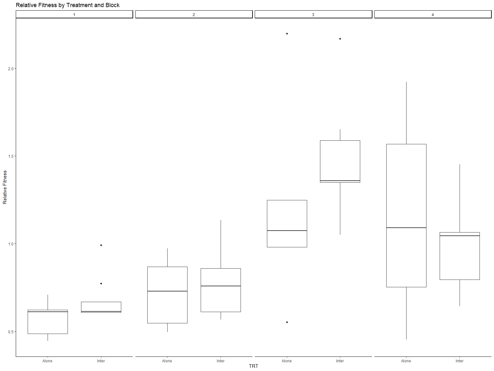

RhizMicrobiome_GenusLevel
================
Sara Colom
2/8/2020

-   [Sample sizes](#sample-sizes)
    -   [Table sample number by species and
        treatment](#table-sample-number-by-species-and-treatment)
    -   [Table number of maternal line per
        species](#table-number-of-maternal-line-per-species)
-   [Load Libraries](#load-libraries)
-   [Read in Data](#read-in-data)
    -   [Alpha Diversity](#alpha-diversity)
    -   [Test for differences](#test-for-differences)
-   [Linear mixed models](#linear-mixed-models)
-   [ANOVA Test for treatment within I. purpurea
    (Table 1)](#anova-test-for-treatment-within-i-purpurea-table-1)
-   [Community Composition](#community-composition)
    -   [Beta Diversity](#beta-diversity)
-   [PERMANOVA (Table 2)](#permanova-table-2)
-   [Correlations with root traits](#correlations-with-root-traits)
    -   [Prep root data](#prep-root-data)
    -   [Table 3. Within species (root traits and
        alphadiv)](#table-3-within-species-root-traits-and-alphadiv)
    -   [Plotting significant linear
        associations](#plotting-significant-linear-associations)
    -   [Linear mixed models (not
        reported)](#linear-mixed-models-not-reported)
-   [Figure 1](#figure-1)
-   [Figure 2](#figure-2)
-   [ANCOVA](#ancova)
-   [Figure 3](#figure-3)
-   [MANTEL (Table 4)](#mantel-table-4)
-   [Export ANCOVA tables](#export-ancova-tables)

## Sample sizes

### Table sample number by species and treatment

| Species      | Treatment   | N   |
|--------------|-------------|-----|
| I. purpurea  | Alone       | 27  |
| I. purpurea  | Competition | 73  |
| I. hederacea | Competition | 73  |

### Table number of maternal line per species

| Species      | Number of ML |
|--------------|--------------|
| I. purpurea  | 10           |
| I. hederacea | 5            |

# Load Libraries

``` r
library(phyloseq)
library(ggplot2)
library(ape)
library(vegan)
library(plyr)
library(dplyr)
library(scales)
library(grid)
library(reshape2)
library(pegas)
library(pgirmess)
library(multcomp)
library(multcompView)
library(ggpubr)
library(ggcorrplot)
library(RColorBrewer)
library(broom)
library(ggthemes)
library(corrplot)
library(Hmisc)
library(emmeans)
library(lmerTest)
library(interactions)
library(jtools)
library(MASS)
library(stringr)

source("miSeq.R")
source("functions.R")

# Aesthetics
Tx<-theme(axis.text.y = element_text(size = 12),
          axis.title.y = element_text(size = 20)) +
          theme(axis.text.x = element_text(vjust = 1, hjust=1, angle=0, size = 20),
          axis.title.x = element_text(angle=0, size = 12),
          plot.title=element_text(size = 25,hjust=0))

# Aesthetics
Tx2<-theme(axis.text.y = element_text(size = 12),
          axis.title.y = element_text(size = 12)) +
          theme(axis.text.x = element_text(vjust = 1, hjust=1, size = 25),
          axis.title.x = element_text(size = 25),
          plot.title=element_text(size = 25,hjust=0))

GoldGrey <- c("#F1CE63", "#79706E")
GreenBlue <- c("#59A14F", "#4E79A7")
```

# Read in Data

``` r
physeq1 <- readRDS("../DataSets/physeq_clean")
physeq.scale <- readRDS("../DataSets/physeq_scaled")
alpha <- readRDS("../DataSets/alpha")

RootData <- read.csv("../DataSets/RootTraits_PCs.csv")
LeafData <- read.csv("../DataSets/SizeFitData.csv")
Fitness = read.csv("../DataSets/FitPA4.csv")
```

## Alpha Diversity

``` r
# Visualize data distribution w Violin plots


p <- ggplot(alpha %>% filter(TRT == "Inter"), aes(x = Species, y = rich)) +
  geom_violin(trim = FALSE, aes(fill = Species), alpha = 0.3) + 
  geom_dotplot(binaxis = 'y', stackdir = 'center', dotsize = 1, aes(color = Species, fill = Species)) +
  theme_classic() +
  scale_color_brewer(palette = "Paired") +
  scale_fill_brewer(palette = "Paired") +
  ggtitle("Mean Species Richness")


q <- ggplot(alpha %>% filter(TRT == "Inter"), aes(x = Species, y = InvSimp)) +
  geom_violin(trim = FALSE, aes(fill = Species), alpha = 0.3) + 
  geom_dotplot(binaxis = 'y', stackdir = 'center', dotsize = 1, aes(color = Species, fill = Species)) +
  theme_classic() +
  scale_color_brewer(palette = "Paired") +
  scale_fill_brewer(palette = "Paired") +
  ggtitle("Mean Species Inverse Simpson") +
  ylab("")


t <- ggplot(alpha %>% filter(TRT == "Inter"), aes(x = Species, y = sim)) +
  geom_violin(trim = FALSE, aes(fill=Species), alpha = 0.3) + 
  geom_dotplot(binaxis = 'y', stackdir = 'center', dotsize = 1, aes(color = Species, fill = Species)) +
  theme_classic() +
  scale_color_brewer(palette = "Paired") +
  scale_fill_brewer(palette = "Paired") +
  ggtitle("Mean Simpson") +
  ylab("")

v <- ggplot(alpha %>% filter(TRT == "Inter"), aes(x = Species, y = even)) +
  geom_violin(trim = FALSE, aes(fill = Species), alpha = 0.3) + 
  geom_dotplot(binaxis = 'y', stackdir = 'center', dotsize = 1, aes(color = Species, fill = Species)) +
  theme_classic() +
  scale_color_brewer(palette = "Paired") +
  scale_fill_brewer(palette = "Paired") +
  ggtitle("Mean Evenness") +
  ylab("")


ggarrange(p, q, t, v, common.legend = T, ncol = 2, nrow = 2)
```

<!-- -->

## Test for differences

# Linear mixed models

``` r
# Test for treatment within I. purpurea


RichLmm <- lmer(rich ~ TRT + Block + (1|Block:ML), alpha %>% filter(Species == "Ip"))

InvLmm <- lmer(InvSimp ~ TRT + Block + (1|Block:ML), alpha %>% filter(Species == "Ip"))

SimLmm <- lmer(sim ~ TRT + Block + (1|Block:ML), alpha %>% filter(Species == "Ip"))

EvenLmm <- lmer(even ~ TRT + Block + (1|Block:ML), alpha %>% filter(Species == "Ip"))
```

    ## boundary (singular) fit: see help('isSingular')

``` r
anova(RichLmm)
```

    ## Type III Analysis of Variance Table with Satterthwaite's method
    ##        Sum Sq Mean Sq NumDF  DenDF F value   Pr(>F)   
    ## TRT    1320.5  1320.5     1 87.801  1.4442 0.232690   
    ## Block 13858.8  4619.6     3 26.431  5.0524 0.006744 **
    ## ---
    ## Signif. codes:  0 '***' 0.001 '**' 0.01 '*' 0.05 '.' 0.1 ' ' 1

``` r
ranova(RichLmm)
```

    ## ANOVA-like table for random-effects: Single term deletions
    ## 
    ## Model:
    ## rich ~ TRT + Block + (1 | Block:ML)
    ##                npar  logLik    AIC    LRT Df Pr(>Chisq)
    ## <none>            7 -467.21 948.42                     
    ## (1 | Block:ML)    6 -467.22 946.44 0.0238  1     0.8774

``` r
anova(InvLmm)
```

    ## Type III Analysis of Variance Table with Satterthwaite's method
    ##       Sum Sq Mean Sq NumDF  DenDF F value Pr(>F)  
    ## TRT     0.27   0.273     1 82.613  0.0035 0.9533  
    ## Block 721.76 240.588     3 24.544  3.0419 0.0479 *
    ## ---
    ## Signif. codes:  0 '***' 0.001 '**' 0.01 '*' 0.05 '.' 0.1 ' ' 1

``` r
ranova(InvLmm)
```

    ## ANOVA-like table for random-effects: Single term deletions
    ## 
    ## Model:
    ## InvSimp ~ TRT + Block + (1 | Block:ML)
    ##                npar  logLik    AIC    LRT Df Pr(>Chisq)
    ## <none>            7 -354.94 723.88                     
    ## (1 | Block:ML)    6 -355.46 722.92 1.0486  1     0.3058

``` r
anova(SimLmm)
```

    ## Type III Analysis of Variance Table with Satterthwaite's method
    ##           Sum Sq    Mean Sq NumDF  DenDF F value Pr(>F)
    ## TRT   0.00002357 2.3571e-05     1 79.747  0.4399 0.5091
    ## Block 0.00033833 1.1278e-04     3 22.261  2.1049 0.1283

``` r
ranova(SimLmm)
```

    ## ANOVA-like table for random-effects: Single term deletions
    ## 
    ## Model:
    ## sim ~ TRT + Block + (1 | Block:ML)
    ##                npar logLik     AIC    LRT Df Pr(>Chisq)
    ## <none>            7 318.62 -623.24                     
    ## (1 | Block:ML)    6 317.94 -623.89 1.3513  1      0.245

``` r
anova(EvenLmm)
```

    ## Type III Analysis of Variance Table with Satterthwaite's method
    ##           Sum Sq    Mean Sq NumDF DenDF F value   Pr(>F)   
    ## TRT   2.2628e-07 2.2628e-07     1    95  1.1782 0.280475   
    ## Block 2.9697e-06 9.8990e-07     3    95  5.1542 0.002408 **
    ## ---
    ## Signif. codes:  0 '***' 0.001 '**' 0.01 '*' 0.05 '.' 0.1 ' ' 1

``` r
ranova(EvenLmm)
```

    ## ANOVA-like table for random-effects: Single term deletions
    ## 
    ## Model:
    ## even ~ TRT + Block + (1 | Block:ML)
    ##                npar logLik     AIC LRT Df Pr(>Chisq)
    ## <none>            7 591.89 -1169.8                  
    ## (1 | Block:ML)    6 591.89 -1171.8   0  1          1

# ANOVA Test for treatment within I. purpurea (Table 1)

``` r
alpha.purp <- alpha %>% filter(Species == "Ip")

aov.Richness <- lm(rich ~ TRT + Block, alpha.purp)
aov.simpsonInv <- lm(InvSimp ~ TRT + Block, alpha.purp)
aov.simpson <- lm(sim ~ TRT + Block, alpha.purp)
aov.evenness <- lm(even ~ TRT + Block, alpha.purp)
aov.shannon <- lm(shan ~ TRT + Block, alpha.purp)


#Call for the summary of that ANOVA, which will include P-values
anova(aov.Richness)
```

    FALSE Analysis of Variance Table
    FALSE 
    FALSE Response: rich
    FALSE           Df Sum Sq Mean Sq F value   Pr(>F)   
    FALSE TRT        1    962   961.9  1.0381 0.310860   
    FALSE Block      3  14694  4897.8  5.2858 0.002052 **
    FALSE Residuals 95  88028   926.6                    
    FALSE ---
    FALSE Signif. codes:  0 '***' 0.001 '**' 0.01 '*' 0.05 '.' 0.1 ' ' 1

``` r
anova(aov.simpsonInv)
```

    FALSE Analysis of Variance Table
    FALSE 
    FALSE Response: InvSimp
    FALSE           Df Sum Sq Mean Sq F value  Pr(>F)  
    FALSE TRT        1    2.5    2.54  0.0288 0.86562  
    FALSE Block      3 1031.6  343.85  3.9020 0.01122 *
    FALSE Residuals 95 8371.5   88.12                  
    FALSE ---
    FALSE Signif. codes:  0 '***' 0.001 '**' 0.01 '*' 0.05 '.' 0.1 ' ' 1

``` r
anova(aov.simpson)
```

    FALSE Analysis of Variance Table
    FALSE 
    FALSE Response: sim
    FALSE           Df    Sum Sq    Mean Sq F value  Pr(>F)  
    FALSE TRT        1 0.0000171 1.7100e-05  0.2785 0.59889  
    FALSE Block      3 0.0005091 1.6970e-04  2.7643 0.04617 *
    FALSE Residuals 95 0.0058321 6.1391e-05                  
    FALSE ---
    FALSE Signif. codes:  0 '***' 0.001 '**' 0.01 '*' 0.05 '.' 0.1 ' ' 1

``` r
anova(aov.evenness)
```

    FALSE Analysis of Variance Table
    FALSE 
    FALSE Response: even
    FALSE           Df     Sum Sq    Mean Sq F value   Pr(>F)   
    FALSE TRT        1 1.9700e-07 1.9704e-07  1.0259 0.313685   
    FALSE Block      3 2.9697e-06 9.8990e-07  5.1542 0.002408 **
    FALSE Residuals 95 1.8245e-05 1.9206e-07                    
    FALSE ---
    FALSE Signif. codes:  0 '***' 0.001 '**' 0.01 '*' 0.05 '.' 0.1 ' ' 1

``` r
# No significant differences
```

# Community Composition

## Beta Diversity

``` r
physeq.bray <- phyloseq::distance(physeq = physeq.scale, method = "bray")

# # # # # # # # # # # # # # # # # # # # # 
# Subsample for within I. purpurea only
# # # # # # # # # # # # # # # # # # # # # 

physeq.Purp <- subset_samples(physeq.scale, Species == "Ip")
sampledf.Purp<- data.frame(sample_data(physeq.Purp))

# Calculate bray curtis for I.purpurea samples only
physeq.Purp.bray <- phyloseq::distance(physeq = physeq.Purp, method = "bray")
```

``` r
# Beta diversity pcoa Bray-Curtis DNA only 
physeq.pcoa <-
  ordinate(
    physeq = physeq.scale,
    method = "PCoA",
    distance = "bray"
  )

physeq.pcoa.vectors <- data.frame(physeq.pcoa$vectors[, 1:4])

physeq.pcoa.vectors$Duplicates <- row.names(physeq.pcoa.vectors)

SampData <- data.frame(sample_data(physeq1))

colnames(SampData)[1] <- "Duplicates"

SampData <- subset(SampData, SampData$TRT == "Inter"|SampData$TRT == "Alone")

physeq.pcoa.df <- droplevels(merge(physeq.pcoa.vectors, SampData,by="Duplicates"))
```

# PERMANOVA (Table 2)

``` r
## All experiment, add variable treatment, then species
sampledf <- data.frame(sample_data(physeq.scale))

physeq.purp = subset_samples(physeq.scale, Species == "Ip")

treatment <- sampledf %>% 
  filter(Species == "Ip") %>% 
  pull(TRT)

block <- sampledf %>% 
  filter(Species == "Ip") %>% 
  pull(Block)

output <- adonis(otu_table(physeq.purp) %>% t ~ treatment + block, method = "bray")
```

# Correlations with root traits

## Prep root data

``` r
RootAlphaObs <- merge(alpha, RootData[c("Sample_ID", "PC1", "PC2", "PC3", "PC4")])
```

## Table 3. Within species (root traits and alphadiv)

``` r
#summary(glht(SimpInvPC1, mcp(rank="Tukey")))

#################################################################
##################### SUBSET for I.purpurea #####################
#################################################################


RootAlphaPurp <- droplevels(RootAlphaObs %>% filter(Species == "Ip"))
RootAlphaPurp$Comp <- sub(".*\\-", "", RootAlphaPurp$Combos)

### Linear regressions

SimpPC1 <- lm(sim ~ PC1 + Block + TRT, RootAlphaPurp) 
summary(SimpPC1)
```

    ## 
    ## Call:
    ## lm(formula = sim ~ PC1 + Block + TRT, data = RootAlphaPurp)
    ## 
    ## Residuals:
    ##       Min        1Q    Median        3Q       Max 
    ## -0.027453 -0.003862  0.001500  0.005865  0.011300 
    ## 
    ## Coefficients:
    ##              Estimate Std. Error t value Pr(>|t|)    
    ## (Intercept)  0.977989   0.003869 252.755   <2e-16 ***
    ## PC1          0.001447   0.001258   1.150   0.2554    
    ## Block2      -0.005401   0.010369  -0.521   0.6047    
    ## Block3      -0.009643   0.010882  -0.886   0.3797    
    ## Block4      -0.002049   0.002635  -0.777   0.4405    
    ## TRTInter    -0.004216   0.002470  -1.707   0.0939 .  
    ## ---
    ## Signif. codes:  0 '***' 0.001 '**' 0.01 '*' 0.05 '.' 0.1 ' ' 1
    ## 
    ## Residual standard error: 0.008187 on 51 degrees of freedom
    ## Multiple R-squared:  0.1337, Adjusted R-squared:  0.04877 
    ## F-statistic: 1.574 on 5 and 51 DF,  p-value: 0.1841

``` r
SimpInvPC1 <- lm(InvSimp ~ PC1 + Comp + TRT + Block, RootAlphaPurp) 
summary(SimpInvPC1)
```

    ## 
    ## Call:
    ## lm(formula = InvSimp ~ PC1 + Comp + TRT + Block, data = RootAlphaPurp)
    ## 
    ## Residuals:
    ##      Min       1Q   Median       3Q      Max 
    ## -14.0281  -6.9591   0.3038   6.3289  18.8379 
    ## 
    ## Coefficients: (1 not defined because of singularities)
    ##                  Estimate Std. Error t value Pr(>|t|)    
    ## (Intercept)       42.7370     4.3928   9.729 6.18e-13 ***
    ## PC1                1.0167     1.4322   0.710   0.4812    
    ## CompPA 4.12 Ihed  -2.5142     3.6273  -0.693   0.4916    
    ## CompPA 4.15 Ihed  -0.2098     3.6612  -0.057   0.9545    
    ## CompPA 4.2 Ihed   -9.5479     4.1700  -2.290   0.0265 *  
    ## CompPA 4.3 Ihed   -3.6759     4.0327  -0.912   0.3666    
    ## TRTInter               NA         NA      NA       NA    
    ## Block2            -1.2232    11.8157  -0.104   0.9180    
    ## Block3            -5.0956    12.3933  -0.411   0.6828    
    ## Block4            -2.9551     2.9900  -0.988   0.3280    
    ## ---
    ## Signif. codes:  0 '***' 0.001 '**' 0.01 '*' 0.05 '.' 0.1 ' ' 1
    ## 
    ## Residual standard error: 9.233 on 48 degrees of freedom
    ## Multiple R-squared:  0.2126, Adjusted R-squared:  0.08133 
    ## F-statistic:  1.62 on 8 and 48 DF,  p-value: 0.1441

``` r
RichPC1 <- lm(rich ~ PC1 + Block + TRT, RootAlphaPurp) 
summary(RichPC1)
```

    ## 
    ## Call:
    ## lm(formula = rich ~ PC1 + Block + TRT, data = RootAlphaPurp)
    ## 
    ## Residuals:
    ##     Min      1Q  Median      3Q     Max 
    ## -68.694 -17.875   1.742  20.104  51.312 
    ## 
    ## Coefficients:
    ##             Estimate Std. Error t value Pr(>|t|)    
    ## (Intercept)  461.869     14.307  32.283   <2e-16 ***
    ## PC1            3.379      4.650   0.727   0.4707    
    ## Block2        -7.192     38.340  -0.188   0.8519    
    ## Block3        -2.043     40.236  -0.051   0.9597    
    ## Block4         1.186      9.744   0.122   0.9036    
    ## TRTInter     -17.545      9.133  -1.921   0.0603 .  
    ## ---
    ## Signif. codes:  0 '***' 0.001 '**' 0.01 '*' 0.05 '.' 0.1 ' ' 1
    ## 
    ## Residual standard error: 30.27 on 51 degrees of freedom
    ## Multiple R-squared:  0.1664, Adjusted R-squared:  0.08472 
    ## F-statistic: 2.037 on 5 and 51 DF,  p-value: 0.08903

``` r
EvenPC1 <- lm(even ~ PC1 + Block + TRT , RootAlphaPurp) 
summary(EvenPC1)
```

    ## 
    ## Call:
    ## lm(formula = even ~ PC1 + Block + TRT, data = RootAlphaPurp)
    ## 
    ## Residuals:
    ##        Min         1Q     Median         3Q        Max 
    ## -8.015e-04 -3.058e-04  1.160e-06  2.792e-04  9.880e-04 
    ## 
    ## Coefficients:
    ##               Estimate Std. Error t value Pr(>|t|)    
    ## (Intercept)  1.033e-02  2.037e-04  50.696   <2e-16 ***
    ## PC1         -6.197e-06  6.620e-05  -0.094    0.926    
    ## Block2      -1.131e-04  5.458e-04  -0.207    0.837    
    ## Block3      -3.416e-04  5.728e-04  -0.596    0.554    
    ## Block4      -1.537e-04  1.387e-04  -1.108    0.273    
    ## TRTInter     1.765e-04  1.300e-04   1.358    0.180    
    ## ---
    ## Signif. codes:  0 '***' 0.001 '**' 0.01 '*' 0.05 '.' 0.1 ' ' 1
    ## 
    ## Residual standard error: 0.0004309 on 51 degrees of freedom
    ## Multiple R-squared:  0.1239, Adjusted R-squared:  0.03796 
    ## F-statistic: 1.442 on 5 and 51 DF,  p-value: 0.2253

``` r
SimpPC2 <- lm(sim ~ PC2 + Block + TRT, RootAlphaPurp) 
summary(SimpPC2)
```

    ## 
    ## Call:
    ## lm(formula = sim ~ PC2 + Block + TRT, data = RootAlphaPurp)
    ## 
    ## Residuals:
    ##       Min        1Q    Median        3Q       Max 
    ## -0.027561 -0.003682  0.001345  0.005432  0.011845 
    ## 
    ## Coefficients:
    ##               Estimate Std. Error t value Pr(>|t|)    
    ## (Intercept)  0.9721778  0.0029179 333.173   <2e-16 ***
    ## PC2         -0.0009071  0.0006315  -1.436    0.157    
    ## Block2       0.0059736  0.0046160   1.294    0.201    
    ## Block3       0.0038107  0.0032096   1.187    0.241    
    ## Block4       0.0001549  0.0032208   0.048    0.962    
    ## TRTInter    -0.0028856  0.0024702  -1.168    0.248    
    ## ---
    ## Signif. codes:  0 '***' 0.001 '**' 0.01 '*' 0.05 '.' 0.1 ' ' 1
    ## 
    ## Residual standard error: 0.00813 on 51 degrees of freedom
    ## Multiple R-squared:  0.1458, Adjusted R-squared:  0.06203 
    ## F-statistic: 1.741 on 5 and 51 DF,  p-value: 0.1421

``` r
SimpInvPC2 <- lm(InvSimp ~ PC2 + Comp + TRT + Block, RootAlphaPurp) 
summary(SimpInvPC2)
```

    ## 
    ## Call:
    ## lm(formula = InvSimp ~ PC2 + Comp + TRT + Block, data = RootAlphaPurp)
    ## 
    ## Residuals:
    ##      Min       1Q   Median       3Q      Max 
    ## -13.8113  -6.6027  -0.0319   5.2411  20.5597 
    ## 
    ## Coefficients: (1 not defined because of singularities)
    ##                  Estimate Std. Error t value Pr(>|t|)    
    ## (Intercept)       38.8561     3.3502  11.598 1.59e-15 ***
    ## PC2               -0.5592     0.7312  -0.765   0.4481    
    ## CompPA 4.12 Ihed  -1.9226     3.6054  -0.533   0.5963    
    ## CompPA 4.15 Ihed   0.6735     3.6180   0.186   0.8531    
    ## CompPA 4.2 Ihed   -8.6322     4.2973  -2.009   0.0502 .  
    ## CompPA 4.3 Ihed   -2.4873     4.0792  -0.610   0.5449    
    ## TRTInter               NA         NA      NA       NA    
    ## Block2             6.6866     5.4195   1.234   0.2233    
    ## Block3             4.2155     3.7854   1.114   0.2710    
    ## Block4            -1.6399     3.7052  -0.443   0.6600    
    ## ---
    ## Signif. codes:  0 '***' 0.001 '**' 0.01 '*' 0.05 '.' 0.1 ' ' 1
    ## 
    ## Residual standard error: 9.225 on 48 degrees of freedom
    ## Multiple R-squared:  0.2139, Adjusted R-squared:  0.08286 
    ## F-statistic: 1.632 on 8 and 48 DF,  p-value: 0.1405

``` r
RichPC2 <- lm(rich ~ PC2 + Block + TRT, RootAlphaPurp) 
summary(RichPC2)
```

    ## 
    ## Call:
    ## lm(formula = rich ~ PC2 + Block + TRT, data = RootAlphaPurp)
    ## 
    ## Residuals:
    ##     Min      1Q  Median      3Q     Max 
    ## -65.527 -11.917   3.751  21.397  48.599 
    ## 
    ## Coefficients:
    ##             Estimate Std. Error t value Pr(>|t|)    
    ## (Intercept)  438.929     10.272  42.732  < 2e-16 ***
    ## PC2           -5.734      2.223  -2.579  0.01282 *  
    ## Block2        22.156     16.249   1.363  0.17872    
    ## Block3        35.137     11.298   3.110  0.00306 ** 
    ## Block4        17.473     11.338   1.541  0.12946    
    ## TRTInter     -11.287      8.696  -1.298  0.20012    
    ## ---
    ## Signif. codes:  0 '***' 0.001 '**' 0.01 '*' 0.05 '.' 0.1 ' ' 1
    ## 
    ## Residual standard error: 28.62 on 51 degrees of freedom
    ## Multiple R-squared:  0.255,  Adjusted R-squared:  0.182 
    ## F-statistic: 3.491 on 5 and 51 DF,  p-value: 0.008644

``` r
car::Anova(mod = lm(rich ~ PC2 + Block + TRT*PC2, RootAlphaPurp), type = "III")
```

    ## Anova Table (Type III tests)
    ## 
    ## Response: rich
    ##              Sum Sq Df   F value  Pr(>F)    
    ## (Intercept) 1331420  1 1609.8076 < 2e-16 ***
    ## PC2            3433  1    4.1509 0.04692 *  
    ## Block          8117  3    3.2714 0.02865 *  
    ## TRT             750  1    0.9064 0.34565    
    ## PC2:TRT         416  1    0.5030 0.48150    
    ## Residuals     41353 50                      
    ## ---
    ## Signif. codes:  0 '***' 0.001 '**' 0.01 '*' 0.05 '.' 0.1 ' ' 1

``` r
EvenPC2 <- lm(even ~ PC2 + Block + TRT , RootAlphaPurp) 
summary(EvenPC2) 
```

    ## 
    ## Call:
    ## lm(formula = even ~ PC2 + Block + TRT, data = RootAlphaPurp)
    ## 
    ## Residuals:
    ##        Min         1Q     Median         3Q        Max 
    ## -7.790e-04 -2.985e-04 -1.367e-05  2.307e-04  1.030e-03 
    ## 
    ## Coefficients:
    ##               Estimate Std. Error t value Pr(>|t|)    
    ## (Intercept)  1.053e-02  1.474e-04  71.425  < 2e-16 ***
    ## PC2          7.252e-05  3.190e-05   2.273  0.02725 *  
    ## Block2      -2.146e-04  2.332e-04  -0.920  0.36176    
    ## Block3      -5.085e-04  1.621e-04  -3.136  0.00284 ** 
    ## Block4      -3.746e-04  1.627e-04  -2.303  0.02541 *  
    ## TRTInter     1.110e-04  1.248e-04   0.890  0.37769    
    ## ---
    ## Signif. codes:  0 '***' 0.001 '**' 0.01 '*' 0.05 '.' 0.1 ' ' 1
    ## 
    ## Residual standard error: 0.0004107 on 51 degrees of freedom
    ## Multiple R-squared:  0.2043, Adjusted R-squared:  0.1263 
    ## F-statistic: 2.619 on 5 and 51 DF,  p-value: 0.03493

``` r
SimpPC3 <- lm(sim ~ PC3 + Block + TRT, RootAlphaPurp) 
summary(SimpPC3)
```

    ## 
    ## Call:
    ## lm(formula = sim ~ PC3 + Block + TRT, data = RootAlphaPurp)
    ## 
    ## Residuals:
    ##       Min        1Q    Median        3Q       Max 
    ## -0.027765 -0.002862  0.001317  0.006049  0.012040 
    ## 
    ## Coefficients:
    ##               Estimate Std. Error t value Pr(>|t|)    
    ## (Intercept)  0.9737709  0.0024996 389.573   <2e-16 ***
    ## PC3          0.0009578  0.0007577   1.264    0.212    
    ## Block2       0.0062684  0.0046770   1.340    0.186    
    ## Block3       0.0027008  0.0030730   0.879    0.384    
    ## Block4      -0.0028575  0.0025835  -1.106    0.274    
    ## TRTInter    -0.0029872  0.0024794  -1.205    0.234    
    ## ---
    ## Signif. codes:  0 '***' 0.001 '**' 0.01 '*' 0.05 '.' 0.1 ' ' 1
    ## 
    ## Residual standard error: 0.008166 on 51 degrees of freedom
    ## Multiple R-squared:  0.1382, Adjusted R-squared:  0.05373 
    ## F-statistic: 1.636 on 5 and 51 DF,  p-value: 0.1673

``` r
SimpInvPC3 <- lm(InvSimp ~ PC3 + Comp + TRT + Block, RootAlphaPurp) 
summary(SimpInvPC3)
```

    ## 
    ## Call:
    ## lm(formula = InvSimp ~ PC3 + Comp + TRT + Block, data = RootAlphaPurp)
    ## 
    ## Residuals:
    ##      Min       1Q   Median       3Q      Max 
    ## -13.3897  -7.2801   0.0318   5.5277  19.0761 
    ## 
    ## Coefficients: (1 not defined because of singularities)
    ##                  Estimate Std. Error t value Pr(>|t|)    
    ## (Intercept)       39.8540     2.8711  13.881   <2e-16 ***
    ## PC3                0.5259     0.8919   0.590   0.5582    
    ## CompPA 4.12 Ihed  -1.5109     3.7682  -0.401   0.6902    
    ## CompPA 4.15 Ihed   0.3203     3.5946   0.089   0.9294    
    ## CompPA 4.2 Ihed   -8.9321     4.2637  -2.095   0.0415 *  
    ## CompPA 4.3 Ihed   -2.7888     4.0417  -0.690   0.4935    
    ## TRTInter               NA         NA      NA       NA    
    ## Block2             6.6726     5.4507   1.224   0.2269    
    ## Block3             3.6502     3.6522   0.999   0.3226    
    ## Block4            -3.4573     2.9385  -1.177   0.2452    
    ## ---
    ## Signif. codes:  0 '***' 0.001 '**' 0.01 '*' 0.05 '.' 0.1 ' ' 1
    ## 
    ## Residual standard error: 9.247 on 48 degrees of freedom
    ## Multiple R-squared:   0.21,  Adjusted R-squared:  0.07836 
    ## F-statistic: 1.595 on 8 and 48 DF,  p-value: 0.1513

``` r
RichPC3 <- lm(rich ~ PC3 + Block + TRT, RootAlphaPurp) 
summary(RichPC3)
```

    ## 
    ## Call:
    ## lm(formula = rich ~ PC3 + Block + TRT, data = RootAlphaPurp)
    ## 
    ## Residuals:
    ##     Min      1Q  Median      3Q     Max 
    ## -70.160 -16.679   2.978  20.134  52.500 
    ## 
    ## Coefficients:
    ##             Estimate Std. Error t value Pr(>|t|)    
    ## (Intercept) 452.2049     9.2684  48.790   <2e-16 ***
    ## PC3           1.9983     2.8096   0.711    0.480    
    ## Block2       19.8187    17.3422   1.143    0.258    
    ## Block3       26.7079    11.3946   2.344    0.023 *  
    ## Block4       -0.6489     9.5797  -0.068    0.946    
    ## TRTInter    -14.8465     9.1935  -1.615    0.113    
    ## ---
    ## Signif. codes:  0 '***' 0.001 '**' 0.01 '*' 0.05 '.' 0.1 ' ' 1
    ## 
    ## Residual standard error: 30.28 on 51 degrees of freedom
    ## Multiple R-squared:  0.1661, Adjusted R-squared:  0.08432 
    ## F-statistic: 2.031 on 5 and 51 DF,  p-value: 0.08978

``` r
EvenPC3 <- lm(even ~ PC3 + Block + TRT , RootAlphaPurp) 
summary(EvenPC3)
```

    ## 
    ## Call:
    ## lm(formula = even ~ PC3 + Block + TRT, data = RootAlphaPurp)
    ## 
    ## Residuals:
    ##        Min         1Q     Median         3Q        Max 
    ## -8.037e-04 -3.090e-04 -1.690e-06  2.763e-04  9.947e-04 
    ## 
    ## Coefficients:
    ##               Estimate Std. Error t value Pr(>|t|)    
    ## (Intercept)  1.034e-02  1.319e-04  78.365   <2e-16 ***
    ## PC3          2.841e-06  3.999e-05   0.071   0.9436    
    ## Block2      -1.559e-04  2.468e-04  -0.632   0.5304    
    ## Block3      -3.921e-04  1.622e-04  -2.418   0.0192 *  
    ## Block4      -1.518e-04  1.364e-04  -1.113   0.2708    
    ## TRTInter     1.763e-04  1.309e-04   1.347   0.1839    
    ## ---
    ## Signif. codes:  0 '***' 0.001 '**' 0.01 '*' 0.05 '.' 0.1 ' ' 1
    ## 
    ## Residual standard error: 0.000431 on 51 degrees of freedom
    ## Multiple R-squared:  0.1238, Adjusted R-squared:  0.03789 
    ## F-statistic: 1.441 on 5 and 51 DF,  p-value: 0.2256

``` r
SimpPC4 <- lm(sim ~ PC4 + Block + TRT, RootAlphaPurp) 
summary(SimpPC4)
```

    ## 
    ## Call:
    ## lm(formula = sim ~ PC4 + Block + TRT, data = RootAlphaPurp)
    ## 
    ## Residuals:
    ##       Min        1Q    Median        3Q       Max 
    ## -0.020413 -0.004944  0.001874  0.005665  0.012687 
    ## 
    ## Coefficients:
    ##               Estimate Std. Error t value Pr(>|t|)    
    ## (Intercept)  0.9764140  0.0024003 406.792  < 2e-16 ***
    ## PC4          0.0024831  0.0009036   2.748  0.00827 ** 
    ## Block2       0.0012787  0.0046058   0.278  0.78242    
    ## Block3       0.0006558  0.0029679   0.221  0.82601    
    ## Block4      -0.0047031  0.0025559  -1.840  0.07158 .  
    ## TRTInter    -0.0028974  0.0023099  -1.254  0.21544    
    ## ---
    ## Signif. codes:  0 '***' 0.001 '**' 0.01 '*' 0.05 '.' 0.1 ' ' 1
    ## 
    ## Residual standard error: 0.007739 on 51 degrees of freedom
    ## Multiple R-squared:  0.2259, Adjusted R-squared:   0.15 
    ## F-statistic: 2.976 on 5 and 51 DF,  p-value: 0.01969

``` r
car::Anova(mod = lm(sim ~ PC4 + Block + TRT*PC4, RootAlphaPurp), type = "III")
```

    ## Anova Table (Type III tests)
    ## 
    ## Response: sim
    ##             Sum Sq Df    F value Pr(>F)    
    ## (Intercept) 9.1182  1 1.5163e+05 <2e-16 ***
    ## PC4         0.0000  1 1.9700e-01 0.6591    
    ## Block       0.0003  3 1.4874e+00 0.2293    
    ## TRT         0.0001  1 8.4520e-01 0.3623    
    ## PC4:TRT     0.0000  1 7.9930e-01 0.3756    
    ## Residuals   0.0030 50                      
    ## ---
    ## Signif. codes:  0 '***' 0.001 '**' 0.01 '*' 0.05 '.' 0.1 ' ' 1

``` r
# Repeat & remove outlier
SimpPC4_out <- lm(sim ~ PC4 + Block + TRT, RootAlphaPurp %>% filter(sim > 0.94)) 
summary(SimpPC4_out)
```

    ## 
    ## Call:
    ## lm(formula = sim ~ PC4 + Block + TRT, data = RootAlphaPurp %>% 
    ##     filter(sim > 0.94))
    ## 
    ## Residuals:
    ##       Min        1Q    Median        3Q       Max 
    ## -0.017811 -0.003811  0.001589  0.004450  0.011490 
    ## 
    ## Coefficients:
    ##               Estimate Std. Error t value Pr(>|t|)    
    ## (Intercept)  0.9747198  0.0022354 436.044   <2e-16 ***
    ## PC4          0.0008668  0.0009460   0.916    0.364    
    ## Block2       0.0035840  0.0042372   0.846    0.402    
    ## Block3       0.0016636  0.0027118   0.613    0.542    
    ## Block4      -0.0021819  0.0024349  -0.896    0.374    
    ## TRTInter    -0.0026408  0.0020996  -1.258    0.214    
    ## ---
    ## Signif. codes:  0 '***' 0.001 '**' 0.01 '*' 0.05 '.' 0.1 ' ' 1
    ## 
    ## Residual standard error: 0.00703 on 50 degrees of freedom
    ## Multiple R-squared:  0.102,  Adjusted R-squared:  0.01223 
    ## F-statistic: 1.136 on 5 and 50 DF,  p-value: 0.3537

``` r
SimpInvPC4 <- lm(InvSimp ~ PC4 + Comp + TRT + Block, RootAlphaPurp) 
summary(SimpInvPC4)
```

    ## 
    ## Call:
    ## lm(formula = InvSimp ~ PC4 + Comp + TRT + Block, data = RootAlphaPurp)
    ## 
    ## Residuals:
    ##      Min       1Q   Median       3Q      Max 
    ## -13.1982  -7.7521   0.3428   6.3656  21.7090 
    ## 
    ## Coefficients: (1 not defined because of singularities)
    ##                  Estimate Std. Error t value Pr(>|t|)    
    ## (Intercept)       41.6988     2.8055  14.863   <2e-16 ***
    ## PC4                1.9003     1.0889   1.745   0.0873 .  
    ## CompPA 4.12 Ihed  -2.0636     3.5041  -0.589   0.5587    
    ## CompPA 4.15 Ihed   0.2956     3.4983   0.084   0.9330    
    ## CompPA 4.2 Ihed   -8.0009     4.1457  -1.930   0.0595 .  
    ## CompPA 4.3 Ihed   -1.7723     3.9605  -0.448   0.6565    
    ## TRTInter               NA         NA      NA       NA    
    ## Block2             3.0685     5.5619   0.552   0.5837    
    ## Block3             2.1513     3.5765   0.602   0.5503    
    ## Block4            -4.8794     2.9836  -1.635   0.1085    
    ## ---
    ## Signif. codes:  0 '***' 0.001 '**' 0.01 '*' 0.05 '.' 0.1 ' ' 1
    ## 
    ## Residual standard error: 9 on 48 degrees of freedom
    ## Multiple R-squared:  0.2518, Adjusted R-squared:  0.1271 
    ## F-statistic: 2.019 on 8 and 48 DF,  p-value: 0.06403

``` r
RichPC4 <- lm(rich ~ PC4 + Block + TRT, RootAlphaPurp) 
summary(RichPC4)
```

    ## 
    ## Call:
    ## lm(formula = rich ~ PC4 + Block + TRT, data = RootAlphaPurp)
    ## 
    ## Residuals:
    ##    Min     1Q Median     3Q    Max 
    ## -65.92 -15.72   0.98  20.30  53.09 
    ## 
    ## Coefficients:
    ##             Estimate Std. Error t value Pr(>|t|)    
    ## (Intercept)  456.445      9.346  48.836   <2e-16 ***
    ## PC4            3.503      3.518   0.996   0.3241    
    ## Block2        12.109     17.934   0.675   0.5026    
    ## Block3        23.597     11.557   2.042   0.0464 *  
    ## Block4        -3.106      9.953  -0.312   0.7563    
    ## TRTInter     -15.185      8.995  -1.688   0.0975 .  
    ## ---
    ## Signif. codes:  0 '***' 0.001 '**' 0.01 '*' 0.05 '.' 0.1 ' ' 1
    ## 
    ## Residual standard error: 30.14 on 51 degrees of freedom
    ## Multiple R-squared:  0.1739, Adjusted R-squared:  0.09287 
    ## F-statistic: 2.147 on 5 and 51 DF,  p-value: 0.07469

``` r
EvenPC4 <- lm(even ~ PC4 + Block + TRT , RootAlphaPurp) 
summary(EvenPC4)
```

    ## 
    ## Call:
    ## lm(formula = even ~ PC4 + Block + TRT, data = RootAlphaPurp)
    ## 
    ## Residuals:
    ##        Min         1Q     Median         3Q        Max 
    ## -7.993e-04 -2.799e-04  2.209e-05  2.921e-04  9.660e-04 
    ## 
    ## Coefficients:
    ##               Estimate Std. Error t value Pr(>|t|)    
    ## (Intercept)  1.036e-02  1.333e-04  77.714   <2e-16 ***
    ## PC4          2.615e-05  5.018e-05   0.521   0.6045    
    ## Block2      -2.010e-04  2.558e-04  -0.786   0.4357    
    ## Block3      -4.111e-04  1.648e-04  -2.494   0.0159 *  
    ## Block4      -1.729e-04  1.420e-04  -1.218   0.2288    
    ## TRTInter     1.824e-04  1.283e-04   1.422   0.1611    
    ## ---
    ## Signif. codes:  0 '***' 0.001 '**' 0.01 '*' 0.05 '.' 0.1 ' ' 1
    ## 
    ## Residual standard error: 0.0004298 on 51 degrees of freedom
    ## Multiple R-squared:  0.1283, Adjusted R-squared:  0.04289 
    ## F-statistic: 1.502 on 5 and 51 DF,  p-value: 0.2057

## Plotting significant linear associations

``` r
# Richness and root architecture
P2.rich <- ggplot() +
  geom_point(data = RootAlphaPurp, aes(PC2, rich), alpha = 0.5, size = 3, color = "brown") +
  geom_smooth(data = RootAlphaPurp, method = "lm", aes(PC2, rich), fullrange = TRUE, color = "black", size = 1.2, fill = "#DCDCDC") +
  theme_classic() +
  ylab("Richness") +
  xlab("") +
  theme(axis.text = element_text(color = "black", size = 12)) +
  theme(axis.title = element_text(color = "black", size = 18)) +
  theme(legend.text = element_text(size = 12)) +
  theme(legend.position = "top") +
  guides(colour = guide_legend(override.aes = list(size = 3)))

# Evenness and root architecture
P2.even <- ggplot() +
  geom_point(data = RootAlphaPurp, aes(PC2, even), alpha = 0.5, size = 3, color = "brown") +
  geom_smooth(data = RootAlphaPurp, method = "lm", aes(PC2, even), fullrange = TRUE, color = "black", size = 1.2, fill = "#DCDCDC") +
  theme_classic() +
  ylab("Evenness") +
  xlab("") +
  theme(axis.text = element_text(color = "black", size = 12)) +
  theme(axis.title = element_text(color = "black", size = 18)) +
  theme(legend.text = element_text(size = 12)) +
  theme(legend.position = "top") +
  guides(colour = guide_legend(override.aes = list(size = 3)))


# Root morphology on species diversity Simpson metric

P4.Sim <- ggplot() +
  geom_point(data = RootAlphaPurp, aes(PC4, sim), alpha = 0.5, size = 3, color = "brown") +
  geom_smooth(data = RootAlphaPurp, method = "lm", aes(PC4, sim), fullrange = TRUE, color = "black", size = 1.2, fill = "#DCDCDC") +
  theme_classic() +
  ylab("Simpson") +
  xlab("Root Morphology (PC4)") +
  theme(axis.text = element_text(color = "black", size = 12)) +
  theme(axis.title = element_text(color = "black", size = 18)) +
  theme(legend.text = element_text(size = 12)) +
  theme(legend.position = "top") +
  guides(colour = guide_legend(override.aes = list(size = 3)))
```

## Linear mixed models (not reported)

``` r
### Simpson
SimpLMM <- lmer(sim ~ TRT + Block + (1|ML), alpha %>% filter(Species == "Ip")) 
```

    ## boundary (singular) fit: see help('isSingular')

``` r
anova(SimpLMM)
```

    ## Type III Analysis of Variance Table with Satterthwaite's method
    ##           Sum Sq    Mean Sq NumDF DenDF F value  Pr(>F)  
    ## TRT   0.00003472 3.4721e-05     1    95  0.5656 0.45388  
    ## Block 0.00050911 1.6970e-04     3    95  2.7643 0.04617 *
    ## ---
    ## Signif. codes:  0 '***' 0.001 '**' 0.01 '*' 0.05 '.' 0.1 ' ' 1

``` r
ranova(SimpLMM)
```

    ## ANOVA-like table for random-effects: Single term deletions
    ## 
    ## Model:
    ## sim ~ TRT + Block + (1 | ML)
    ##          npar logLik     AIC         LRT Df Pr(>Chisq)
    ## <none>      7 317.94 -621.89                          
    ## (1 | ML)    6 317.94 -623.89 -4.5475e-13  1          1

``` r
### Inverse Simpson
SimpInvLMM <- lmer(InvSimp ~ TRT + Block + (1|ML), alpha %>% filter(Species == "Ip")) 
```

    ## boundary (singular) fit: see help('isSingular')

``` r
anova(SimpInvLMM)
```

    ## Type III Analysis of Variance Table with Satterthwaite's method
    ##        Sum Sq Mean Sq NumDF DenDF F value  Pr(>F)  
    ## TRT      0.48    0.48     1    95  0.0055 0.94112  
    ## Block 1031.56  343.85     3    95  3.9020 0.01122 *
    ## ---
    ## Signif. codes:  0 '***' 0.001 '**' 0.01 '*' 0.05 '.' 0.1 ' ' 1

``` r
ranova(SimpInvLMM)
```

    ## ANOVA-like table for random-effects: Single term deletions
    ## 
    ## Model:
    ## InvSimp ~ TRT + Block + (1 | ML)
    ##          npar  logLik    AIC LRT Df Pr(>Chisq)
    ## <none>      7 -355.46 724.92                  
    ## (1 | ML)    6 -355.46 722.92   0  1          1

``` r
### Inverse Simpson
RichLMM <- lmer(rich ~ TRT + Block + (1|ML), alpha %>% filter(Species == "Ip")) 
anova(RichLMM)
```

    ## Type III Analysis of Variance Table with Satterthwaite's method
    ##        Sum Sq Mean Sq NumDF  DenDF F value   Pr(>F)   
    ## TRT    1393.7  1393.7     1 91.101  1.5271 0.219729   
    ## Block 14143.2  4714.4     3 92.228  5.1656 0.002407 **
    ## ---
    ## Signif. codes:  0 '***' 0.001 '**' 0.01 '*' 0.05 '.' 0.1 ' ' 1

``` r
ranova(RichLMM)
```

    ## ANOVA-like table for random-effects: Single term deletions
    ## 
    ## Model:
    ## rich ~ TRT + Block + (1 | ML)
    ##          npar  logLik    AIC     LRT Df Pr(>Chisq)
    ## <none>      7 -467.16 948.31                      
    ## (1 | ML)    6 -467.22 946.44 0.12747  1     0.7211

``` r
LeafData$Sample_ID <- paste(LeafData$Position, ifelse(grepl("Ihed", LeafData$ML), "H", "P"), sep="")
```

``` r
# Calculate relative fitness
# First calculate mean seed number by species and treatment---note* we only have seed output of I. purpurea

MeanSeedNumber <- aggregate(SeedNumber ~ Trt + Species, Fitness, mean)

colnames(MeanSeedNumber) <- c("Trt", "Species", "MeanSeedNumber")

Ipurp.Fit <- Fitness %>%
  filter(Species == "Ip")

Ipurp.Alpha <- alpha %>%
  filter(Species == "Ip")

FitnessPurp <- merge(Ipurp.Fit, MeanSeedNumber, by=c("Trt", "Species"))
FitnessPurp$RelativeFit <- FitnessPurp$SeedNumber/FitnessPurp$MeanSeedNumber
FitnessPurp$Block <- as.factor(FitnessPurp$Block)

FitnessPurp2 <- merge(FitnessPurp, LeafData)
str(FitnessPurp2)
```

    ## 'data.frame':    385 obs. of  24 variables:
    ##  $ Trt            : chr  "Alone" "Alone" "Alone" "Alone" ...
    ##  $ Species        : chr  "Ip" "Ip" "Ip" "Ip" ...
    ##  $ Position       : chr  "102" "114" "136" "138" ...
    ##  $ Block          : Factor w/ 4 levels "1","2","3","4": 1 1 1 1 1 1 1 1 1 1 ...
    ##  $ Order          : int  102 114 136 138 151 153 172 203 204 213 ...
    ##  $ ML             : chr  "PA4.2Ip" "PA4.15Ip" "PA4.2Ip" "PA4.11Ip" ...
    ##  $ UniqId         : chr  "102Ip" "114Ip" "136Ip" "138Ip" ...
    ##  $ GerminationDate: chr  "43258" "43258" "43258" "43258" ...
    ##  $ Comment1       : chr  NA NA NA NA ...
    ##  $ Dead_plant     : chr  NA NA NA NA ...
    ##  $ DeathCause     : logi  NA NA NA NA NA NA ...
    ##  $ RootsHarvested : chr  "N" "N" "N" "N" ...
    ##  $ SeedsCounted   : chr  "Y" "Y" "Y" "Y" ...
    ##  $ Comp           : chr  NA NA NA NA ...
    ##  $ Combos         : chr  NA NA NA NA ...
    ##  $ Population     : chr  "PA4" "PA4" "PA4" "PA4" ...
    ##  $ SeedNumber     : int  96 75 93 56 383 321 256 202 79 172 ...
    ##  $ MeanSeedNumber : num  224 224 224 224 224 ...
    ##  $ RelativeFit    : num  0.428 0.334 0.415 0.25 1.708 ...
    ##  $ Block.1        : int  1 1 1 1 1 1 1 1 1 1 ...
    ##  $ Leaf.Number    : int  6 5 6 7 9 10 11 7 7 8 ...
    ##  $ Comment        : logi  NA NA NA NA NA NA ...
    ##  $ X              : int  1 7 21 23 31 32 39 53 54 57 ...
    ##  $ Sample_ID      : chr  "102P" "114P" "136P" "138P" ...

``` r
FitnessPurp2$Leaf.Number <- as.numeric(as.character(FitnessPurp2$Leaf.Number))

SN1 <- lmer(SeedNumber~Trt + Block + Leaf.Number + Block:Trt + (1|ML), FitnessPurp2)
anova(SN1) # Treatment is significant effect on plant seed number; Significant Treatment by Block effect
```

    ## Type III Analysis of Variance Table with Satterthwaite's method
    ##              Sum Sq Mean Sq NumDF  DenDF  F value  Pr(>F)    
    ## Trt           83491   83491     1 370.05   3.9783 0.04682 *  
    ## Block        128423   42808     3 371.69   2.0398 0.10790    
    ## Leaf.Number 2425524 2425524     1 374.69 115.5752 < 2e-16 ***
    ## Trt:Block    164743   54914     3 371.54   2.6166 0.05082 .  
    ## ---
    ## Signif. codes:  0 '***' 0.001 '**' 0.01 '*' 0.05 '.' 0.1 ' ' 1

``` r
ggplot(FitnessPurp, aes(Trt, RelativeFit, fill=Block)) +
  geom_boxplot() +
  scale_fill_brewer("Paired") +
  theme_classic() +
  ylab("Relative Fitness") +
  ggtitle("Relative Fitness by Treatment and Block")
```

<!-- -->

``` r
# Remove size effects from fitness
StdFitness <- FitnessPurp2[c("Trt", "Species", "Block", "ML", "RelativeFit", "Leaf.Number")] # Subset fitness data for variables of interest

# Run one-way ANOVA to remove size effect--i.e., keep residuals
StdFitness$RelativeFitness <- residuals(lm(RelativeFit ~ Leaf.Number, FitnessPurp2)) 

# Compare residuals and non-standard values of fitness
plot(StdFitness$RelativeFit, StdFitness$RelativeFitness)
```

<!-- -->

``` r
# Average fitness by block, maternal line and treatment--we use NON standardized fitness (ie size effects not removed)
FitAveraged = aggregate(RelativeFit ~ Block + Trt + ML, FitnessPurp, mean)
colnames(FitAveraged) <- c("Block", "Trt", "ML", "RelativeFitness")
FitAveraged$TRT <- FitAveraged$Trt
dim(FitAveraged)
```

    ## [1] 76  5

``` r
head(FitAveraged)
```

    ##   Block   Trt       ML RelativeFitness   TRT
    ## 1     1 Alone PA4.11Ip       0.4437172 Alone
    ## 2     2 Alone PA4.11Ip       1.0435158 Alone
    ## 3     3 Alone PA4.11Ip       1.0747321 Alone
    ## 4     4 Alone PA4.11Ip       1.4627059 Alone
    ## 5     1 Inter PA4.11Ip       0.6619616 Inter
    ## 6     2 Inter PA4.11Ip       0.6103389 Inter

``` r
# Average size
SizeAveraged <- aggregate(Leaf.Number ~ Block + Trt + ML + Species, LeafData,mean)
colnames(SizeAveraged) <- c("Block", "Trt", "ML", "Species", "Size")

SizeAveraged$TRT <- SizeAveraged$Trt
dim(SizeAveraged)
```

    ## [1] 76  6

``` r
head(SizeAveraged)
```

    ##   Block   Trt       ML Species      Size   TRT
    ## 1     1 Alone PA4.11Ip      Ip  9.000000 Alone
    ## 2     2 Alone PA4.11Ip      Ip 11.000000 Alone
    ## 3     3 Alone PA4.11Ip      Ip  8.000000 Alone
    ## 4     4 Alone PA4.11Ip      Ip  5.000000 Alone
    ## 5     1 Inter PA4.11Ip      Ip  7.545455 Inter
    ## 6     2 Inter PA4.11Ip      Ip  7.500000 Inter

``` r
SizePurp <- SizeAveraged %>% filter(Species == "Ip")
```

``` r
####  ####  ####  ####  ####  ####   ####
#  Examine selection on microbiome first
####  ####  ####  ####  ####  ####   ####
FitnessPurp$TRT <- FitnessPurp$Trt
FitnessPurp$Combos <- as.character(FitnessPurp$Combos)
FitnessPurp[which(FitnessPurp$TRT == "Alone"),]$Combos <- "none"
FitnessPurp$Combos <- as.factor(FitnessPurp$Combos)

BrayFit <- merge(physeq.pcoa.df,FitAveraged)

FitAlpha <- merge(FitAveraged, alpha)
dim(FitAlpha)
```

    ## [1] 97 13

``` r
ggplot(FitAlpha, aes(TRT, RelativeFitness)) +
  geom_boxplot() +
  scale_fill_brewer("Paired") +
  theme_classic() +
  ylab("Relative Fitness") +
  ggtitle("Relative Fitness by Treatment and Block") +
  facet_grid(~Block)
```

<!-- -->

``` r
# Combine with root data

RootAveraged <- aggregate(list(RootData[c("PC1", "PC2", "PC3", "PC4")]),by=list(RootData$Trt, RootData$ML), FUN = mean) 

colnames(RootAveraged) <- c("Trt", "ML", "PC1", "PC2", "PC3", "PC4")
head(RootAveraged)
```

    ##     Trt         ML         PC1        PC2        PC3         PC4
    ## 1 Alone   PA4.11Ip -0.69794646 -1.3274069  0.7756816 -0.75520608
    ## 2 Inter   PA4.11Ip  0.43519578  0.6954043 -0.1859846  0.10761866
    ## 3 Inter PA4.12Ihed  0.07075942 -0.9146971 -0.2814713 -0.01631047
    ## 4 Alone   PA4.13Ip -2.28254650  1.4831488  0.9299528 -0.64140759
    ## 5 Inter   PA4.13Ip  0.11317327 -0.1860671  0.1006711  0.43992946
    ## 6 Alone   PA4.14Ip  0.70071833 -0.4492977  0.9728631 -0.41237743

``` r
RootFitAlpha <- merge(FitAlpha, RootAveraged)
head(RootFitAlpha)
```

    ##         ML   Trt Block   TRT RelativeFitness Sample_ID Species
    ## 1 PA4.11Ip Alone     1 Alone       0.4437172      158P      Ip
    ## 2 PA4.11Ip Alone     1 Alone       0.4437172       84P      Ip
    ## 3 PA4.11Ip Alone     4 Alone       1.4627059      814P      Ip
    ## 4 PA4.11Ip Alone     3 Alone       1.0747321      674P      Ip
    ## 5 PA4.11Ip Inter     1 Inter       0.6619616      93AP      Ip
    ## 6 PA4.11Ip Inter     1 Inter       0.6619616       21P      Ip
    ##                    Combos rich  InvSimp       sim     shan        even
    ## 1                    none  434 31.43535 0.9681887 4.534697 0.010448610
    ## 2                    none  478 41.08728 0.9756616 4.753743 0.009945068
    ## 3                    none  466 48.22287 0.9792630 4.791226 0.010281601
    ## 4                    none  437 30.30030 0.9669970 4.491512 0.010278060
    ## 5 PA 4.11 Ip-PA 4.15 Ihed  427 35.29942 0.9716709 4.593859 0.010758451
    ## 6  PA 4.11 Ip-PA 4.3 Ihed  489 42.06259 0.9762259 4.752692 0.009719206
    ##          PC1        PC2        PC3        PC4
    ## 1 -0.6979465 -1.3274069  0.7756816 -0.7552061
    ## 2 -0.6979465 -1.3274069  0.7756816 -0.7552061
    ## 3 -0.6979465 -1.3274069  0.7756816 -0.7552061
    ## 4 -0.6979465 -1.3274069  0.7756816 -0.7552061
    ## 5  0.4351958  0.6954043 -0.1859846  0.1076187
    ## 6  0.4351958  0.6954043 -0.1859846  0.1076187

``` r
# CombinE root,fitness/bray estimates
RootFitBray <- merge(BrayFit, RootAveraged)


# Plot boxplots of averaged root traits
PC2_Box <- ggplot(RootAveraged, aes(x = "", y = PC2)) +
  geom_boxplot() +
  #geom_jitter() +
  xlab("Root Architecture") +
  theme_classic() +
  Tx+ 
  coord_flip()

# Plot boxplots of averaged root traits
PC1_Box=ggplot(RootAveraged, aes(x = "", y = PC1)) +
  geom_boxplot() +
  #geom_jitter() +
  xlab("Root Topology") +
  theme_classic() +
  Tx+ 
  coord_flip()

# Plot boxplots of averaged root traits
PC4_Box=ggplot(RootAveraged, aes(x = "", y = PC4)) +
  geom_boxplot() +
  #geom_jitter() +
  xlab("Root Morphology") +
  theme_classic() +
  Tx+ 
  coord_flip()
```

# Figure 1

``` r
#ggarrange(P2.rich,P2.even,P4.Sim,P4.simIn,nrow=2,ncol=2)
AB <- ggarrange(P2.rich, P2.even, labels = "AUTO", hjust = -7, vjust = 1.5,font.label = list(size = 14))
```

    ## `geom_smooth()` using formula 'y ~ x'
    ## `geom_smooth()` using formula 'y ~ x'

``` r
# Common x title
x.grob1 <- textGrob("Root architecture (PC2)", 
                   gp = gpar(col="black", fontsize = 25), rot = 0)

gridExtra::grid.arrange(gridExtra::arrangeGrob(AB, bottom = x.grob1, padding = unit(0.05,units = 'in'), nrow=1))
```

<!-- -->

# Figure 2

``` r
P4.Sim
```

    ## `geom_smooth()` using formula 'y ~ x'

<!-- -->

``` r
# Remove block effects from fitness
RootFitAlpha$FitResidBlk <- resid(lm(RelativeFitness ~ Block, RootFitAlpha))

RootFitAlpha$Comp <- sub(".*\\-", "", RootFitAlpha$Combos)
```

# ANCOVA

Evaluate selection on microbiome community structure variables
separatley. Use MASS for selection of best model.

``` r
# Scale the microbial variables
RootFitAlpha$richScaled<-scale(RootFitAlpha$rich)
RootFitAlpha$SimScaled<-scale(RootFitAlpha$sim)
RootFitAlpha$InvSimScaled<-scale(RootFitAlpha$InvSimp)
RootFitAlpha$EvenScaled<-scale(RootFitAlpha$even)


# ANCOVA MUltivariate Linear Regressions

# Inverse Simpson diversity

ANCOVA_sim <-(lm(RelativeFitness ~ TRT + Block + TRT:Block + PC1*TRT + PC2*TRT + PC3*TRT + PC4*TRT + InvSimScaled*TRT + PC1*Block + PC2*Block + PC3*Block + PC4*Block + InvSimScaled*Block, RootFitAlpha)) # Full model reported


step <- stepAIC(ANCOVA_sim, direction = "backward", trace = FALSE)

step$anova
```

    ## Stepwise Model Path 
    ## Analysis of Deviance Table
    ## 
    ## Initial Model:
    ## RelativeFitness ~ TRT + Block + TRT:Block + PC1 * TRT + PC2 * 
    ##     TRT + PC3 * TRT + PC4 * TRT + InvSimScaled * TRT + PC1 * 
    ##     Block + PC2 * Block + PC3 * Block + PC4 * Block + InvSimScaled * 
    ##     Block
    ## 
    ## Final Model:
    ## RelativeFitness ~ TRT + Block + PC1 + PC2 + PC3 + PC4 + InvSimScaled + 
    ##     TRT:Block + TRT:PC3 + TRT:InvSimScaled + Block:PC1 + Block:PC3 + 
    ##     Block:PC4
    ## 
    ## 
    ##                   Step Df   Deviance Resid. Df Resid. Dev       AIC
    ## 1                                           64   4.120048 -240.4081
    ## 2          - Block:PC2  3 0.09205004        67   4.212098 -244.2648
    ## 3 - Block:InvSimScaled  3 0.07728452        70   4.289383 -248.5011
    ## 4            - TRT:PC4  1 0.00144092        71   4.290824 -250.4685
    ## 5            - TRT:PC2  1 0.02656276        72   4.317387 -251.8699
    ## 6            - TRT:PC1  1 0.06064622        73   4.378033 -252.5168

``` r
model_sim <-lm(RelativeFitness ~ TRT + Block + PC1 + PC2 + PC3 + PC4 + InvSimScaled + 
    TRT:Block + TRT:PC3 + TRT:InvSimScaled + Block:PC1 + Block:PC3 + 
    Block:PC4, RootFitAlpha
)


# anova(model) # Type I sum of sqaures--sequence order matters, interactions not accounted
ancova_res_sim <- car::Anova(model_sim, type="III") %>% 
  tidy() %>%   # Report the type three sums of squares
  tidy_more() %>% 
  mutate(Term = str_replace(Term, "InvSimScaled", "Inverse Simpson")) %>% 
  mutate(Term = str_replace(Term, "PC1", "Root topology")) %>% 
  mutate(Term = str_replace(Term, "PC2", "Root architecture")) %>% 
  mutate(Term = str_replace(Term, "PC3", "Root size")) %>% 
  mutate(Term = str_replace(Term, "PC4", "Root morphology")) %>% 
  mutate(Term = str_replace(Term, "TRT", "Treatment")) 
  

ancova_res_sim
```

    ## # A tibble: 15 x 6
    ##    Term                         SS    DF `F-value` p.value P         
    ##    <chr>                     <dbl> <dbl>     <dbl>   <dbl> <chr>     
    ##  1 (Intercept)               0.372     1     6.21    0.015 0.015 *   
    ##  2 Treatment                 0.015     1     0.255   0.615 0.615     
    ##  3 Block                     1.48      3     8.26    0     <0.001 ***
    ##  4 Root topology             0.093     1     1.55    0.217 0.217     
    ##  5 Root architecture         0.092     1     1.53    0.22  0.22      
    ##  6 Root size                 0.144     1     2.41    0.125 0.125     
    ##  7 Root morphology           0.038     1     0.628   0.431 0.431     
    ##  8 Inverse Simpson           0.176     1     2.93    0.091 0.091     
    ##  9 Treatment:Block           0.449     3     2.50    0.066 0.066     
    ## 10 Treatment:Root size       0.161     1     2.68    0.106 0.106     
    ## 11 Treatment:Inverse Simpson 0.201     1     3.35    0.071 0.071     
    ## 12 Block:Root topology       0.519     3     2.89    0.041 0.041 *   
    ## 13 Block:Root size           0.444     3     2.47    0.069 0.069     
    ## 14 Block:Root morphology     0.918     3     5.10    0.003 0.003 **  
    ## 15 Residuals                 4.38     73    NA      NA     <NA>

Evaluate species richness on fitness

``` r
ANCOVA_rich <-(lm(RelativeFitness ~ TRT + Block + TRT:Block + PC1*TRT + PC2*TRT + PC3*TRT + PC4*TRT + richScaled*TRT + PC1*Block + PC2*Block + PC3*Block + PC4*Block + richScaled*Block, RootFitAlpha)) # Full model reported


step <- stepAIC(ANCOVA_rich, direction = "backward", trace = FALSE)

step$anova
```

    ## Stepwise Model Path 
    ## Analysis of Deviance Table
    ## 
    ## Initial Model:
    ## RelativeFitness ~ TRT + Block + TRT:Block + PC1 * TRT + PC2 * 
    ##     TRT + PC3 * TRT + PC4 * TRT + richScaled * TRT + PC1 * Block + 
    ##     PC2 * Block + PC3 * Block + PC4 * Block + richScaled * Block
    ## 
    ## Final Model:
    ## RelativeFitness ~ TRT + Block + PC1 + PC2 + PC3 + PC4 + richScaled + 
    ##     TRT:Block + TRT:richScaled + Block:PC1 + Block:PC3 + Block:PC4
    ## 
    ## 
    ##                 Step Df    Deviance Resid. Df Resid. Dev       AIC
    ## 1                                          64   3.984920 -243.6428
    ## 2 - Block:richScaled  3 0.071168628        67   4.056089 -247.9257
    ## 3        - Block:PC2  3 0.108938782        70   4.165027 -251.3548
    ## 4          - TRT:PC4  1 0.005974457        71   4.171002 -253.2158
    ## 5          - TRT:PC2  1 0.030023812        72   4.201026 -254.5201
    ## 6          - TRT:PC3  1 0.040953922        73   4.241980 -255.5791
    ## 7          - TRT:PC1  1 0.054596652        74   4.296576 -256.3386

``` r
model_rich <-lm(RelativeFitness ~ TRT + Block + PC1 + PC2 + PC3 + PC4 + richScaled + 
    TRT:Block + TRT:richScaled + Block:PC1 + Block:PC3 + Block:PC4, RootFitAlpha
)


# anova(model) # Type I sum of sqaures--sequence order matters, interactions not accounted
ancova_res_rich <- car::Anova(model_rich, type="III") %>% 
  tidy() %>%   # Report the type three sums of squares
  tidy_more() %>% 
  mutate(Term = str_replace(Term, "richScaled", "Species richness")) %>% 
  mutate(Term = str_replace(Term, "PC1", "Root topology")) %>% 
  mutate(Term = str_replace(Term, "PC2", "Root architecture")) %>% 
  mutate(Term = str_replace(Term, "PC3", "Root size")) %>% 
  mutate(Term = str_replace(Term, "PC4", "Root morphology")) %>% 
  mutate(Term = str_replace(Term, "TRT", "Treatment")) 
  

ancova_res_rich
```

    ## # A tibble: 14 x 6
    ##    Term                          SS    DF `F-value` p.value P       
    ##    <chr>                      <dbl> <dbl>     <dbl>   <dbl> <chr>   
    ##  1 (Intercept)                0.189     1     3.25    0.076 0.076   
    ##  2 Treatment                  0.092     1     1.58    0.213 0.213   
    ##  3 Block                      0.998     3     5.73    0.001 0.001 **
    ##  4 Root topology              0.112     1     1.94    0.168 0.168   
    ##  5 Root architecture          0.149     1     2.57    0.113 0.113   
    ##  6 Root size                  0.042     1     0.728   0.396 0.396   
    ##  7 Root morphology            0.028     1     0.479   0.491 0.491   
    ##  8 Species richness           0.435     1     7.50    0.008 0.008 **
    ##  9 Treatment:Block            0.364     3     2.09    0.109 0.109   
    ## 10 Treatment:Species richness 0.401     1     6.90    0.01  0.01 *  
    ## 11 Block:Root topology        0.493     3     2.83    0.044 0.044 * 
    ## 12 Block:Root size            0.289     3     1.66    0.184 0.184   
    ## 13 Block:Root morphology      0.962     3     5.52    0.002 0.002 **
    ## 14 Residuals                  4.30     74    NA      NA     <NA>

Evaluate species evenness on fitness

``` r
ANCOVA_even <-(lm(RelativeFitness ~ TRT + Block + TRT:Block + PC1*TRT + PC2*TRT + PC3*TRT + PC4*TRT + EvenScaled*TRT + PC1*Block + PC2*Block + PC3*Block + PC4*Block + EvenScaled*Block, RootFitAlpha)) # Full model reported


step <- stepAIC(ANCOVA_even, direction = "backward", trace = FALSE)

step$anova
```

    ## Stepwise Model Path 
    ## Analysis of Deviance Table
    ## 
    ## Initial Model:
    ## RelativeFitness ~ TRT + Block + TRT:Block + PC1 * TRT + PC2 * 
    ##     TRT + PC3 * TRT + PC4 * TRT + EvenScaled * TRT + PC1 * Block + 
    ##     PC2 * Block + PC3 * Block + PC4 * Block + EvenScaled * Block
    ## 
    ## Final Model:
    ## RelativeFitness ~ TRT + Block + PC1 + PC2 + PC3 + PC4 + EvenScaled + 
    ##     TRT:EvenScaled + Block:PC1 + Block:PC4
    ## 
    ## 
    ##                 Step Df     Deviance Resid. Df Resid. Dev       AIC
    ## 1                                           64   4.084392 -241.2512
    ## 2 - Block:EvenScaled  3 0.0754439014        67   4.159836 -245.4758
    ## 3        - Block:PC2  3 0.0964256567        70   4.256261 -249.2530
    ## 4          - TRT:PC4  1 0.0008096981        71   4.257071 -251.2346
    ## 5        - Block:PC3  3 0.1934621254        74   4.450533 -252.9236
    ## 6          - TRT:PC3  1 0.0298015561        75   4.480335 -254.2763
    ## 7          - TRT:PC2  1 0.0187048705        76   4.499040 -255.8722
    ## 8          - TRT:PC1  1 0.0869858758        77   4.586026 -256.0146
    ## 9        - TRT:Block  3 0.2570341442        80   4.843060 -256.7249

``` r
model_even <-lm(RelativeFitness ~ TRT + Block + PC1 + PC2 + PC3 + PC4 + EvenScaled + 
    TRT:EvenScaled + Block:PC1 + Block:PC4, RootFitAlpha
)


# anova(model) # Type I sum of sqaures--sequence order matters, interactions not accounted
ancova_res_even <- car::Anova(model_even, type="III") %>% 
  tidy() %>%   # Report the type three sums of squares
  tidy_more() %>% 
  mutate(Term = str_replace(Term, "EvenScaled", "Species evenness")) %>%
  mutate(Term = str_replace(Term, "PC1", "Root topology")) %>% 
  mutate(Term = str_replace(Term, "PC2", "Root architecture")) %>% 
  mutate(Term = str_replace(Term, "PC3", "Root size")) %>% 
  mutate(Term = str_replace(Term, "PC4", "Root morphology")) %>% 
  mutate(Term = str_replace(Term, "TRT", "Treatment")) 
  

ancova_res_even
```

    ## # A tibble: 12 x 6
    ##    Term                          SS    DF `F-value` p.value P         
    ##    <chr>                      <dbl> <dbl>     <dbl>   <dbl> <chr>     
    ##  1 (Intercept)                2.50      1    41.4     0     <0.001 ***
    ##  2 Treatment                  0.011     1     0.179   0.673 0.673     
    ##  3 Block                      4.53      3    24.9     0     <0.001 ***
    ##  4 Root topology              0.06      1     0.986   0.324 0.324     
    ##  5 Root architecture          0.124     1     2.05    0.156 0.156     
    ##  6 Root size                  0.224     1     3.71    0.058 0.058     
    ##  7 Root morphology            0.11      1     1.82    0.181 0.181     
    ##  8 Species evenness           0.513     1     8.48    0.005 0.005 **  
    ##  9 Treatment:Species evenness 0.445     1     7.34    0.008 0.008 **  
    ## 10 Block:Root topology        0.726     3     4.00    0.01  0.01 *    
    ## 11 Block:Root morphology      1.08      3     5.93    0.001 0.001 **  
    ## 12 Residuals                  4.84     80    NA      NA     <NA>

Within treatment linear regression, regress sp. richness onto relative
fitness

``` r
# Richness scaled and covariates

lr_scaled_rich <- summary(lm(RelativeFitness ~ Block + PC1 + PC2 + PC3 + PC4 + richScaled 
    + Block:PC1 + Block:PC3 + Block:PC4, RootFitAlpha %>% filter(TRT == "Alone"))) %>%  # Alone
    tidy() %>% 
    tidy_more2()


lr_scaled_rich2 <- summary(lm(RelativeFitness ~ Block + PC1 + PC2 + PC3 + PC4 + richScaled + 
    Block:PC1 + Block:PC3 + Block:PC4, RootFitAlpha %>% filter(TRT != "Alone"))) %>%  # Competition
    tidy() %>% 
    tidy_more2()


lr_scaled_rich
```

    ## # A tibble: 18 x 6
    ##    Term        estimate    SE `F-value` p.value P       
    ##    <chr>          <dbl> <dbl>     <dbl>   <dbl> <chr>   
    ##  1 (Intercept)   -4.42  3.33     -1.33    0.233 0.233   
    ##  2 Block2         5.23  3.30      1.59    0.164 0.164   
    ##  3 Block3         5.56  3.28      1.70    0.141 0.141   
    ##  4 Block4         5.80  3.28      1.77    0.127 0.127   
    ##  5 PC1           -0.598 0.359    -1.67    0.147 0.147   
    ##  6 PC2           -0.053 0.048    -1.11    0.309 0.309   
    ##  7 PC3            0.494 0.392     1.26    0.255 0.255   
    ##  8 PC4           -5.24  3.62     -1.45    0.198 0.198   
    ##  9 richScaled     0.138 0.063     2.20    0.07  0.07    
    ## 10 Block2:PC1     0.537 0.336     1.60    0.161 0.161   
    ## 11 Block3:PC1     1.12  0.355     3.15    0.02  0.02 *  
    ## 12 Block4:PC1     0.169 0.365     0.464   0.659 0.659   
    ## 13 Block2:PC3    -0.666 0.447    -1.49    0.187 0.187   
    ## 14 Block3:PC3     0.175 0.419     0.418   0.691 0.691   
    ## 15 Block4:PC3    -1.41  0.374    -3.77    0.009 0.009 **
    ## 16 Block2:PC4     5.47  3.65      1.50    0.184 0.184   
    ## 17 Block3:PC4     5.65  3.61      1.57    0.168 0.168   
    ## 18 Block4:PC4     4.73  3.67      1.29    0.245 0.245

``` r
lr_scaled_rich2
```

    ## # A tibble: 18 x 6
    ##    Term        estimate    SE `F-value` p.value P         
    ##    <chr>          <dbl> <dbl>     <dbl>   <dbl> <chr>     
    ##  1 (Intercept)    0.776 0.072    10.8     0     <0.001 ***
    ##  2 Block2         0.027 0.086     0.309   0.759 0.759     
    ##  3 Block3         0.712 0.086     8.28    0     <0.001 ***
    ##  4 Block4         0.214 0.087     2.46    0.017 0.017 *   
    ##  5 PC1           -0.154 0.119    -1.29    0.201 0.201     
    ##  6 PC2           -0.046 0.058    -0.797   0.429 0.429     
    ##  7 PC3           -0.129 0.141    -0.914   0.365 0.365     
    ##  8 PC4            0.192 0.162     1.18    0.241 0.241     
    ##  9 richScaled    -0.017 0.025    -0.655   0.515 0.515     
    ## 10 Block2:PC1     0.061 0.133     0.456   0.65  0.65      
    ## 11 Block3:PC1     0.207 0.134     1.54    0.129 0.129     
    ## 12 Block4:PC1     0.331 0.135     2.45    0.018 0.018 *   
    ## 13 Block2:PC3     0.277 0.169     1.64    0.107 0.107     
    ## 14 Block3:PC3    -0.322 0.187    -1.72    0.09  0.09      
    ## 15 Block4:PC3     0.007 0.174     0.043   0.966 0.966     
    ## 16 Block2:PC4     0.097 0.213     0.457   0.65  0.65      
    ## 17 Block3:PC4    -0.527 0.217    -2.43    0.018 0.018 *   
    ## 18 Block4:PC4    -0.494 0.207    -2.38    0.021 0.021 *

Raw value of richness simple LR

``` r
summary(lm(RelativeFitness ~ rich, RootFitAlpha %>% filter(TRT == "Alone"))) # Alone
```

    ## 
    ## Call:
    ## lm(formula = RelativeFitness ~ rich, data = RootFitAlpha %>% 
    ##     filter(TRT == "Alone"))
    ## 
    ## Residuals:
    ##     Min      1Q  Median      3Q     Max 
    ## -0.5824 -0.3509 -0.1523  0.2511  1.0696 
    ## 
    ## Coefficients:
    ##              Estimate Std. Error t value Pr(>|t|)
    ## (Intercept) -1.313978   1.400070  -0.939    0.358
    ## rich         0.004895   0.003069   1.595    0.125
    ## 
    ## Residual standard error: 0.4722 on 22 degrees of freedom
    ## Multiple R-squared:  0.1037, Adjusted R-squared:  0.06291 
    ## F-statistic: 2.544 on 1 and 22 DF,  p-value: 0.125

``` r
summary(lm(RelativeFitness ~ rich, RootFitAlpha %>% filter(TRT != "Alone"))) # Alone
```

    ## 
    ## Call:
    ## lm(formula = RelativeFitness ~ rich, data = RootFitAlpha %>% 
    ##     filter(TRT != "Alone"))
    ## 
    ## Residuals:
    ##      Min       1Q   Median       3Q      Max 
    ## -0.55517 -0.29823 -0.00738  0.21166  1.16446 
    ## 
    ## Coefficients:
    ##              Estimate Std. Error t value Pr(>|t|)  
    ## (Intercept) -0.322197   0.569532  -0.566   0.5734  
    ## rich         0.002953   0.001275   2.317   0.0234 *
    ## ---
    ## Signif. codes:  0 '***' 0.001 '**' 0.01 '*' 0.05 '.' 0.1 ' ' 1
    ## 
    ## Residual standard error: 0.3523 on 71 degrees of freedom
    ## Multiple R-squared:  0.07029,    Adjusted R-squared:  0.0572 
    ## F-statistic: 5.368 on 1 and 71 DF,  p-value: 0.0234

Within treatment linear regression, regress sp. evenness onto relative
fitness

``` r
# Run full model
lr_scaled_even <- summary(lm(RelativeFitness ~ Block + PC1 + PC2 + PC3 + PC4 + EvenScaled + 
  Block:PC1 + Block:PC4, RootFitAlpha %>% filter(TRT == "Alone"))) %>%  # Alone
  tidy() %>% 
  tidy_more2()

lr_scaled_even2 <- summary(lm(RelativeFitness ~ Block + PC1 + PC2 + PC3 + PC4 + EvenScaled + 
    Block:PC1 + Block:PC4, RootFitAlpha %>% filter(TRT != "Alone"))) %>%  # Competition
    tidy() %>% 
    tidy_more2()

lr_scaled_even
```

    ## # A tibble: 15 x 6
    ##    Term        estimate    SE `F-value` p.value P    
    ##    <chr>          <dbl> <dbl>     <dbl>   <dbl> <chr>
    ##  1 (Intercept)   -0.324 3.51     -0.092   0.929 0.929
    ##  2 Block2         1.19  3.52      0.337   0.744 0.744
    ##  3 Block3         1.59  3.42      0.467   0.652 0.652
    ##  4 Block4         1.11  3.42      0.324   0.754 0.754
    ##  5 PC1           -0.215 0.47     -0.458   0.658 0.658
    ##  6 PC2           -0.059 0.088    -0.668   0.521 0.521
    ##  7 PC3           -0.072 0.236    -0.304   0.768 0.768
    ##  8 PC4           -0.682 3.88     -0.175   0.865 0.865
    ##  9 EvenScaled    -0.251 0.133    -1.88    0.092 0.092
    ## 10 Block2:PC1     0.179 0.517     0.347   0.737 0.737
    ## 11 Block3:PC1     0.456 0.528     0.864   0.41  0.41 
    ## 12 Block4:PC1    -0.187 0.511    -0.367   0.722 0.722
    ## 13 Block2:PC4     0.997 3.96      0.252   0.807 0.807
    ## 14 Block3:PC4     0.516 3.97      0.13    0.9   0.9  
    ## 15 Block4:PC4     0.24  3.97      0.06    0.953 0.953

``` r
lr_scaled_even2
```

    ## # A tibble: 15 x 6
    ##    Term        estimate    SE `F-value` p.value P         
    ##    <chr>          <dbl> <dbl>     <dbl>   <dbl> <chr>     
    ##  1 (Intercept)    0.767 0.078     9.85    0     <0.001 ***
    ##  2 Block2         0.07  0.094     0.746   0.459 0.459     
    ##  3 Block3         0.667 0.091     7.31    0     <0.001 ***
    ##  4 Block4         0.223 0.093     2.40    0.02  0.02 *    
    ##  5 PC1           -0.132 0.132    -1.00    0.321 0.321     
    ##  6 PC2           -0.022 0.063    -0.348   0.729 0.729     
    ##  7 PC3           -0.082 0.086    -0.959   0.342 0.342     
    ##  8 PC4            0.188 0.175     1.07    0.288 0.288     
    ##  9 EvenScaled     0.004 0.026     0.156   0.876 0.876     
    ## 10 Block2:PC1     0.033 0.147     0.226   0.822 0.822     
    ## 11 Block3:PC1     0.182 0.147     1.24    0.221 0.221     
    ## 12 Block4:PC1     0.308 0.148     2.08    0.042 0.042 *   
    ## 13 Block2:PC4     0.108 0.232     0.463   0.645 0.645     
    ## 14 Block3:PC4    -0.468 0.235    -2.00    0.051 0.051     
    ## 15 Block4:PC4    -0.487 0.225    -2.16    0.035 0.035 *

Simple LR and raw value of evenness

``` r
summary(lm(RelativeFitness ~ even, RootFitAlpha %>% filter(TRT == "Alone"))) # Alone
```

    ## 
    ## Call:
    ## lm(formula = RelativeFitness ~ even, data = RootFitAlpha %>% 
    ##     filter(TRT == "Alone"))
    ## 
    ## Residuals:
    ##     Min      1Q  Median      3Q     Max 
    ## -0.6257 -0.3240 -0.1184  0.2570  1.0273 
    ## 
    ## Coefficients:
    ##             Estimate Std. Error t value Pr(>|t|)  
    ## (Intercept)    5.359      2.170    2.47   0.0218 *
    ## even        -434.397    211.854   -2.05   0.0524 .
    ## ---
    ## Signif. codes:  0 '***' 0.001 '**' 0.01 '*' 0.05 '.' 0.1 ' ' 1
    ## 
    ## Residual standard error: 0.457 on 22 degrees of freedom
    ## Multiple R-squared:  0.1604, Adjusted R-squared:  0.1223 
    ## F-statistic: 4.204 on 1 and 22 DF,  p-value: 0.05242

``` r
summary(lm(RelativeFitness ~ even, RootFitAlpha %>% filter(TRT != "Alone"))) # Alone
```

    ## 
    ## Call:
    ## lm(formula = RelativeFitness ~ even, data = RootFitAlpha %>% 
    ##     filter(TRT != "Alone"))
    ## 
    ## Residuals:
    ##      Min       1Q   Median       3Q      Max 
    ## -0.59190 -0.24316 -0.03449  0.20871  1.19081 
    ## 
    ## Coefficients:
    ##             Estimate Std. Error t value Pr(>|t|)    
    ## (Intercept)    3.393      0.926   3.664 0.000475 ***
    ## even        -231.101     89.114  -2.593 0.011536 *  
    ## ---
    ## Signif. codes:  0 '***' 0.001 '**' 0.01 '*' 0.05 '.' 0.1 ' ' 1
    ## 
    ## Residual standard error: 0.3492 on 71 degrees of freedom
    ## Multiple R-squared:  0.08653,    Adjusted R-squared:  0.07366 
    ## F-statistic: 6.725 on 1 and 71 DF,  p-value: 0.01154

# Figure 3

Plot results

First create data frames of regression residuals after controlling for
all other predictors in the model.

``` r
alone_res_fit <- resid(lm(RelativeFitness ~ Block + PC1 + PC2 + PC3 + PC4 + 
  Block:PC1 + Block:PC4, RootFitAlpha %>% filter(TRT == "Alone"))) # Collect residuals excluding evenness

comp_res_fit <- resid(lm(RelativeFitness ~ Block + PC1 + PC2 + PC3 + PC4 + 
  Block:PC1 + Block:PC4, RootFitAlpha %>% filter(TRT != "Alone"))) # Collect residuals excluding evenness


EvenScaled_alone <- RootFitAlpha %>%  filter(TRT == "Alone") %>% pull(EvenScaled) 
EvenScaled_comp <- RootFitAlpha %>%  filter(TRT != "Alone") %>% pull(EvenScaled)

even_df_resid <- data.frame(fitness = c(alone_res_fit, comp_res_fit), 
                            EvenScaled = c(EvenScaled_alone,
                                           EvenScaled_comp),
                            TRT = c(rep("alone", length(alone_res_fit)), rep("competition", length(comp_res_fit))))
```

``` r
alone_res_fit <- resid(lm(RelativeFitness ~ Block + PC1 + PC2 + PC3 + PC4 
    + Block:PC1 + Block:PC3 + Block:PC4, RootFitAlpha %>% filter(TRT == "Alone"))) # Collect residuals excluding richness

comp_res_fit <- resid(lm(RelativeFitness ~ Block + PC1 + PC2 + PC3 + PC4 
    + Block:PC1 + Block:PC3 + Block:PC4, RootFitAlpha %>% filter(TRT != "Alone"))) # Collect residuals excluding richness

richScaled_alone <- RootFitAlpha %>%  filter(TRT == "Alone") %>% pull(richScaled) 
richScaled_comp <- RootFitAlpha %>%  filter(TRT != "Alone") %>% pull(richScaled)

rich_df_resid <- data.frame(fitness = c(alone_res_fit, comp_res_fit), 
                            richScaled = c(richScaled_alone,
                                           richScaled_comp),
                            TRT = c(rep("alone", length(alone_res_fit)), rep("competition", length(comp_res_fit))))
```

``` r
ggscatter(
  rich_df_resid, x = "richScaled", y = "fitness",
  color = "TRT", add = "reg.line", size = 2, alpha = 0.5
  ) +
  scale_color_manual("Treatment", values = c("brown", "darkgreen")) +
  xlab("Sp. Richness") +
  ylab("Fitness") +
  theme(axis.text = element_text(color = "black", size = 12)) +
  theme(axis.title = element_text(color = "black", size = 18)) +
  theme(legend.text = element_text(size = 12)) 
```

    ## `geom_smooth()` using formula 'y ~ x'

<!-- -->

``` r
ggscatter(
  even_df_resid, x = "EvenScaled", y = "fitness",
  color = "TRT", add = "reg.line", size = 2, alpha = 0.5
  ) +
  scale_color_manual("Treatment", values = c("brown", "darkgreen")) +
  xlab("Sp. Evenness") +
  ylab("Relative Fitness") +
  theme(axis.text = element_text(color = "black", size = 12)) +
  theme(axis.title = element_text(color = "black", size = 18)) +
  theme(legend.text = element_text(size = 12)) 
```

    ## `geom_smooth()` using formula 'y ~ x'

<!-- -->

# MANTEL (Table 4)

``` r
#  Here we use the Family mean values of root traits---this would indicate evidence for 'phenotypic selection' 

  # Load matrix Bray distances of OTU abundance
  OTU_table = t(otu_table(physeq1)) # Write out OTU table
  

  # Pull out Root traits of interest and save these to the Sampled data frame
  SampledFit = merge(FitAveraged, sampledf, by = c("TRT", "ML", "Block"))


# Pull out Root traits of interest and save these to the Sampled data frame
SampledRoots = merge(RootAlphaObs, sampledf)
SampledRootsIp = subset(SampledRoots, Species == "Ip")

OTU_table = OTU_table[row.names(OTU_table) %in% SampledRootsIp$Sample_ID,]

    OTU = OTU_table
    Roots = SampledRootsIp

  # Calculate root architecture distances with euclidean distance 

    PC2 = SampledRootsIp$PC2 # isolate PC2, i.e. root architecture
    PC2.dist = dist(PC2)

  # Calculate Bray distance matrix for OTU table

    Bray = vegdist(OTU, method = "bray")

    
# OTU Bray vs Root architecture

    OTU_pc2 = mantel(Bray, PC2.dist, method = "spearman", permutations = 9999, na.rm = TRUE)

    # Marginally significant--very low r value
    # Mantel statistic r: 0.06836  
    # Significance: 0.07
    
# Repeat for root topology, size and morphology

  PC1 = SampledRootsIp$PC1 # isolate 
  PC1.dist = dist(PC1)
  PC3 = SampledRootsIp$PC3 # isolate 
  PC3.dist=dist(PC3)
  PC4 = SampledRootsIp$PC1 # isolate 
  PC4.dist = dist(PC4)

# Examine overall distances in root system; i.e. use all PCs in distance calculation

    PCall = SampledRootsIp[grep("PC",names(SampledRootsIp))]
    PC.dist = dist(PCall)

    OTU_pc = mantel(Bray, PC.dist, method = "spearman", permutations = 9999, na.rm = TRUE)

###             examine mantel test using observed values of roots ###

OTU_pc1 = mantel(Bray, PC1.dist, method = "spearman", permutations = 9999, na.rm = TRUE)
# OTU_pc2 = mantel(Bray,PC2.dist, method = "spearman", permutations = 9999, na.rm = TRUE)
OTU_pc3 = mantel(Bray, PC3.dist, method = "spearman", permutations = 9999, na.rm = TRUE)
OTU_pc4 = mantel(Bray, PC4.dist, method = "spearman", permutations = 9999, na.rm = TRUE)
```

PC1 Mantel

``` r
OTU_pc1
```

    ## 
    ## Mantel statistic based on Spearman's rank correlation rho 
    ## 
    ## Call:
    ## mantel(xdis = Bray, ydis = PC1.dist, method = "spearman", permutations = 9999,      na.rm = TRUE) 
    ## 
    ## Mantel statistic r: -0.04189 
    ##       Significance: 0.7619 
    ## 
    ## Upper quantiles of permutations (null model):
    ##    90%    95%  97.5%    99% 
    ## 0.0744 0.0986 0.1177 0.1406 
    ## Permutation: free
    ## Number of permutations: 9999

PC2 Mantel

``` r
OTU_pc2
```

    ## 
    ## Mantel statistic based on Spearman's rank correlation rho 
    ## 
    ## Call:
    ## mantel(xdis = Bray, ydis = PC2.dist, method = "spearman", permutations = 9999,      na.rm = TRUE) 
    ## 
    ## Mantel statistic r: 0.06836 
    ##       Significance: 0.0714 
    ## 
    ## Upper quantiles of permutations (null model):
    ##    90%    95%  97.5%    99% 
    ## 0.0600 0.0763 0.0913 0.1086 
    ## Permutation: free
    ## Number of permutations: 9999

PC3 Mantel

``` r
OTU_pc3
```

    ## 
    ## Mantel statistic based on Spearman's rank correlation rho 
    ## 
    ## Call:
    ## mantel(xdis = Bray, ydis = PC3.dist, method = "spearman", permutations = 9999,      na.rm = TRUE) 
    ## 
    ## Mantel statistic r: 0.07133 
    ##       Significance: 0.1253 
    ## 
    ## Upper quantiles of permutations (null model):
    ##    90%    95%  97.5%    99% 
    ## 0.0803 0.1045 0.1242 0.1509 
    ## Permutation: free
    ## Number of permutations: 9999

PC4 Mantel

``` r
OTU_pc4
```

    ## 
    ## Mantel statistic based on Spearman's rank correlation rho 
    ## 
    ## Call:
    ## mantel(xdis = Bray, ydis = PC4.dist, method = "spearman", permutations = 9999,      na.rm = TRUE) 
    ## 
    ## Mantel statistic r: -0.04189 
    ##       Significance: 0.7665 
    ## 
    ## Upper quantiles of permutations (null model):
    ##    90%    95%  97.5%    99% 
    ## 0.0731 0.0965 0.1147 0.1410 
    ## Permutation: free
    ## Number of permutations: 9999

# Export ANCOVA tables

``` r
tables <- list("rich" = ancova_res_rich, "even" = ancova_res_even, "invSim" = ancova_res_sim)

writexl::write_xlsx(tables, "ancova_tables.xlsx")
```
